# Lesson 6.13: Path Parameters

> **Duration**: 25 min | **Section**: C - FastAPI Fundamentals

## 🎯 The Problem (3-5 min)

You have a list of books. You need to get ONE specific book. How?

```
GET /books      → All books (list)
GET /books/???  → ONE book (but which one?)
```

You can't create a separate endpoint for each book:

```python
# ❌ Ridiculous
@app.get("/books/1")
def get_book_1(): ...

@app.get("/books/2")
def get_book_2(): ...
# ... 1000 more?
```

> **Scenario**: Your bookstore has 10,000 books. You need `GET /books/1`, `GET /books/2`, ... `GET /books/10000`. You need ONE endpoint that handles ANY book ID.

## 🧪 Try It: Path Parameters (10 min)

### The Solution: Variables in the Path

```python
@app.get("/books/{book_id}")
def get_book(book_id: int):
    # book_id is extracted from the URL!
    return {"book_id": book_id}
```


### How It Works

1. **URL**: `/books/42`
2. **Pattern**: `/books/{book_id}` matches!
3. **Extract**: `book_id` = `"42"` (string from URL)
4. **Type hint**: `book_id: int`
5. **Convert**: `int("42")` = `42`
6. **Call**: `get_book(book_id=42)`

### Type Conversion is Automatic

```python
@app.get("/items/{item_id}")
def get_item(item_id: int):  # Expects int
    return {"item_id": item_id, "type": type(item_id).__name__}

# GET /items/42 → {"item_id": 42, "type": "int"}
# GET /items/abc → 422 Unprocessable Entity (can't convert "abc" to int)
```

### Multiple Path Parameters

```python
@app.get("/users/{user_id}/posts/{post_id}")
def get_user_post(user_id: int, post_id: int):
    return {"user_id": user_id, "post_id": post_id}

# GET /users/5/posts/10 → {"user_id": 5, "post_id": 10}
```

## 🔍 Under the Hood (10-15 min)

### Validation Flow

```mermaid
flowchart TD
    REQ["Request: /books/abc"]
    MATCH["Route Match: /books/{book_id}"]
    EXTRACT["Extract: book_id = 'abc'"]
    TYPE["Type Hint: int"]
    CONVERT{"Can convert?"}
    SUCCESS["✅ Call function"]
    ERROR["❌ 422 Error"]
    
    REQ --> MATCH --> EXTRACT --> TYPE --> CONVERT
    CONVERT -->|Yes| SUCCESS
    CONVERT -->|No| ERROR
    
    style ERROR fill:#C62828,color:#fff
    style SUCCESS fill:#2E7D32,color:#fff
```



### Error Response

When type conversion fails:

```bash
curl http://localhost:8000/books/abc
```

```json
{
  "detail": [
    {
      "type": "int_parsing",
      "loc": ["path", "book_id"],
      "msg": "Input should be a valid integer, unable to parse string as an integer",
      "input": "abc"
    }
  ]
}
```

Status: **422 Unprocessable Entity**

### Supported Types

| Type Hint | Valid Input | Example |
|-----------|-------------|---------|
| `int` | Integers | `/items/42` |
| `float` | Decimals | `/items/3.14` |
| `str` | Any string | `/items/hello` |
| `bool` | true/false, 1/0 | `/items/true` |
| `UUID` | Valid UUIDs | `/items/550e8400-e29b-41d4-a716-446655440000` |

### Path Parameter with Constraints

Using `Path()` for validation:

```python
from fastapi import FastAPI, Path

app = FastAPI()

@app.get("/books/{book_id}")
def get_book(
    book_id: int = Path(
        title="Book ID",
        description="The ID of the book to retrieve",
        ge=1,          # Greater than or equal to 1
        le=10000       # Less than or equal to 10000
    )
):
    return {"book_id": book_id}
```

Now:
- `GET /books/0` → 422 (ge=1 violated)
- `GET /books/-5` → 422 (ge=1 violated)
- `GET /books/99999` → 422 (le=10000 violated)
- `GET /books/42` → ✅ Works

### Order Matters!

```python
# ❌ WRONG ORDER: /books/featured never matches!
@app.get("/books/{book_id}")  # Matches everything first
def get_book(book_id: int):
    return {"book_id": book_id}

@app.get("/books/featured")   # Never reached!
def get_featured():
    return {"books": ["..."]}
```

```python
# ✅ CORRECT ORDER: Static routes first
@app.get("/books/featured")   # Specific first
def get_featured():
    return {"books": ["..."]}

@app.get("/books/{book_id}")  # Dynamic second
def get_book(book_id: int):
    return {"book_id": book_id}
```


## 💥 Where It Breaks (3-5 min)

### Parameter Name Mismatch

```python
# ❌ Path says book_id, function says id
@app.get("/books/{book_id}")
def get_book(id: int):  # Wrong name!
    return {"id": id}

# FastAPI error: path parameter 'book_id' not found
```

```python
# ✅ Names must match
@app.get("/books/{book_id}")
def get_book(book_id: int):  # Same name!
    return {"book_id": book_id}
```

### Paths That Look Like Values

```python
# What if book_id is "latest"?
@app.get("/books/{book_id}")
def get_book(book_id: int):
    ...

# GET /books/latest → 422 (can't convert "latest" to int)
```

**Solution**: Define specific routes first, or use Enum:

```python
from enum import Enum

class BookFilter(str, Enum):
    latest = "latest"
    popular = "popular"
    featured = "featured"

@app.get("/books/{filter}")
def get_books_filtered(filter: BookFilter):
    return {"filter": filter}

# GET /books/latest → {"filter": "latest"}
# GET /books/random → 422 (not in enum)
```

## ✅ Real-World Pattern: Full CRUD (5 min)

```python
from fastapi import FastAPI, Path, HTTPException

app = FastAPI()

books = {
    1: {"id": 1, "title": "1984", "author": "Orwell"},
    2: {"id": 2, "title": "Dune", "author": "Herbert"},
}

@app.get("/books")
def list_books():
    """List all books."""
    return list(books.values())

@app.get("/books/{book_id}")
def get_book(book_id: int = Path(ge=1)):
    """Get a single book by ID."""
    if book_id not in books:
        raise HTTPException(status_code=404, detail="Book not found")
    return books[book_id]

@app.delete("/books/{book_id}")
def delete_book(book_id: int = Path(ge=1)):
    """Delete a book by ID."""
    if book_id not in books:
        raise HTTPException(status_code=404, detail="Book not found")
    deleted = books.pop(book_id)
    return {"deleted": deleted}
```

## 🎯 Practice

### Exercise 1: User Profile

Create an endpoint `GET /users/{user_id}` that:
- Takes `user_id` as an integer
- Returns `{"user_id": user_id, "name": "User {user_id}"}`

### Exercise 2: Multiple Parameters

Create `GET /organizations/{org_id}/teams/{team_id}/members/{member_id}`:
- All IDs are integers
- Return all three IDs

### Exercise 3: Order Challenge

Create these endpoints in the correct order:
- `GET /items/count` → returns `{"count": 100}`
- `GET /items/{item_id}` → returns `{"item_id": item_id}`

Test that `/items/count` works correctly.

### Exercise 4: Enum Path

Create an endpoint `GET /status/{status_type}` where status_type must be one of: `healthy`, `degraded`, `down`.

## 🔑 Key Takeaways

- **`{param}`** in path = variable extracted from URL
- **Type hints** control validation and conversion
- **Order matters**: specific routes before dynamic ones
- **`Path()`** adds constraints like `ge`, `le`, `pattern`
- **Parameter names must match** in path and function
- **Enum** for fixed set of allowed values

## ❓ Common Questions

| Question | Answer |
|----------|--------|
| "Can I have optional path params?" | No, use query params for optional. Paths are always required. |
| "What about `/` in the value?" | Use path converters or encode it |
| "Can param be anywhere in path?" | Yes: `/api/{version}/users/{id}` |
| "What's the difference from query params?" | Path is in URL, query is after `?` |

## 📚 Further Reading

- [FastAPI Path Parameters](https://fastapi.tiangolo.com/tutorial/path-params/)
- [Path Validation with Path()](https://fastapi.tiangolo.com/tutorial/path-params-numeric-validations/)
- [Enum Path Parameters](https://fastapi.tiangolo.com/tutorial/path-params/#predefined-values)

---

**Next**: [Lesson 6.14: Query Parameters](./Lesson-14-Query-Parameters.md) — Learn about the other kind of parameter: `/items?skip=0&limit=10`.
