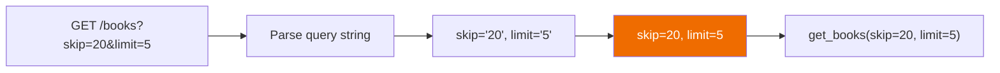
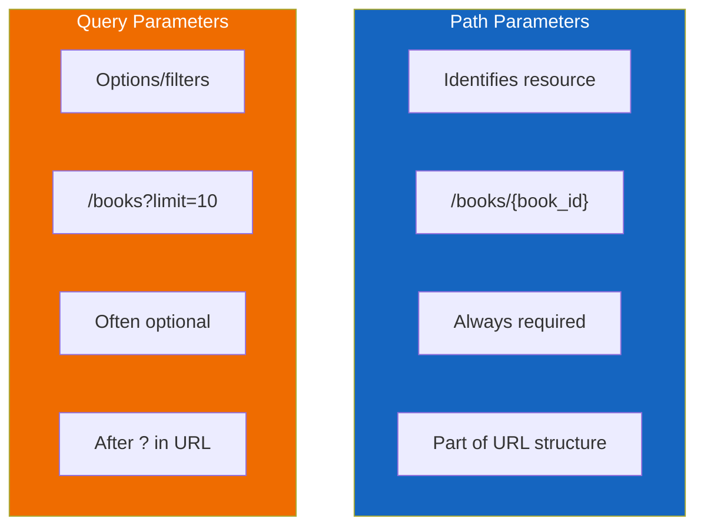

# Lesson 6.14: Query Parameters

> **Duration**: 25 min | **Section**: C - FastAPI Fundamentals

## 🎯 The Problem (3-5 min)

Path parameters identify WHAT you want: `/books/42` = book 42.

But what about:
- "Give me books, but only page 2"
- "Give me books, sorted by title"
- "Give me books, filtered by author 'Orwell'"

These are OPTIONS, not identities. You can't put every option in the path:

```
❌ /books/page/2/sort/title/author/orwell
```

> **Scenario**: Your bookstore has 10,000 books. Users want to paginate (10 at a time), filter by genre, sort by date, and search by title. How do you handle all these optional parameters?

## 🧪 Try It: Query Parameters (10 min)

### Query Parameters in the URL

```
GET /books?skip=20&limit=10&author=orwell
         └──────────┬──────────┘
            Query string (after ?)
```

### Basic Query Parameters

```python
from fastapi import FastAPI

app = FastAPI()

@app.get("/books")
def get_books(skip: int = 0, limit: int = 10):
    # skip and limit come from query string
    books = [{"id": i, "title": f"Book {i}"} for i in range(100)]
    return books[skip : skip + limit]
```



### Testing

```bash
# With query params
curl "http://localhost:8000/books?skip=10&limit=5"

# Default values apply
curl "http://localhost:8000/books"  # skip=0, limit=10

# Partial params
curl "http://localhost:8000/books?limit=3"  # skip=0, limit=3
```

## 🔍 Under the Hood (10-15 min)

### How FastAPI Detects Query vs Path

```python
@app.get("/books/{book_id}")
def get_book(
    book_id: int,     # In path → path parameter
    verbose: bool = False  # Not in path → query parameter
):
    ...
```

**Rule**: 
- If the parameter name appears in the path string → **path parameter**
- If NOT → **query parameter**

### Required vs Optional

```python
@app.get("/search")
def search(
    q: str,              # REQUIRED (no default)
    page: int = 1,       # OPTIONAL (has default)
    limit: int = 10      # OPTIONAL (has default)
):
    return {"q": q, "page": page, "limit": limit}
```

```bash
# Missing required param
curl "http://localhost:8000/search"
# 422 Error: field required

# With required param
curl "http://localhost:8000/search?q=python"
# {"q": "python", "page": 1, "limit": 10}
```

### Optional That Can Be None

```python
from typing import Optional

@app.get("/items")
def get_items(
    q: str | None = None  # Optional, defaults to None
):
    if q:
        return {"filtered_by": q}
    return {"items": ["all", "items"]}
```

### Using Query() for Validation

```python
from fastapi import Query

@app.get("/books")
def get_books(
    skip: int = Query(default=0, ge=0, description="Records to skip"),
    limit: int = Query(default=10, ge=1, le=100, description="Max records"),
    search: str | None = Query(default=None, min_length=3, max_length=50)
):
    return {"skip": skip, "limit": limit, "search": search}
```

| Query() Parameter | Meaning |
|-------------------|---------|
| `default` | Default value (or `...` for required) |
| `ge`, `le`, `gt`, `lt` | Numeric constraints |
| `min_length`, `max_length` | String length constraints |
| `pattern` | Regex pattern |
| `title`, `description` | Documentation |
| `examples` | Example values for docs |

### Required Query Parameter with Query()

```python
from fastapi import Query

@app.get("/search")
def search(
    q: str = Query(..., min_length=1)  # ... means REQUIRED
):
    return {"q": q}
```

### List Query Parameters

```python
@app.get("/items")
def get_items(tags: list[str] = Query(default=[])):
    return {"tags": tags}

# Called with:
# GET /items?tags=python&tags=fastapi&tags=tutorial
# Result: {"tags": ["python", "fastapi", "tutorial"]}
```

### Comparison: Path vs Query



| Aspect | Path Parameter | Query Parameter |
|--------|----------------|-----------------|
| Purpose | Identify resource | Filter/modify request |
| Required? | Always | Can be optional |
| Location | In URL path | After `?` |
| Example | `/users/42` | `/users?active=true` |

## 💥 Where It Breaks (3-5 min)

### Boolean Confusion

```python
@app.get("/items")
def get_items(active: bool = True):
    return {"active": active}
```

```bash
# All of these work for True:
/items?active=true
/items?active=True
/items?active=1
/items?active=yes
/items?active=on

# All of these work for False:
/items?active=false
/items?active=0
/items?active=no
```

### Query String Encoding

```bash
# Spaces need encoding
/search?q=hello world     # ❌ Invalid
/search?q=hello%20world   # ✅ Valid
/search?q=hello+world     # ✅ Also valid

# Special characters
/search?q=fast&api        # ❌ Thinks there's a param called 'api'
/search?q=fast%26api      # ✅ Encoded &
```

### Multiple Values Need list Type

```python
# ❌ Single value type
@app.get("/items")
def get_items(tag: str = None):  # Only gets LAST value
    ...
# /items?tag=a&tag=b → tag = "b"

# ✅ List type
@app.get("/items")
def get_items(tag: list[str] = Query(default=[])):
    ...
# /items?tag=a&tag=b → tag = ["a", "b"]
```

## ✅ Real-World Pattern: Search & Pagination (5 min)

```python
from fastapi import FastAPI, Query
from typing import Optional

app = FastAPI()

@app.get("/products")
def search_products(
    # Pagination
    page: int = Query(default=1, ge=1, description="Page number"),
    per_page: int = Query(default=20, ge=1, le=100, description="Items per page"),
    
    # Filtering
    category: str | None = Query(default=None, description="Filter by category"),
    min_price: float | None = Query(default=None, ge=0, description="Minimum price"),
    max_price: float | None = Query(default=None, ge=0, description="Maximum price"),
    in_stock: bool = Query(default=True, description="Only show in-stock items"),
    
    # Search
    q: str | None = Query(default=None, min_length=2, description="Search term"),
    
    # Sorting
    sort_by: str = Query(default="created_at", pattern="^(created_at|price|name)$"),
    order: str = Query(default="desc", pattern="^(asc|desc)$")
):
    return {
        "pagination": {"page": page, "per_page": per_page},
        "filters": {
            "category": category,
            "price_range": [min_price, max_price],
            "in_stock": in_stock,
            "search": q
        },
        "sorting": {"by": sort_by, "order": order}
    }
```

Usage:
```bash
curl "http://localhost:8000/products?page=2&per_page=10&category=electronics&min_price=50&sort_by=price&order=asc"
```

## 🎯 Practice

### Exercise 1: Basic Query Params

Create `GET /users` with:
- `skip`: int, default 0, must be >= 0
- `limit`: int, default 10, between 1-100

### Exercise 2: Search Endpoint

Create `GET /search` with:
- `q`: required string, min 2 characters
- `category`: optional string
- `include_archived`: bool, default False

### Exercise 3: Combined Parameters

Create `GET /orders/{user_id}` with:
- `user_id`: path parameter (int)
- `status`: query param, optional
- `from_date`: query param, optional string
- `to_date`: query param, optional string

## 🔑 Key Takeaways

- **Query parameters** come after `?` in URL: `?key=value&key2=value2`
- **Not in path string** = query parameter
- **Default value** = optional; **no default** = required
- **Query()** adds validation, docs, and constraints
- **list[str]** for multiple values: `?tag=a&tag=b`
- **Path** identifies resources; **Query** filters/modifies

## ❓ Common Questions

| Question | Answer |
|----------|--------|
| "Query vs request body?" | Query for simple filters; body for complex data |
| "Max URL length?" | ~2000 chars. Use POST body for complex queries. |
| "Case sensitive?" | Parameter names: yes. Values: depends on your code. |
| "Can I alias parameter names?" | Yes: `Query(alias="from")` for reserved words |

## 📚 Further Reading

- [FastAPI Query Parameters](https://fastapi.tiangolo.com/tutorial/query-params/)
- [Query Parameter Validation](https://fastapi.tiangolo.com/tutorial/query-params-str-validations/)
- [Multiple Values](https://fastapi.tiangolo.com/tutorial/query-params-str-validations/#query-parameter-list-multiple-values)

---

**Next**: [Lesson 6.15: Request Body](./Lesson-15-Request-Body.md) — For creating and updating resources, you need to send data in the request body, not just the URL.
