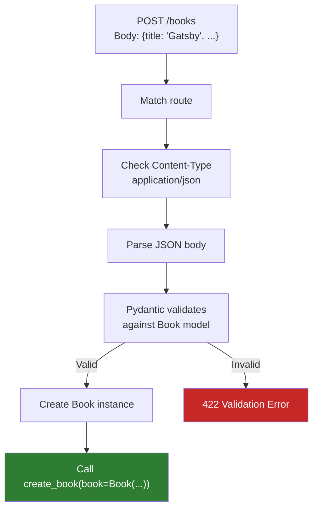
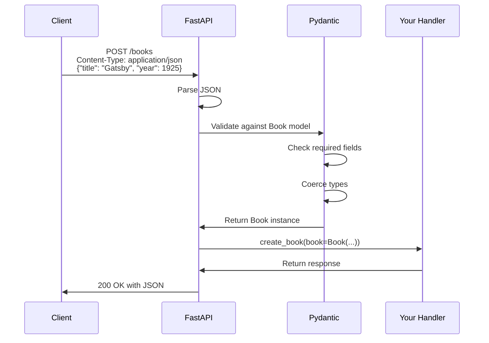

# Lesson 6.15: Request Body

> **Duration**: 30 min | **Section**: C - FastAPI Fundamentals

## 🎯 The Problem (3-5 min)

Path parameters identify resources. Query parameters filter results. But what about CREATING or UPDATING resources with complex data?

```json
{
  "title": "The Great Gatsby",
  "author": "F. Scott Fitzgerald",
  "year": 1925,
  "genres": ["fiction", "classic"],
  "metadata": {
    "isbn": "978-0743273565",
    "pages": 180
  }
}
```

You can't fit this in a URL. You need the **request body**.

> **Scenario**: You're building a book creation endpoint. Books have titles, authors, publication years, genres (a list), and metadata (nested object). Path and query parameters won't work. How do you accept complex data?

## 🧪 Try It: Query Params vs Body (5 min)

### The Painful Way (Query Params)

```python
# ❌ This is ridiculous
@app.post("/books")
def create_book(
    title: str,
    author: str,
    year: int,
    genre1: str = None,
    genre2: str = None,
    isbn: str = None,
    pages: int = None
):
    ...

# URL would be:
# /books?title=Gatsby&author=Fitzgerald&year=1925&genre1=fiction&...
```

Problems:
- No nesting (metadata.isbn?)
- No lists (multiple genres?)
- Long, ugly URLs
- Not how APIs work

### The Right Way (Request Body)

```python
from fastapi import FastAPI
from pydantic import BaseModel

app = FastAPI()

class Book(BaseModel):
    title: str
    author: str
    year: int
    genres: list[str] = []

@app.post("/books")
def create_book(book: Book):
    return {"message": "Book created", "book": book}
```

```bash
curl -X POST http://localhost:8000/books \
     -H "Content-Type: application/json" \
     -d '{"title": "Gatsby", "author": "Fitzgerald", "year": 1925}'
```

## 🔍 Under the Hood (10-15 min)

### How FastAPI Knows It's a Body

```python
@app.post("/books")
def create_book(book: Book):  # Type is Pydantic model → Body!
    ...
```

**Rule**:
- Simple types (`int`, `str`, `bool`, etc.) → Query parameters
- Pydantic model → Request body



### Complete Request Flow



### Combining Body, Path, and Query

```python
from fastapi import FastAPI, Query
from pydantic import BaseModel

app = FastAPI()

class Book(BaseModel):
    title: str
    author: str

@app.put("/books/{book_id}")
def update_book(
    book_id: int,           # Path parameter (in URL path)
    book: Book,             # Request body (Pydantic model)
    notify: bool = False    # Query parameter (simple type + default)
):
    return {
        "book_id": book_id,
        "updated": book,
        "notify": notify
    }
```

```bash
curl -X PUT "http://localhost:8000/books/42?notify=true" \
     -H "Content-Type: application/json" \
     -d '{"title": "New Title", "author": "New Author"}'
```

### Nested Models in Body

```python
from pydantic import BaseModel

class Metadata(BaseModel):
    isbn: str
    pages: int

class Book(BaseModel):
    title: str
    author: str
    metadata: Metadata

@app.post("/books")
def create_book(book: Book):
    return book
```

```json
{
  "title": "Dune",
  "author": "Frank Herbert",
  "metadata": {
    "isbn": "978-0441013593",
    "pages": 412
  }
}
```

### Multiple Bodies (Rare)

Usually one body per request, but possible:

```python
from fastapi import Body

@app.post("/compare")
def compare_books(
    book1: Book = Body(...),
    book2: Book = Body(...)
):
    return {"comparing": [book1.title, book2.title]}
```

```json
{
  "book1": {"title": "1984", "author": "Orwell"},
  "book2": {"title": "Brave New World", "author": "Huxley"}
}
```

### Single Values in Body

For simple values that should come from body (not query):

```python
from fastapi import Body

@app.post("/items/{item_id}/price")
def update_price(
    item_id: int,
    price: float = Body(...)
):
    return {"item_id": item_id, "price": price}
```

Request body: just `49.99` (or `{"price": 49.99}` if `embed=True`)

## 💥 Where It Breaks (3-5 min)

### Forgetting Content-Type

```bash
# ❌ No Content-Type header
curl -X POST http://localhost:8000/books \
     -d '{"title": "Test"}'
# Error or wrong parsing

# ✅ Include Content-Type
curl -X POST http://localhost:8000/books \
     -H "Content-Type: application/json" \
     -d '{"title": "Test"}'
```

### Invalid JSON

```bash
# ❌ Missing quotes
curl -X POST http://localhost:8000/books \
     -H "Content-Type: application/json" \
     -d '{title: Test}'  # Invalid JSON!

# Error: JSON decode error
```

### Model Field vs Body Parameter

```python
# ❌ This is a query param, not body!
@app.post("/books")
def create_book(title: str, author: str):
    ...

# ✅ This is a body (Pydantic model)
@app.post("/books")
def create_book(book: Book):
    ...
```

## ✅ Real-World CRUD Pattern (10 min)

```python
from fastapi import FastAPI, HTTPException
from pydantic import BaseModel, Field
from datetime import datetime

app = FastAPI()

# Models
class BookCreate(BaseModel):
    title: str = Field(min_length=1, max_length=200)
    author: str = Field(min_length=1, max_length=100)
    year: int = Field(ge=1450, le=datetime.now().year)
    genres: list[str] = []

class BookUpdate(BaseModel):
    title: str | None = Field(default=None, min_length=1, max_length=200)
    author: str | None = Field(default=None, min_length=1, max_length=100)
    year: int | None = Field(default=None, ge=1450, le=datetime.now().year)
    genres: list[str] | None = None

class BookResponse(BaseModel):
    id: int
    title: str
    author: str
    year: int
    genres: list[str]
    created_at: datetime

# Fake database
books_db = {}
next_id = 1

@app.post("/books", response_model=BookResponse, status_code=201)
def create_book(book: BookCreate):
    global next_id
    book_data = BookResponse(
        id=next_id,
        **book.model_dump(),
        created_at=datetime.now()
    )
    books_db[next_id] = book_data
    next_id += 1
    return book_data

@app.get("/books/{book_id}", response_model=BookResponse)
def get_book(book_id: int):
    if book_id not in books_db:
        raise HTTPException(status_code=404, detail="Book not found")
    return books_db[book_id]

@app.put("/books/{book_id}", response_model=BookResponse)
def update_book(book_id: int, book: BookUpdate):
    if book_id not in books_db:
        raise HTTPException(status_code=404, detail="Book not found")
    
    stored = books_db[book_id]
    update_data = book.model_dump(exclude_unset=True)
    
    for field, value in update_data.items():
        setattr(stored, field, value)
    
    return stored

@app.delete("/books/{book_id}")
def delete_book(book_id: int):
    if book_id not in books_db:
        raise HTTPException(status_code=404, detail="Book not found")
    deleted = books_db.pop(book_id)
    return {"deleted": deleted}
```

### Pattern: Separate Models for Create/Update/Response

| Model | Purpose |
|-------|---------|
| `BookCreate` | Input for POST (all fields required) |
| `BookUpdate` | Input for PUT/PATCH (fields optional) |
| `BookResponse` | Output (includes id, timestamps) |

## 🎯 Practice

### Exercise 1: Create Endpoint

Create `POST /users` with body:
```python
class UserCreate(BaseModel):
    name: str
    email: EmailStr
    age: int = Field(ge=0)
```

### Exercise 2: Update Endpoint

Create `PUT /users/{user_id}` that:
- Takes path param `user_id`
- Takes body `UserUpdate` (all fields optional)
- Returns updated user

### Exercise 3: Nested Body

Create `POST /orders` with:
```python
class OrderItem(BaseModel):
    product_id: int
    quantity: int

class OrderCreate(BaseModel):
    customer_id: int
    items: list[OrderItem]
```

## 🔑 Key Takeaways

- **Pydantic model as parameter** = Request body
- **Simple type as parameter** = Query parameter
- **Combine** path, query, and body in one endpoint
- **Nested models** work automatically
- **Validation happens before** your function runs
- **Separate models** for Create/Update/Response

## ❓ Common Questions

| Question | Answer |
|----------|--------|
| "JSON only?" | Default yes, but FastAPI supports form data, files, etc. |
| "Max body size?" | Depends on server config. Uvicorn default is ~16MB. |
| "Can GET have body?" | Technically possible, but don't. Use POST. |
| "model_dump(exclude_unset=True)?" | Returns only fields that were explicitly set (for partial updates) |

## 📚 Further Reading

- [FastAPI Request Body](https://fastapi.tiangolo.com/tutorial/body/)
- [Body - Multiple Parameters](https://fastapi.tiangolo.com/tutorial/body-multiple-params/)
- [Body - Nested Models](https://fastapi.tiangolo.com/tutorial/body-nested-models/)

---

**Next**: [Lesson 6.16: FastAPI Basics Q&A](./Lesson-16-FastAPI-Basics-QA.md) — Let's answer common questions about async, Starlette, and when to use what.
