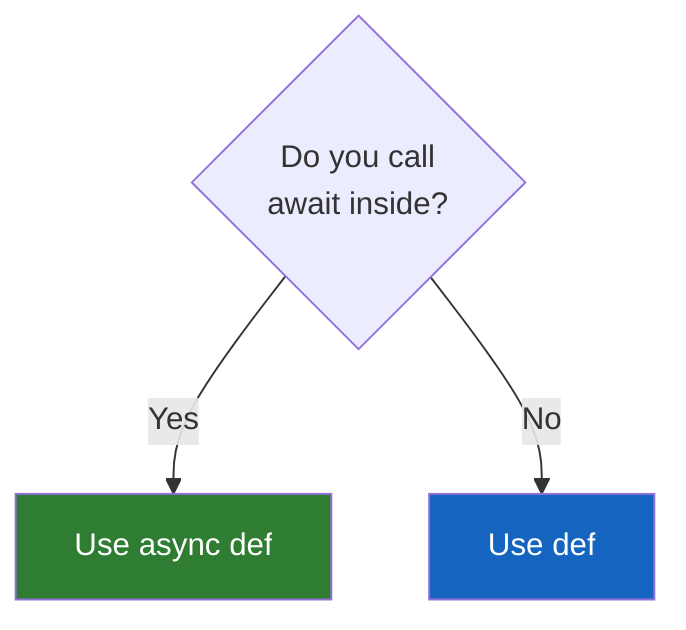

# Lesson 6.16: FastAPI Basics Q&A

> **Duration**: 10 min | **Section**: C - FastAPI Fundamentals

## 🎯 Purpose

You've learned the FastAPI fundamentals: endpoints, path parameters, query parameters, and request bodies. Let's answer the common questions that arise at this stage.

## ❓ Frequently Asked Questions

### Q: `def` vs `async def` — When do I use which?

```python
# Synchronous (blocking)
@app.get("/sync")
def sync_endpoint():
    result = database.query()  # Blocks!
    return result

# Asynchronous (non-blocking)
@app.get("/async")
async def async_endpoint():
    result = await database.async_query()  # Doesn't block!
    return result
```

**Rules**:

| Use `def` when... | Use `async def` when... |
|-------------------|-------------------------|
| CPU-bound work (computation) | I/O-bound work (network, database) |
| Synchronous libraries | Async libraries (asyncpg, httpx) |
| You're not sure | You have `await` calls |



**Important**: FastAPI handles both! Using `def` won't break anything—FastAPI runs it in a thread pool.

---

### Q: What's Starlette?

**Starlette** is the ASGI framework that FastAPI is built on.

| FastAPI | Starlette |
|---------|-----------|
| Routing decorators (`@app.get`) | Request/Response objects |
| Pydantic integration | Middleware system |
| Auto documentation | WebSocket support |
| Dependency injection | Background tasks |

You rarely touch Starlette directly, but it's there:

```python
from starlette.requests import Request
from starlette.responses import Response

@app.get("/low-level")
def low_level(request: Request):
    # Access raw Starlette request
    user_agent = request.headers.get("user-agent")
    return {"user_agent": user_agent}
```

---

### Q: How does automatic documentation work?

FastAPI generates an **OpenAPI schema** from your code:

1. Parses decorators (`@app.get`, `@app.post`)
2. Extracts type hints (parameters, return types)
3. Reads Pydantic model schemas
4. Builds OpenAPI JSON at `/openapi.json`
5. Serves Swagger UI at `/docs`
6. Serves ReDoc at `/redoc`

```python
# Your code
@app.post("/users", response_model=UserResponse, status_code=201)
def create_user(user: UserCreate):
    """Create a new user account."""
    ...
```

Becomes:
- Endpoint documented
- Request schema from `UserCreate`
- Response schema from `UserResponse`
- Status code: 201
- Description from docstring

---

### Q: Can I use Flask extensions with FastAPI?

**No.** Flask and FastAPI are different frameworks.

| Flask Extension | FastAPI Alternative |
|-----------------|---------------------|
| Flask-SQLAlchemy | SQLAlchemy (async or sync) |
| Flask-Login | FastAPI security utilities |
| Flask-CORS | `fastapi.middleware.cors` |
| Flask-Mail | Any async email library |

FastAPI has its own ecosystem. Look for async-first libraries.

---

### Q: How do I handle CORS?

```python
from fastapi import FastAPI
from fastapi.middleware.cors import CORSMiddleware

app = FastAPI()

app.add_middleware(
    CORSMiddleware,
    allow_origins=["http://localhost:3000"],  # Frontend URL
    allow_credentials=True,
    allow_methods=["*"],
    allow_headers=["*"],
)
```

We'll cover this in depth in Lesson 6.26.

---

### Q: Where do I put my database connection?

Use **Dependency Injection** (covered in Section E):

```python
# Brief preview
from fastapi import Depends

def get_db():
    db = SessionLocal()
    try:
        yield db
    finally:
        db.close()

@app.get("/users")
def get_users(db: Session = Depends(get_db)):
    return db.query(User).all()
```

---

### Q: How do I test my endpoints?

Use **TestClient** (from Starlette):

```python
from fastapi.testclient import TestClient
from main import app

client = TestClient(app)

def test_read_root():
    response = client.get("/")
    assert response.status_code == 200
    assert response.json() == {"message": "Hello"}

def test_create_user():
    response = client.post("/users", json={"name": "Alice", "age": 25})
    assert response.status_code == 201
```

---

### Q: Development vs Production?

| Development | Production |
|-------------|------------|
| `--reload` flag | No reload |
| Single worker | Multiple workers |
| Debug mode | No debug |
| HTTP | HTTPS (via reverse proxy) |

```bash
# Development
uvicorn main:app --reload

# Production
uvicorn main:app --host 0.0.0.0 --port 8000 --workers 4
# Or use Gunicorn with uvicorn workers
gunicorn main:app -w 4 -k uvicorn.workers.UvicornWorker
```

---

### Q: Return value types — dict, model, or Response?

```python
# Dict → automatically JSONified
@app.get("/v1")
def version1():
    return {"status": "ok"}

# Pydantic model → serialized to JSON
@app.get("/v2", response_model=User)
def version2():
    return User(name="Alice", age=25)

# Response object → full control
from fastapi.responses import JSONResponse

@app.get("/v3")
def version3():
    return JSONResponse(
        content={"custom": "response"},
        headers={"X-Custom": "Header"}
    )
```

---

### Q: Can I have multiple apps?

Yes, using **mounting**:

```python
from fastapi import FastAPI

app = FastAPI()
admin_app = FastAPI()

@app.get("/")
def main_root():
    return {"app": "main"}

@admin_app.get("/")
def admin_root():
    return {"app": "admin"}

# Mount admin app at /admin
app.mount("/admin", admin_app)
```

- `/` → main app
- `/admin/` → admin app

---

## � Common Pitfalls

| Pitfall | Why It Happens | Fix |
|---------|---------------|-----|
| Using `async def` without `await` | Copying async examples blindly | Use `def` unless you have actual `await` calls inside |
| Blocking calls in `async def` | Mixing sync libraries with async handlers | Use `def` for sync code; FastAPI runs it in thread pool |
| Expecting Flask extensions to work | Similar decorator syntax | FastAPI has its own ecosystem; look for async-first libraries |
| Forgetting CORS in frontend projects | Works in Postman but not browser | Add `CORSMiddleware` early in development |
| Not using type hints | Optional in Python, required for FastAPI | Type hints enable validation, docs, and IDE support |
| Hardcoding database connections | Quick prototyping | Use dependency injection from the start |

## 🔑 Key Takeaways

1. **`def` vs `async def`** — Use `async def` only when you have `await` calls; `def` works fine otherwise
2. **Starlette is the foundation** — FastAPI adds Pydantic integration and auto-docs on top of Starlette
3. **Auto-docs are free** — Type hints + Pydantic models = automatic OpenAPI documentation
4. **CORS is required for browsers** — Add `CORSMiddleware` when building APIs for web frontends
5. **TestClient for testing** — Use `TestClient(app)` to test endpoints without running a server
6. **Production needs workers** — Remove `--reload`, add `--workers 4` or use Gunicorn

---

## �🔑 Quick Reference

| Concept | Answer |
|---------|--------|
| When use `async`? | When you have `await` calls |
| What's Starlette? | The ASGI framework FastAPI uses |
| Auto docs how? | OpenAPI schema from type hints |
| Flask extensions? | No, use FastAPI ecosystem |
| CORS? | `CORSMiddleware` |
| Database? | Dependency injection |
| Testing? | `TestClient` |
| Production? | Remove `--reload`, add workers |

## 📚 Further Reading

- [FastAPI Async/Await](https://fastapi.tiangolo.com/async/)
- [Testing FastAPI](https://fastapi.tiangolo.com/tutorial/testing/)
- [Deployment](https://fastapi.tiangolo.com/deployment/)

---

**Next**: [Lesson 6.17: The Flow Problem](./Lesson-17-The-Flow-Problem.md) — Now we go deeper. What EXACTLY happens between request and your function?
