# Lesson 6.17: The Flow Problem

> **Duration**: 5 min | **Section**: D - FastAPI Under the Hood

## 🎯 The Problem (5 min)

You can build FastAPI endpoints. They work. But do you know what's happening between:

```
Request arrives → ??? → Your function runs
```

What's in that `???`?

> **Scenario**: Your endpoint returns a 422 error, but you never raised it. Your middleware logs show the request, but your function never prints anything. Something happened BEFORE your code ran. What?

## 💥 The Mystery

Consider this endpoint:

```python
@app.post("/users")
def create_user(user: User):
    print("Function started!")  # When does this print?
    return user
```

Now send bad data:

```bash
curl -X POST http://localhost:8000/users \
     -H "Content-Type: application/json" \
     -d '{"name": 123}'  # name should be string
```

Result: **422 Unprocessable Entity**

But... "Function started!" never printed. Your function NEVER RAN.

**Something intercepted the request and rejected it before your code.**

## 🔍 What's Really Happening

```mermaid
flowchart TD
    REQ["📨 REQUEST ARRIVES"]
    MW["🔒 MIDDLEWARE<br/>Logging, CORS, Auth headers"]
    ROUTE["🗺️ ROUTING<br/>Match URL to handler"]
    VAL["✅ VALIDATION<br/>Pydantic validates path, query, body"]
    DI["💉 DEPENDENCY INJECTION<br/>Inject DB, auth, etc."]
    CODE["🎯 YOUR CODE<br/>Finally! Your function runs"]
    RESP["📤 RESPONSE<br/>Serialize, add headers"]
    
    REQ --> MW
    MW --> ROUTE
    ROUTE --> VAL
    VAL -->|"❌ Invalid"| ERROR["422 Error<br/>(Your code never runs!)"]
    VAL -->|"✅ Valid"| DI
    DI --> CODE
    CODE --> RESP
    
    style REQ fill:#1565C0,color:#fff
    style CODE fill:#2E7D32,color:#fff
    style ERROR fill:#C62828,color:#fff
    style VAL fill:#EF6C00,color:#fff
```



Your function is just ONE step in a pipeline. If earlier steps fail, your function is never called.

## 🤔 Why Does This Matter?

Understanding the flow helps you:

1. **Debug faster**: "422 error? That's validation. Check my Pydantic model."
2. **Know where to add things**: "Logging before validation? Middleware. After? In my function."
3. **Understand dependencies**: "Why does `get_current_user` run before my function?"
4. **Optimize performance**: "Validation is slow? Maybe my model is too complex."

## ❓ Questions We'll Answer

| Lesson | Question |
|--------|----------|
| 6.18 | What happens at EACH step of the request lifecycle? |
| 6.19 | How do I control what gets returned (response_model)? |
| 6.20 | How do status codes and errors work? |
| 6.21 | Where do I add logging? Why 422 not 400? |

---

**Next**: [Lesson 6.18: Request Lifecycle](./Lesson-18-Request-Lifecycle.md) — Let's trace through EXACTLY what happens at each stage.
