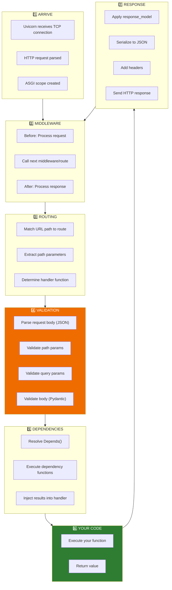
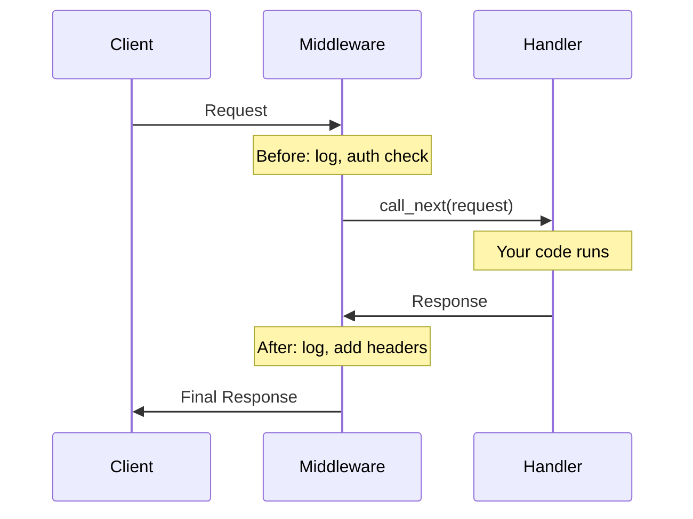
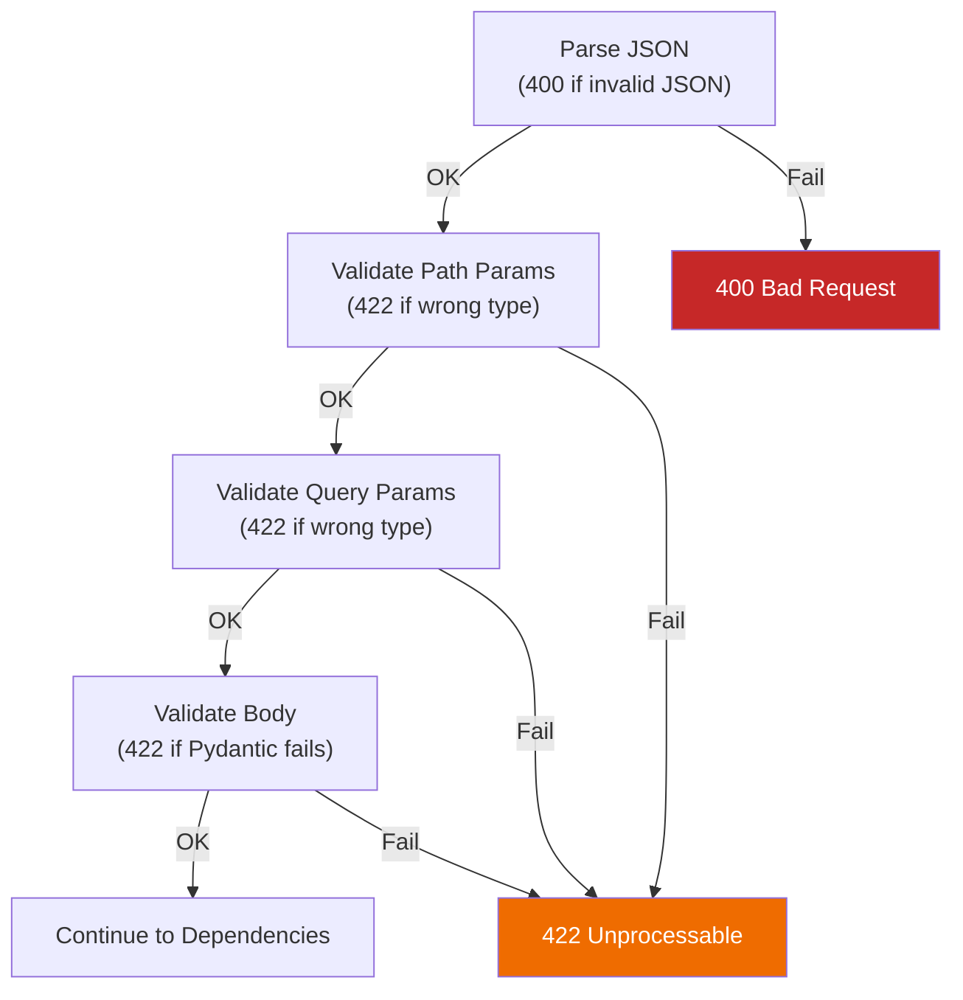

# Lesson 6.18: Request Lifecycle

> **Duration**: 35 min | **Section**: D - FastAPI Under the Hood

## 🎯 The Problem (3-5 min)

You know a request goes through multiple stages before reaching your function. But what EXACTLY happens at each stage? When do you have access to what?

> **Scenario**: You want to:
> 1. Log every request
> 2. Authenticate users
> 3. Validate data
> 4. Run your logic
> 5. Transform the response
>
> Where does each piece go?

## 🔍 Under the Hood: The Complete Flow (15 min)

### The Full Pipeline



### Stage 1: Request Arrival (Uvicorn)

```
Client sends: 
POST /users HTTP/1.1
Host: localhost:8000
Content-Type: application/json

{"name": "Alice", "age": 25}
```

Uvicorn:
1. Receives TCP bytes
2. Parses HTTP (method, path, headers, body)
3. Creates ASGI scope (request context)
4. Passes to FastAPI

### Stage 2: Middleware

Middleware wraps the ENTIRE request/response cycle:

```python
from fastapi import FastAPI
from starlette.middleware.base import BaseHTTPMiddleware
import time

app = FastAPI()

class TimingMiddleware(BaseHTTPMiddleware):
    async def dispatch(self, request, call_next):
        # BEFORE: runs before routing/validation
        start = time.time()
        print(f"→ {request.method} {request.url.path}")
        
        # Call the rest of the pipeline
        response = await call_next(request)
        
        # AFTER: runs after your handler returns
        duration = time.time() - start
        print(f"← {response.status_code} ({duration:.3f}s)")
        
        return response

app.add_middleware(TimingMiddleware)
```



### Stage 3: Routing

FastAPI matches the URL to a route:

```python
@app.get("/users/{user_id}")
def get_user(user_id: int): ...

@app.post("/users")
def create_user(user: User): ...
```

For `POST /users`:
1. Check method: POST ✓
2. Check path: /users ✓
3. Select handler: `create_user`

### Stage 4: Validation (Pydantic)

This is where 422 errors come from:

```python
class User(BaseModel):
    name: str
    age: int

@app.post("/users")
def create_user(user: User):
    ...
```

**Validation order:**
1. Parse JSON body
2. Validate path parameters (types, constraints)
3. Validate query parameters
4. Validate body against Pydantic model



### Stage 5: Dependency Injection

Dependencies run AFTER validation, BEFORE your handler:

```python
from fastapi import Depends

def get_db():
    print("Creating DB connection")
    db = Database()
    try:
        yield db
    finally:
        print("Closing DB connection")
        db.close()

@app.get("/users")
def get_users(db = Depends(get_db)):
    print("Handler running")
    return db.query("SELECT * FROM users")
```

Output order:
```
Creating DB connection
Handler running
Closing DB connection
```

### Stage 6: Your Handler

Finally! Your function runs:

```python
@app.post("/users")
def create_user(user: User):
    # You're here! Data is validated.
    # user is a Pydantic model, guaranteed valid.
    return {"id": 1, "name": user.name}
```

### Stage 7: Response Processing

After your handler returns:

1. **response_model** filters/validates output
2. **Serialization** converts to JSON
3. **Headers** added (Content-Type, etc.)
4. **Middleware "after"** runs
5. **Send** to client

## 💥 Where It Breaks (3-5 min)

### Can't Access Body in Middleware (Directly)

```python
class BadMiddleware(BaseHTTPMiddleware):
    async def dispatch(self, request, call_next):
        body = await request.body()  # ⚠️ Consumes body!
        response = await call_next(request)  # Handler gets empty body!
        return response
```

Body is a stream—read once, gone. Use with care.

### Order of Middleware Matters

```python
# Middleware added LAST runs FIRST
app.add_middleware(AuthMiddleware)    # 2nd
app.add_middleware(LoggingMiddleware) # 1st

# Request: Logging → Auth → Handler → Auth → Logging
```

## ✅ Practical Lifecycle Examples (10 min)

### Example 1: Tracing a Request

```python
from fastapi import FastAPI, Request, Depends
from pydantic import BaseModel

app = FastAPI()

# Middleware: first
@app.middleware("http")
async def trace_middleware(request: Request, call_next):
    print(f"1. Middleware BEFORE: {request.method} {request.url.path}")
    response = await call_next(request)
    print(f"6. Middleware AFTER: status={response.status_code}")
    return response

# Dependency
def trace_dependency():
    print("3. Dependency running")
    return "dep_value"

class Item(BaseModel):
    name: str

@app.post("/items")
def create_item(item: Item, dep = Depends(trace_dependency)):
    print(f"4. Handler running: {item.name}")
    print(f"5. Handler returning")
    return {"name": item.name}
```

Request with valid data:
```
1. Middleware BEFORE: POST /items
   [Routing happens]
   [Validation passes - Pydantic]
3. Dependency running
4. Handler running: Widget
5. Handler returning
6. Middleware AFTER: status=200
```

Request with INVALID data:
```
1. Middleware BEFORE: POST /items
   [Routing happens]
   [Validation FAILS - Pydantic]
6. Middleware AFTER: status=422
```

Notice: Steps 3, 4, 5 never happen with invalid data!

### Example 2: Authentication at the Right Layer

```python
from fastapi import HTTPException, Security
from fastapi.security import APIKeyHeader

api_key_header = APIKeyHeader(name="X-API-Key")

def verify_api_key(api_key: str = Security(api_key_header)):
    if api_key != "secret":
        raise HTTPException(status_code=401, detail="Invalid API key")
    return api_key

@app.get("/protected")
def protected(api_key: str = Depends(verify_api_key)):
    return {"message": "You're in!"}
```

Flow:
1. Middleware runs
2. Routing matches `/protected`
3. No body validation needed
4. **Dependency runs** → `verify_api_key` checks header
5. If valid → handler runs
6. If invalid → 401, handler never runs

## 🎯 Practice

### Exercise 1: Trace Output

Given this code, predict the console output for:
a) Valid request
b) Invalid JSON body

```python
@app.middleware("http")
async def log_middleware(request, call_next):
    print("A")
    response = await call_next(request)
    print("B")
    return response

def my_dep():
    print("C")
    return True

class Item(BaseModel):
    name: str

@app.post("/items")
def create(item: Item, dep = Depends(my_dep)):
    print("D")
    return item
```

### Exercise 2: Where to Add

Decide where each feature belongs:
1. Log all requests with timing → ___________
2. Validate request body → ___________
3. Get database connection → ___________
4. Check API key → ___________
5. Transform response format → ___________

## 🔑 Key Takeaways

- Request goes through: **Middleware → Routing → Validation → Dependencies → Handler → Response**
- **422 errors** come from validation (before your code)
- **Middleware** sees all requests (even failed ones)
- **Dependencies** run after validation
- **Order matters**: middleware last added runs first

## ❓ Common Questions

| Question | Answer |
|----------|--------|
| "Why didn't my print statement run?" | Validation probably failed before your function |
| "Where do I add logging?" | Middleware for all requests, handler for specific logic |
| "Dependencies vs middleware?" | Middleware: all requests. Dependencies: specific endpoints. |
| "Can I skip validation?" | Don't use Pydantic models (use dict), but you lose safety |

## 📚 Further Reading

- [FastAPI Middleware](https://fastapi.tiangolo.com/tutorial/middleware/)
- [Starlette Middleware](https://www.starlette.io/middleware/)
- [FastAPI Request Object](https://fastapi.tiangolo.com/advanced/using-request-directly/)

---

**Next**: [Lesson 6.19: Response Models](./Lesson-19-Response-Models.md) — Control exactly what your API returns with response_model.
