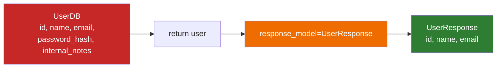

# Lesson 6.19: Response Models

> **Duration**: 25 min | **Section**: D - FastAPI Under the Hood

## 🎯 The Problem (3-5 min)

Your handler returns data. But should it return EVERYTHING?

```python
class UserDB(BaseModel):
    id: int
    name: str
    email: str
    password_hash: str  # 😱 NEVER expose this!
    created_at: datetime
    internal_notes: str  # Internal only

@app.get("/users/{user_id}")
def get_user(user_id: int):
    user = db.get_user(user_id)
    return user  # Exposes password_hash and internal_notes!
```

> **Scenario**: Your database model has sensitive fields (password hashes, internal IDs, admin notes). You need to return user data without exposing secrets. How do you filter what gets returned?

## 🧪 Try It: Manual Filtering (5 min)

### The Naive Approach

```python
@app.get("/users/{user_id}")
def get_user(user_id: int):
    user = db.get_user(user_id)
    
    # Manual filtering 😫
    return {
        "id": user.id,
        "name": user.name,
        "email": user.email
        # Explicitly omit password_hash, internal_notes
    }
```

Problems:
- Repeat for every endpoint
- Easy to forget a field
- No documentation in /docs
- No validation of output

## 🔍 Under the Hood: response_model (10-15 min)

### The Solution: Separate Response Model

```python
from fastapi import FastAPI
from pydantic import BaseModel
from datetime import datetime

app = FastAPI()

# Database model (internal)
class UserDB(BaseModel):
    id: int
    name: str
    email: str
    password_hash: str
    internal_notes: str
    created_at: datetime

# Response model (external)
class UserResponse(BaseModel):
    id: int
    name: str
    email: str
    created_at: datetime

@app.get("/users/{user_id}", response_model=UserResponse)
def get_user(user_id: int):
    user = db.get_user(user_id)  # Returns UserDB
    return user  # FastAPI filters to UserResponse!
```



### How response_model Works

1. Your handler returns data (dict, model, ORM object)
2. FastAPI filters it through `response_model`
3. Only fields defined in response_model appear in output
4. Extra fields are **silently dropped**
5. Missing required fields raise errors

### Benefits

| Feature | Benefit |
|---------|---------|
| Security | Password hashes never leak |
| Documentation | /docs shows exact response schema |
| Validation | Output is validated too |
| Consistency | Same format every time |

### Multiple Response Models for One Endpoint

```python
class UserBasic(BaseModel):
    id: int
    name: str

class UserDetailed(BaseModel):
    id: int
    name: str
    email: str
    created_at: datetime
    posts_count: int

@app.get("/users/{user_id}")
def get_user(user_id: int, detailed: bool = False):
    user = db.get_user(user_id)
    
    if detailed:
        return UserDetailed(
            **user.model_dump(),
            posts_count=len(user.posts)
        )
    return UserBasic(**user.model_dump())
```

But for different response models in docs, use `Union`:

```python
from typing import Union

@app.get("/users/{user_id}", response_model=Union[UserDetailed, UserBasic])
def get_user(user_id: int, detailed: bool = False):
    ...
```

### Excluding Fields

Sometimes you want most fields, just not some:

```python
class User(BaseModel):
    id: int
    name: str
    email: str
    password_hash: str

@app.get("/users/{user_id}", 
         response_model=User,
         response_model_exclude={"password_hash"})
def get_user(user_id: int):
    return db.get_user(user_id)
```

Or include only specific fields:

```python
@app.get("/users/{user_id}", 
         response_model=User,
         response_model_include={"id", "name"})
def get_user(user_id: int):
    return db.get_user(user_id)
```

### Handling None Values

```python
class UserResponse(BaseModel):
    id: int
    name: str
    bio: str | None = None

@app.get("/users/{user_id}", 
         response_model=UserResponse,
         response_model_exclude_none=True)  # Omit null fields
def get_user(user_id: int):
    return {"id": 1, "name": "Alice", "bio": None}

# Output: {"id": 1, "name": "Alice"}  ← bio not included
```

### List Response Models

```python
@app.get("/users", response_model=list[UserResponse])
def list_users():
    return db.get_all_users()  # Each item filtered through UserResponse
```

## 💥 Where It Breaks (3-5 min)

### Missing Required Fields

```python
class UserResponse(BaseModel):
    id: int
    name: str
    email: str  # Required!

@app.get("/users/{user_id}", response_model=UserResponse)
def get_user(user_id: int):
    return {"id": 1, "name": "Alice"}  # Missing email!
    
# Error: field required
```

### Wrong Types

```python
class UserResponse(BaseModel):
    id: int
    name: str

@app.get("/users/{user_id}", response_model=UserResponse)
def get_user(user_id: int):
    return {"id": "not-an-int", "name": "Alice"}  # id should be int!
    
# Error: value is not a valid integer
```

### Response Model vs Return Type Hint

```python
# These are DIFFERENT!

# Return type hint: for IDE/mypy only
def get_user(user_id: int) -> UserResponse:
    ...

# response_model: for FastAPI filtering/validation/docs
@app.get("/users/{user_id}", response_model=UserResponse)
def get_user(user_id: int):
    ...

# Best practice: use BOTH
@app.get("/users/{user_id}", response_model=UserResponse)
def get_user(user_id: int) -> UserResponse:
    ...
```

## ✅ Real-World Pattern (5 min)

### Complete CRUD Response Models

```python
from pydantic import BaseModel, EmailStr
from datetime import datetime

# Shared fields
class UserBase(BaseModel):
    name: str
    email: EmailStr

# Create: input
class UserCreate(UserBase):
    password: str

# Update: all optional
class UserUpdate(BaseModel):
    name: str | None = None
    email: EmailStr | None = None

# Response: no password, has id/timestamps
class UserResponse(UserBase):
    id: int
    created_at: datetime
    
    class Config:
        from_attributes = True  # Allow ORM objects

# Endpoints
@app.post("/users", response_model=UserResponse, status_code=201)
def create_user(user: UserCreate):
    db_user = db.create(user)  # Returns ORM object with password_hash
    return db_user  # Filtered to UserResponse (no password)

@app.get("/users/{user_id}", response_model=UserResponse)
def get_user(user_id: int):
    return db.get(user_id)

@app.get("/users", response_model=list[UserResponse])
def list_users(skip: int = 0, limit: int = 10):
    return db.get_all(skip=skip, limit=limit)
```

## 🎯 Practice

### Exercise 1: Create Response Model

Given this internal model:
```python
class ProductDB(BaseModel):
    id: int
    name: str
    price: float
    cost: float  # Internal - don't expose!
    supplier_id: int  # Internal
    created_at: datetime
```

Create a `ProductResponse` model that exposes only: id, name, price, created_at.

### Exercise 2: List Endpoint

Create `GET /products` that returns `list[ProductResponse]`.

### Exercise 3: Exclude Fields

Use `response_model_exclude` to create an endpoint that returns ProductDB without `cost` and `supplier_id`.

## 🔑 Key Takeaways

- **response_model** filters and validates output
- **Security**: Never expose internal fields (passwords, internal IDs)
- **Documentation**: /docs shows exact response schema
- **Validation**: Output is validated against the model
- Use **separate models** for Create, Update, Response
- **response_model_exclude/include** for quick filtering

## ❓ Common Questions

| Question | Answer |
|----------|--------|
| "Performance impact?" | Minimal. Filtering is fast. |
| "ORM objects work?" | Yes, with `from_attributes = True` (formerly `orm_mode`) |
| "Can I return raw dict?" | Yes, still filtered through response_model |
| "Dynamic response model?" | Use Union types or return different models conditionally |

## 📚 Further Reading

- [FastAPI Response Model](https://fastapi.tiangolo.com/tutorial/response-model/)
- [Response Model Extra](https://fastapi.tiangolo.com/tutorial/response-model/#response_model_include-and-response_model_exclude)
- [Pydantic from_attributes](https://docs.pydantic.dev/latest/concepts/models/#arbitrary-class-instances)

---

**Next**: [Lesson 6.20: Status Codes & Errors](./Lesson-20-Status-Codes-And-Errors.md) — Learn to return proper HTTP status codes and handle errors gracefully.
