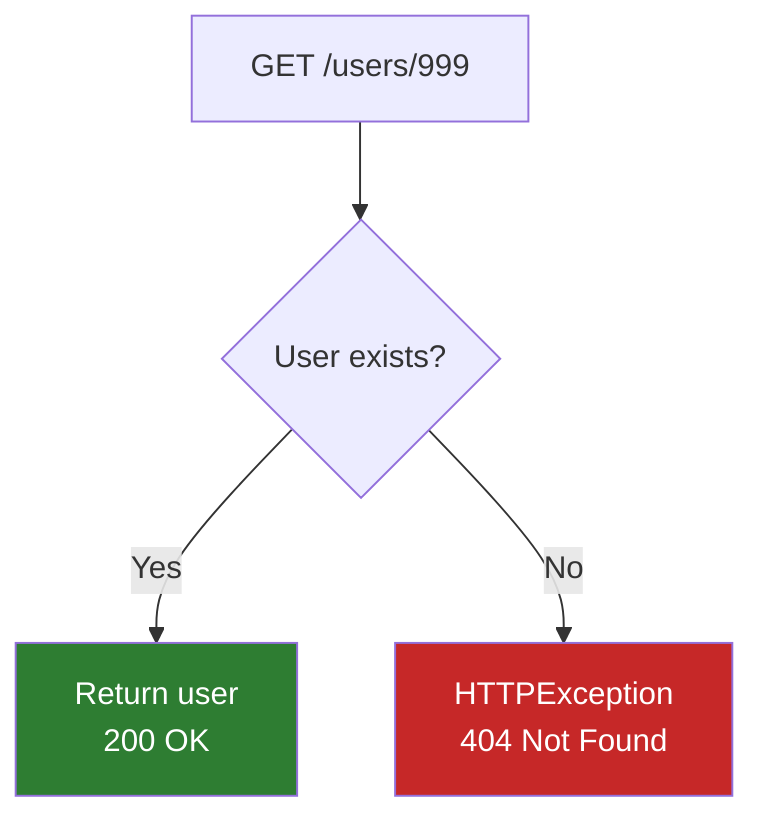

# Lesson 6.20: Status Codes & Errors

> **Duration**: 25 min | **Section**: D - FastAPI Under the Hood

## 🎯 The Problem (3-5 min)

HTTP status codes communicate what happened:
- Did it succeed?
- Was there an error?
- What KIND of error?

But many developers return 200 for everything:

```python
# ❌ Bad: 200 OK with error in body
@app.get("/users/{user_id}")
def get_user(user_id: int):
    user = db.get(user_id)
    if not user:
        return {"error": "User not found"}  # Still 200 OK!
    return user
```

Clients can't easily detect errors. They have to parse the body every time.

> **Scenario**: Your frontend needs to know: Did the request succeed? If not, what went wrong? Using proper status codes, the frontend can check `response.status` before parsing the body.

## 🧪 Try It: Proper Status Codes (5 min)

### Success Codes

```python
from fastapi import FastAPI, status

app = FastAPI()

# 200 OK - Default for successful GET
@app.get("/users")
def list_users():
    return users

# 201 Created - Resource created
@app.post("/users", status_code=status.HTTP_201_CREATED)
def create_user(user: User):
    return created_user

# 204 No Content - Success, nothing to return
@app.delete("/users/{user_id}", status_code=status.HTTP_204_NO_CONTENT)
def delete_user(user_id: int):
    db.delete(user_id)
    # Return nothing
```

### Error Codes with HTTPException

```python
from fastapi import HTTPException

@app.get("/users/{user_id}")
def get_user(user_id: int):
    user = db.get(user_id)
    if not user:
        raise HTTPException(
            status_code=404,
            detail="User not found"
        )
    return user
```



## 🔍 Under the Hood (10-15 min)

### Common Status Codes Reference

| Code | Name | Use When |
|:----:|------|----------|
| **200** | OK | Successful GET, PUT |
| **201** | Created | Successful POST (resource created) |
| **204** | No Content | Successful DELETE (nothing to return) |
| **400** | Bad Request | Malformed request (bad JSON syntax) |
| **401** | Unauthorized | Not authenticated |
| **403** | Forbidden | Authenticated but not allowed |
| **404** | Not Found | Resource doesn't exist |
| **422** | Unprocessable Entity | Validation error (FastAPI default) |
| **500** | Internal Server Error | Server crashed |

### HTTPException in Detail

```python
from fastapi import HTTPException

raise HTTPException(
    status_code=404,              # HTTP status code
    detail="User not found",      # Error message (can be string or dict)
    headers={"X-Error": "custom"} # Optional custom headers
)
```

Response:
```json
{
  "detail": "User not found"
}
```

### Rich Error Details

```python
raise HTTPException(
    status_code=400,
    detail={
        "error": "invalid_request",
        "message": "Email already registered",
        "field": "email"
    }
)
```

Response:
```json
{
  "detail": {
    "error": "invalid_request",
    "message": "Email already registered",
    "field": "email"
  }
}
```

### Custom Exception Handlers

For consistent error formatting across your app:

```python
from fastapi import FastAPI, Request
from fastapi.responses import JSONResponse

app = FastAPI()

class ItemNotFoundError(Exception):
    def __init__(self, item_id: int):
        self.item_id = item_id

@app.exception_handler(ItemNotFoundError)
async def item_not_found_handler(request: Request, exc: ItemNotFoundError):
    return JSONResponse(
        status_code=404,
        content={
            "error": "item_not_found",
            "message": f"Item {exc.item_id} does not exist",
            "item_id": exc.item_id
        }
    )

@app.get("/items/{item_id}")
def get_item(item_id: int):
    item = db.get(item_id)
    if not item:
        raise ItemNotFoundError(item_id)  # Custom exception
    return item
```

### Handling Validation Errors Differently

Override FastAPI's default 422 handler:

```python
from fastapi import FastAPI, Request
from fastapi.exceptions import RequestValidationError
from fastapi.responses import JSONResponse

app = FastAPI()

@app.exception_handler(RequestValidationError)
async def validation_exception_handler(request: Request, exc: RequestValidationError):
    errors = []
    for error in exc.errors():
        errors.append({
            "field": ".".join(str(loc) for loc in error["loc"]),
            "message": error["msg"],
            "type": error["type"]
        })
    
    return JSONResponse(
        status_code=422,
        content={
            "error": "validation_failed",
            "details": errors
        }
    )
```

### Documenting Error Responses

```python
from fastapi import FastAPI, HTTPException
from pydantic import BaseModel

class ErrorResponse(BaseModel):
    detail: str

@app.get(
    "/users/{user_id}",
    responses={
        404: {"model": ErrorResponse, "description": "User not found"},
        500: {"description": "Internal server error"}
    }
)
def get_user(user_id: int):
    ...
```

This appears in `/docs`!

## 💥 Where It Breaks (3-5 min)

### Returning Status Code Instead of Raising

```python
# ❌ Wrong: return with status code doesn't change HTTP status
@app.get("/users/{user_id}")
def get_user(user_id: int):
    if not user:
        return {"error": "not found"}, 404  # ← Doesn't work like Flask!
        
# ✅ Right: raise HTTPException
@app.get("/users/{user_id}")
def get_user(user_id: int):
    if not user:
        raise HTTPException(status_code=404, detail="not found")
```

### 204 With Body

```python
# ❌ Wrong: 204 can't have body
@app.delete("/users/{user_id}", status_code=204)
def delete_user(user_id: int):
    return {"deleted": True}  # Body ignored!
    
# ✅ Right: return nothing for 204
@app.delete("/users/{user_id}", status_code=204)
def delete_user(user_id: int):
    db.delete(user_id)
    # No return
```

### Catching HTTPException

```python
# ❌ Don't catch HTTPException just to re-raise
try:
    ...
except Exception as e:
    raise HTTPException(status_code=500, detail=str(e))

# HTTPException is already an exception—let it propagate!
```

## ✅ Complete Error Handling Pattern (5 min)

```python
from fastapi import FastAPI, HTTPException, status
from pydantic import BaseModel

app = FastAPI()

class User(BaseModel):
    name: str
    email: str

class UserResponse(BaseModel):
    id: int
    name: str
    email: str

# Fake DB
users_db = {1: {"id": 1, "name": "Alice", "email": "alice@example.com"}}

@app.get("/users/{user_id}", response_model=UserResponse)
def get_user(user_id: int):
    if user_id not in users_db:
        raise HTTPException(
            status_code=status.HTTP_404_NOT_FOUND,
            detail=f"User {user_id} not found"
        )
    return users_db[user_id]

@app.post("/users", response_model=UserResponse, status_code=status.HTTP_201_CREATED)
def create_user(user: User):
    # Check for duplicate email
    for existing in users_db.values():
        if existing["email"] == user.email:
            raise HTTPException(
                status_code=status.HTTP_409_CONFLICT,
                detail="Email already registered"
            )
    
    new_id = max(users_db.keys()) + 1
    users_db[new_id] = {"id": new_id, **user.model_dump()}
    return users_db[new_id]

@app.delete("/users/{user_id}", status_code=status.HTTP_204_NO_CONTENT)
def delete_user(user_id: int):
    if user_id not in users_db:
        raise HTTPException(
            status_code=status.HTTP_404_NOT_FOUND,
            detail=f"User {user_id} not found"
        )
    del users_db[user_id]
```

## 🎯 Practice

### Exercise 1: Status Codes

What status code should each endpoint return?

| Endpoint | On Success | On Not Found |
|----------|:----------:|:------------:|
| GET /users/{id} | _____ | _____ |
| POST /users | _____ | N/A |
| PUT /users/{id} | _____ | _____ |
| DELETE /users/{id} | _____ | _____ |

### Exercise 2: Custom Error Handler

Create a custom exception `InsufficientFundsError` with an exception handler that returns:
```json
{
  "error": "insufficient_funds",
  "required": 100.00,
  "available": 50.00
}
```

### Exercise 3: Document Errors

Add `responses` parameter to document possible error responses for a payment endpoint.

## 🔑 Key Takeaways

- **status_code** in decorator sets success status
- **HTTPException** for errors (raises, doesn't return)
- **404** = not found, **401** = not authenticated, **403** = forbidden
- **422** = validation error (FastAPI's Pydantic errors)
- **Custom exception handlers** for consistent error format
- **Document errors** with `responses` parameter

## ❓ Common Questions

| Question | Answer |
|----------|--------|
| "Why 422 not 400?" | 400 = malformed request. 422 = valid request, invalid data. |
| "status.HTTP_* vs numbers?" | Same thing. Constants are more readable. |
| "Can I use 2xx for errors?" | Technically yes, but DON'T. Breaks client expectations. |
| "Multiple error types?" | Use different status codes + different detail messages |

## 📚 Further Reading

- [FastAPI Handling Errors](https://fastapi.tiangolo.com/tutorial/handling-errors/)
- [HTTP Status Codes - MDN](https://developer.mozilla.org/en-US/docs/Web/HTTP/Status)
- [REST API Error Handling Best Practices](https://www.baeldung.com/rest-api-error-handling-best-practices)

---

**Next**: [Lesson 6.21: Request Lifecycle Q&A](./Lesson-21-Request-Lifecycle-QA.md) — Answers to common questions about the request lifecycle.
