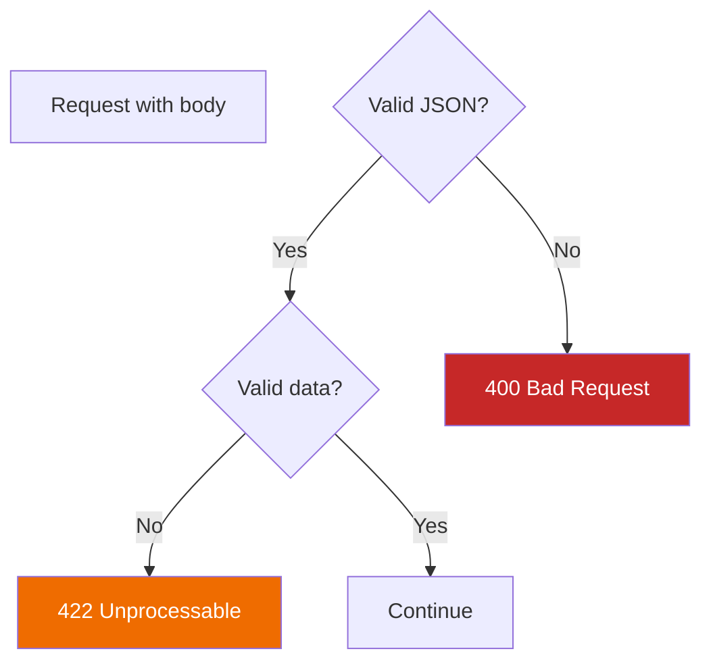

# Lesson 6.21: Request Lifecycle Q&A

> **Duration**: 10 min | **Section**: D - FastAPI Under the Hood

## 🎯 Purpose

You understand the request lifecycle: Middleware → Routing → Validation → Dependencies → Handler → Response. Let's answer the common questions that come up.

## ❓ Frequently Asked Questions

### Q: Where do I add logging?

**Answer**: It depends on WHAT you want to log.

| What to Log | Where | Example |
|-------------|-------|---------|
| All requests (even failed) | Middleware | Request timing, IP address |
| Only after validation | Dependency | Log validated user actions |
| Specific endpoint logic | Handler | Business-specific events |

```python
# Middleware: logs ALL requests
@app.middleware("http")
async def log_requests(request, call_next):
    logger.info(f"Request: {request.method} {request.url}")
    response = await call_next(request)
    logger.info(f"Response: {response.status_code}")
    return response

# Dependency: logs only after validation passes
def log_user_action(user: User = Depends(get_current_user)):
    logger.info(f"User {user.id} making request")
    return user

# Handler: logs specific business logic
@app.post("/orders")
def create_order(order: Order):
    logger.info(f"Creating order: {order.id}")
    ...
```

---

### Q: Why does FastAPI use 422 instead of 400?

**Answer**: They mean different things:

| Code | Meaning | Example |
|:----:|---------|---------|
| **400** | Bad Request - Malformed | `{name: Alice}` (invalid JSON syntax) |
| **422** | Unprocessable - Valid syntax, invalid data | `{"age": "old"}` (wrong type) |

FastAPI uses 422 because:
1. The JSON is valid (parseable)
2. But the DATA doesn't match the schema

This is more precise and follows RFC 4918.



---

### Q: Can I access the request object directly?

**Answer**: Yes! Import `Request` from FastAPI.

```python
from fastapi import FastAPI, Request

@app.get("/debug")
def debug(request: Request):
    return {
        "method": request.method,
        "url": str(request.url),
        "headers": dict(request.headers),
        "client": request.client.host if request.client else None,
        "cookies": request.cookies,
    }
```

Useful for:
- Getting headers manually
- Logging client IP
- Accessing cookies
- Reading raw body (advanced)

---

### Q: How do I debug what's happening?

**Answer**: Add prints/logs at each layer:

```python
# 1. Middleware
@app.middleware("http")
async def debug_middleware(request, call_next):
    print("1. Middleware: request received")
    response = await call_next(request)
    print("5. Middleware: response ready")
    return response

# 2. Dependency
def debug_dependency():
    print("3. Dependency: executing")
    return "dep"

# 3. Handler
@app.post("/test")
def test(data: Model, dep = Depends(debug_dependency)):
    print("4. Handler: running")
    return {"ok": True}

# If validation fails, you'll see:
# 1. Middleware: request received
# 5. Middleware: response ready
# (Steps 3, 4 skipped!)
```

---

### Q: Dependencies vs Middleware - when to use which?

| Aspect | Middleware | Dependency |
|--------|-----------|------------|
| Runs on | ALL requests | Specific endpoints |
| Access to | Raw request/response | Validated parameters |
| Use for | Logging, CORS, headers | Auth, DB, per-endpoint logic |
| Defined | Once globally | Per-endpoint or router |

```python
# Middleware: runs on EVERY request
app.add_middleware(CORSMiddleware, ...)

# Dependency: runs only where you put it
@app.get("/protected")
def protected(user: User = Depends(get_current_user)):
    ...
```

---

### Q: My function is async but I'm calling sync code. Is that OK?

**Answer**: It works, but can block the event loop.

```python
# ❌ Blocking async (bad for performance)
@app.get("/data")
async def get_data():
    result = sync_database_call()  # Blocks!
    return result

# ✅ Option 1: Just use def (FastAPI runs in thread pool)
@app.get("/data")
def get_data():
    result = sync_database_call()
    return result

# ✅ Option 2: Run sync in executor
import asyncio

@app.get("/data")
async def get_data():
    loop = asyncio.get_event_loop()
    result = await loop.run_in_executor(None, sync_database_call)
    return result
```

---

### Q: How do I return a file or non-JSON response?

**Answer**: Use specialized Response classes.

```python
from fastapi.responses import FileResponse, HTMLResponse, PlainTextResponse

# File download
@app.get("/download")
def download():
    return FileResponse("report.pdf", filename="report.pdf")

# HTML page
@app.get("/page", response_class=HTMLResponse)
def page():
    return "<html><body><h1>Hello</h1></body></html>"

# Plain text
@app.get("/text", response_class=PlainTextResponse)
def text():
    return "Just plain text"
```

---

### Q: What happens if I raise an exception in middleware?

**Answer**: The request fails, but later middleware still runs.

```python
@app.middleware("http")
async def first_middleware(request, call_next):
    try:
        return await call_next(request)
    except Exception as e:
        # This catches exceptions from later middleware/handlers
        return JSONResponse(status_code=500, content={"error": str(e)})

@app.middleware("http")
async def second_middleware(request, call_next):
    raise RuntimeError("Something broke")  # Caught by first_middleware
```

The first middleware can catch and handle errors from the rest of the chain.

---

## � Common Pitfalls

| Pitfall | Why It Happens | Fix |
|---------|---------------|-----|
| Logging in wrong layer | Not understanding lifecycle | Middleware for all requests; dependencies for validated requests |
| Expecting 400 for validation errors | Other frameworks use 400 | FastAPI uses 422 (Unprocessable Entity) for Pydantic validation failures |
| Blocking async with sync calls | Mixing sync libraries in async handlers | Use `def` for sync code, or run in executor |
| Middleware not seeing validation errors | Validation happens after middleware | Validation errors are caught and returned as 422 response |
| Dependencies running multiple times | Not understanding caching | Use `Depends(dep, use_cache=True)` (default) for same-request caching |
| Returning dict when Response needed | Not knowing specialized responses exist | Use `FileResponse`, `HTMLResponse`, etc. for non-JSON responses |

## 🔑 Key Takeaways

1. **Request lifecycle order** — Middleware → Routing → Validation → Dependencies → Handler → Response
2. **422 vs 400** — 422 means valid JSON but invalid data; 400 means malformed request
3. **Log at the right layer** — Middleware for all traffic; dependencies for business logic
4. **Access raw request** — Add `request: Request` parameter to access headers, client IP, etc.
5. **Sync in async is OK with `def`** — FastAPI runs `def` handlers in thread pool automatically
6. **Middleware wraps everything** — First middleware can catch errors from the entire chain

---

## �🔑 Quick Reference

| Question | Short Answer |
|----------|--------------|
| Where to log? | Middleware (all), Dependency (per-endpoint) |
| 400 vs 422? | 400 = bad JSON syntax, 422 = bad data |
| Access headers? | `request: Request` parameter |
| Debug flow? | Print at each layer |
| Middleware vs Deps? | Middleware = global, Deps = specific |
| Sync in async? | Use `def` instead, or run in executor |
| Non-JSON response? | Use FileResponse, HTMLResponse, etc. |

---

**Next**: [Lesson 6.22: The Reuse Problem](./Lesson-22-The-Reuse-Problem.md) — Every endpoint needs database connection. Every protected route needs auth. How do you avoid repeating yourself?
