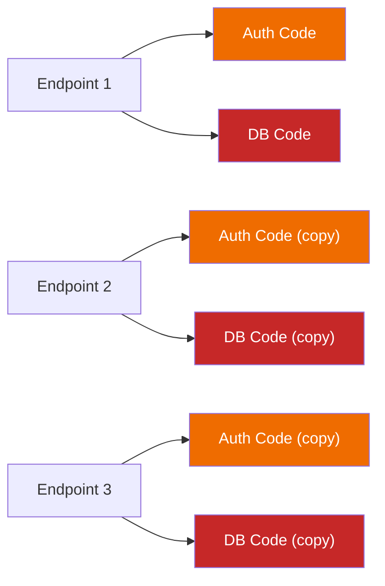
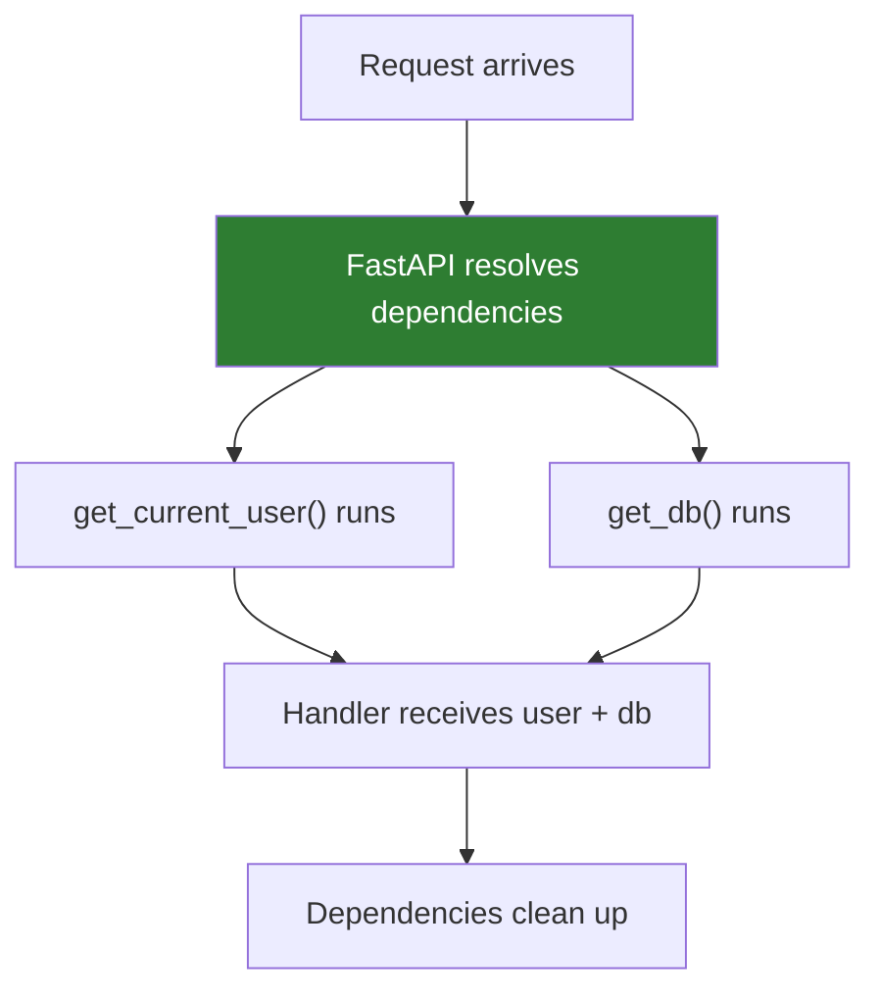

# Lesson 6.22: The Reuse Problem

> **Duration**: 5 min | **Section**: E - Advanced FastAPI | **Type**: Intro Lesson

## 📍 Where We Are

You can build FastAPI endpoints with validated inputs and typed outputs. You have routes that accept path parameters, query parameters, and request bodies.

**But there's a problem brewing.**

## 😤 THE PROBLEM: Copy-Paste Hell

Let's look at a real API with three endpoints:

```python
from fastapi import FastAPI, HTTPException
from sqlalchemy.orm import Session
from database import engine

app = FastAPI()

@app.get("/users/{user_id}")
def get_user(user_id: int, token: str):
    # 1. Validate token
    if not is_valid_token(token):
        raise HTTPException(401, "Invalid token")
    
    # 2. Get current user from token
    current_user = get_user_from_token(token)
    if not current_user:
        raise HTTPException(401, "Invalid token")
    
    # 3. Connect to database
    db = Session(engine)
    try:
        # 4. Actual logic
        user = db.query(User).filter(User.id == user_id).first()
        return user
    finally:
        db.close()


@app.get("/posts")
def get_posts(skip: int = 0, limit: int = 10, token: str = None):
    # 1. Validate token (SAME CODE!)
    if not is_valid_token(token):
        raise HTTPException(401, "Invalid token")
    
    # 2. Get current user from token (SAME CODE!)
    current_user = get_user_from_token(token)
    if not current_user:
        raise HTTPException(401, "Invalid token")
    
    # 3. Connect to database (SAME CODE!)
    db = Session(engine)
    try:
        # 4. Actual logic
        posts = db.query(Post).offset(skip).limit(limit).all()
        return posts
    finally:
        db.close()


@app.post("/posts")
def create_post(post: PostCreate, token: str):
    # 1. Validate token (SAME CODE!)
    if not is_valid_token(token):
        raise HTTPException(401, "Invalid token")
    
    # 2. Get current user from token (SAME CODE!)
    current_user = get_user_from_token(token)
    if not current_user:
        raise HTTPException(401, "Invalid token")
    
    # 3. Connect to database (SAME CODE!)
    db = Session(engine)
    try:
        # 4. Actual logic
        new_post = Post(**post.dict(), author_id=current_user.id)
        db.add(new_post)
        db.commit()
        return new_post
    finally:
        db.close()
```

### Count the Repetition

| What | Times Repeated |
|------|:--------------:|
| Token validation | 3x |
| Get current user | 3x |
| Database connection | 3x |
| Database cleanup | 3x |

**That's 12 copy-pasted blocks for just 3 endpoints.**

## 🔥 Why This Hurts

### 1. Bug Propagation
If token validation has a bug, you fix it in ONE place... and forget the other two.

### 2. Inconsistency
One endpoint might close the database, another might forget.

### 3. Testing Nightmare
How do you test the logic WITHOUT a real database? You can't easily swap it.

### 4. Change Amplification
Want to add rate limiting? Change EVERY endpoint.



## 🤔 The Traditional Solution

In regular Python, you'd make a helper function:

```python
def require_auth(token: str):
    if not is_valid_token(token):
        raise HTTPException(401, "Invalid token")
    return get_user_from_token(token)

@app.get("/users/{user_id}")
def get_user(user_id: int, token: str):
    current_user = require_auth(token)  # Better!
    db = Session(engine)
    try:
        ...
    finally:
        db.close()
```

Better, but:
1. Still manually calling `require_auth(token)` everywhere
2. Still manually passing `token` as a parameter everywhere
3. Database handling is still repeated

## ❓ What If...

What if we could say:

> "Before running this endpoint, automatically:
> 1. Get the token from the header
> 2. Validate it
> 3. Give me the user
> 4. Connect to database
> 5. Clean up after I'm done"

And FastAPI would handle all of that, leaving our endpoint to just do business logic?

```python
# Dream code - is this possible?
@app.get("/users/{user_id}")
def get_user(
    user_id: int,
    current_user: User = ???,  # Auto from token
    db: Session = ???          # Auto connected, auto closed
):
    # Just business logic!
    return db.query(User).filter(User.id == user_id).first()
```

## 🎯 The Answer: Dependency Injection

This pattern exists. It's called **Dependency Injection**.

FastAPI has it built in with `Depends()`.



Write the logic ONCE. Reuse it EVERYWHERE. FastAPI handles the wiring.

---

## 📝 What You'll Learn Next

| Lesson | Topic |
|--------|-------|
| 6.23 | Dependency Injection Under the Hood |
| 6.24 | Routers & Organization |
| 6.25 | Authentication with Dependencies |

---

**Next**: [Lesson 6.23: Dependency Injection Under the Hood](./Lesson-23-Dependency-Injection-Under-The-Hood.md) — How `Depends()` actually works, and how to use it.
