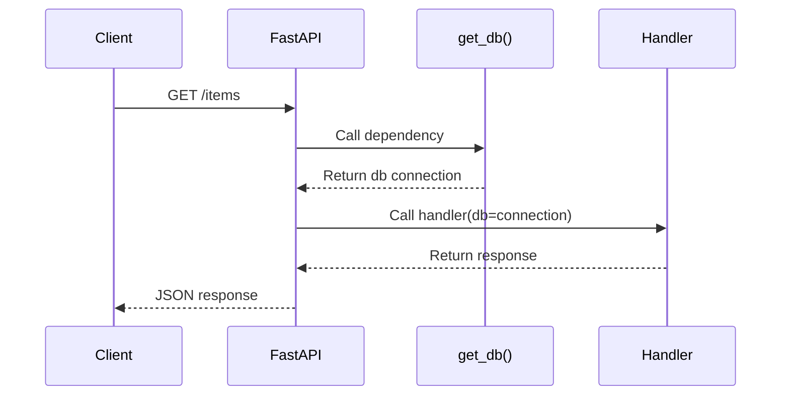
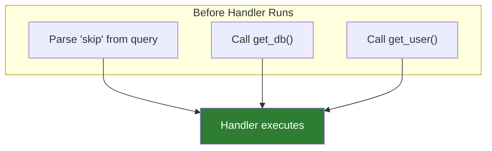
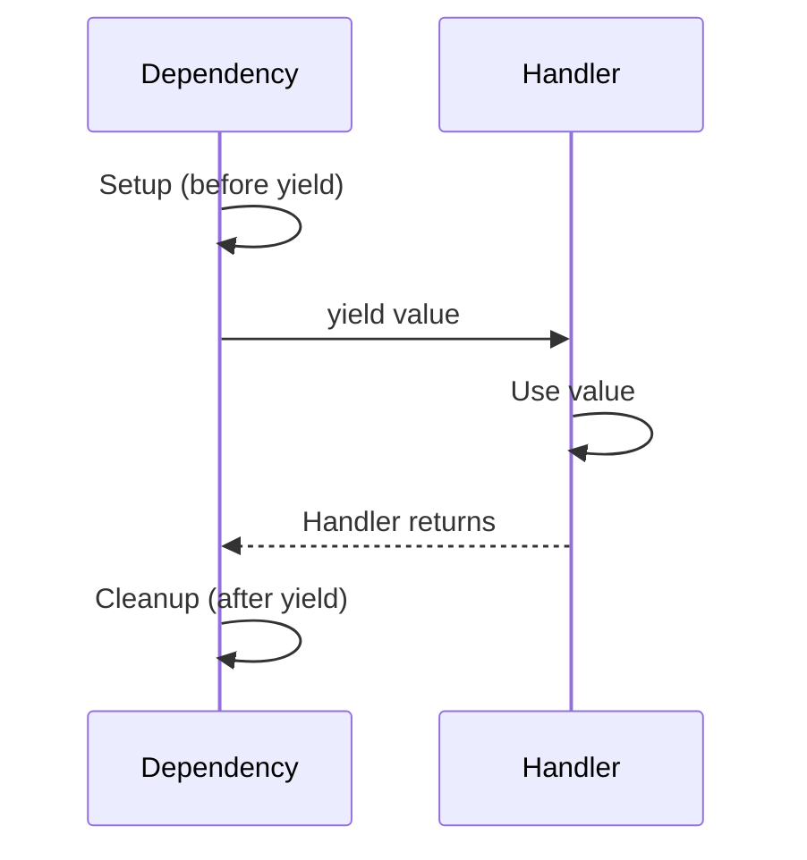
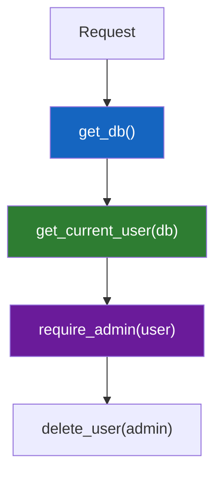
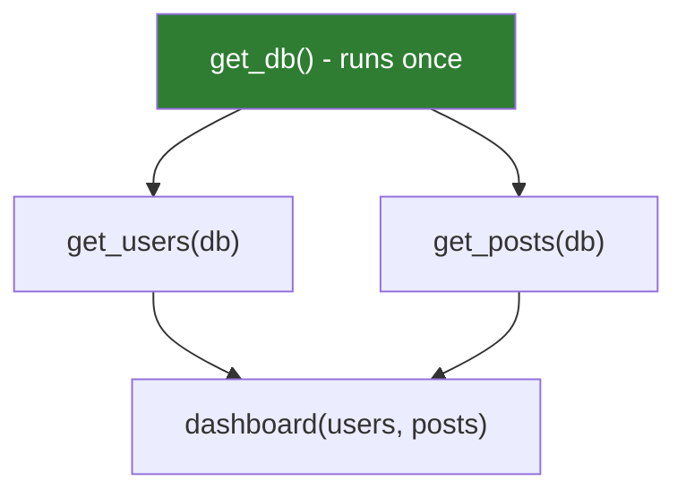
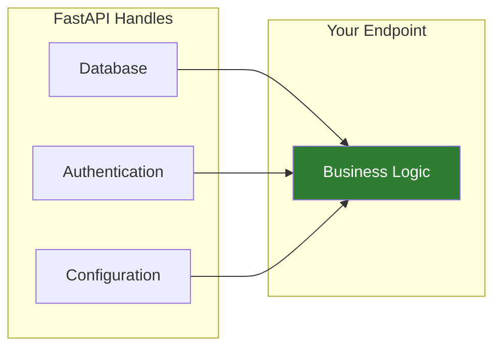

# Lesson 6.23: Dependency Injection Under the Hood

> **Duration**: 35 min | **Section**: E - Advanced FastAPI

## 📍 Where We Are

We saw the copy-paste problem: authentication, database connections, and setup code repeated in every endpoint. We need a way to write it once and reuse it everywhere.

**The answer: Dependency Injection with `Depends()`.**

---

## 🎯 The Core Idea

Dependency Injection means: **Give me what I need, don't make me create it.**

Instead of:
```python
def make_coffee():
    water = get_water()        # I have to get water
    beans = grind_beans()      # I have to grind beans
    machine = turn_on_machine() # I have to turn on machine
    return brew(water, beans)
```

With dependency injection:
```python
def make_coffee(water, beans, machine):  # Just give me these!
    return brew(water, beans)
```

Someone ELSE handles getting water, grinding beans, turning on the machine. Your function just does its job.

---

## 🔧 The Simplest Dependency

```python
from fastapi import FastAPI, Depends

app = FastAPI()

# Step 1: Define a dependency (just a function!)
def get_db():
    print("Opening database connection")
    return {"connection": "db123"}

# Step 2: Use it with Depends()
@app.get("/items")
def get_items(db = Depends(get_db)):
    print(f"Using {db}")
    return {"items": [1, 2, 3]}
```

What happens when you call `/items`:

```
Opening database connection
Using {'connection': 'db123'}
```

FastAPI automatically:
1. Sees `Depends(get_db)` in the parameter list
2. Calls `get_db()` before your handler runs
3. Passes the result as `db`



---

## 🔬 Under the Hood: How Depends Works

When FastAPI starts up, it analyzes your endpoint function:

```python
@app.get("/items")
def get_items(
    skip: int = 0,              # Query parameter
    db = Depends(get_db),        # Dependency
    user = Depends(get_user)     # Another dependency
):
    ...
```

FastAPI builds a **dependency graph**:



All dependencies are resolved, THEN your handler runs with everything ready.

---

## 🔄 Dependencies With Cleanup (yield)

Here's the real power. What if your dependency needs cleanup?

### The Problem: Resource Leaks

```python
def get_db():
    db = create_connection()
    return db
    # Connection never closed! 💀
```

### The Solution: Use `yield`

```python
def get_db():
    print("1. Opening connection")
    db = create_connection()
    try:
        yield db  # Give this to the handler
    finally:
        print("3. Closing connection")
        db.close()  # Cleanup runs after handler finishes!

@app.get("/items")
def get_items(db = Depends(get_db)):
    print("2. Using connection")
    return db.query("SELECT * FROM items")
```

Output:
```
1. Opening connection
2. Using connection
3. Closing connection
```



The `finally` block runs **even if the handler raises an exception**!

---

## 🔗 Nested Dependencies

Dependencies can depend on other dependencies:

```python
# Level 1: Get database
def get_db():
    db = connect_db()
    yield db
    db.close()

# Level 2: Get user requires database
def get_current_user(db = Depends(get_db)):
    # I have a db connection!
    user = db.query("SELECT * FROM users WHERE token = ...")
    return user

# Level 3: Check admin requires user
def require_admin(user = Depends(get_current_user)):
    if not user.is_admin:
        raise HTTPException(403, "Admin required")
    return user

# Endpoint: Just use the top-level dependency
@app.delete("/users/{user_id}")
def delete_user(user_id: int, admin = Depends(require_admin)):
    # admin is guaranteed to be an admin user
    # db was opened and will be closed automatically
    ...
```

FastAPI resolves the full chain:



---

## 🏷️ Class-Based Dependencies

For complex dependencies, use classes:

```python
class Pagination:
    def __init__(self, skip: int = 0, limit: int = 10):
        self.skip = skip
        self.limit = limit

@app.get("/items")
def get_items(pagination: Pagination = Depends()):
    # pagination.skip and pagination.limit are query params!
    return items[pagination.skip : pagination.skip + pagination.limit]
```

When you use `Depends()` with no argument on a class, FastAPI:
1. Looks at `__init__` parameters
2. Maps them to query parameters
3. Creates an instance

This is great for grouping related parameters.

---

## 🔀 Shared Dependencies: Caching

What if two dependencies need the same sub-dependency?

```python
def get_db():
    print("Opening connection")
    return create_connection()

def get_users(db = Depends(get_db)):
    return db.query("users")

def get_posts(db = Depends(get_db)):
    return db.query("posts")

@app.get("/dashboard")
def dashboard(
    users = Depends(get_users),
    posts = Depends(get_posts)
):
    return {"users": users, "posts": posts}
```

Does `get_db()` run twice? **NO!**

FastAPI caches dependency results within a request:

```
Opening connection  # Only once!
```



### Disabling the Cache

If you WANT it to run each time:

```python
@app.get("/data")
def get_data(
    first_db = Depends(get_db, use_cache=False),
    second_db = Depends(get_db, use_cache=False)
):
    # get_db runs twice - different connections
    ...
```

---

## 🎯 Common Dependency Patterns

### Pattern 1: Database Session

```python
from sqlalchemy import create_engine
from sqlalchemy.orm import sessionmaker, Session

engine = create_engine("sqlite:///./app.db")
SessionLocal = sessionmaker(bind=engine)

def get_db():
    db = SessionLocal()
    try:
        yield db
    finally:
        db.close()
```

### Pattern 2: Authentication

```python
from fastapi.security import HTTPBearer, HTTPAuthorizationCredentials

security = HTTPBearer()

def get_current_user(
    credentials: HTTPAuthorizationCredentials = Depends(security)
):
    token = credentials.credentials
    user = decode_and_validate_token(token)
    if not user:
        raise HTTPException(401, "Invalid token")
    return user
```

### Pattern 3: Configuration

```python
from functools import lru_cache
from pydantic_settings import BaseSettings

class Settings(BaseSettings):
    database_url: str
    secret_key: str

@lru_cache  # Cache settings - read env once
def get_settings():
    return Settings()

@app.get("/info")
def info(settings: Settings = Depends(get_settings)):
    return {"db": settings.database_url}
```

---

## 🧪 Practice: Build a Dependency Chain

### Challenge

Create a protected endpoint that:
1. Opens a database connection (with cleanup)
2. Gets the current user from a token
3. Checks if user is active
4. Only then runs the handler

```python
from fastapi import FastAPI, Depends, HTTPException, Header

app = FastAPI()

# 1. Database dependency
def get_db():
    """Create db connection, yield it, close after"""
    print("DB: Opening")
    db = {"connected": True}  # Fake connection
    try:
        yield db
    finally:
        print("DB: Closing")

# 2. Get user (needs db)
def get_current_user(
    db = Depends(get_db),
    x_token: str = Header()
):
    """Lookup user by token"""
    # Fake: token "admin123" = admin, "user456" = regular, anything else = None
    users = {
        "admin123": {"id": 1, "name": "Admin", "active": True},
        "user456": {"id": 2, "name": "User", "active": False},
    }
    user = users.get(x_token)
    if not user:
        raise HTTPException(401, "Invalid token")
    return user

# 3. Require active user (needs user)
def require_active_user(user = Depends(get_current_user)):
    """Ensure user is active"""
    if not user["active"]:
        raise HTTPException(403, "Account deactivated")
    return user

# 4. Protected endpoint
@app.get("/profile")
def get_profile(user = Depends(require_active_user)):
    return {"message": f"Hello, {user['name']}!"}
```

### Test It

```bash
# No token - 422 (missing header)
curl http://localhost:8000/profile

# Invalid token - 401
curl http://localhost:8000/profile -H "X-Token: wrong"

# Inactive user - 403
curl http://localhost:8000/profile -H "X-Token: user456"

# Active user - 200
curl http://localhost:8000/profile -H "X-Token: admin123"
```

---

## 🔑 Key Takeaways

| Concept | What It Does |
|---------|--------------|
| `Depends(func)` | Calls `func`, passes result to handler |
| `yield` in dependency | Setup → yield → cleanup |
| Nested deps | Dependencies can use other dependencies |
| Cache | Same dep runs once per request (by default) |
| Class deps | Group related parameters |

### The Mental Model



You write business logic. FastAPI wires up the dependencies.

---

## ❓ Quick Q&A

**Q: Can I use async dependencies?**
A: Yes! `async def get_db():` works exactly the same way.

**Q: What if a dependency fails?**
A: The exception propagates up. Your handler never runs.

**Q: How do I test endpoints with dependencies?**
A: Override them in tests (next lesson covers this).

---

## 📚 Further Reading

- [FastAPI Dependencies](https://fastapi.tiangolo.com/tutorial/dependencies/)
- [Dependencies with yield](https://fastapi.tiangolo.com/tutorial/dependencies/dependencies-with-yield/)
- [Sub-dependencies](https://fastapi.tiangolo.com/tutorial/dependencies/sub-dependencies/)

---

**Next**: [Lesson 6.24: Routers & Organization](./Lesson-24-Routers-And-Organization.md) — Your app is growing. How do you organize dozens of endpoints across multiple files?
