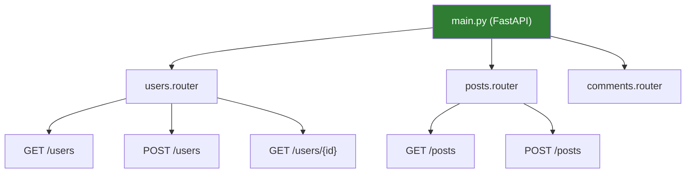
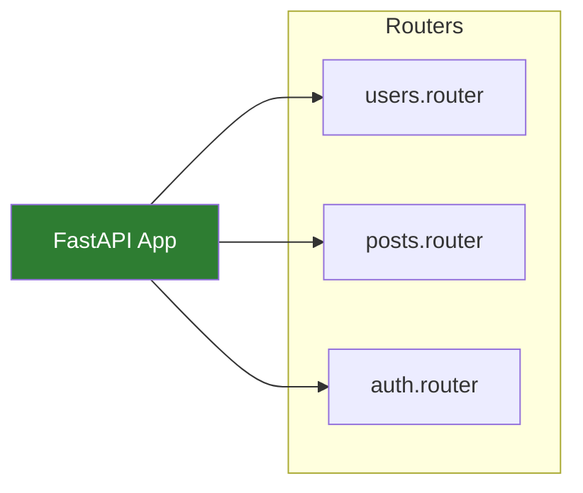

# Lesson 6.24: Routers & Organization

> **Duration**: 25 min | **Section**: E - Advanced FastAPI

## 📍 Where We Are

You understand dependencies and how to reuse code across endpoints. But what happens when your API grows?

You have users, posts, comments, products, orders, payments... all in one file. It becomes a mess.

---

## 😤 THE PROBLEM: The Growing Monolith

Week 1:
```python
# main.py - 50 lines, manageable
@app.get("/users")
@app.post("/users")
@app.get("/users/{id}")
```

Week 4:
```python
# main.py - 500 lines, getting messy
@app.get("/users")
@app.post("/users")
@app.get("/users/{id}")
@app.put("/users/{id}")
@app.delete("/users/{id}")
@app.get("/posts")
@app.post("/posts")
@app.get("/posts/{id}")
@app.put("/posts/{id}")
@app.delete("/posts/{id}")
@app.get("/comments")
# ... 40 more endpoints
```

Week 8:
```python
# main.py - 2000 lines
# Nobody wants to touch this file
# Finding anything takes forever
# Merge conflicts every PR
```

### The Pain Points

| Problem | Impact |
|---------|--------|
| One huge file | Hard to navigate |
| Everything coupled | Hard to test |
| Merge conflicts | Slow development |
| No clear ownership | "Who owns users?" |

---

## 🔧 The Solution: APIRouter

FastAPI provides `APIRouter` — a way to organize endpoints into separate modules.

### Step 1: Create a Router

```python
# app/routers/users.py
from fastapi import APIRouter

router = APIRouter()

@router.get("/users")
def get_users():
    return [{"id": 1, "name": "Alice"}]

@router.post("/users")
def create_user(name: str):
    return {"id": 2, "name": name}

@router.get("/users/{user_id}")
def get_user(user_id: int):
    return {"id": user_id, "name": "Someone"}
```

### Step 2: Include in Main App

```python
# app/main.py
from fastapi import FastAPI
from app.routers import users, posts

app = FastAPI()

app.include_router(users.router)
app.include_router(posts.router)
```

That's it! All routes from `users.router` are now part of your app.



---

## 🏷️ Router Configuration

### Add a Prefix

Instead of writing `/users` on every route:

```python
# Before: prefix in each route
@router.get("/users")
@router.post("/users")
@router.get("/users/{id}")
```

```python
# After: prefix once in router
router = APIRouter(prefix="/users")

@router.get("/")           # → GET /users
@router.post("/")          # → POST /users
@router.get("/{user_id}")  # → GET /users/{user_id}
```

### Add Tags (for documentation)

```python
router = APIRouter(
    prefix="/users",
    tags=["Users"]  # Groups in Swagger UI
)
```

The `/docs` page now groups all user endpoints under "Users".

### Add Common Dependencies

```python
router = APIRouter(
    prefix="/admin",
    tags=["Admin"],
    dependencies=[Depends(require_admin)]  # Applied to ALL routes
)

@router.get("/stats")  # Only admins can access
def get_stats():
    return {"users": 100}

@router.delete("/user/{id}")  # Only admins can access
def delete_user(id: int):
    return {"deleted": id}
```

---

## 📁 Recommended Project Structure

### Small Project (5-10 endpoints)

```
app/
├── main.py          # App + all routers
├── models.py        # Pydantic models
├── database.py      # DB connection
└── routers/
    ├── __init__.py
    ├── users.py
    └── posts.py
```

### Medium Project (20-50 endpoints)

```
app/
├── main.py
├── config.py        # Settings
├── dependencies.py  # Shared deps (auth, db)
├── models/
│   ├── __init__.py
│   ├── user.py
│   └── post.py
├── routers/
│   ├── __init__.py
│   ├── users.py
│   └── posts.py
└── services/
    ├── __init__.py
    └── user_service.py
```

### Large Project (100+ endpoints)

```
app/
├── main.py
├── core/
│   ├── config.py
│   ├── security.py
│   └── database.py
├── api/
│   ├── deps.py           # Dependencies
│   └── v1/
│       ├── __init__.py
│       ├── router.py     # Combines all v1 routers
│       ├── endpoints/
│       │   ├── users.py
│       │   ├── posts.py
│       │   └── auth.py
│       └── schemas/      # Pydantic models for v1
├── models/               # Database models
├── services/             # Business logic
└── tests/
```

---

## 🔧 Practice: Refactor to Routers

### Before (monolith)

```python
# main.py
from fastapi import FastAPI

app = FastAPI()

# Users
@app.get("/users")
def get_users():
    return []

@app.post("/users")
def create_user():
    return {"id": 1}

# Posts
@app.get("/posts")
def get_posts():
    return []

@app.post("/posts")
def create_post():
    return {"id": 1}
```

### After (organized)

```python
# app/routers/users.py
from fastapi import APIRouter

router = APIRouter(prefix="/users", tags=["Users"])

@router.get("/")
def get_users():
    return []

@router.post("/")
def create_user():
    return {"id": 1}
```

```python
# app/routers/posts.py
from fastapi import APIRouter

router = APIRouter(prefix="/posts", tags=["Posts"])

@router.get("/")
def get_posts():
    return []

@router.post("/")
def create_post():
    return {"id": 1}
```

```python
# app/main.py
from fastapi import FastAPI
from app.routers import users, posts

app = FastAPI(title="My API")

app.include_router(users.router)
app.include_router(posts.router)
```

---

## 🔀 Nested Routers

Routers can include other routers:

```python
# api/v1/router.py
from fastapi import APIRouter
from api.v1.endpoints import users, posts, comments

api_router = APIRouter()
api_router.include_router(users.router, prefix="/users", tags=["Users"])
api_router.include_router(posts.router, prefix="/posts", tags=["Posts"])
api_router.include_router(comments.router, prefix="/comments", tags=["Comments"])

# main.py
from fastapi import FastAPI
from api.v1.router import api_router

app = FastAPI()
app.include_router(api_router, prefix="/api/v1")
```

Result:
- `GET /api/v1/users`
- `GET /api/v1/posts`
- `GET /api/v1/comments`

---

## 🏷️ Versioning Your API

Using routers for versioning:

```python
# api/v1/users.py
router = APIRouter()

@router.get("/users")
def get_users_v1():
    return {"version": "v1", "users": [...]}

# api/v2/users.py
router = APIRouter()

@router.get("/users")
def get_users_v2():
    return {"version": "v2", "data": {"users": [...]}, "meta": {...}}

# main.py
from api.v1 import router as v1_router
from api.v2 import router as v2_router

app.include_router(v1_router, prefix="/api/v1")
app.include_router(v2_router, prefix="/api/v2")
```

Both versions work simultaneously:
- `GET /api/v1/users` — old format
- `GET /api/v2/users` — new format

---

## 📊 Comparison: When to Split

| Size | Structure | Recommendation |
|------|-----------|----------------|
| 1-5 endpoints | One file | Keep simple |
| 6-20 endpoints | Basic routers | Split by resource |
| 20-50 endpoints | Full structure | Add services layer |
| 50+ endpoints | Domain-driven | Consider microservices |

---

## 🔑 Key Takeaways

| Concept | What It Does |
|---------|--------------|
| `APIRouter()` | Create a group of routes |
| `prefix="/users"` | Add path prefix to all routes |
| `tags=["Users"]` | Group in OpenAPI docs |
| `dependencies=[...]` | Apply to all routes in router |
| `include_router()` | Add router to app |

### The Mental Model



Think of routers as **mini-apps** that get combined into one.

---

## 📚 Further Reading

- [FastAPI Bigger Applications](https://fastapi.tiangolo.com/tutorial/bigger-applications/)
- [APIRouter Class Reference](https://fastapi.tiangolo.com/reference/apirouter/)

---

**Next**: [Lesson 6.25: Authentication](./Lesson-25-Authentication.md) — How do you protect endpoints? JWT tokens, OAuth2, and security dependencies.
