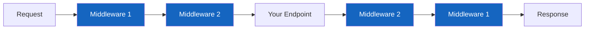
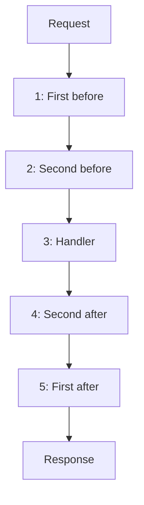
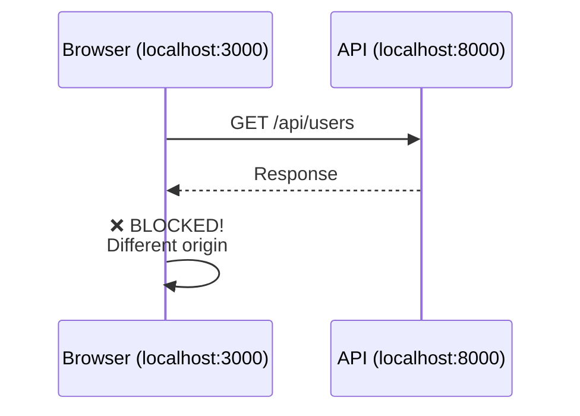
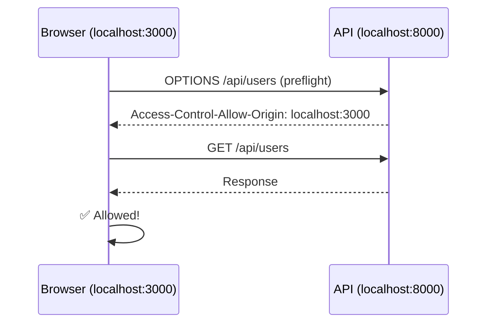
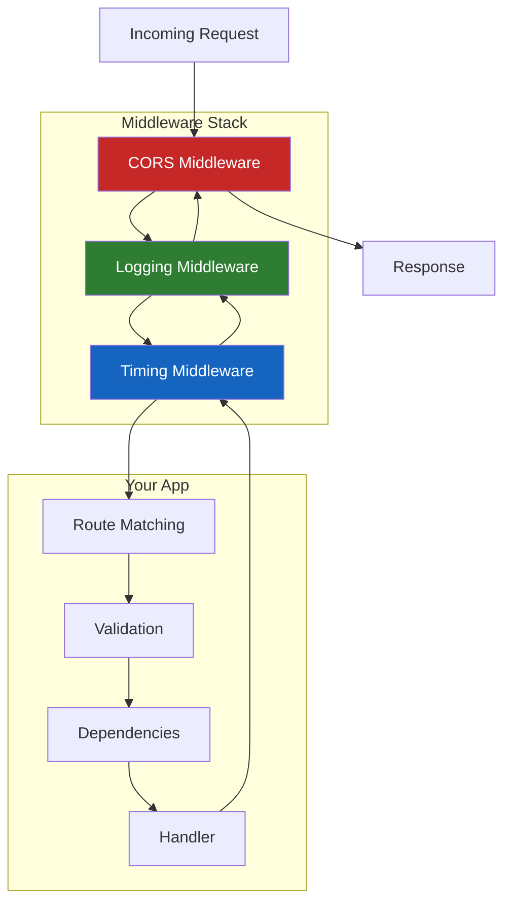

# Lesson 6.26: Middleware & CORS

> **Duration**: 30 min | **Section**: E - Advanced FastAPI

## 📍 Where We Are

You can authenticate users, organize routes, and build full APIs. Now we need to handle cross-cutting concerns: logging every request, adding headers, measuring timing, and allowing browser access.

---

## 🎯 What is Middleware?

Middleware is code that runs on **every request** — before it reaches your endpoint, and after the response is generated.

Think of it as a security checkpoint:



Every request passes through middleware. Every response passes back through (in reverse order).

---

## 🔧 Creating Middleware

### Basic Pattern

```python
from fastapi import FastAPI, Request

app = FastAPI()

@app.middleware("http")
async def my_middleware(request: Request, call_next):
    # 1. BEFORE: runs before endpoint
    print(f"Request: {request.method} {request.url}")
    
    # 2. CALL: pass request to next layer (and wait)
    response = await call_next(request)
    
    # 3. AFTER: runs after endpoint returns
    print(f"Response status: {response.status_code}")
    
    return response
```

| Step | What Happens |
|------|--------------|
| Before `call_next` | Process incoming request |
| `await call_next(request)` | Your endpoint runs |
| After `call_next` | Process outgoing response |

---

## 📊 Common Middleware Use Cases

### 1. Request Timing

```python
import time

@app.middleware("http")
async def add_timing(request: Request, call_next):
    start = time.time()
    
    response = await call_next(request)
    
    duration = time.time() - start
    response.headers["X-Process-Time"] = str(duration)
    
    return response
```

Now every response has a timing header!

### 2. Logging

```python
import logging

logger = logging.getLogger("api")

@app.middleware("http")
async def log_requests(request: Request, call_next):
    logger.info(f"→ {request.method} {request.url}")
    
    response = await call_next(request)
    
    logger.info(f"← {response.status_code}")
    
    return response
```

### 3. Request ID Tracking

```python
import uuid

@app.middleware("http")
async def add_request_id(request: Request, call_next):
    request_id = str(uuid.uuid4())
    
    # Store in request state (accessible in endpoints)
    request.state.request_id = request_id
    
    response = await call_next(request)
    
    # Add to response headers
    response.headers["X-Request-ID"] = request_id
    
    return response


# Access in endpoint
@app.get("/test")
def test(request: Request):
    return {"request_id": request.state.request_id}
```

### 4. Error Handling

```python
from fastapi.responses import JSONResponse

@app.middleware("http")
async def catch_exceptions(request: Request, call_next):
    try:
        return await call_next(request)
    except Exception as e:
        # Log the error
        logger.error(f"Unhandled error: {e}")
        
        # Return clean error response
        return JSONResponse(
            status_code=500,
            content={"error": "Internal server error"}
        )
```

---

## 🔗 Middleware Order Matters

Middleware executes in the order it's added (for requests) and reverse order (for responses):

```python
@app.middleware("http")
async def first(request, call_next):
    print("1: First - before")
    response = await call_next(request)
    print("5: First - after")
    return response

@app.middleware("http")
async def second(request, call_next):
    print("2: Second - before")
    response = await call_next(request)
    print("4: Second - after")
    return response

@app.get("/")
def home():
    print("3: Handler")
    return {"ok": True}
```

Output:
```
1: First - before
2: Second - before
3: Handler
4: Second - after
5: First - after
```



---

## 🌐 CORS: The Browser Problem

### What is CORS?

When your frontend (React app at `http://localhost:3000`) calls your API (at `http://localhost:8000`), the **browser blocks it**.

This is CORS: Cross-Origin Resource Sharing.



### Why Does This Exist?

Security. Without CORS, malicious websites could:
1. Load `evil-site.com` in your browser
2. Make requests to `your-bank.com` 
3. Steal your data using your cookies

### The Solution: CORS Headers

The API needs to explicitly say: "I allow requests from these origins."

```python
from fastapi.middleware.cors import CORSMiddleware

app.add_middleware(
    CORSMiddleware,
    allow_origins=["http://localhost:3000"],  # Your frontend
    allow_credentials=True,                    # Allow cookies
    allow_methods=["*"],                       # GET, POST, PUT, DELETE, etc.
    allow_headers=["*"],                       # All headers
)
```

Now:


---

## ⚙️ CORS Configuration Options

```python
app.add_middleware(
    CORSMiddleware,
    
    # Which origins can access your API
    allow_origins=[
        "http://localhost:3000",      # Development
        "https://myapp.com",          # Production
    ],
    # Or allow all: allow_origins=["*"]
    
    # Allow cookies/auth headers
    allow_credentials=True,
    
    # HTTP methods allowed
    allow_methods=["GET", "POST", "PUT", "DELETE"],
    # Or all: allow_methods=["*"]
    
    # Headers the client can send
    allow_headers=["*"],
    
    # Headers the client can read from response
    expose_headers=["X-Total-Count", "X-Request-ID"],
)
```

### Common Configurations

| Environment | allow_origins | allow_credentials |
|-------------|--------------|-------------------|
| Development | `["*"]` | `False` |
| Production | Specific domains | `True` |
| Public API | `["*"]` | `False` |

⚠️ **Warning**: `allow_origins=["*"]` with `allow_credentials=True` is **not allowed** by browsers (security risk).

---

## 📦 Built-in Middleware

FastAPI/Starlette provides several middleware:

```python
from starlette.middleware.gzip import GZipMiddleware
from starlette.middleware.httpsredirect import HTTPSRedirectMiddleware
from starlette.middleware.trustedhost import TrustedHostMiddleware

# Compress responses
app.add_middleware(GZipMiddleware, minimum_size=1000)

# Redirect HTTP → HTTPS
app.add_middleware(HTTPSRedirectMiddleware)

# Only allow specific hosts
app.add_middleware(
    TrustedHostMiddleware, 
    allowed_hosts=["myapp.com", "*.myapp.com"]
)
```

---

## 🧪 Practice: Build Request Logging Middleware

### Challenge

Create middleware that:
1. Assigns a unique request ID
2. Logs the request method, path, and timing
3. Adds request ID to response headers

```python
from fastapi import FastAPI, Request
import uuid
import time
import logging

logging.basicConfig(level=logging.INFO)
logger = logging.getLogger("api")

app = FastAPI()

@app.middleware("http")
async def log_and_track(request: Request, call_next):
    # 1. Generate request ID
    request_id = str(uuid.uuid4())[:8]
    request.state.request_id = request_id
    
    # 2. Log incoming request
    start = time.time()
    logger.info(f"[{request_id}] → {request.method} {request.url.path}")
    
    # 3. Process request
    response = await call_next(request)
    
    # 4. Calculate timing
    duration = time.time() - start
    
    # 5. Log response
    logger.info(f"[{request_id}] ← {response.status_code} ({duration:.3f}s)")
    
    # 6. Add headers
    response.headers["X-Request-ID"] = request_id
    response.headers["X-Process-Time"] = f"{duration:.3f}"
    
    return response


# Add CORS for frontend
from fastapi.middleware.cors import CORSMiddleware

app.add_middleware(
    CORSMiddleware,
    allow_origins=["http://localhost:3000"],
    allow_methods=["*"],
    allow_headers=["*"],
)


@app.get("/")
def home():
    return {"message": "Hello!"}

@app.get("/slow")
async def slow():
    import asyncio
    await asyncio.sleep(1)
    return {"message": "Finally!"}
```

### Test It

```bash
curl -i http://localhost:8000/

# Response headers include:
# X-Request-ID: a1b2c3d4
# X-Process-Time: 0.001

# Logs show:
# [a1b2c3d4] → GET /
# [a1b2c3d4] ← 200 (0.001s)
```

---

## 🔑 Key Takeaways

| Concept | Purpose |
|---------|---------|
| `@app.middleware("http")` | Run code on every request/response |
| `await call_next(request)` | Pass to next middleware/handler |
| `request.state` | Store data accessible in handlers |
| `CORSMiddleware` | Allow cross-origin browser requests |
| Middleware order | First added = outermost layer |

### The Complete Picture



---

## 📚 Further Reading

- [FastAPI Middleware](https://fastapi.tiangolo.com/tutorial/middleware/)
- [CORS](https://fastapi.tiangolo.com/tutorial/cors/)
- [MDN: CORS](https://developer.mozilla.org/en-US/docs/Web/HTTP/CORS)
- [Starlette Middleware](https://www.starlette.io/middleware/)

---

**Next**: [Lesson 6.27: Background Tasks](./Lesson-27-Background-Tasks.md) — How do you run tasks after returning a response? Email sending, file processing, cleanup tasks.
