# Lesson 6.27: Background Tasks

> **Duration**: 20 min | **Section**: E - Advanced FastAPI

## 📍 Where We Are

You can build complete APIs with authentication, middleware, and organized routers. But what about slow operations?

Some tasks shouldn't make users wait.

---

## 😤 THE PROBLEM: Slow Responses

```python
@app.post("/signup")
def signup(user: UserCreate):
    # 1. Create user in database (fast)
    db_user = create_user(user)
    
    # 2. Send welcome email (slow - 2-3 seconds!)
    send_email(
        to=user.email,
        subject="Welcome!",
        body="Thanks for signing up..."
    )
    
    # 3. Finally return
    return {"user_id": db_user.id}
```

The user waits 3 seconds just to see "Success" — even though the signup was done instantly.

```mermaid
sequenceDiagram
    participant C as Client
    participant A as API
    participant E as Email Service
    
    C->>A: POST /signup
    A->>A: Create user (50ms)
    A->>E: Send email (2000ms)
    E-->>A: Email sent
    A-->>C: Response (2050ms later!)
    
    Note over C: User waits 2+ seconds 😤
```



---

## 🎯 The Solution: Background Tasks

Run the slow work AFTER responding:

```python
from fastapi import BackgroundTasks

@app.post("/signup")
def signup(user: UserCreate, background_tasks: BackgroundTasks):
    # 1. Create user (fast)
    db_user = create_user(user)
    
    # 2. Queue email for later
    background_tasks.add_task(
        send_email,
        to=user.email,
        subject="Welcome!",
        body="Thanks for signing up..."
    )
    
    # 3. Return immediately!
    return {"user_id": db_user.id}
```


The user gets a response in 50ms. The email sends in the background.

---

## 🔧 How BackgroundTasks Works

### Basic Usage

```python
from fastapi import FastAPI, BackgroundTasks

app = FastAPI()

def slow_task(data: str):
    """This runs after response is sent"""
    print(f"Processing: {data}")
    time.sleep(5)  # Simulate slow work
    print(f"Done: {data}")

@app.post("/process")
def process(data: str, background_tasks: BackgroundTasks):
    background_tasks.add_task(slow_task, data)
    return {"status": "Processing started"}
```

### Multiple Tasks

```python
@app.post("/order")
def create_order(order: Order, background_tasks: BackgroundTasks):
    # Save order
    saved = save_order(order)
    
    # Queue multiple background tasks
    background_tasks.add_task(send_confirmation_email, order.email)
    background_tasks.add_task(notify_warehouse, saved.id)
    background_tasks.add_task(update_analytics, "order_created")
    
    return {"order_id": saved.id}
```

Tasks run in order, one after another.

---

## 🔗 Background Tasks in Dependencies

You can add background tasks from dependencies too:

```python
def log_request(
    request: Request,
    background_tasks: BackgroundTasks
):
    """Dependency that logs requests in background"""
    background_tasks.add_task(
        save_to_log_file,
        method=request.method,
        path=str(request.url),
        timestamp=datetime.now()
    )

@app.get("/items")
def get_items(log = Depends(log_request)):
    return {"items": [...]}
```

The logging happens after the response, not blocking anything.

---

## ⚠️ Important Limitations

### 1. No Return Values

Background tasks run "fire and forget" — you can't get their result:

```python
# ❌ Can't do this
result = await background_tasks.add_task(slow_task)

# ✅ Just queue it
background_tasks.add_task(slow_task)
# Response returns, task runs later
```

### 2. Same Process

Background tasks run in the same Python process. If the server restarts, queued tasks are lost.

For critical tasks, use a proper task queue:

| Need | Solution |
|------|----------|
| Simple, non-critical | `BackgroundTasks` |
| Must complete | Celery, RQ, Dramatiq |
| High volume | Celery + Redis |
| Distributed | Celery + RabbitMQ |

### 3. Error Handling

Exceptions in background tasks don't affect the response (it's already sent):

```python
def risky_task():
    raise ValueError("Oops!")  # User never sees this

@app.post("/test")
def test(bg: BackgroundTasks):
    bg.add_task(risky_task)
    return {"status": "ok"}  # Returns 200 even if task fails
```

Handle errors inside your task:

```python
def safe_task():
    try:
        do_risky_thing()
    except Exception as e:
        logger.error(f"Background task failed: {e}")
        # Maybe save to database for retry
```

---

## 📊 When to Use Background Tasks

| Use Case | BackgroundTasks? | Why |
|----------|-----------------|-----|
| Send email | ✅ Yes | User doesn't need to wait |
| Generate report | ✅ Yes | Can take minutes |
| Update cache | ✅ Yes | Non-blocking |
| Process payment | ❌ No | User needs result |
| Validate input | ❌ No | Must happen before response |
| Critical workflow | ⚠️ Consider Celery | Need guarantees |

---

## 🧪 Practice: Order Processing

### Challenge

Build an order API where:
1. Order is saved immediately
2. Receipt email sent in background
3. Inventory updated in background
4. Analytics logged in background

```python
from fastapi import FastAPI, BackgroundTasks
from pydantic import BaseModel
from datetime import datetime
import time

app = FastAPI()

# Models
class OrderCreate(BaseModel):
    product_id: int
    quantity: int
    email: str

class Order(BaseModel):
    id: int
    product_id: int
    quantity: int
    email: str
    created_at: datetime

# Fake database
orders_db = []

# Background task functions
def send_receipt(email: str, order_id: int):
    print(f"📧 Sending receipt to {email} for order {order_id}...")
    time.sleep(2)  # Simulate slow email
    print(f"📧 Receipt sent!")

def update_inventory(product_id: int, quantity: int):
    print(f"📦 Updating inventory: product {product_id}, -{quantity}...")
    time.sleep(1)
    print(f"📦 Inventory updated!")

def log_analytics(event: str, data: dict):
    print(f"📊 Logging: {event} = {data}")

# Endpoint
@app.post("/orders", response_model=Order)
def create_order(order: OrderCreate, background_tasks: BackgroundTasks):
    # 1. Save order (synchronous - user needs the ID)
    new_order = Order(
        id=len(orders_db) + 1,
        product_id=order.product_id,
        quantity=order.quantity,
        email=order.email,
        created_at=datetime.now()
    )
    orders_db.append(new_order)
    
    # 2. Queue background tasks
    background_tasks.add_task(send_receipt, order.email, new_order.id)
    background_tasks.add_task(update_inventory, order.product_id, order.quantity)
    background_tasks.add_task(log_analytics, "order_created", {"order_id": new_order.id})
    
    # 3. Return immediately
    return new_order


@app.get("/orders")
def list_orders():
    return orders_db
```

### Test It

```bash
# Create order - returns instantly
curl -X POST http://localhost:8000/orders \
  -H "Content-Type: application/json" \
  -d '{"product_id": 1, "quantity": 2, "email": "test@example.com"}'

# Server logs (after response):
# 📧 Sending receipt to test@example.com for order 1...
# 📧 Receipt sent!
# 📦 Updating inventory: product 1, -2...
# 📦 Inventory updated!
# 📊 Logging: order_created = {'order_id': 1}
```

---

## 🔑 Key Takeaways

| Concept | What It Does |
|---------|--------------|
| `BackgroundTasks` | Queue work to run after response |
| `add_task(func, *args)` | Add a function to the queue |
| Fire-and-forget | No return values, no blocking |
| Same process | Lost on restart |
| Dependencies | Can add tasks from deps too |

### The Pattern

```mermaid
flowchart LR
    REQ["Request"]
    FAST["Fast work"]
    RESP["Response ✓"]
    SLOW["Slow work<br/>(background)"]
    
    REQ --> FAST --> RESP
    FAST -.-> SLOW
    
    style RESP fill:#2E7D32,color:#fff
    style SLOW fill:#1565C0,color:#fff
```



Respond fast. Do slow work later.

---

## 📚 Further Reading

- [FastAPI Background Tasks](https://fastapi.tiangolo.com/tutorial/background-tasks/)
- [Celery](https://docs.celeryq.dev/) — Production task queue
- [Starlette Background](https://www.starlette.io/background/)

---

**Next**: [Lesson 6.28: Streaming Responses](./Lesson-28-Streaming-Responses.md) — How do you send large files or real-time data without loading everything into memory?
