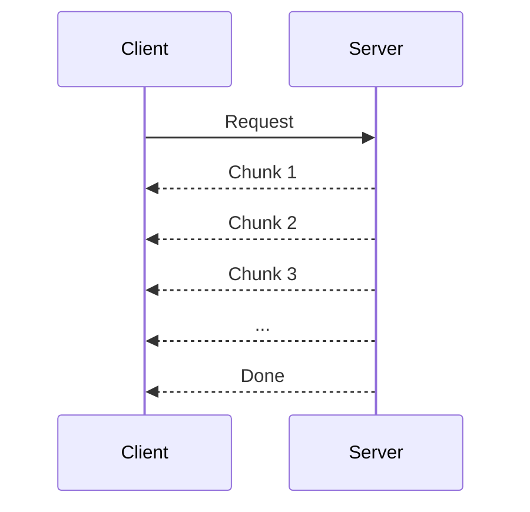
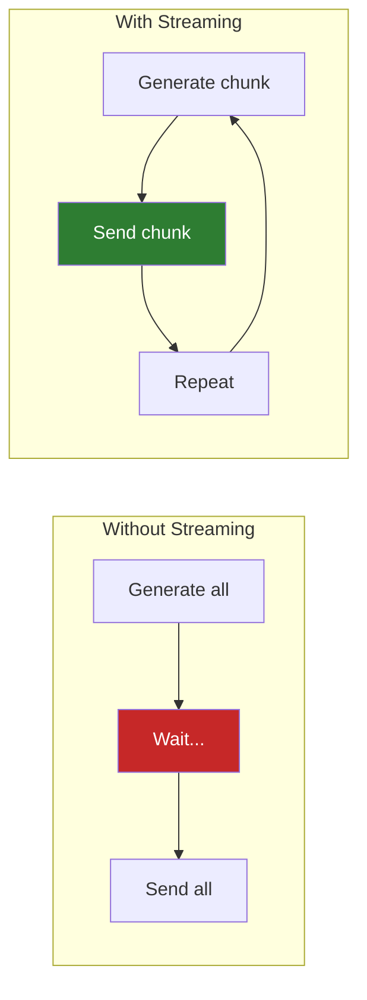

# Lesson 6.28: Streaming Responses

> **Duration**: 25 min | **Section**: E - Advanced FastAPI

## 📍 Where We Are

You can run background tasks, but what if you need to send data **as it's generated**? Large files, real-time logs, or LLM responses that stream word by word.

---

## 😤 THE PROBLEM: Memory Explosion

```python
@app.get("/download/huge-file")
def download_file():
    # ❌ Loads entire file into memory!
    with open("huge_10gb_file.csv", "rb") as f:
        content = f.read()  # 💥 10GB in RAM
    return Response(content)
```

Or with LLM responses:

```python
@app.post("/chat")
def chat(prompt: str):
    # ❌ Waits for entire response before sending
    response = llm.generate(prompt)  # 30 seconds...
    return {"response": response}  # User stares at spinner
```

### The Problems

| Issue | Impact |
|-------|--------|
| Memory | Server crashes on large files |
| Latency | User waits for entire response |
| Timeout | Connection might close before done |

---

## 🎯 The Solution: Streaming

Send data **chunk by chunk** as it becomes available:



No waiting for everything. Data flows continuously.

---

## 🔧 StreamingResponse

### Basic File Streaming

```python
from fastapi import FastAPI
from fastapi.responses import StreamingResponse

app = FastAPI()

def file_generator(file_path: str):
    """Yield file in chunks"""
    with open(file_path, "rb") as f:
        while chunk := f.read(8192):  # 8KB chunks
            yield chunk

@app.get("/download/{filename}")
def download(filename: str):
    return StreamingResponse(
        file_generator(f"files/{filename}"),
        media_type="application/octet-stream",
        headers={"Content-Disposition": f"attachment; filename={filename}"}
    )
```

Memory usage: ~8KB constant, regardless of file size!

### How It Works


---

## 💬 Streaming LLM Responses

This is where streaming shines — chat responses that appear word by word:

```python
from fastapi import FastAPI
from fastapi.responses import StreamingResponse
import asyncio

app = FastAPI()

async def fake_llm_stream(prompt: str):
    """Simulate LLM streaming response"""
    words = f"Here is my response to '{prompt}': ".split()
    words += "This is a streaming response that appears word by word.".split()
    
    for word in words:
        yield word + " "
        await asyncio.sleep(0.1)  # Simulate LLM thinking

@app.post("/chat")
async def chat(prompt: str):
    return StreamingResponse(
        fake_llm_stream(prompt),
        media_type="text/plain"
    )
```

### Testing with curl

```bash
curl -X POST "http://localhost:8000/chat?prompt=Hello" --no-buffer
# Output appears word by word!
```

---

## 📡 Server-Sent Events (SSE)

For real-time updates to web browsers, use SSE format:

```python
from fastapi import FastAPI
from fastapi.responses import StreamingResponse
import asyncio
import json

app = FastAPI()

async def event_generator():
    """Generate SSE events"""
    count = 0
    while True:
        count += 1
        # SSE format: "data: {json}\n\n"
        data = json.dumps({"count": count, "message": f"Event {count}"})
        yield f"data: {data}\n\n"
        await asyncio.sleep(1)
        
        if count >= 10:
            break

@app.get("/events")
async def events():
    return StreamingResponse(
        event_generator(),
        media_type="text/event-stream"
    )
```

### Frontend JavaScript

```javascript
const eventSource = new EventSource('/events');

eventSource.onmessage = (event) => {
    const data = JSON.parse(event.data);
    console.log('Received:', data);
};
```

---

## 📊 Streaming JSON Arrays

For large lists, stream as JSON Lines (one object per line):

```python
import json

async def stream_users():
    """Stream users one by one"""
    for i in range(1000000):  # 1 million users
        user = {"id": i, "name": f"User {i}"}
        yield json.dumps(user) + "\n"
        
        if i % 1000 == 0:
            await asyncio.sleep(0)  # Let other tasks run

@app.get("/users/stream")
async def stream_all_users():
    return StreamingResponse(
        stream_users(),
        media_type="application/x-ndjson"  # Newline-delimited JSON
    )
```

Client reads line by line — never loads all million users at once.

---

## 🔄 Comparison: Response Types

| Type | Use Case | Memory |
|------|----------|--------|
| `JSONResponse` | Small JSON data | All in RAM |
| `FileResponse` | Static files | Streamed by OS |
| `StreamingResponse` | Dynamic streaming | Constant |
| SSE (`text/event-stream`) | Real-time browser updates | Constant |

```python
from fastapi.responses import FileResponse, JSONResponse, StreamingResponse

# Small data - normal response
@app.get("/small")
def small():
    return {"data": [1, 2, 3]}  # JSONResponse

# Static file - OS handles streaming
@app.get("/static")
def static():
    return FileResponse("file.pdf")

# Dynamic large data - you control streaming
@app.get("/stream")
def stream():
    return StreamingResponse(generator())
```

---

## 🧪 Practice: Build a Log Streamer

### Challenge

Stream a log file as it's being written (like `tail -f`):

```python
from fastapi import FastAPI
from fastapi.responses import StreamingResponse
import asyncio

app = FastAPI()

async def tail_log(file_path: str):
    """Stream log file, following new lines"""
    with open(file_path, "r") as f:
        # Go to end of file
        f.seek(0, 2)
        
        while True:
            line = f.readline()
            if line:
                yield f"data: {line}\n\n"
            else:
                await asyncio.sleep(0.1)  # Wait for new content

@app.get("/logs/{filename}")
async def stream_logs(filename: str):
    return StreamingResponse(
        tail_log(f"logs/{filename}"),
        media_type="text/event-stream"
    )
```

### More Complete Example with LLM-style Streaming

```python
from fastapi import FastAPI
from fastapi.responses import StreamingResponse
from pydantic import BaseModel
import asyncio
import json

app = FastAPI()

class ChatRequest(BaseModel):
    message: str

async def generate_response(message: str):
    """Simulate LLM streaming"""
    response = f"You said: {message}. Here's my thoughtful response about that topic."
    
    # Stream character by character (like real LLM)
    for char in response:
        yield f"data: {json.dumps({'token': char})}\n\n"
        await asyncio.sleep(0.02)
    
    # Send done signal
    yield f"data: {json.dumps({'done': True})}\n\n"

@app.post("/chat/stream")
async def chat_stream(request: ChatRequest):
    return StreamingResponse(
        generate_response(request.message),
        media_type="text/event-stream"
    )

# Test endpoint that doesn't stream (for comparison)
@app.post("/chat/sync")
async def chat_sync(request: ChatRequest):
    # Simulate waiting for full response
    await asyncio.sleep(2)
    return {"response": f"You said: {request.message}. Here's my response."}
```

### Test Both

```bash
# Non-streaming: waits 2 seconds, then shows everything
time curl -X POST "http://localhost:8000/chat/sync" \
  -H "Content-Type: application/json" \
  -d '{"message": "Hello"}'

# Streaming: starts showing immediately
curl -X POST "http://localhost:8000/chat/stream" \
  -H "Content-Type: application/json" \
  -d '{"message": "Hello"}' \
  --no-buffer
```

---

## 🔑 Key Takeaways

| Concept | Purpose |
|---------|---------|
| `StreamingResponse` | Send data as generator yields |
| Generator function | `yield` chunks of data |
| `async` generators | Use `await` inside streaming |
| SSE format | `data: ...\n\n` for browsers |
| `media_type` | Tell client what's coming |

### Mental Model



---

## 📚 Further Reading

- [FastAPI StreamingResponse](https://fastapi.tiangolo.com/advanced/custom-response/#streamingresponse)
- [Server-Sent Events (MDN)](https://developer.mozilla.org/en-US/docs/Web/API/Server-sent_events)
- [NDJSON Spec](http://ndjson.org/)

---

**Next**: [Lesson 6.29: Advanced FastAPI Q&A](./Lesson-29-Advanced-FastAPI-QA.md) — Common questions about testing, deployment, performance, and production.
