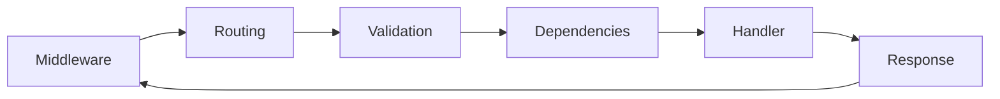
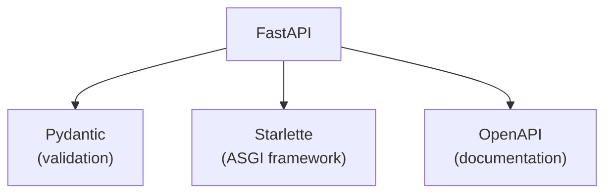

```mermaid
flowchart LR
    subgraph "A: HTTP"
        A1["Communication<br/>Problem"]
        A2["What is API"]
        A3["HTTP Under<br/>the Hood"]
    end
    
    subgraph "B: Pydantic"
        B1["Validation<br/>Problem"]
        B2["BaseModel"]
        B3["Custom<br/>Validators"]
    end
    
    subgraph "C: FastAPI Basics"
        C1["First<br/>Endpoint"]
        C2["Parameters"]
        C3["Request<br/>Body"]
    end
    
    subgraph "D: Under the Hood"
        D1["Request<br/>Lifecycle"]
        D2["Response<br/>Models"]
        D3["Error<br/>Handling"]
    end
    
    subgraph "E: Advanced"
        E1["Dependencies"]
        E2["Auth"]
        E3["Middleware"]
        E4["Streaming"]
    end
    
    A1 --> A2 --> A3 --> B1
    B1 --> B2 --> B3 --> C1
    C1 --> C2 --> C3 --> D1
    D1 --> D2 --> D3 --> E1
    E1 --> E2 --> E3 --> E4
```

# Lesson 6.30: Module 6 Review

> **Duration**: 20 min | **Section**: E - Advanced FastAPI | **Type**: Review

## 🎯 What You Learned

You started with "how do computers talk to each other?" and ended building production-ready APIs. Let's consolidate everything.

---

## 🗺️ The Journey



---

## 📝 Section Summaries

### Section A: HTTP Fundamentals

| You Learned | Key Insight |
|-------------|-------------|
| APIs are contracts | Not just "send data" — structured communication |
| HTTP anatomy | Method + URL + Headers + Body |
| Status codes | 2xx success, 4xx client error, 5xx server error |
| Request/Response | Text-based protocol, stateless |

```
GET /users/123 HTTP/1.1
Host: api.example.com
Authorization: Bearer token123

---
HTTP/1.1 200 OK
Content-Type: application/json

{"id": 123, "name": "Alice"}
```

### Section B: Pydantic Validation

| You Learned | Key Insight |
|-------------|-------------|
| Type hints → runtime validation | Python types become guarantees |
| BaseModel | Define shape of your data |
| Field constraints | `Field(min_length=1, max_length=100)` |
| Custom validators | Business logic validation |
| Nested models | Complex data structures |
| Settings | Environment variables made easy |

```python
from pydantic import BaseModel, Field, field_validator

class User(BaseModel):
    name: str = Field(min_length=1)
    age: int = Field(ge=0, le=150)
    email: str
    
    @field_validator("email")
    @classmethod
    def validate_email(cls, v):
        if "@" not in v:
            raise ValueError("Invalid email")
        return v.lower()
```

### Section C: FastAPI Basics

| You Learned | Key Insight |
|-------------|-------------|
| Decorators = routes | `@app.get("/path")` |
| Path parameters | `/users/{id}` with type conversion |
| Query parameters | `?skip=0&limit=10` with defaults |
| Request body | Pydantic models = automatic validation |
| Response models | Control what's sent back |

```python
@app.get("/users/{user_id}")
def get_user(
    user_id: int,                      # Path param
    include_posts: bool = False,       # Query param
) -> UserResponse:                     # Response model
    ...

@app.post("/users", status_code=201)
def create_user(user: UserCreate):     # Request body
    ...
```

### Section D: FastAPI Under the Hood

| You Learned | Key Insight |
|-------------|-------------|
| Request lifecycle | Middleware → Routing → Validation → Deps → Handler |
| Response models | Filter output, hide internal fields |
| Status codes | Semantic meaning for each response |
| HTTPException | Proper error responses |
| Exception handlers | Customize error format |



### Section E: Advanced FastAPI

| You Learned | Key Insight |
|-------------|-------------|
| Dependencies | Write once, inject everywhere |
| `yield` cleanup | Setup → yield → cleanup |
| Routers | Organize large applications |
| JWT Auth | Stateless authentication |
| Middleware | Cross-cutting concerns |
| CORS | Browser security policy |
| Background tasks | Fire-and-forget work |
| Streaming | Constant memory, real-time data |

```python
# The power of dependencies
@app.get("/protected")
def protected(
    db: Session = Depends(get_db),         # Database
    user: User = Depends(get_current_user), # Auth
    settings: Settings = Depends(get_settings), # Config
):
    # Just business logic here!
    return db.query(...).filter(...)
```

---

## 🧠 Mental Models

### 1. FastAPI = Pydantic + Starlette + OpenAPI



### 2. Everything is a Dependency

- Database connections
- Authentication
- Configuration
- Logging
- Rate limiting

If you need it in multiple endpoints, make it a dependency.

### 3. Layers of an API

```
┌──────────────────────────────────┐
│         Middleware               │  ← Every request
├──────────────────────────────────┤
│         Routing                  │  ← Match URL to handler
├──────────────────────────────────┤
│         Validation               │  ← Pydantic
├──────────────────────────────────┤
│         Dependencies             │  ← Auth, DB, etc.
├──────────────────────────────────┤
│         Handler                  │  ← Your business logic
├──────────────────────────────────┤
│         Response                 │  ← Serialize & send
└──────────────────────────────────┘
```

---

## ✅ Independence Check

### Know (Definitions)

- [ ] What is an API?
- [ ] What is HTTP?
- [ ] What is Pydantic?
- [ ] What is FastAPI?
- [ ] What is a dependency?

### Understand (Why)

- [ ] Why do we use status codes?
- [ ] Why does Pydantic exist?
- [ ] Why use dependencies instead of helper functions?
- [ ] Why do we need CORS?

### Apply (How)

- [ ] Create a CRUD API with validation
- [ ] Add authentication to endpoints
- [ ] Stream a large response
- [ ] Handle errors gracefully

### Analyze (Limitations)

- [ ] When is FastAPI NOT the right choice?
- [ ] When do background tasks fail you?
- [ ] What are JWT token limitations?

### Create (Build)

- [ ] Design an API from scratch
- [ ] Choose the right patterns for your use case
- [ ] Structure a large application

---

## 🚀 What's Next

With FastAPI and Pydantic, you can build professional APIs. In the next modules, you'll use these skills to:

| Module | Topic | How FastAPI Helps |
|--------|-------|-------------------|
| 7 | LLM APIs | Call OpenAI/Claude with httpx |
| 8 | LangChain | Build LLM-powered endpoints |
| 9 | Prompt Engineering | API for prompt management |
| 10 | RAG | FastAPI serves embeddings/search |
| 11 | Agents | Tool-using API agents |
| 12 | Projects | Full-stack AI applications |

---

## 📋 Quick Reference Card

### Creating an Endpoint

```python
@app.get("/items/{item_id}", response_model=ItemResponse, status_code=200)
def get_item(
    item_id: int,                              # Path param
    q: str | None = None,                      # Query param
    db: Session = Depends(get_db),             # Dependency
    user: User = Depends(get_current_user),    # Auth
) -> ItemResponse:
    item = db.query(Item).filter(Item.id == item_id).first()
    if not item:
        raise HTTPException(404, "Item not found")
    return item
```

### Common Imports

```python
from fastapi import FastAPI, Depends, HTTPException, status, Query, Path, Body
from fastapi.middleware.cors import CORSMiddleware
from fastapi.responses import StreamingResponse, FileResponse
from fastapi.security import OAuth2PasswordBearer
from pydantic import BaseModel, Field, field_validator
```

### Project Structure

```
app/
├── main.py           # FastAPI app, middleware, routers
├── config.py         # Settings
├── dependencies.py   # Shared dependencies
├── routers/          # Route handlers
├── models/           # Pydantic models
├── services/         # Business logic
└── tests/            # Test files
```

---

## 🎉 Congratulations!

You've completed Module 6: FastAPI & Pydantic.

You can now:
- Build RESTful APIs
- Validate data automatically
- Handle authentication
- Organize large applications
- Stream responses
- Deploy to production

**These skills power modern AI applications.** Every LLM wrapper, RAG system, and AI agent you build will use these foundations.

---

**Next Module**: [Module 7: LLM APIs](../Module-07-LLM-APIs/README.md) — Connect to OpenAI, Anthropic, and other LLM providers.
