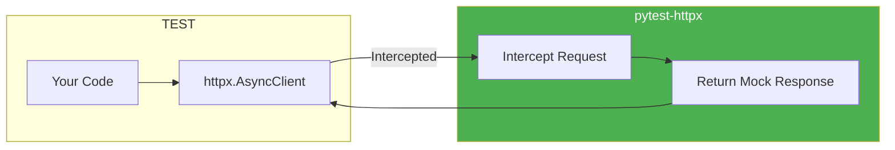
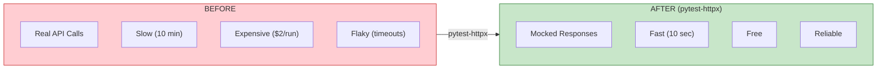

# Lesson 6.31: Async Testing with pytest-httpx

> **Duration**: 30 min | **Section**: F - Testing

## 🎯 The Problem

Your FastAPI app makes external API calls:
- OpenAI for LLM responses
- Embedding services
- External databases
- Third-party APIs

Testing is painful:
- Tests hit real APIs = slow, expensive, flaky
- Mocking `httpx.AsyncClient` is verbose
- Tests pass locally, fail in CI (rate limits)

> **Scenario**: Your test suite has 50 tests that call OpenAI. Each run costs $2 and takes 10 minutes. CI runs 20 times per day. That's $40/day just for tests. And sometimes OpenAI is slow, so tests timeout randomly.

## 🧪 Try It: The Naive Approach

```python
# Manual mocking - verbose and error-prone
import pytest
from unittest.mock import AsyncMock, patch

@pytest.mark.asyncio
async def test_query_rag():
    # Mock the HTTP client
    mock_response = AsyncMock()
    mock_response.json.return_value = {
        "choices": [{"message": {"content": "Mocked response"}}]
    }
    mock_response.status_code = 200
    
    with patch("httpx.AsyncClient.post", return_value=mock_response):
        # Still doesn't work because of async context managers
        # Need to mock __aenter__, __aexit__...
        pass

# This gets very messy very fast
```

## 🔍 Under the Hood: pytest-httpx



**pytest-httpx** automatically intercepts all httpx requests and lets you define mock responses with minimal code.

---

## ✅ The Fix: pytest-httpx

### Step 1: Install

```bash
pip install pytest-httpx pytest-asyncio
```

### Step 2: Basic Mocking

```python
# tests/test_api.py
import pytest
from httpx import AsyncClient
from app.main import app

@pytest.mark.asyncio
async def test_openai_call(httpx_mock):
    """Mock OpenAI API response."""
    
    # Define what the mock should return
    httpx_mock.add_response(
        url="https://api.openai.com/v1/chat/completions",
        json={
            "choices": [{
                "message": {"content": "Paris is the capital of France."}
            }],
            "usage": {"total_tokens": 50}
        }
    )
    
    # Test your actual code
    async with AsyncClient(app=app, base_url="http://test") as client:
        response = await client.post(
            "/query",
            json={"question": "What is the capital of France?"}
        )
    
    assert response.status_code == 200
    assert "Paris" in response.json()["answer"]


@pytest.mark.asyncio
async def test_embedding_service(httpx_mock):
    """Mock embedding API."""
    
    httpx_mock.add_response(
        url="https://api.openai.com/v1/embeddings",
        json={
            "data": [{
                "embedding": [0.1, 0.2, 0.3] * 128  # 384 dimensions
            }]
        }
    )
    
    async with AsyncClient(app=app, base_url="http://test") as client:
        response = await client.post(
            "/embed",
            json={"text": "Hello world"}
        )
    
    assert response.status_code == 200
    assert len(response.json()["embedding"]) == 384
```

### Step 3: Pattern Matching

```python
import re

@pytest.mark.asyncio
async def test_multiple_endpoints(httpx_mock):
    """Mock multiple external APIs."""
    
    # Mock any OpenAI endpoint
    httpx_mock.add_response(
        url=re.compile(r"https://api\.openai\.com/.*"),
        json={"choices": [{"message": {"content": "Mock"}}]}
    )
    
    # Mock embedding service
    httpx_mock.add_response(
        url="https://embed.example.com/v1/embed",
        json={"embedding": [0.1] * 384}
    )
    
    # Your test code here...


@pytest.mark.asyncio
async def test_with_method_matching(httpx_mock):
    """Match by HTTP method."""
    
    # Only match POST requests
    httpx_mock.add_response(
        method="POST",
        url="https://api.example.com/data",
        json={"created": True}
    )
    
    # Match GET with different response
    httpx_mock.add_response(
        method="GET",
        url="https://api.example.com/data",
        json={"items": [1, 2, 3]}
    )
```

### Step 4: Error Simulation

```python
import httpx

@pytest.mark.asyncio
async def test_api_timeout(httpx_mock):
    """Test timeout handling."""
    
    httpx_mock.add_exception(
        url="https://api.openai.com/v1/chat/completions",
        exception=httpx.TimeoutException("Connection timeout")
    )
    
    async with AsyncClient(app=app, base_url="http://test") as client:
        response = await client.post(
            "/query",
            json={"question": "Test"}
        )
    
    assert response.status_code == 503
    assert "timeout" in response.json()["detail"].lower()


@pytest.mark.asyncio
async def test_rate_limit(httpx_mock):
    """Test rate limit handling."""
    
    httpx_mock.add_response(
        url="https://api.openai.com/v1/chat/completions",
        status_code=429,
        json={"error": {"message": "Rate limit exceeded"}}
    )
    
    async with AsyncClient(app=app, base_url="http://test") as client:
        response = await client.post(
            "/query",
            json={"question": "Test"}
        )
    
    assert response.status_code == 429


@pytest.mark.asyncio
async def test_server_error(httpx_mock):
    """Test 500 error handling."""
    
    httpx_mock.add_response(
        url="https://api.openai.com/v1/chat/completions",
        status_code=500,
        json={"error": {"message": "Internal server error"}}
    )
    
    async with AsyncClient(app=app, base_url="http://test") as client:
        response = await client.post(
            "/query",
            json={"question": "Test"}
        )
    
    # Should return error to user, not crash
    assert response.status_code in [500, 503]
```

---

## 🔄 Request Verification

```python
@pytest.mark.asyncio
async def test_verify_request_sent(httpx_mock):
    """Verify the correct request was made."""
    
    httpx_mock.add_response(
        url="https://api.openai.com/v1/chat/completions",
        json={"choices": [{"message": {"content": "Mock"}}]}
    )
    
    async with AsyncClient(app=app, base_url="http://test") as client:
        await client.post("/query", json={"question": "Hello"})
    
    # Get all requests that were made
    requests = httpx_mock.get_requests()
    
    assert len(requests) == 1
    request = requests[0]
    
    # Verify request details
    assert request.url == "https://api.openai.com/v1/chat/completions"
    assert request.method == "POST"
    
    # Verify request body
    import json
    body = json.loads(request.content)
    assert "messages" in body
    assert body["model"] == "gpt-4"


@pytest.mark.asyncio
async def test_verify_headers(httpx_mock):
    """Verify auth headers are sent."""
    
    httpx_mock.add_response(json={"data": "mock"})
    
    async with AsyncClient(app=app, base_url="http://test") as client:
        await client.post("/query", json={"question": "Test"})
    
    request = httpx_mock.get_requests()[0]
    
    # Verify Authorization header
    assert "Authorization" in request.headers
    assert request.headers["Authorization"].startswith("Bearer ")
```

---

## 📦 Fixtures for Reusable Mocks

```python
# tests/conftest.py
import pytest

@pytest.fixture
def mock_openai(httpx_mock):
    """Reusable OpenAI mock."""
    
    def _mock(content: str = "Default response", tokens: int = 100):
        httpx_mock.add_response(
            url="https://api.openai.com/v1/chat/completions",
            json={
                "choices": [{"message": {"content": content}}],
                "usage": {"total_tokens": tokens}
            }
        )
        return httpx_mock
    
    return _mock


@pytest.fixture
def mock_embedding(httpx_mock):
    """Reusable embedding mock."""
    
    def _mock(dimensions: int = 384):
        httpx_mock.add_response(
            url="https://api.openai.com/v1/embeddings",
            json={"data": [{"embedding": [0.1] * dimensions}]}
        )
        return httpx_mock
    
    return _mock


# Use in tests
@pytest.mark.asyncio
async def test_with_fixture(mock_openai):
    mock_openai(content="Custom response", tokens=50)
    
    # Test code...
```

---

## 🧪 Testing Streaming Responses

```python
@pytest.mark.asyncio
async def test_streaming_response(httpx_mock):
    """Test SSE streaming from LLM."""
    
    # Simulate streaming response
    stream_data = b'data: {"choices":[{"delta":{"content":"Hello"}}]}\n\n'
    stream_data += b'data: {"choices":[{"delta":{"content":" World"}}]}\n\n'
    stream_data += b'data: [DONE]\n\n'
    
    httpx_mock.add_response(
        url="https://api.openai.com/v1/chat/completions",
        content=stream_data,
        headers={"content-type": "text/event-stream"}
    )
    
    async with AsyncClient(app=app, base_url="http://test") as client:
        async with client.stream(
            "POST",
            "/query/stream",
            json={"question": "Hello"}
        ) as response:
            chunks = []
            async for chunk in response.aiter_text():
                chunks.append(chunk)
    
    full_response = "".join(chunks)
    assert "Hello" in full_response
    assert "World" in full_response
```

---

## 📊 Comparison



| Metric | Real APIs | pytest-httpx |
|--------|-----------|--------------|
| Test duration | 10 min | 10 sec |
| Cost per run | $2 | $0 |
| Reliability | Flaky | 100% |
| CI friendly | No | Yes |

---

## 🎯 Practice

1. **Install pytest-httpx** in your project
2. **Mock an OpenAI call** in a basic test
3. **Test error handling** with simulated 429/500 errors
4. **Verify request content** was correct
5. **Create a reusable fixture** for common mocks
6. **Run tests** in CI without API keys

```python
# Quick starter test
import pytest

@pytest.mark.asyncio
async def test_quick_mock(httpx_mock):
    httpx_mock.add_response(json={"message": "mocked!"})
    
    import httpx
    async with httpx.AsyncClient() as client:
        response = await client.get("https://any-url.com/api")
    
    assert response.json()["message"] == "mocked!"
```

## 🔑 Key Takeaways

- **pytest-httpx** = automatic httpx mocking
- **`httpx_mock.add_response()`** = define mock responses
- **Pattern matching** = mock multiple URLs with regex
- **Error simulation** = test timeout, rate limit, 500 errors
- **Request verification** = check what was actually sent
- **Fixtures** = reusable mock configurations

## ❓ Common Questions

| Question | Answer |
|----------|--------|
| Works with aiohttp? | No, use `aioresponses` for aiohttp |
| Can I mix real and mock? | Yes, use `httpx_mock.add_passthrough()` |
| Response order? | Responses are returned in order added |
| Async required? | Works with sync httpx too |

## 🔗 Further Reading

- [pytest-httpx Documentation](https://colin-b.github.io/pytest_httpx/)
- [pytest-asyncio](https://pytest-asyncio.readthedocs.io/)
- [HTTPX Testing Guide](https://www.python-httpx.org/advanced/#testing)
- [FastAPI Testing](https://fastapi.tiangolo.com/tutorial/testing/)

---

**Previous**: [Lesson 30 - Module 6 Review](Lesson-30-Module-6-Review.md) | **Up**: [Module 6 README](README.md)
