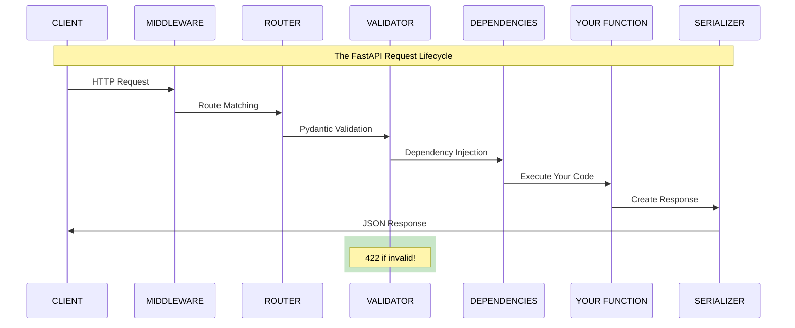

# Module 6: FastAPI & Pydantic

> **Duration**: 2 Weeks | **Lessons**: 31

## 🎯 Module Overview

Your Python code has amazing features—but it's trapped on one computer. How does a React frontend, mobile app, or another service *use* your code? The answer is **APIs**. This module teaches you to build production-ready REST APIs with **FastAPI** (the fastest Python web framework) and **Pydantic** (bulletproof data validation). You'll understand exactly what happens from the moment a request arrives until your function runs.

## 🧠 Mental Model

**The Pattern**: Route → Validate → Inject → Execute → Respond

## 📋 Prerequisites

- Python Core (Module 3) - Functions, classes, decorators, type hints
- PostgreSQL (Module 4) - Database basics, CRUD operations
- Docker (Module 5) - Running containers (for dev environment)

## 🗂️ Module Structure

| Section | Lessons | Focus |
|---------|:-------:|-------|
| A: HTTP Under the Hood | 6.0 - 6.4 | What IS an API? HTTP fundamentals before frameworks |
| B: Pydantic | 6.5 - 6.10 | Data validation that protects your code |
| C: FastAPI Fundamentals | 6.11 - 6.16 | Your first endpoints, parameters, request bodies |
| D: FastAPI Under the Hood | 6.17 - 6.21 | Request lifecycle, responses, error handling |
| E: Advanced FastAPI | 6.22 - 6.30 | Dependency injection, auth, routers, streaming |

## 📚 Lessons

### Section A: HTTP Under the Hood

*Before you use FastAPI, you must understand what it's doing FOR you.*

| # | Lesson | Duration | What We're Solving |
|:-:|--------|:--------:|-------------------|
| 6.0 | The Communication Problem | 10 min | Your Python is stuck on one computer. How do other apps use it? |
| 6.1 | What IS an API? | 20 min | Application Programming Interface—a contract between systems |
| 6.2 | HTTP Under the Hood | 30 min | Request/response cycle, methods, headers, status codes |
| 6.3 | Building a Server From Scratch | 35 min | Raw Python sockets—then you'll appreciate FastAPI! |
| 6.4 | HTTP Q&A | 10 min | REST, JSON, common confusions |

### Section B: Pydantic (Data Validation)

*Users send garbage. Pydantic catches it before your code crashes.*

| # | Lesson | Duration | What We're Solving |
|:-:|--------|:--------:|-------------------|
| 6.5 | The Validation Problem | 5 min | User sends `{age: 'twenty'}` instead of `{age: 20}`. Now what? |
| 6.6 | Pydantic Under the Hood | 30 min | BaseModel = data class + validation + type coercion |
| 6.7 | Pydantic Models | 25 min | Field types, Optional, Field() constraints |
| 6.8 | Custom Validation | 30 min | `@field_validator` for complex business rules |
| 6.9 | Nested Models | 25 min | Models inside models—real-world data structures |
| 6.10 | Settings & Config | 25 min | Type-safe configuration from environment variables |

### Section C: FastAPI Fundamentals

*Build your first endpoints. See automatic documentation appear.*

| # | Lesson | Duration | What We're Solving |
|:-:|--------|:--------:|-------------------|
| 6.11 | What IS FastAPI? | 20 min | Fast, modern, automatic docs—built on Starlette + Pydantic |
| 6.12 | Your First Endpoint | 25 min | `app = FastAPI()`, `@app.get("/")`, uvicorn, /docs |
| 6.13 | Path Parameters | 25 min | `/users/{user_id}` → function receives `user_id` with type conversion |
| 6.14 | Query Parameters | 25 min | `/items?skip=0&limit=10` with optional defaults |
| 6.15 | Request Body | 30 min | Pydantic validates JSON body automatically |
| 6.16 | FastAPI Basics Q&A | 10 min | async def vs def, Starlette, common questions |

### Section D: FastAPI Under the Hood

*What ACTUALLY happens between request and your function?*

| # | Lesson | Duration | What We're Solving |
|:-:|--------|:--------:|-------------------|
| 6.17 | The Flow Problem | 5 min | Request arrives—what happens before your function runs? |
| 6.18 | Request Lifecycle | 35 min | Middleware → Routing → Validation → Your Code → Response |
| 6.19 | Response Models | 25 min | Control exactly what gets returned with `response_model` |
| 6.20 | Status Codes & Errors | 25 min | `status_code=201`, `HTTPException`, custom handlers |
| 6.21 | Request Lifecycle Q&A | 10 min | Where to add logging, why 422 not 400, debugging |

### Section E: Advanced FastAPI

*Build production-ready APIs with auth, routers, and streaming.*

| # | Lesson | Duration | What We're Solving |
|:-:|--------|:--------:|-------------------|
| 6.22 | The Reuse Problem | 5 min | Every endpoint needs DB. Every protected route needs auth. Repeat code? |
| 6.23 | Dependency Injection Under the Hood | 35 min | `Depends()` = FastAPI gives you what you need, composably |
| 6.24 | Routers & Organization | 30 min | `APIRouter()` to split app into modules with prefixes |
| 6.25 | Authentication | 40 min | API keys, OAuth2, JWT tokens with `Depends(get_current_user)` |
| 6.26 | Middleware & CORS | 25 min | Request/response hooks, `CORSMiddleware` for browsers |
| 6.27 | Background Tasks | 25 min | Fire-and-forget with `BackgroundTasks` |
| 6.28 | Streaming Responses | 30 min | `StreamingResponse` for LLM token-by-token output |
| 6.29 | Advanced Q&A | 10 min | WebSockets, testing, production configuration |
| 6.30 | Module 6 Review | 15 min | The complete mental model: Route → Validate → Inject → Execute → Respond |

## 🎯 Module Project

**Build a Complete REST API**:
- User registration with validation
- JWT authentication
- CRUD operations on resources
- Proper error handling with status codes
- Connected to PostgreSQL

This project integrates everything: FastAPI routes, Pydantic validation, dependency injection for DB/auth, and proper HTTP semantics.

## ✅ Independence Check

After this module, you should be able to:

| Level | Question |
|-------|----------|
| **Know** | What are the HTTP methods and when do you use each? |
| **Understand** | Why does FastAPI return 422 when validation fails, not 400? |
| **Apply** | How do you add a protected endpoint that requires authentication? |
| **Analyze** | When would `async def` outperform `def` in FastAPI? |
| **Create** | Can you build a new API with auth, validation, and database from scratch? |

## 🔗 References

- [FastAPI Official Documentation](https://fastapi.tiangolo.com/)
- [Pydantic V2 Documentation](https://docs.pydantic.dev/latest/)
- [Starlette Documentation](https://www.starlette.io/)
- [HTTP Status Codes - MDN](https://developer.mozilla.org/en-US/docs/Web/HTTP/Status)
- [REST API Design Best Practices](https://restfulapi.net/)
- [OAuth2 Simplified](https://oauth.net/2/)
- [JWT.io - JSON Web Tokens](https://jwt.io/)

## 🔗 Next Module

→ [Module 7: LLM APIs - The Hard Parts](../Module-07-LLM-APIs/README.md)
