# Lesson 7.0: The AI Magic Problem

> **Duration**: 15 min | **Section**: A - What IS an LLM? | **Type**: Intro Lesson

## 📍 Where We Are

You've built APIs with FastAPI. You've worked with databases. Now you want to add "AI" to your applications.

You've used ChatGPT. It seems to **understand** you. It **thinks** about problems. It **knows** things.

**But what is it actually doing?**

---

## 🤔 The Mystery

```
You: "What's the capital of France?"
ChatGPT: "The capital of France is Paris."
```

It looks like it "knows" the answer. Like it has a database of facts. Like it's looking something up.

```
You: "Write me a poem about debugging code"
ChatGPT: "In the depths of night, I trace the line,
         Where errors lurk and bugs entwine..."
```

It's "creative". It seems to be "thinking" about what words go together.

```
You: "Why is the sky blue?"
ChatGPT: "The sky appears blue because of a phenomenon called Rayleigh scattering..."
```

It "explains" complex concepts. It seems to "understand" physics.

---

## 🎭 The Illusion

Here's what's actually happening:

**The LLM is doing ONE thing:**
> Given all the text so far, predict the most likely **next word**.

That's it.

No thinking. No understanding. No knowledge database. Just prediction.


When you ask "What is the capital of France?", the model predicts:
- After "What is the capital of France?", the next word is probably "The"
- After "...France? The", the next word is probably "capital"
- And so on...

It learned these patterns from reading billions of documents where "capital of France" is followed by "Paris".

---

## 💡 The "Fancy Autocomplete" Analogy

Your phone's keyboard predicts what you'll type next:

```
"I'm on my" → [way, phone, way home]
```

GPT-4 is the same thing, but:
1. It saw WAY more text (the entire internet)
2. It considers WAY more context (not just 3 words, but thousands)
3. It's REALLY good at patterns

The result looks like understanding. But it's still just prediction.

---

## 🚨 Why This Matters for Engineers

If you think the LLM "knows" things:
- You'll be surprised when it confidently says wrong things
- You'll trust it to "remember" conversations (it doesn't)
- You'll expect consistency (you won't get it)

If you understand it's a prediction machine:
- You'll validate outputs
- You'll manage conversation history yourself
- You'll design systems that work WITH its limitations

---

## 🔮 What We'll Learn

This module will teach you:

| Topic | What You'll Understand |
|-------|------------------------|
| Tokens | How text becomes numbers the model processes |
| Context Window | Why there's a limit on how much text you can send |
| Temperature | How to control randomness in predictions |
| API Calls | How to talk to OpenAI/Anthropic servers |
| Streaming | How to get responses word-by-word |
| Function Calling | How to make the LLM "do" things |
| Cost | How to track and manage spending |

---

## 🎯 The Goal

By the end of this module, you'll be able to:

1. Explain EXACTLY what happens when you call an LLM API
2. Build streaming chat interfaces
3. Give LLMs "tools" to call external systems
4. Handle errors, retries, and rate limits
5. Manage costs and token budgets

---

## 🧠 Mental Model Preview

```mermaid
flowchart TD
    subgraph "What you see"
        USER["User types question"]
        MAGIC["✨ Magic ✨"]
        ANSWER["Smart answer appears"]
    end
    
    subgraph "What actually happens"
        INPUT["Text input"]
        TOKENIZE["Convert to tokens"]
        PREDICT["Predict next token<br/>(repeat 100s of times)"]
        SAMPLE["Sample based on temperature"]
        OUTPUT["Assemble response"]
    end
    
    USER -.-> INPUT
    INPUT --> TOKENIZE --> PREDICT --> SAMPLE --> OUTPUT
    OUTPUT -.-> ANSWER
    
    MAGIC ~~~ PREDICT
    
    style MAGIC fill:#C62828,color:#fff
    style PREDICT fill:#2E7D32,color:#fff
```



---

**Next**: [Lesson 7.1: Prediction Machines](./Lesson-01-Prediction-Machines.md) — How does "predict the next word" actually work? And how is it so good at it?
