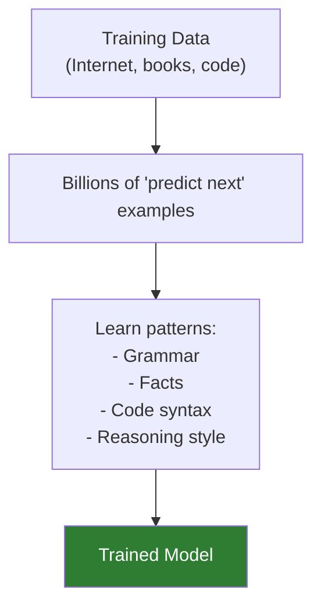
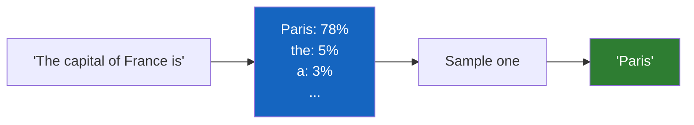
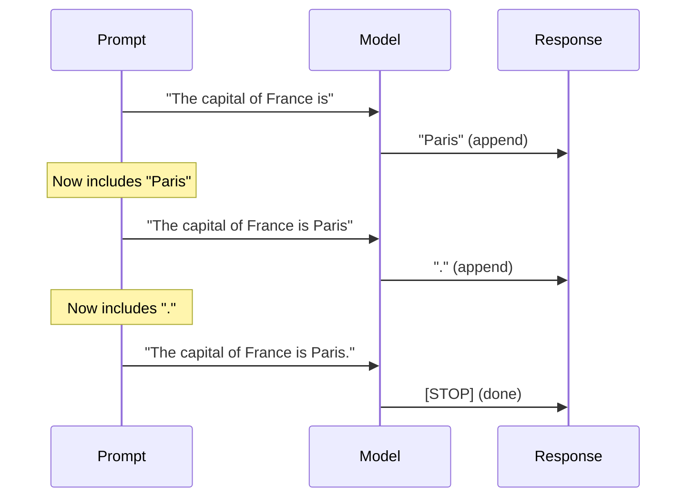
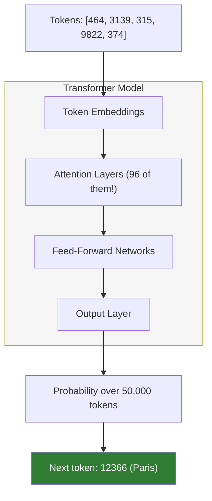
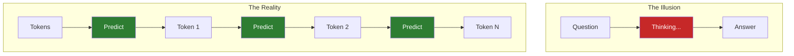

# Lesson 7.1: Prediction Machines

> **Duration**: 25 min | **Section**: A - What IS an LLM?

## 📍 Where We Are

You know that LLMs "predict the next word." But how? How can prediction look so much like understanding?

---

## 🎯 The Core Mechanism

### The Training Process

Before GPT-4 could answer your questions, it was trained on a simple task:

> Given text, predict what comes next.

```
Input:  "The cat sat on the"
Target: "mat"

Input:  "To be or not to"
Target: "be"

Input:  "def calculate_sum(numbers):\n    return"
Target: "sum(numbers)"
```

The model saw **trillions** of these examples. It learned patterns.



---

## 🔢 How Prediction Actually Works

The model doesn't pick ONE next word. It assigns **probabilities** to ALL possible words.

```
Input: "The capital of France is"

Probabilities:
  "Paris"     = 78%
  "the"       = 5%
  "a"         = 3%
  "located"   = 2%
  "known"     = 1%
  ... (50,000 other words with tiny probabilities)
```

Then it **samples** from these probabilities. Usually it picks the highest ("Paris"), but not always.



---

## 🔄 Autoregressive Generation

Here's the key: the model generates **one token at a time**, then feeds its output back as input.

```
Step 1: "The capital of France is" → "Paris"
Step 2: "The capital of France is Paris" → "."
Step 3: "The capital of France is Paris." → [DONE]
```

This is called **autoregressive** generation.



For a 100-word response, the model runs **100 times**, each time seeing everything it's generated so far.

---

## 🧪 Try It: See Probabilities

While you can't see exact probabilities from the API, you can see the effect:

```python
from openai import OpenAI
client = OpenAI()

# Same prompt, multiple times
for i in range(3):
    response = client.chat.completions.create(
        model="gpt-4o-mini",
        messages=[{"role": "user", "content": "Tell me a random fruit"}],
        temperature=1.0  # High randomness
    )
    print(response.choices[0].message.content)

# Outputs might be:
# "Mango!"
# "Papaya"
# "I'd say... a pomegranate!"
```

Different answers because it's **sampling** from probabilities, not retrieving facts.

---

## 💡 Why It Looks Like Understanding

The model learned patterns from seeing SO much text:

| What It Saw | Pattern It Learned |
|-------------|-------------------|
| Millions of geography facts | "capital of X" → city name |
| Billions of code examples | function definitions → return statements |
| Endless conversations | question → relevant answer |
| Every writing style | formal/casual, short/long |

It's not that it "knows" Paris is France's capital. It's that in its training data, "capital of France" was followed by "Paris" in every context.

---

## 🔍 Under the Hood: The Neural Network

The actual model is a massive neural network (transformer architecture):



GPT-4 has:
- ~1.7 trillion parameters (weights in the network)
- 96 transformer layers
- Trained on trillions of tokens
- Cost >$100 million to train

All to predict the next word really, really well.

---

## 🚨 The Fundamental Limitation

The model has NO:
- Long-term memory (each API call is independent)
- Real-time knowledge (only knows training data)
- Ability to verify facts (just predicts likely text)
- Understanding of truth (just predicts likely text)

This is why it "hallucinates" — if a confident-sounding lie is a likely next word, it will generate it.

---

## 📊 Comparing Models

| Model | Parameters | Context | What It Means |
|-------|-----------|---------|---------------|
| GPT-4o | ~1.7T | 128K tokens | Huge, expensive, very capable |
| GPT-4o-mini | ~8B | 128K tokens | Smaller, cheaper, still good |
| Claude 3.5 Sonnet | Unknown | 200K tokens | Anthropic's flagship |
| Claude 3 Haiku | Unknown | 200K tokens | Fast and cheap |

More parameters = learned more patterns = better predictions.

---

## 🎯 Key Takeaways

| Concept | What It Means |
|---------|---------------|
| Prediction | Model outputs probability distribution over next tokens |
| Autoregressive | Generate one token, feed back, repeat |
| Training | Learned patterns from trillions of examples |
| No memory | Each API call is independent |
| No truth | Predicts likely text, not verified facts |

---

## 🔑 Mental Model



---

## ❓ Common Questions

| Question | Answer |
|----------|--------|
| "Does it understand?" | No — it predicts probable next text based on patterns |
| "Why is it so good?" | Trillions of training examples + massive model size |
| "Can it learn from our conversation?" | No — each API call is independent |
| "Why different answers each time?" | It samples from probabilities, not retrieval |

---

**Next**: [Lesson 7.2: Training Data](./Lesson-02-Training-Data.md) — Where did these patterns come from? And why does the model confidently say wrong things?
