# Lesson 7.2: Training Data

> **Duration**: 20 min | **Section**: A - What IS an LLM?

## 📍 Where We Are

You know LLMs predict the next token based on patterns. But where did these patterns come from? And why does the model confidently say things that are wrong?

---

## 📚 What It Read

LLMs are trained on massive datasets scraped from:

| Source | What It Contains |
|--------|------------------|
| Web pages | Wikipedia, news, blogs, forums |
| Books | Fiction, non-fiction, textbooks |
| Code | GitHub, Stack Overflow |
| Scientific papers | arXiv, academic journals |
| Conversations | Reddit, social media |

GPT-4's training data is estimated at **13 trillion tokens** — roughly 10 trillion words, or 20 million books.


---

## 🔑 Key Insight: Patterns, Not Knowledge

The model doesn't store facts like a database. It learned **patterns** of text.

### Example: "The capital of France"

The model saw this phrase thousands of times:
- "The capital of France is Paris."
- "Paris, the capital of France, is known for..."
- "...visited Paris, capital of France, last summer."

It learned: when you see "capital of France", "Paris" is likely to follow.

This is NOT:
```python
# NOT how it works
knowledge_base = {"France": {"capital": "Paris"}}
```

This IS:
```python
# Conceptually closer
def predict(text):
    # If patterns in training suggest "Paris" comes next
    if "capital of France" in text:
        return high_probability("Paris")
```

---

## 🎭 Why It Hallucinates

Hallucination = confidently generating false information.

### The Problem

The model predicts **probable** text, not **true** text.


This works for well-documented facts. But what about:

```
"Who was the first person to climb Mount Everest backwards?"
```

There's no true answer. But the model will still predict **probable-sounding** text:
- "Sir Edmund Hillary" (sounds plausible)
- "A Sherpa named Tenzing" (sounds plausible)
- Some completely made-up name (sounds plausible)

**The model can't distinguish "I don't know" from "I should make up something plausible."**

---

## 📅 The Knowledge Cutoff

Training data has a **cutoff date**.

| Model | Knowledge Cutoff |
|-------|-----------------|
| GPT-4 (original) | September 2021 |
| GPT-4 Turbo | April 2024 |
| GPT-4o | October 2023 |
| Claude 3.5 | April 2024 |

Anything after the cutoff: the model literally has never seen it.

```python
# This won't work well for recent events
response = client.chat.completions.create(
    model="gpt-4o",
    messages=[{
        "role": "user",
        "content": "What happened in the news yesterday?"
    }]
)
# Model will say it doesn't have real-time information
# (if trained properly to know its limitations)
```

---

## ⚠️ Training Data Problems

### 1. Outdated Information

```
Q: "Who is the UK Prime Minister?"
A: (Depends on training cutoff - might say an old PM)
```

### 2. Wrong Information in Training Data

The internet has wrong information. The model learned it.

```
Q: "How many legs does a spider have?"
A: "8"  ✅ (correct and common in training data)

Q: "Is glass a liquid?"
A: "Yes, glass is a slow-moving liquid..."  ❌ (common myth in training data)
```

### 3. Biased Information

Training data reflects human biases present in web content.

### 4. Fabricated Citations

```
Q: "Give me a citation for research on X"
A: "Smith et al. (2019). Journal of Made Up Studies..."
```

The model generates **plausible-looking** citations, not real ones.

---

## 🔧 How Companies Address This

### RLHF: Reinforcement Learning from Human Feedback

After initial training, the model is fine-tuned:
1. Humans rate responses (helpful, honest, harmless)
2. Model learns to produce higher-rated responses
3. Learn to say "I don't know" instead of making things up

```mermaid
flowchart TD
    BASE["Base Model<br/>(just predicts text)"]
    RLHF["RLHF Training"]
    ALIGNED["Aligned Model<br/>(tries to be helpful/honest)"]
    
    subgraph "Human Feedback"
        H1["✅ 'Good answer'"]
        H2["❌ 'That's wrong'"]
        H3["⚠️ 'That's harmful'"]
    end
    
    BASE --> RLHF
    H1 --> RLHF
    H2 --> RLHF
    H3 --> RLHF
    RLHF --> ALIGNED
    
    style ALIGNED fill:#2E7D32,color:#fff
```



This is why ChatGPT says "As an AI language model, I don't have..." — it was trained to acknowledge limitations.

---

## 🧪 Testing Knowledge Limits

```python
from openai import OpenAI
client = OpenAI()

def test_knowledge(prompt):
    response = client.chat.completions.create(
        model="gpt-4o-mini",
        messages=[{"role": "user", "content": prompt}]
    )
    return response.choices[0].message.content

# Well-documented fact
print(test_knowledge("What year did World War 2 end?"))
# "1945" ✅

# Recent event (after cutoff)
print(test_knowledge("Who won the 2025 Super Bowl?"))
# "I don't have information about events in 2025..." ✅ (good)

# Obscure question
print(test_knowledge("What is the phone number of Joe's Pizza in Brooklyn?"))
# Might make one up! ❌ (hallucination risk)
```

---

## 🎯 Key Takeaways

| Concept | Implication |
|---------|-------------|
| Trained on internet | Contains both truth and lies |
| Patterns, not facts | Predicts probable, not verified |
| Knowledge cutoff | No info after training date |
| Hallucinations | Confident + wrong = dangerous |
| RLHF helps | But doesn't eliminate problems |

---

## 🔑 For Your Applications

When building with LLMs:

| Risk | Mitigation |
|------|------------|
| Wrong facts | Add retrieval (RAG) with verified sources |
| Old information | Use recent documents or web search |
| Made-up citations | Verify all references |
| Confident hallucinations | Ask for reasoning, verify outputs |

---

## ❓ Common Questions

| Question | Answer |
|----------|--------|
| "Can I update its knowledge?" | Not directly — you provide context in prompts |
| "How do I know if it's lying?" | You don't — you must verify critical outputs |
| "Will it always hallucinate?" | Less common with good prompts + lower temperature |
| "Is newer training data better?" | Usually yes, but doesn't eliminate the problem |

---

**Next**: [Lesson 7.3: Tokens Under the Hood](./Lesson-03-Tokens-Under-The-Hood.md) — Text isn't sent as text. It's converted to numbers called tokens. This affects everything.
