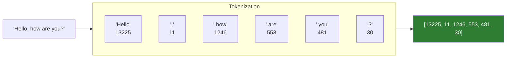
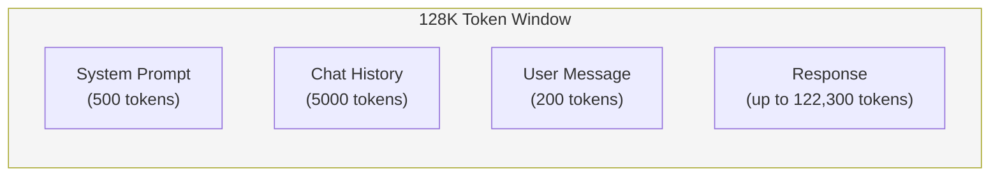

# Lesson 7.3: Tokens Under the Hood

> **Duration**: 25 min | **Section**: A - What IS an LLM?

## 📍 Where We Are

LLMs don't process text directly. They work with **tokens** — chunks of text converted to numbers. Understanding tokens is essential because:

1. You're **billed** per token
2. There's a **limit** on total tokens (context window)
3. Some operations work **per token**, not per word

---

## 🔤 What is a Token?

A token is a piece of text that the model treats as a single unit.

```
"Hello" → 1 token
"Hello world" → 2 tokens
" Hello" → 1 token (note the space!)
"don't" → 2 tokens: "don" + "'t"
"ChatGPT" → 2 tokens: "Chat" + "GPT"
```

Tokens are NOT words. They're pieces learned from training data to be efficient.

---

## 🔢 Tokenization in Action

```python
import tiktoken

# Get the tokenizer for GPT-4
enc = tiktoken.encoding_for_model("gpt-4o")

text = "Hello, how are you?"
tokens = enc.encode(text)
print(f"Text: '{text}'")
print(f"Tokens: {tokens}")
print(f"Count: {len(tokens)}")

# Output:
# Text: 'Hello, how are you?'
# Tokens: [13225, 11, 1246, 553, 481, 30]
# Count: 6
```

Each token is a number that maps to a piece of text in the vocabulary.



---

## 📊 Token Patterns

### 1. Common Words = 1 Token

```python
enc.encode("the")       # [1782] - 1 token
enc.encode("hello")     # [13225] - 1 token
enc.encode("function")  # [1834] - 1 token
```

### 2. Spaces Are Part of Tokens

```python
enc.encode("hello")     # [13225]
enc.encode(" hello")    # [23748] - Different token!
```

The space is included IN the token, not separate.

### 3. Rare Words = Multiple Tokens

```python
enc.encode("cryptocurrency")    # [89753, 575, 7839] - 3 tokens
enc.encode("defenestration")    # [755, 2994, 267, 2265] - 4 tokens
enc.encode("supercalifragilisticexpialidocious")  # Many tokens!
```

### 4. Numbers Can Be Tricky

```python
enc.encode("123")       # [4278] - 1 token
enc.encode("12345")     # [4278, 1399] - 2 tokens
enc.encode("3.14159")   # Multiple tokens
```

### 5. Code Has Different Patterns

```python
enc.encode("def calculate():")  
# Different tokenization than English prose
```

---

## 🔧 Counting Tokens in Practice

```python
import tiktoken

def count_tokens(text: str, model: str = "gpt-4o") -> int:
    """Count tokens in a string."""
    enc = tiktoken.encoding_for_model(model)
    return len(enc.encode(text))

# Examples
print(count_tokens("Hello, world!"))  # 4
print(count_tokens("The quick brown fox jumps over the lazy dog."))  # 10

# Count tokens for a message
message = {
    "role": "user",
    "content": "What is the capital of France?"
}
print(count_tokens(message["content"]))  # 7
```

---

## 💰 Why Tokens = Money

OpenAI charges per token:

| Model | Input (per 1M tokens) | Output (per 1M tokens) |
|-------|----------------------:|------------------------:|
| GPT-4o | $2.50 | $10.00 |
| GPT-4o-mini | $0.15 | $0.60 |
| GPT-4 Turbo | $10.00 | $30.00 |

```python
def estimate_cost(prompt_tokens: int, completion_tokens: int, model: str = "gpt-4o"):
    """Estimate cost for a request."""
    prices = {
        "gpt-4o": {"input": 2.50 / 1_000_000, "output": 10.00 / 1_000_000},
        "gpt-4o-mini": {"input": 0.15 / 1_000_000, "output": 0.60 / 1_000_000},
    }
    p = prices[model]
    return prompt_tokens * p["input"] + completion_tokens * p["output"]

# Example: 1000 token prompt, 500 token response
cost = estimate_cost(1000, 500, "gpt-4o")
print(f"${cost:.6f}")  # $0.007500
```

---

## 📏 Context Window Limits

Every model has a maximum number of tokens it can process:

| Model | Context Window |
|-------|---------------:|
| GPT-4o | 128,000 tokens |
| GPT-4o-mini | 128,000 tokens |
| Claude 3.5 Sonnet | 200,000 tokens |
| Claude 3 Haiku | 200,000 tokens |

This limit includes **BOTH**:
- Your input (prompt + history)
- The model's output



If you send 100K tokens, the model can only generate ~28K more.

---

## 🔄 Token Math for Conversations

```python
def calculate_remaining_tokens(
    messages: list,
    max_tokens: int = 128000,
    model: str = "gpt-4o"
) -> int:
    """Calculate how many tokens are left for the response."""
    import tiktoken
    enc = tiktoken.encoding_for_model(model)
    
    total = 0
    for msg in messages:
        # Rough estimate: role takes ~4 tokens overhead
        total += 4
        total += len(enc.encode(msg["content"]))
    
    return max_tokens - total

# Example
messages = [
    {"role": "system", "content": "You are a helpful assistant."},
    {"role": "user", "content": "Tell me about Python."},
]

remaining = calculate_remaining_tokens(messages)
print(f"Tokens remaining for response: {remaining:,}")
```

---

## 📊 Rules of Thumb

| Content | Tokens (approx) |
|---------|---------------:|
| 1 word | ~1.3 tokens |
| 1 sentence | ~15-20 tokens |
| 1 paragraph | ~75-100 tokens |
| 1 page of text | ~500-600 tokens |
| 1 short email | ~100-200 tokens |
| Average ChatGPT response | ~200-500 tokens |

```
4 characters ≈ 1 token (for English)
```

---

## 🧪 Practice: Token Exploration

```python
import tiktoken

enc = tiktoken.encoding_for_model("gpt-4o")

def explore_tokens(text: str):
    tokens = enc.encode(text)
    print(f"Text: '{text}'")
    print(f"Token count: {len(tokens)}")
    print("Breakdown:")
    for token in tokens:
        print(f"  {token}: '{enc.decode([token])}'")
    print()

# Try these
explore_tokens("Hello")
explore_tokens(" Hello")  # Note the space
explore_tokens("Hello!")
explore_tokens("don't")
explore_tokens("ChatGPT")
explore_tokens("def calculate_sum(numbers):")
```

Output shows how text is chunked:
```
Text: 'don't'
Token count: 2
Breakdown:
  9468: 'don'
  1431: ''t'
```

---

## 🎯 Key Takeaways

| Concept | What It Means |
|---------|---------------|
| Token ≠ Word | Tokens are learned chunks, often sub-words |
| ~4 chars = 1 token | Rule of thumb for English |
| Spaces matter | " hello" is different from "hello" |
| Context = input + output | Both count toward the limit |
| Cost = tokens × price | More tokens = more money |

---

## 🔑 Practical Implications

| Situation | Implication |
|-----------|-------------|
| Long documents | May exceed context window |
| Chat history | Accumulates tokens over time |
| Code completion | Code tokens ≠ prose tokens |
| Cost management | Count tokens before calling API |
| System prompts | Reused tokens every request |

---

## 📚 Further Reading

- [OpenAI Tokenizer](https://platform.openai.com/tokenizer) — Interactive tokenizer
- [tiktoken Library](https://github.com/openai/tiktoken) — Python tokenizer
- [Anthropic Tokenization](https://docs.anthropic.com/en/docs/build-with-claude/prompt-caching#how-to-implement-prompt-caching)

---

**Next**: [Lesson 7.4: Context Window](./Lesson-04-Context-Window.md) — What happens when you run out of space? How do you manage limited context?
