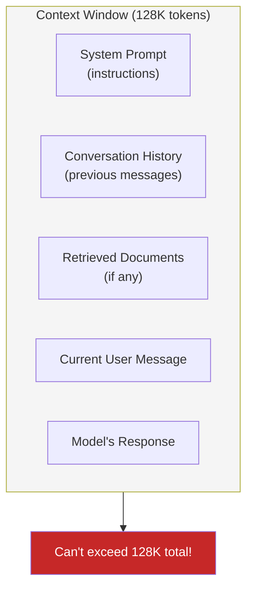
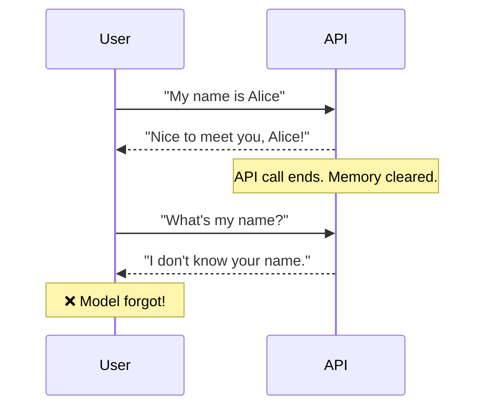
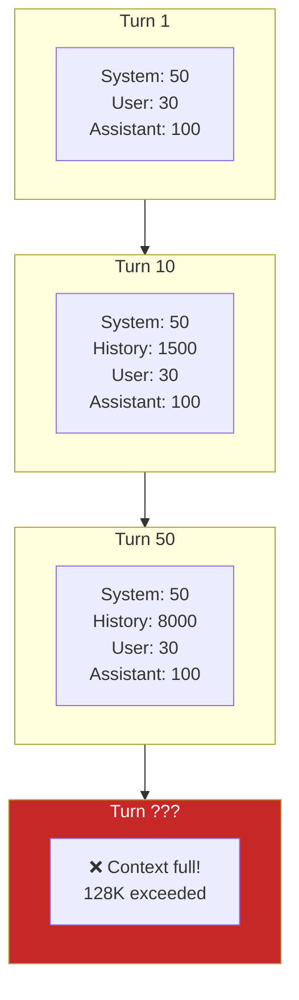

# Lesson 7.4: Context Window

> **Duration**: 20 min | **Section**: A - What IS an LLM?

## 📍 Where We Are

You understand tokens. Now you need to understand the **context window** — the limited space where all your input and output must fit.

---

## 🎯 The Core Concept

The context window is the model's **working memory**. Everything the model can "see" must fit in this window.



---

## 📏 What Fits?

| Tokens | Roughly Equals |
|-------:|----------------|
| 1,000 | 1-2 pages of text |
| 10,000 | A short story |
| 50,000 | A novel (~150 pages) |
| 100,000 | A long novel |
| 128,000 | GPT-4o's full context |
| 200,000 | Claude 3.5's full context |
| 1,000,000 | Gemini 1.5 Pro's context |

128K tokens sounds like a lot, but it fills up fast.

---

## ⚠️ The Critical Misunderstanding

Many developers think:

> "The model remembers our conversation."

**NO.** Each API call is **completely independent**.



**You** must send the conversation history with every request.

---

## 🔧 Managing Conversation History

```python
from openai import OpenAI
client = OpenAI()

# You maintain the history
conversation = [
    {"role": "system", "content": "You are a helpful assistant."}
]

def chat(user_message: str) -> str:
    # Add user message to history
    conversation.append({"role": "user", "content": user_message})
    
    # Send ENTIRE history to API
    response = client.chat.completions.create(
        model="gpt-4o-mini",
        messages=conversation  # All messages, every time
    )
    
    assistant_message = response.choices[0].message.content
    
    # Add assistant response to history
    conversation.append({"role": "assistant", "content": assistant_message})
    
    return assistant_message

# Now it "remembers"
print(chat("My name is Alice"))
# "Nice to meet you, Alice!"

print(chat("What's my name?"))
# "Your name is Alice."

print(len(conversation))  # 5 messages now
```

---

## 📈 The Growing Problem

Every turn, the context grows:

```
Turn 1: 100 tokens (system + user + response)
Turn 5: 500 tokens
Turn 10: 1000 tokens
Turn 50: 5000 tokens
Turn 100: 10000+ tokens
```

Eventually, you hit the limit.



---

## 🔪 Context Management Strategies

### Strategy 1: Sliding Window

Keep only the last N messages:

```python
def get_recent_messages(conversation: list, max_messages: int = 20) -> list:
    """Keep system prompt + last N messages."""
    system = [m for m in conversation if m["role"] == "system"]
    others = [m for m in conversation if m["role"] != "system"]
    return system + others[-max_messages:]

# Before API call
messages = get_recent_messages(conversation, max_messages=20)
```

### Strategy 2: Token Budget

Keep messages until you hit a token limit:

```python
import tiktoken

def fit_to_token_budget(
    conversation: list,
    max_tokens: int = 10000,
    model: str = "gpt-4o"
) -> list:
    """Keep as many recent messages as fit in budget."""
    enc = tiktoken.encoding_for_model(model)
    
    # Always keep system message
    system = [m for m in conversation if m["role"] == "system"]
    others = [m for m in conversation if m["role"] != "system"]
    
    result = list(system)
    token_count = sum(len(enc.encode(m["content"])) for m in system)
    
    # Add messages from most recent, going backwards
    for msg in reversed(others):
        msg_tokens = len(enc.encode(msg["content"]))
        if token_count + msg_tokens > max_tokens:
            break
        result.insert(len(system), msg)  # Insert after system
        token_count += msg_tokens
    
    return result
```

### Strategy 3: Summarization

Periodically summarize old messages:

```python
def summarize_history(old_messages: list) -> str:
    """Ask the model to summarize conversation so far."""
    summary_prompt = f"""Summarize this conversation in 200 words:

{format_messages(old_messages)}"""
    
    response = client.chat.completions.create(
        model="gpt-4o-mini",
        messages=[{"role": "user", "content": summary_prompt}],
        max_tokens=300
    )
    
    return response.choices[0].message.content

# Replace old messages with summary
if len(conversation) > 30:
    old = conversation[1:20]  # Skip system, take old messages
    summary = summarize_history(old)
    
    # New conversation: system + summary + recent messages
    conversation = [
        conversation[0],  # System
        {"role": "assistant", "content": f"[Previous conversation summary: {summary}]"},
        *conversation[20:]  # Recent messages
    ]
```

---

## 🔍 Visualizing Context Usage

```python
import tiktoken

def analyze_context(conversation: list, model: str = "gpt-4o"):
    """Show token breakdown of conversation."""
    enc = tiktoken.encoding_for_model(model)
    
    print("Context Analysis:")
    print("-" * 40)
    
    total = 0
    for i, msg in enumerate(conversation):
        tokens = len(enc.encode(msg["content"]))
        total += tokens
        role = msg["role"].ljust(10)
        print(f"{i}: {role} {tokens:,} tokens")
    
    print("-" * 40)
    print(f"Total: {total:,} tokens")
    print(f"Remaining: {128000 - total:,} tokens")

# Usage
analyze_context(conversation)
```

Output:
```
Context Analysis:
----------------------------------------
0: system     50 tokens
1: user       30 tokens
2: assistant  150 tokens
3: user       25 tokens
4: assistant  200 tokens
----------------------------------------
Total: 455 tokens
Remaining: 127,545 tokens
```

---

## 🎯 Key Takeaways

| Concept | What It Means |
|---------|---------------|
| Context window | Total tokens model can see |
| No memory | Each API call is independent |
| You manage history | Send all relevant messages each time |
| Context fills up | Long conversations exceed limits |
| Strategies exist | Sliding window, token budget, summarization |

---

## 📊 Context Window Comparison

| Model | Context | ~Pages of Text |
|-------|--------:|---------------:|
| GPT-3.5 Turbo | 16K | 25 pages |
| GPT-4o | 128K | 200 pages |
| Claude 3.5 | 200K | 300 pages |
| Gemini 1.5 Pro | 1M | 1,500 pages |

---

## ❓ Common Questions

| Question | Answer |
|----------|--------|
| "Does the model remember between calls?" | No — you must send history each time |
| "What happens if I exceed the limit?" | API returns an error |
| "Should I always use max context?" | No — more context = more cost + latency |
| "Is bigger context always better?" | No — "lost in the middle" problem (later lesson) |

---

**Next**: [Lesson 7.5: Temperature & Sampling](./Lesson-05-Temperature-And-Sampling.md) — The randomness dial. How to control creativity vs consistency.
