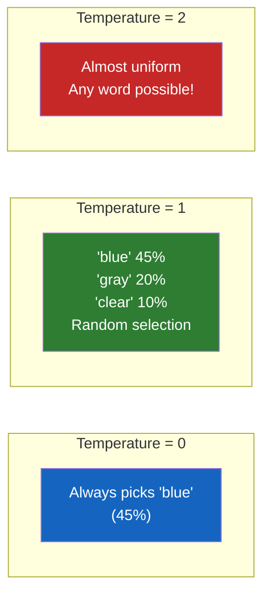
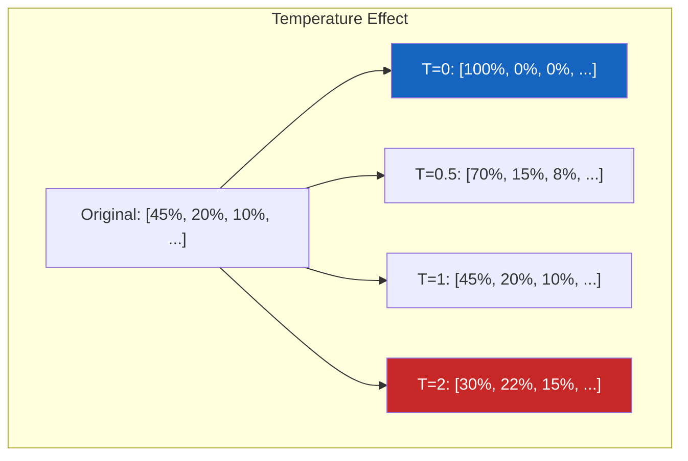
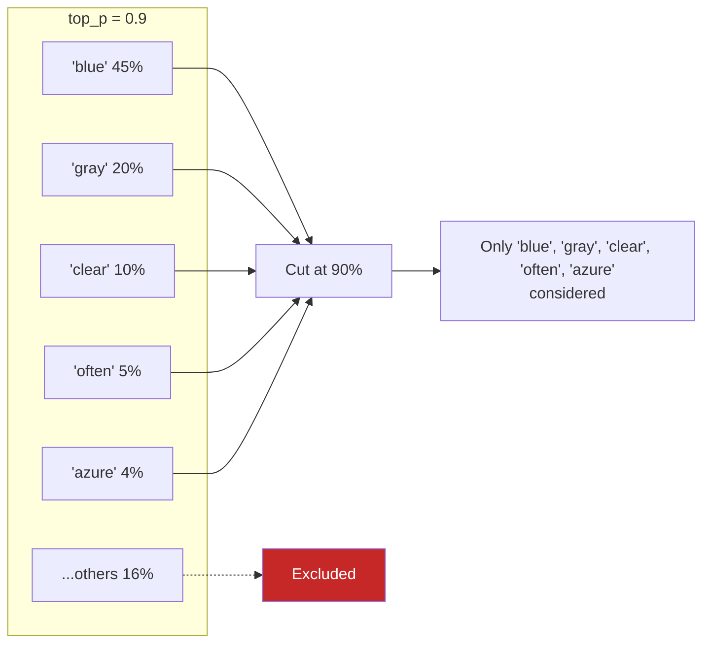
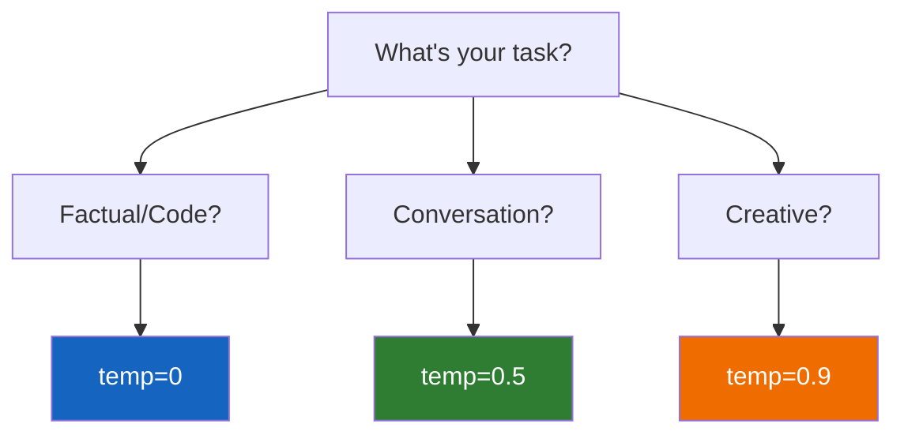

# Lesson 7.5: Temperature & Sampling

> **Duration**: 25 min | **Section**: A - What IS an LLM?

## 📍 Where We Are

You know LLMs predict probabilities for the next token. But how does it choose which token to actually output? That's where **temperature** and **sampling** come in.

---

## 🎰 The Sampling Problem

The model produces probabilities:

```
Next token after "The color of the sky is":
  "blue"   = 45%
  "gray"   = 20%
  "clear"  = 10%
  "often"  = 5%
  ...
```

It could pick "blue" (most likely) or "gray" (also reasonable) or even "often" (less likely but grammatical).

**Temperature controls this choice.**

---

## 🌡️ What is Temperature?

Temperature is a number (usually 0-2) that controls randomness:

| Temperature | Behavior | Use Case |
|:-----------:|----------|----------|
| 0 | Always pick highest probability | Factual Q&A, code |
| 0.3-0.5 | Mostly highest, occasional variety | Balanced responses |
| 0.7-0.9 | More creative, varied | Creative writing |
| 1.0+ | Very random, unpredictable | Brainstorming |



---

## 🔬 How It Works Mathematically

Temperature modifies the probability distribution:

```
Original probabilities:     P = [0.45, 0.20, 0.10, 0.05, ...]

With temperature T:
  adjusted = softmax(logits / T)
```

- **T < 1**: Makes high probabilities higher, low ones lower (more deterministic)
- **T = 1**: Original probabilities
- **T > 1**: Flattens probabilities (more random)



---

## 🧪 Try It: Same Prompt, Different Temperatures

```python
from openai import OpenAI
client = OpenAI()

def generate(prompt: str, temperature: float) -> str:
    response = client.chat.completions.create(
        model="gpt-4o-mini",
        messages=[{"role": "user", "content": prompt}],
        temperature=temperature,
        max_tokens=50
    )
    return response.choices[0].message.content

prompt = "Write one sentence about a robot."

# Temperature 0 - Deterministic
for _ in range(3):
    print(f"T=0: {generate(prompt, 0)}")

# All outputs will be identical!

# Temperature 1 - Creative
for _ in range(3):
    print(f"T=1: {generate(prompt, 1)}")

# Outputs will vary each time
```

Example outputs:
```
T=0: A robot is a machine capable of carrying out complex actions automatically.
T=0: A robot is a machine capable of carrying out complex actions automatically.
T=0: A robot is a machine capable of carrying out complex actions automatically.

T=1: The little robot hummed a cheerful tune as it watered the garden flowers.
T=1: Standing at the edge of the galaxy, the robot contemplated its purpose.
T=1: A robot in Tokyo helped elderly residents with their daily shopping.
```

---

## 🎚️ Other Sampling Parameters

### `top_p` (Nucleus Sampling)

Only consider tokens that make up the top P% of probability mass:

```python
response = client.chat.completions.create(
    model="gpt-4o-mini",
    messages=[...],
    top_p=0.9  # Only consider top 90% of probability mass
)
```



### `top_k` (Not in OpenAI, used elsewhere)

Only consider the top K tokens by probability.

### Recommendation

OpenAI recommends changing **either** temperature **or** top_p, not both:

```python
# Good - adjust temperature only
response = client.chat.completions.create(
    model="gpt-4o-mini",
    messages=[...],
    temperature=0.7,
    # top_p defaults to 1
)

# Good - adjust top_p only
response = client.chat.completions.create(
    model="gpt-4o-mini",
    messages=[...],
    top_p=0.9,
    # temperature defaults to 1
)

# Avoid - both modified
response = client.chat.completions.create(
    model="gpt-4o-mini",
    messages=[...],
    temperature=0.7,
    top_p=0.9  # Confusing interaction
)
```

---

## 🎯 Temperature Guidelines by Task

| Task | Temperature | Why |
|------|:-----------:|-----|
| Code generation | 0 | Want correct, not creative |
| Math problems | 0 | One right answer |
| Factual Q&A | 0-0.3 | Accuracy matters |
| Summarization | 0.3-0.5 | Some variation OK |
| General chat | 0.7 | Natural conversation |
| Creative writing | 0.8-1.0 | Want variety |
| Brainstorming | 1.0-1.5 | Want wild ideas |

---

## 🔧 Practical Examples

### Code Generation (Low Temperature)

```python
response = client.chat.completions.create(
    model="gpt-4o",
    messages=[{
        "role": "user",
        "content": "Write a Python function to calculate factorial"
    }],
    temperature=0  # Want correct code, not creative code
)
```

### Creative Writing (High Temperature)

```python
response = client.chat.completions.create(
    model="gpt-4o",
    messages=[{
        "role": "user",
        "content": "Write a creative story opening about a time traveler"
    }],
    temperature=0.9  # Want variety and creativity
)
```

### Customer Support (Medium Temperature)

```python
response = client.chat.completions.create(
    model="gpt-4o-mini",
    messages=[{
        "role": "user",
        "content": "Help me reset my password"
    }],
    temperature=0.5  # Professional but not robotic
)
```

---

## 🧊 Temperature = 0 is Not Random

When temperature is 0, you get **deterministic** output:

```python
# Same input → Same output (with temp=0)
for _ in range(5):
    response = client.chat.completions.create(
        model="gpt-4o-mini",
        messages=[{"role": "user", "content": "Say hello"}],
        temperature=0
    )
    print(response.choices[0].message.content)

# Output (all identical):
# Hello!
# Hello!
# Hello!
# Hello!
# Hello!
```

This is useful for:
- Caching responses
- Reproducible tests
- Consistent behavior

---

## 📊 Visual Summary



---

## 🎯 Key Takeaways

| Concept | What It Means |
|---------|---------------|
| Temperature | Controls randomness in token selection |
| T=0 | Deterministic, always highest probability |
| T=1 | Natural sampling from distribution |
| T>1 | More random, creative, unpredictable |
| top_p | Alternative: limit to top probability mass |
| Use one | Either temperature OR top_p, not both |

---

## ❓ Common Questions

| Question | Answer |
|----------|--------|
| "What's the default?" | Usually 1.0 |
| "Can I go above 1?" | Yes, up to 2.0 (very random) |
| "Does T=0 mean no randomness?" | Yes, deterministic output |
| "Which is better, temp or top_p?" | Personal preference; temp is more intuitive |

---

**Next**: [Lesson 7.6: LLM Fundamentals Q&A](./Lesson-06-LLM-Fundamentals-QA.md) — Common questions answered: "Why different answers each time?" "Why does it lie?"
