# Lesson 7.6: LLM Fundamentals Q&A

> **Duration**: 10 min | **Section**: A - What IS an LLM?

## 🎯 Purpose

You've learned the fundamentals: prediction, training data, tokens, context windows, and temperature. Let's answer the common questions.

---

## ❓ Frequently Asked Questions

### Q: Why do I get different answers to the same question?

**Answer**: Sampling with temperature > 0.

When temperature isn't 0, the model **samples** from the probability distribution rather than always picking the top choice.

```python
# Same question, 3 different answers
for _ in range(3):
    response = client.chat.completions.create(
        model="gpt-4o-mini",
        messages=[{"role": "user", "content": "Name a fruit"}],
        temperature=1.0
    )
    print(response.choices[0].message.content)

# "Apple"
# "Mango"  
# "I'd say strawberry!"
```

**Fix**: Use `temperature=0` for consistent answers.

---

### Q: Why does the model confidently say wrong things?

**Answer**: It predicts **probable** text, not **true** text.

The model learned patterns from training data. If confident-sounding wrong answers were common in training, it reproduces them.


**Not lying** (no intent). **Not confused** (no understanding). Just predicting probable text.

---

### Q: Why can't it do simple math?

**Answer**: Math requires computation. LLMs do pattern matching.

```
Q: What's 347 * 892?
A: "The answer is 309,524"  ← Often wrong!
```

The model predicts what a math answer **looks like**, not what the answer **is**.

**Fix**: Use function calling to invoke a real calculator (Section C).

---

### Q: Does the model "remember" our conversation?

**Answer**: No. Each API call is completely independent.

The model only "knows" what you send in that specific request:

```python
# Call 1
client.chat.completions.create(
    messages=[{"role": "user", "content": "My name is Alice"}]
)

# Call 2 - DOES NOT know about Call 1!
client.chat.completions.create(
    messages=[{"role": "user", "content": "What's my name?"}]
)
# "I don't know your name."
```

**You** must send conversation history with each request.

---

### Q: Can the model access the internet?

**Answer**: No — base models cannot.

The model only knows:
1. What was in training data (up to cutoff date)
2. What you include in your prompt

Some products (ChatGPT, Copilot) add web search as a tool, but the base API does not.

---

### Q: Why is the model "lazy" or cuts responses short?

**Answer**: Training and `max_tokens`.

1. **Training**: Models are trained to be concise
2. **max_tokens**: Limits how long the response can be

```python
# Short response
response = client.chat.completions.create(
    model="gpt-4o-mini",
    messages=[{"role": "user", "content": "List all US states"}],
    max_tokens=50  # Too short!
)

# Gets cut off: "Alabama, Alaska, Arizona, Arkansas, California..."

# Better
response = client.chat.completions.create(
    model="gpt-4o-mini",
    messages=[{"role": "user", "content": "List all US states"}],
    max_tokens=500  # Enough room
)
```

---

### Q: Why does it say "As an AI language model..."?

**Answer**: RLHF training.

After initial training, models go through Reinforcement Learning from Human Feedback (RLHF). Human raters rewarded:
- Acknowledging AI nature
- Refusing harmful requests
- Admitting uncertainty

So the model learned to produce these responses.

---

### Q: Which model should I use?

**Answer**: Depends on task and budget.

| Model | Good For | Cost |
|-------|----------|------|
| GPT-4o-mini | Most tasks, best value | Very cheap |
| GPT-4o | Complex reasoning, vision | Moderate |
| Claude 3.5 Sonnet | Long documents, code | Moderate |
| Claude 3 Haiku | Fast, simple tasks | Very cheap |

**Start with the cheapest model that works.** You can always upgrade.

---

### Q: How do I make responses more accurate?

**Answer**: Multiple strategies.

| Strategy | How |
|----------|-----|
| Lower temperature | `temperature=0` for factual |
| Better prompts | Be specific, give examples |
| System prompts | Define the AI's behavior |
| Chain of thought | Ask model to "think step by step" |
| Retrieval (RAG) | Add verified facts to context |
| Function calling | Use real tools for computation |

---

### Q: What's the difference between models from different companies?

**Answer**: Training data, architecture, and fine-tuning differ.

| Aspect | OpenAI | Anthropic |
|--------|--------|-----------|
| Flagship | GPT-4o | Claude 3.5 Sonnet |
| Personality | More direct | More verbose, careful |
| Strengths | All-rounder | Long context, safety |
| API style | Similar | Similar (but different format) |

Both use transformer architecture. Differences come from training choices.

---

## 🧠 Mental Model Summary

```mermaid
flowchart TD
    subgraph "What LLM Is"
        PRED["Prediction machine"]
        PATTERNS["Learned patterns from text"]
        TOKENS["Works on tokens, not words"]
    end
    
    subgraph "What LLM Isn't"
        KNOW["❌ Knowledge database"]
        THINK["❌ Thinking entity"]
        MEM["❌ Has memory between calls"]
        TRUTH["❌ Truth verifier"]
    end
    
    style PRED fill:#2E7D32,color:#fff
    style KNOW fill:#C62828,color:#fff
    style THINK fill:#C62828,color:#fff
    style MEM fill:#C62828,color:#fff
    style TRUTH fill:#C62828,color:#fff
```



---

## � Common Pitfalls

| Pitfall | Why It Happens | Fix |
|---------|---------------|-----|
| Treating LLM output as truth | Confident tone sounds authoritative | Always verify factual claims; LLMs predict probable, not true |
| Expecting consistent answers | Not understanding temperature sampling | Use `temperature=0` for deterministic results |
| Asking LLMs to do math | Seems like it should work | Use function calling for computation; LLMs pattern-match, not calculate |
| Assuming conversation memory | ChatGPT UI hides the complexity | You must send full history with each API call |
| Using `latest` tag blindly | Seems like "best" | Specify model versions; behavior changes between updates |
| Ignoring token limits | Not counting input + output | Use tiktoken to estimate before calling |

## 🔑 Key Takeaways

1. **LLMs are prediction machines** — They predict the next token based on patterns, not understanding
2. **Temperature controls randomness** — 0 = deterministic, 1 = creative/varied
3. **Tokens ≠ words** — "Hello" = 1 token, but long words may be 3-4 tokens
4. **Context window is limited** — 128K tokens sounds big, but fills fast with conversation history
5. **No memory between calls** — Each API call is independent; you manage history
6. **Hallucinations are predictable** — LLMs reproduce patterns from training, including confident mistakes

---

## �🔑 Quick Reference

| Question | Short Answer |
|----------|--------------|
| Different answers? | Temperature sampling |
| Wrong answers? | Predicts probable, not true |
| Can't do math? | Pattern matching, not computation |
| Remember conversation? | No — you send history |
| Access internet? | No — only training data + prompt |
| Which model? | Cheapest that works |

---

**Section A Complete!** You understand what LLMs are, how they work, and their limitations.

**Next**: [Lesson 7.7: The API Problem](./Lesson-07-The-API-Problem.md) — You want to use GPT-4 in YOUR application. How do you actually talk to OpenAI's servers?
