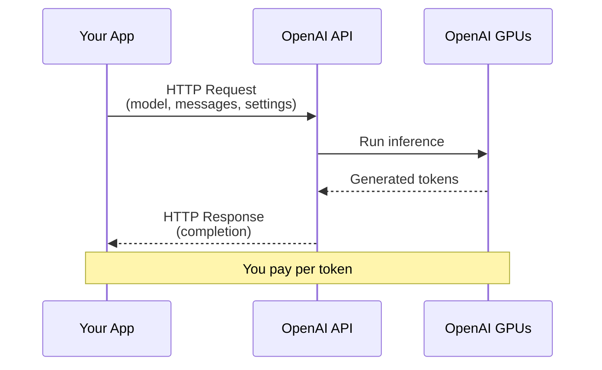

# Lesson 7.7: The API Problem

> **Duration**: 5 min | **Section**: B - OpenAI API | **Type**: Intro Lesson

## 📍 Where We Are

You understand what LLMs are: prediction machines trained on massive text datasets. You know about tokens, context windows, and temperature.

**But how do you actually USE one in your application?**

---

## 🤔 The Problem

You want to build an app that:
- Answers customer questions
- Generates code suggestions
- Summarizes documents
- Has a chat interface

You don't have:
- $100 million to train a model
- A data center with thousands of GPUs
- A team of ML researchers

---

## 🎯 The Solution: APIs

OpenAI, Anthropic, Google, and others host the models. You **call their API**.



No training. No GPUs. No infrastructure. Just HTTP requests.

---

## 💳 The Business Model

| What You Pay For | How It's Billed |
|------------------|-----------------|
| Input tokens | Per million tokens |
| Output tokens | Per million tokens (higher rate) |
| Model tier | More capable = more expensive |

Example for GPT-4o:
- 1,000 tokens input = $0.0025
- 1,000 tokens output = $0.01

A typical chat message might cost $0.001 - $0.05.

---

## 🔑 What You Need

1. **API Key**: Authentication token (like a password)
2. **HTTP Client**: Send requests (Python's `openai` library)
3. **Money**: Pay-as-you-go billing

That's it. No servers to set up, no models to download.

---

## 📋 What You'll Learn

| Lesson | Topic |
|--------|-------|
| 7.8 | Getting set up (API key, packages) |
| 7.9 | Chat completions under the hood |
| 7.10 | The messages array |
| 7.11 | Parameters (max_tokens, stop, etc.) |
| 7.12 | Streaming responses |
| 7.13 | Q&A (rate limits, costs, models) |

---

## 🔧 Preview: How Simple It Is

```python
from openai import OpenAI

client = OpenAI()  # Uses OPENAI_API_KEY env var

response = client.chat.completions.create(
    model="gpt-4o-mini",
    messages=[
        {"role": "user", "content": "Hello!"}
    ]
)

print(response.choices[0].message.content)
# "Hello! How can I help you today?"
```

That's a complete working example. Let's break down every part.

---

**Next**: [Lesson 7.8: OpenAI Setup](./Lesson-08-OpenAI-Setup.md) — Get your API key, install packages, and make your first call.
