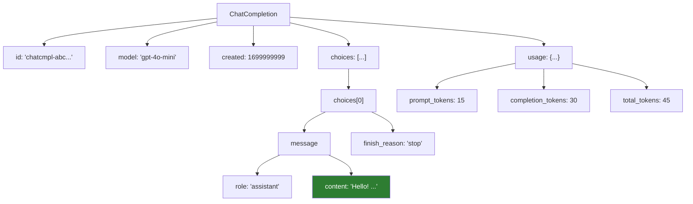

# Lesson 7.8: OpenAI Setup

> **Duration**: 20 min | **Section**: B - OpenAI API

## 📍 Where We Are

You know you need to call OpenAI's API. Let's get set up and make your first call.

---

## 🔑 Step 1: Get an API Key

### Create an Account

1. Go to [platform.openai.com](https://platform.openai.com)
2. Sign up / Log in
3. Go to **API Keys** section (in sidebar or profile)
4. Click **Create new secret key**
5. Copy it immediately (you can't see it again!)

Your key looks like:
```
sk-proj-abc123def456...
```

### ⚠️ Security Rules

| ❌ Never | ✅ Always |
|---------|----------|
| Commit to git | Use environment variables |
| Put in client-side code | Keep on server only |
| Share with others | Use separate keys per project |
| Leave in plain text files | Use `.env` with `.gitignore` |

---

## 📦 Step 2: Install the Package

```bash
pip install openai
```

That's it. The `openai` package is the official Python SDK.

For projects, add to `requirements.txt`:
```
openai>=1.0.0
```

---

## 🔐 Step 3: Set the Environment Variable

### Option A: Export in Terminal

```bash
export OPENAI_API_KEY="sk-proj-abc123def456..."
```

This is temporary (gone when terminal closes).

### Option B: Use a .env File (Recommended)

1. Install python-dotenv:
```bash
pip install python-dotenv
```

2. Create `.env` file:
```
OPENAI_API_KEY=sk-proj-abc123def456...
```

3. Add to `.gitignore`:
```
.env
```

4. Load in your code:
```python
from dotenv import load_dotenv
load_dotenv()  # Loads .env into environment

from openai import OpenAI
client = OpenAI()  # Automatically reads OPENAI_API_KEY
```

---

## 🧪 Step 4: Make Your First Call

```python
from openai import OpenAI

# Create client (reads OPENAI_API_KEY from environment)
client = OpenAI()

# Make a chat completion request
response = client.chat.completions.create(
    model="gpt-4o-mini",
    messages=[
        {"role": "user", "content": "Say hello in three languages."}
    ]
)

# Print the response
print(response.choices[0].message.content)
```

Output:
```
Hello! (English)
Hola! (Spanish)
Bonjour! (French)
```

---

## 🔍 Understanding the Response

```python
response = client.chat.completions.create(...)

# The response object
print(type(response))  # <class 'ChatCompletion'>

# Key attributes
print(response.id)          # "chatcmpl-abc123..."
print(response.model)       # "gpt-4o-mini"
print(response.created)     # Unix timestamp

# The actual content
print(response.choices[0].message.content)  # The text response
print(response.choices[0].message.role)     # "assistant"
print(response.choices[0].finish_reason)    # "stop"

# Token usage (for billing)
print(response.usage.prompt_tokens)      # Tokens in your input
print(response.usage.completion_tokens)  # Tokens in the response
print(response.usage.total_tokens)       # Sum
```

---

## 📊 Response Structure



---

## 🔧 Complete Setup Script

Here's a complete, production-ready setup:

```python
# app.py
import os
from dotenv import load_dotenv
from openai import OpenAI

# Load environment variables
load_dotenv()

# Verify API key exists
if not os.getenv("OPENAI_API_KEY"):
    raise ValueError("OPENAI_API_KEY not set in environment")

# Create client
client = OpenAI()

def chat(user_message: str, model: str = "gpt-4o-mini") -> str:
    """Send a message and get a response."""
    response = client.chat.completions.create(
        model=model,
        messages=[{"role": "user", "content": user_message}]
    )
    return response.choices[0].message.content

# Test it
if __name__ == "__main__":
    print(chat("What's 2 + 2?"))
```

---

## 🚨 Common Errors

### "AuthenticationError"

```
openai.AuthenticationError: Incorrect API key provided
```

**Fix**: Check your API key is correct and set in environment.

```python
# Debug
import os
print(os.getenv("OPENAI_API_KEY")[:10])  # Print first 10 chars
```

### "RateLimitError"

```
openai.RateLimitError: Rate limit reached
```

**Fix**: 
- Wait and retry
- Use a lower tier model
- Add exponential backoff (Lesson 7.22)

### "InsufficientQuotaError"

```
openai.InsufficientQuotaError: You exceeded your current quota
```

**Fix**: Add payment method or increase spending limit at platform.openai.com.

---

## 🔑 Key Takeaways

| Step | What to Do |
|------|------------|
| 1. Get key | Create at platform.openai.com |
| 2. Install | `pip install openai` |
| 3. Set env var | `OPENAI_API_KEY` in `.env` |
| 4. Create client | `client = OpenAI()` |
| 5. Make call | `client.chat.completions.create(...)` |

---

## 📚 Further Reading

- [OpenAI Platform](https://platform.openai.com/)
- [OpenAI Python Library](https://github.com/openai/openai-python)
- [API Reference](https://platform.openai.com/docs/api-reference)

---

**Next**: [Lesson 7.9: Chat Completions Under the Hood](./Lesson-09-Chat-Completions-Under-The-Hood.md) — What exactly happens when you call `client.chat.completions.create()`?
