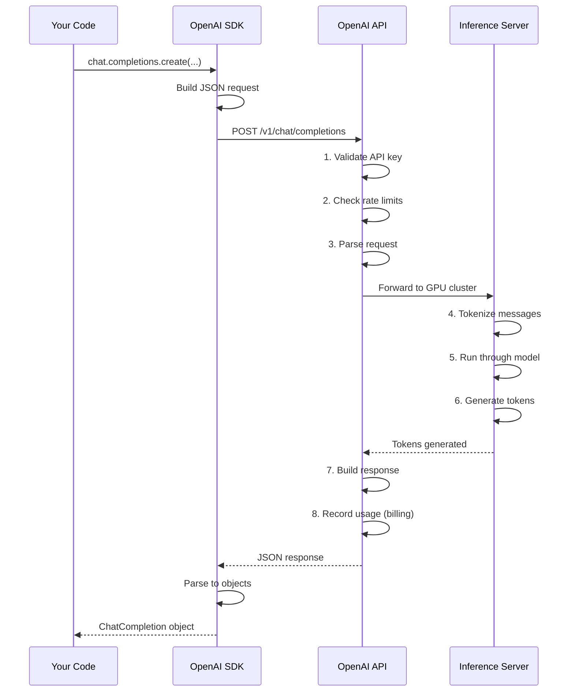
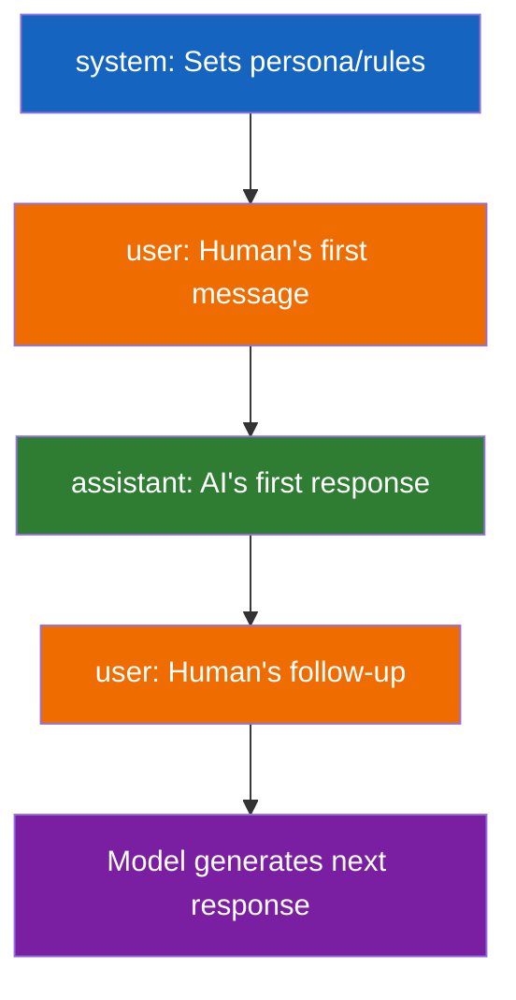

# Lesson 7.9: Chat Completions Under the Hood

> **Duration**: 35 min | **Section**: B - OpenAI API

## 📍 Where We Are

You can make basic API calls. Now let's understand exactly what happens when you call `client.chat.completions.create()`.

---

## 🔍 The Request

When you call:

```python
response = client.chat.completions.create(
    model="gpt-4o-mini",
    messages=[
        {"role": "system", "content": "You are a helpful assistant."},
        {"role": "user", "content": "What is Python?"}
    ],
    temperature=0.7,
    max_tokens=500
)
```

The library sends an HTTP POST request to:
```
POST https://api.openai.com/v1/chat/completions
```

With JSON body:
```json
{
  "model": "gpt-4o-mini",
  "messages": [
    {"role": "system", "content": "You are a helpful assistant."},
    {"role": "user", "content": "What is Python?"}
  ],
  "temperature": 0.7,
  "max_tokens": 500
}
```

And headers:
```
Authorization: Bearer sk-proj-abc123...
Content-Type: application/json
```

---

## 🔄 The Full Journey



---

## 📦 Request Parameters

| Parameter | Type | Required | Description |
|-----------|------|:--------:|-------------|
| `model` | string | ✅ | Which model to use |
| `messages` | array | ✅ | Conversation history |
| `temperature` | float | | Randomness (0-2, default 1) |
| `max_tokens` | int | | Max response length |
| `top_p` | float | | Nucleus sampling |
| `n` | int | | Number of responses |
| `stop` | string/array | | Stop sequences |
| `stream` | bool | | Enable streaming |
| `tools` | array | | Function definitions |

---

## 🎯 Understanding the Messages Array

The `messages` array is the heart of the API. It represents the conversation:

```python
messages = [
    # System message: Sets behavior
    {"role": "system", "content": "You are a pirate."},
    
    # User message: Human input
    {"role": "user", "content": "Hello!"},
    
    # Assistant message: Previous AI response
    {"role": "assistant", "content": "Ahoy, matey!"},
    
    # User message: Follow-up
    {"role": "user", "content": "Where's the treasure?"}
]
```



---

## 📤 The Response Object

```python
response = client.chat.completions.create(...)
```

What you get back:

```python
ChatCompletion(
    id='chatcmpl-9abc...',
    choices=[
        Choice(
            finish_reason='stop',
            index=0,
            message=ChatCompletionMessage(
                content='Python is a programming language...',
                role='assistant'
            )
        )
    ],
    created=1699999999,
    model='gpt-4o-mini',
    usage=CompletionUsage(
        completion_tokens=45,
        prompt_tokens=23,
        total_tokens=68
    )
)
```

### Accessing the Content

```python
# The text response
content = response.choices[0].message.content

# Why [0]? You can request multiple responses with n=2
```

### finish_reason Values

| Value | Meaning |
|-------|---------|
| `stop` | Natural end or hit stop sequence |
| `length` | Hit max_tokens limit |
| `tool_calls` | Model wants to call a tool |
| `content_filter` | Content was filtered |

---

## 🔢 Token Counting

Every request returns usage info:

```python
print(f"Input tokens: {response.usage.prompt_tokens}")
print(f"Output tokens: {response.usage.completion_tokens}")
print(f"Total tokens: {response.usage.total_tokens}")
print(f"Estimated cost: ${response.usage.total_tokens * 0.00001:.6f}")
```

Use this for:
- Cost tracking
- Rate limit management
- Optimizing prompts

---

## 🧪 Practice: Complete Request/Response

```python
from openai import OpenAI
import json

client = OpenAI()

def detailed_chat(user_message: str) -> dict:
    """Make a chat request and return detailed info."""
    
    messages = [
        {"role": "system", "content": "You are a helpful assistant. Be concise."},
        {"role": "user", "content": user_message}
    ]
    
    response = client.chat.completions.create(
        model="gpt-4o-mini",
        messages=messages,
        temperature=0.7,
        max_tokens=200
    )
    
    choice = response.choices[0]
    
    return {
        "id": response.id,
        "model": response.model,
        "content": choice.message.content,
        "finish_reason": choice.finish_reason,
        "prompt_tokens": response.usage.prompt_tokens,
        "completion_tokens": response.usage.completion_tokens,
        "total_tokens": response.usage.total_tokens,
    }

# Test it
result = detailed_chat("What are the three primary colors?")
print(json.dumps(result, indent=2))
```

Output:
```json
{
  "id": "chatcmpl-abc123...",
  "model": "gpt-4o-mini",
  "content": "The three primary colors are red, blue, and yellow...",
  "finish_reason": "stop",
  "prompt_tokens": 25,
  "completion_tokens": 35,
  "total_tokens": 60
}
```

---

## ⚠️ Important Details

### 1. Requests Are Stateless

Each API call is independent. The server doesn't remember previous calls.

```python
# Call 1
response1 = client.chat.completions.create(
    model="gpt-4o-mini",
    messages=[{"role": "user", "content": "My name is Alice"}]
)

# Call 2 - DOES NOT KNOW about Call 1
response2 = client.chat.completions.create(
    model="gpt-4o-mini",
    messages=[{"role": "user", "content": "What's my name?"}]
)
# "I don't know your name."
```

### 2. Order of Messages Matters

The model sees messages in order. Put important context first or last (not middle).

### 3. Model Version Pinning

```python
# Specific version (won't change)
model="gpt-4o-mini-2024-07-18"

# Alias (will update over time)
model="gpt-4o-mini"
```

---

## 🔑 Key Takeaways

| Concept | What It Means |
|---------|---------------|
| HTTP POST | Just a REST API call |
| Messages array | Full conversation history |
| Roles | system, user, assistant |
| Response object | Contains content + metadata |
| Usage | Token counts for billing |
| Stateless | Each call is independent |

---

## 📚 Further Reading

- [Chat Completions API Reference](https://platform.openai.com/docs/api-reference/chat)
- [OpenAI Models](https://platform.openai.com/docs/models)

---

**Next**: [Lesson 7.10: Messages Array](./Lesson-10-Messages-Array.md) — Deep dive into system, user, and assistant roles. Building conversation history.
