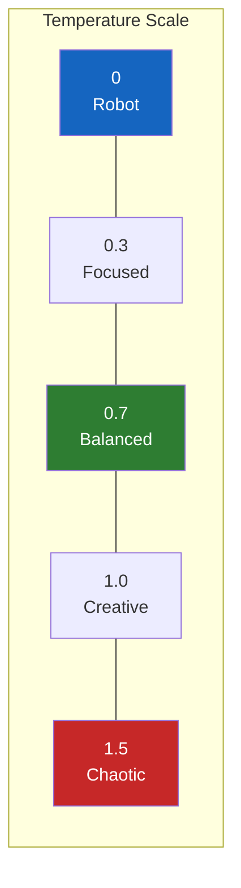
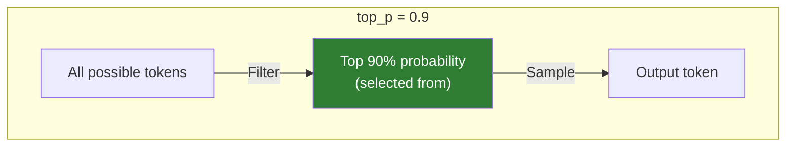

# Lesson 7.11: Parameters Deep Dive

> **Duration**: 35 min | **Section**: B - OpenAI API

## 📍 Where We Are

You can make API calls. Now let's master the parameters — what each one does, when to use it, and common combinations for different use cases.

---

## 🎛️ The Control Panel

```python
response = client.chat.completions.create(
    model="gpt-4o-mini",           # Which model
    messages=[...],                 # What to process
    temperature=0.7,                # Creativity
    max_tokens=1000,                # Response length limit
    top_p=1.0,                      # Nucleus sampling
    frequency_penalty=0.0,          # Reduce repetition
    presence_penalty=0.0,           # Encourage new topics
    stop=None,                      # Stop sequences
    n=1,                            # Number of responses
    seed=None                       # For reproducibility
)
```

---

## 🎯 temperature (Creativity Control)

Controls randomness in token selection.

| Value | Behavior | Use Case |
|-------|----------|----------|
| 0 | Deterministic, focused | Code, facts, math |
| 0.3 | Slightly varied | Customer support |
| 0.7 | Balanced (default) | General chat |
| 1.0 | Creative, diverse | Brainstorming, stories |
| 1.5+ | Very random | Wild creativity (risky) |

```python
# Coding assistant - low temperature
response = client.chat.completions.create(
    model="gpt-4o-mini",
    messages=[{"role": "user", "content": "Write a binary search function"}],
    temperature=0  # Consistent, correct code
)

# Creative writer - high temperature
response = client.chat.completions.create(
    model="gpt-4o-mini",
    messages=[{"role": "user", "content": "Write a poem about clouds"}],
    temperature=1.0  # More creative variety
)
```



---

## 📏 max_tokens (Length Limit)

Maximum tokens in the **response** (not including your prompt).

```python
# Short answer
response = client.chat.completions.create(
    model="gpt-4o-mini",
    messages=[{"role": "user", "content": "Explain gravity"}],
    max_tokens=50  # About 35-40 words
)

# Long explanation
response = client.chat.completions.create(
    model="gpt-4o-mini",
    messages=[{"role": "user", "content": "Explain gravity"}],
    max_tokens=2000  # Room for detailed response
)
```

### Why Set max_tokens?

1. **Cost control** — Pay per token
2. **Speed** — Shorter = faster
3. **Format control** — Force concise answers

### The Cutoff Problem

```python
# If response is longer than max_tokens, it gets CUT OFF mid-sentence
response = client.chat.completions.create(
    model="gpt-4o-mini",
    messages=[{"role": "user", "content": "Write a 500 word essay"}],
    max_tokens=100  # Essay will be incomplete!
)

# Check if response was truncated
if response.choices[0].finish_reason == "length":
    print("Response was cut off due to max_tokens")
```

---

## 🎲 top_p (Nucleus Sampling)

Alternative to temperature. Limits which tokens are considered.

| top_p | Meaning |
|-------|---------|
| 1.0 | Consider all tokens (default) |
| 0.9 | Consider tokens in top 90% probability mass |
| 0.5 | Only top 50% most likely tokens |
| 0.1 | Very restricted (almost deterministic) |

```python
# OpenAI recommends: Change temperature OR top_p, not both
response = client.chat.completions.create(
    model="gpt-4o-mini",
    messages=[...],
    temperature=1,  # Keep at 1 when using top_p
    top_p=0.9       # Slight focus
)
```



---

## 🔁 frequency_penalty (Reduce Repetition)

Penalizes tokens that already appeared. Range: -2.0 to 2.0

```python
# Without penalty - might repeat phrases
response = client.chat.completions.create(
    model="gpt-4o-mini",
    messages=[{"role": "user", "content": "List reasons to exercise"}],
    frequency_penalty=0
)
# "Exercise is good. Exercise helps you. Exercise improves..."

# With penalty - more variety
response = client.chat.completions.create(
    model="gpt-4o-mini",
    messages=[{"role": "user", "content": "List reasons to exercise"}],
    frequency_penalty=0.5
)
# "Exercise is good. It helps your health. Physical activity improves..."
```

| Value | Effect |
|-------|--------|
| 0 | No penalty (default) |
| 0.5 | Light penalty |
| 1.0 | Strong penalty |
| 2.0 | Maximum penalty |
| -2.0 | Encourage repetition (rarely useful) |

---

## 🆕 presence_penalty (New Topics)

Encourages talking about new topics not yet mentioned.

```python
# Encourage exploring new aspects
response = client.chat.completions.create(
    model="gpt-4o-mini",
    messages=[{"role": "user", "content": "Tell me about Paris"}],
    presence_penalty=0.6
)
# More likely to mention diverse topics (history, food, art, architecture)
```

| Parameter | Focus |
|-----------|-------|
| frequency_penalty | Penalizes repeated words |
| presence_penalty | Penalizes already-mentioned topics |

---

## 🛑 stop (Stop Sequences)

Tell the model when to stop generating.

```python
# Stop when hitting a delimiter
response = client.chat.completions.create(
    model="gpt-4o-mini",
    messages=[{"role": "user", "content": "Count: 1, 2, 3, 4, 5, 6, 7, 8, 9, 10"}],
    stop=[","]  # Stop at first comma
)
# "Count: 1"

# Multiple stop sequences
response = client.chat.completions.create(
    model="gpt-4o-mini",
    messages=[{"role": "user", "content": "Write a conversation"}],
    stop=["Human:", "AI:"]  # Stop when new speaker starts
)

# Up to 4 stop sequences allowed
stop=["---", "###", "\n\n\n", "END"]
```

### Use Cases for stop

```python
# JSON extraction - stop after closing brace
response = client.chat.completions.create(
    model="gpt-4o-mini",
    messages=[{"role": "user", "content": "Return JSON: {"}],
    stop=["}"]  # Stop after JSON closes
)
json_content = response.choices[0].message.content + "}"

# List limiting
response = client.chat.completions.create(
    model="gpt-4o-mini",
    messages=[{"role": "user", "content": "List items:\n1."}],
    stop=["\n4."]  # Stop before 4th item
)
```

---

## 🔢 n (Multiple Responses)

Generate multiple completions in one call.

```python
# Get 3 different responses
response = client.chat.completions.create(
    model="gpt-4o-mini",
    messages=[{"role": "user", "content": "Give me a startup idea"}],
    n=3,
    temperature=1.0  # Higher temp for variety
)

# Access all responses
for i, choice in enumerate(response.choices):
    print(f"Idea {i+1}: {choice.message.content}")
```

⚠️ **Cost Warning**: `n=3` means 3x the output tokens = 3x the cost

---

## 🎲 seed (Reproducibility)

Make outputs deterministic (mostly).

```python
# Same seed + same input = same output (usually)
response = client.chat.completions.create(
    model="gpt-4o-mini",
    messages=[{"role": "user", "content": "Pick a random number"}],
    seed=42,
    temperature=0
)
# Running this again with seed=42 gives same result
```

⚠️ Not guaranteed to be perfectly reproducible, but very close.

---

## 📊 Common Parameter Combinations

### Code Generation

```python
response = client.chat.completions.create(
    model="gpt-4o-mini",
    messages=[{"role": "user", "content": "Write a merge sort function"}],
    temperature=0,      # Deterministic
    max_tokens=500,     # Reasonable code length
)
```

### Creative Writing

```python
response = client.chat.completions.create(
    model="gpt-4o-mini",
    messages=[{"role": "user", "content": "Write a short story about time travel"}],
    temperature=0.9,
    max_tokens=2000,
    presence_penalty=0.6,    # Explore different themes
    frequency_penalty=0.3,   # Reduce word repetition
)
```

### Customer Support

```python
response = client.chat.completions.create(
    model="gpt-4o-mini",
    messages=[{"role": "user", "content": "My order is late"}],
    temperature=0.3,    # Consistent but not robotic
    max_tokens=300,     # Keep responses focused
)
```

### Data Extraction

```python
response = client.chat.completions.create(
    model="gpt-4o-mini",
    messages=[{"role": "user", "content": "Extract the email: ..."}],
    temperature=0,      # Exact extraction
    max_tokens=100,     # Short output expected
)
```

### Brainstorming

```python
response = client.chat.completions.create(
    model="gpt-4o-mini",
    messages=[{"role": "user", "content": "Give me 5 app ideas"}],
    temperature=1.0,
    n=3,                # Get 3 different lists
    presence_penalty=0.8,  # Maximum diversity
)
```

---

## 📋 Quick Reference

| Parameter | Default | Range | Primary Use |
|-----------|---------|-------|-------------|
| temperature | 1.0 | 0-2 | Creativity control |
| max_tokens | Model limit | 1-model max | Response length |
| top_p | 1.0 | 0-1 | Token filtering |
| frequency_penalty | 0 | -2 to 2 | Reduce word repetition |
| presence_penalty | 0 | -2 to 2 | Encourage new topics |
| stop | None | Up to 4 strings | Stop conditions |
| n | 1 | 1-128 | Multiple responses |
| seed | None | Any integer | Reproducibility |

---

## 🧪 Practice: Parameter Experimentation

```python
from openai import OpenAI

client = OpenAI()

def test_parameters(prompt: str, **kwargs):
    """Test different parameter combinations."""
    
    defaults = {
        "model": "gpt-4o-mini",
        "messages": [{"role": "user", "content": prompt}]
    }
    
    response = client.chat.completions.create(**{**defaults, **kwargs})
    return response.choices[0].message.content

# Test 1: Temperature comparison
prompt = "Name a fruit"
for temp in [0, 0.5, 1.0, 1.5]:
    result = test_parameters(prompt, temperature=temp)
    print(f"temp={temp}: {result}")

# Test 2: Max tokens cutoff
long_prompt = "Write a detailed essay about climate change"
for tokens in [50, 200, 500]:
    result = test_parameters(long_prompt, max_tokens=tokens)
    print(f"max_tokens={tokens}: {len(result)} chars")

# Test 3: Stop sequences
result = test_parameters(
    "Count from 1 to 10: 1, 2,",
    stop=[", 5"]
)
print(f"Stopped at: {result}")
```

---

## 🔑 Key Takeaways

| Parameter | Remember |
|-----------|----------|
| temperature | 0 = precise, 1 = creative |
| max_tokens | Limits OUTPUT only |
| top_p | Don't mix with temperature changes |
| frequency_penalty | Stops word repetition |
| presence_penalty | Encourages topic variety |
| stop | Force clean endings |
| n | Costs n× tokens |
| seed | For reproducible testing |

---

**Next**: [Lesson 7.12: Streaming Responses](./Lesson-12-Streaming-Responses.md) — Real-time output with `stream=True`.
