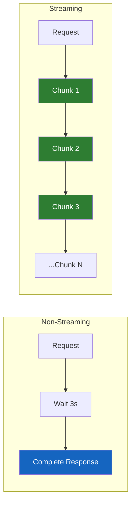
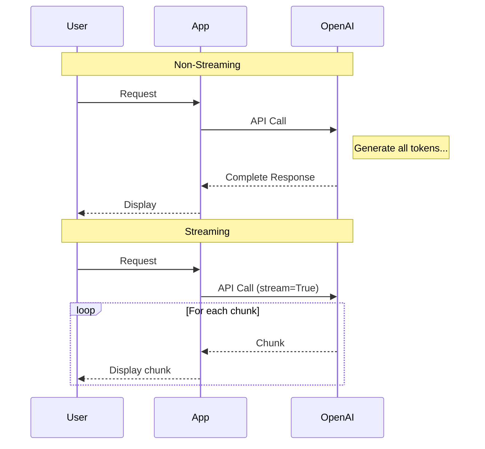

# Lesson 7.12: Streaming Responses

> **Duration**: 30 min | **Section**: B - OpenAI API

## 🎯 The Problem: Waiting Forever

Without streaming:

```
User sends request
   |
   |  ... waiting ...
   |  ... still waiting ...
   |  ... 3 seconds later ...
   |
   v
Entire response appears at once
```

With streaming:

```
User sends request
   |
   v
"Hello" → "Hello, I" → "Hello, I can" → "Hello, I can help" → ...
(tokens appear as they're generated)
```

---

## 💡 Why Streaming Matters

| Without Streaming | With Streaming |
|------------------|----------------|
| Wait 3-10 seconds for response | First token in ~500ms |
| All-or-nothing display | Real-time typewriter effect |
| Bad UX for long responses | Great UX, feels responsive |
| Full response in memory | Process as chunks arrive |

---

## 🔧 Basic Streaming

```python
from openai import OpenAI

client = OpenAI()

# Enable streaming with stream=True
stream = client.chat.completions.create(
    model="gpt-4o-mini",
    messages=[{"role": "user", "content": "Explain quantum computing"}],
    stream=True  # This is the key!
)

# Iterate over chunks as they arrive
for chunk in stream:
    # Each chunk has a choices array
    if chunk.choices[0].delta.content:
        print(chunk.choices[0].delta.content, end="", flush=True)

print()  # Newline at end
```

Output appears character by character:
```
Q→Qu→Qua→Quan→Quant→Quantu→Quantum→Quantum →Quantum c→...
```

---

## 📊 What's in a Chunk?

```python
# Non-streaming response structure
response.choices[0].message.content  # Full content

# Streaming chunk structure
chunk.choices[0].delta.content  # Partial content (a few tokens)
```



### Chunk Structure

```python
# First chunk (usually has role)
{
    "id": "chatcmpl-abc123",
    "object": "chat.completion.chunk",
    "created": 1700000000,
    "model": "gpt-4o-mini",
    "choices": [{
        "index": 0,
        "delta": {"role": "assistant", "content": ""},
        "finish_reason": None
    }]
}

# Middle chunks (have content)
{
    ...
    "choices": [{
        "delta": {"content": "Hello"},  # The actual tokens
        "finish_reason": None
    }]
}

# Final chunk (has finish_reason)
{
    ...
    "choices": [{
        "delta": {},
        "finish_reason": "stop"  # Or "length" if max_tokens hit
    }]
}
```

---

## 🔄 Collecting the Full Response

```python
from openai import OpenAI

client = OpenAI()

def stream_and_collect(prompt: str) -> str:
    """Stream response while also collecting the full text."""
    
    stream = client.chat.completions.create(
        model="gpt-4o-mini",
        messages=[{"role": "user", "content": prompt}],
        stream=True
    )
    
    full_response = []
    
    for chunk in stream:
        content = chunk.choices[0].delta.content
        if content:
            print(content, end="", flush=True)  # Display in real-time
            full_response.append(content)       # Collect for later
    
    print()  # Newline
    
    return "".join(full_response)

# Usage
response_text = stream_and_collect("Write a haiku about coding")
# Output appears in real-time
# response_text now contains the full response
```

---

## ⚡ Async Streaming

For web applications, use async:

```python
import asyncio
from openai import AsyncOpenAI

client = AsyncOpenAI()

async def stream_async(prompt: str):
    """Async streaming for web apps."""
    
    stream = await client.chat.completions.create(
        model="gpt-4o-mini",
        messages=[{"role": "user", "content": prompt}],
        stream=True
    )
    
    async for chunk in stream:
        content = chunk.choices[0].delta.content
        if content:
            print(content, end="", flush=True)
    
    print()

# Run it
asyncio.run(stream_async("Tell me a joke"))
```

---

## 🌐 Streaming in FastAPI

```python
from fastapi import FastAPI
from fastapi.responses import StreamingResponse
from openai import OpenAI

app = FastAPI()
client = OpenAI()

def generate_stream(prompt: str):
    """Generator function for streaming."""
    
    stream = client.chat.completions.create(
        model="gpt-4o-mini",
        messages=[{"role": "user", "content": prompt}],
        stream=True
    )
    
    for chunk in stream:
        content = chunk.choices[0].delta.content
        if content:
            yield content

@app.get("/chat")
def chat(prompt: str):
    return StreamingResponse(
        generate_stream(prompt),
        media_type="text/plain"
    )
```

### Server-Sent Events (SSE)

```python
from fastapi import FastAPI
from fastapi.responses import StreamingResponse
import json

@app.get("/chat/sse")
def chat_sse(prompt: str):
    """Stream as Server-Sent Events."""
    
    def event_generator():
        stream = client.chat.completions.create(
            model="gpt-4o-mini",
            messages=[{"role": "user", "content": prompt}],
            stream=True
        )
        
        for chunk in stream:
            content = chunk.choices[0].delta.content
            if content:
                # SSE format
                yield f"data: {json.dumps({'content': content})}\n\n"
        
        yield "data: [DONE]\n\n"
    
    return StreamingResponse(
        event_generator(),
        media_type="text/event-stream"
    )
```

---

## 🧩 Handling Edge Cases

### Check Finish Reason

```python
def stream_with_status(prompt: str) -> tuple[str, str]:
    """Stream and return finish reason."""
    
    stream = client.chat.completions.create(
        model="gpt-4o-mini",
        messages=[{"role": "user", "content": prompt}],
        stream=True,
        max_tokens=100  # Might hit limit
    )
    
    full_response = []
    finish_reason = None
    
    for chunk in stream:
        if chunk.choices[0].delta.content:
            content = chunk.choices[0].delta.content
            print(content, end="", flush=True)
            full_response.append(content)
        
        if chunk.choices[0].finish_reason:
            finish_reason = chunk.choices[0].finish_reason
    
    print()
    
    return "".join(full_response), finish_reason

text, reason = stream_with_status("Write a long story")
if reason == "length":
    print("\n[Response was truncated due to max_tokens]")
```

### Error Handling

```python
from openai import OpenAI, APIError

def safe_stream(prompt: str):
    """Handle errors during streaming."""
    
    try:
        stream = client.chat.completions.create(
            model="gpt-4o-mini",
            messages=[{"role": "user", "content": prompt}],
            stream=True
        )
        
        for chunk in stream:
            content = chunk.choices[0].delta.content
            if content:
                print(content, end="", flush=True)
        
        print()
        
    except APIError as e:
        print(f"\n[API Error: {e}]")
    except Exception as e:
        print(f"\n[Error: {e}]")
```

---

## 📊 Streaming vs Non-Streaming



---

## 🔧 Token Counting with Streaming

Streaming doesn't return usage data in chunks. Get it from the final response:

```python
def stream_with_tokens(prompt: str):
    """Stream and count tokens."""
    
    stream = client.chat.completions.create(
        model="gpt-4o-mini",
        messages=[{"role": "user", "content": prompt}],
        stream=True,
        stream_options={"include_usage": True}  # Get usage at end
    )
    
    for chunk in stream:
        if chunk.choices and chunk.choices[0].delta.content:
            print(chunk.choices[0].delta.content, end="", flush=True)
        
        # Final chunk has usage
        if hasattr(chunk, 'usage') and chunk.usage:
            print(f"\n\nTokens: {chunk.usage.total_tokens}")
    
    print()
```

---

## 🧪 Practice: Build a Streaming Chat

```python
from openai import OpenAI

client = OpenAI()

class StreamingChat:
    def __init__(self, system_prompt: str = "You are a helpful assistant."):
        self.messages = [{"role": "system", "content": system_prompt}]
    
    def chat(self, user_input: str) -> str:
        """Send message and stream the response."""
        
        self.messages.append({"role": "user", "content": user_input})
        
        stream = client.chat.completions.create(
            model="gpt-4o-mini",
            messages=self.messages,
            stream=True
        )
        
        print("Assistant: ", end="")
        
        full_response = []
        for chunk in stream:
            content = chunk.choices[0].delta.content
            if content:
                print(content, end="", flush=True)
                full_response.append(content)
        
        print("\n")
        
        assistant_message = "".join(full_response)
        self.messages.append({"role": "assistant", "content": assistant_message})
        
        return assistant_message

# Interactive loop
chat = StreamingChat("You are a friendly AI assistant.")

while True:
    user_input = input("You: ")
    if user_input.lower() in ["quit", "exit"]:
        break
    chat.chat(user_input)
```

---

## 🔑 Key Takeaways

| Concept | Key Point |
|---------|-----------|
| `stream=True` | Enables streaming |
| `chunk.choices[0].delta.content` | Get partial content |
| `finish_reason` | Check if complete or truncated |
| Async | Use `AsyncOpenAI` for web apps |
| SSE | Standard for web streaming |
| Token counting | Use `stream_options={"include_usage": True}` |

### When to Stream

| Use Case | Stream? |
|----------|---------|
| Chat interface | ✅ Yes |
| Long responses | ✅ Yes |
| Real-time UX | ✅ Yes |
| Background processing | ❌ No (simpler without) |
| Short responses | ❌ Optional |

---

**Next**: [Lesson 7.13: OpenAI API Q&A](./Lesson-13-OpenAI-API-QA.md) — Common questions and answers about the OpenAI API.
