# Lesson 7.14: The Action Problem

> **Duration**: 5 min | **Section**: C - Function Calling | **Type**: Section Intro

---

## 🎭 The Story So Far

LLMs are amazing at generating text. But text alone has limits:

```
User: "What's the weather in Tokyo?"
LLM: "I don't have access to real-time weather data..."

User: "Book me a flight to Paris"
LLM: "I can't actually book flights, but here's some advice..."

User: "Send an email to my boss"
LLM: "I'm unable to send emails. Here's a draft you could use..."
```

---

## 🧠 The Brain Without Hands

```mermaid
flowchart LR
    subgraph "LLM Alone"
        IN["Input"] --> BRAIN["🧠 LLM<br/>(can only think)"]
        BRAIN --> TEXT["Text Output"]
    end
    
    subgraph "Real World"
        API["Weather API ❌"]
        DB["Database ❌"]
        EMAIL["Email ❌"]
    end
    
    TEXT -.->|"Can't access"| API
    TEXT -.->|"Can't access"| DB
    TEXT -.->|"Can't access"| EMAIL
    
    style BRAIN fill:#1565C0,color:#fff
    style API fill:#C62828,color:#fff
    style DB fill:#C62828,color:#fff
    style EMAIL fill:#C62828,color:#fff
```



An LLM is a brain without hands. It can think, but it can't **do**.

---

## 🎯 What We Want

```mermaid
flowchart LR
    subgraph "LLM with Tools"
        IN["'What's the weather?'"] --> LLM["🧠 LLM"]
        LLM --> DECIDE["Decides: need weather API"]
        DECIDE --> CALL["Calls get_weather()"]
        CALL --> API["🌤️ Weather API"]
        API --> RESULT["72°F, sunny"]
        RESULT --> LLM2["🧠 LLM formats response"]
        LLM2 --> OUT["'It's 72°F and sunny in Tokyo!'"]
    end
    
    style LLM fill:#1565C0,color:#fff
    style LLM2 fill:#1565C0,color:#fff
    style API fill:#2E7D32,color:#fff
```



---

## 🔧 The Solution: Function Calling

**Function calling** (also called "tool use") lets an LLM:

1. **Decide** when to use a function
2. **Specify** which function and what arguments
3. **Use** the result to generate a response

It doesn't actually call the function — **you do**. The LLM just tells you what it wants to call.

---

## 📊 Before vs After

| Without Function Calling | With Function Calling |
|--------------------------|----------------------|
| "I can't check the weather" | Calls `get_weather("Tokyo")` |
| "I can't send emails" | Calls `send_email(to, subject, body)` |
| "I can't access your database" | Calls `query_database(sql)` |
| Static knowledge only | Real-time data access |
| Text generation only | Actions in the real world |

---

## 🧩 What You'll Learn in Section C

| Lesson | Topic |
|--------|-------|
| 7.15 | How function calling works under the hood |
| 7.16 | Defining tools (JSON schemas) |
| 7.17 | Parallel tool calls |
| 7.18 | Function calling Q&A |

---

## 🔑 The Key Insight

> **An LLM doesn't call functions. It generates function call requests. You execute them.**

This is a collaboration:
- LLM decides **what** to call
- Your code actually **calls** it
- LLM uses the **result**

---

**Next**: [Lesson 7.15: Function Calling Under the Hood](./Lesson-15-Function-Calling-Under-The-Hood.md) — The complete flow from request to response.
