# Lesson 7.15: Function Calling Under the Hood

> **Duration**: 40 min | **Section**: C - Function Calling

## 📍 Where We Are

You understand the problem: LLMs can't take actions. Now let's see exactly how function calling works — the complete flow from request to response.

---

## 🔄 The Complete Flow

```mermaid
sequenceDiagram
    participant User
    participant App
    participant LLM as OpenAI
    participant Tool as Your Function
    
    User->>App: "What's the weather in Tokyo?"
    App->>LLM: messages + tools
    LLM-->>App: tool_call: get_weather("Tokyo")
    App->>Tool: get_weather("Tokyo")
    Tool-->>App: {"temp": 72, "condition": "sunny"}
    App->>LLM: messages + tool_result
    LLM-->>App: "It's 72°F and sunny in Tokyo!"
    App->>User: Display response
```



**Key insight**: It takes **TWO** API calls to complete a tool use:
1. LLM decides to use a tool → returns tool_call
2. You execute the tool, send result → LLM generates final response

---

## 📝 Step 1: Define Your Tools

```python
tools = [
    {
        "type": "function",
        "function": {
            "name": "get_weather",
            "description": "Get the current weather for a location",
            "parameters": {
                "type": "object",
                "properties": {
                    "location": {
                        "type": "string",
                        "description": "City name, e.g., 'Tokyo' or 'New York, NY'"
                    },
                    "unit": {
                        "type": "string",
                        "enum": ["celsius", "fahrenheit"],
                        "description": "Temperature unit"
                    }
                },
                "required": ["location"]
            }
        }
    }
]
```

---

## 📝 Step 2: Make the Initial Call

```python
from openai import OpenAI

client = OpenAI()

messages = [
    {"role": "user", "content": "What's the weather in Tokyo?"}
]

response = client.chat.completions.create(
    model="gpt-4o-mini",
    messages=messages,
    tools=tools
)
```

---

## 📝 Step 3: Check the Response

```python
message = response.choices[0].message

# Check if LLM wants to call a tool
if message.tool_calls:
    print("LLM wants to call a tool!")
    
    for tool_call in message.tool_calls:
        print(f"Function: {tool_call.function.name}")
        print(f"Arguments: {tool_call.function.arguments}")
        print(f"ID: {tool_call.id}")
else:
    print("Normal response:", message.content)
```

Output:
```
LLM wants to call a tool!
Function: get_weather
Arguments: {"location": "Tokyo"}
ID: call_abc123
```

---

## 📝 Step 4: Execute Your Function

```python
import json

def get_weather(location: str, unit: str = "celsius") -> dict:
    """Your actual weather function."""
    # In reality, call a weather API here
    return {
        "location": location,
        "temperature": 22,
        "unit": unit,
        "condition": "sunny"
    }

# Parse the arguments and call the function
if message.tool_calls:
    tool_call = message.tool_calls[0]
    
    # Parse JSON arguments
    args = json.loads(tool_call.function.arguments)
    
    # Call the actual function
    result = get_weather(**args)
    
    print(f"Function returned: {result}")
```

---

## 📝 Step 5: Send Result Back to LLM

```python
# Add the assistant message (with tool_calls) to history
messages.append(message)

# Add the tool result
messages.append({
    "role": "tool",
    "tool_call_id": tool_call.id,  # Must match!
    "content": json.dumps(result)
})

# Second API call - LLM generates final response
final_response = client.chat.completions.create(
    model="gpt-4o-mini",
    messages=messages,
    tools=tools  # Include tools again (might need more)
)

print(final_response.choices[0].message.content)
# "The weather in Tokyo is currently 22°C and sunny!"
```

---

## 📊 The Message Flow

```mermaid
flowchart TD
    subgraph "Initial Messages"
        U1["user: 'What's the weather in Tokyo?'"]
    end
    
    subgraph "After First API Call"
        U1
        A1["assistant: (tool_calls: get_weather)"]
    end
    
    subgraph "After Adding Tool Result"
        U1
        A1
        T1["tool: {temp: 22, condition: 'sunny'}"]
    end
    
    subgraph "Final Response"
        U1
        A1
        T1
        A2["assistant: 'It's 22°C and sunny in Tokyo!'"]
    end
```



---

## 🔄 Complete Working Example

```python
from openai import OpenAI
import json

client = OpenAI()

# 1. Define tools
tools = [
    {
        "type": "function",
        "function": {
            "name": "get_weather",
            "description": "Get current weather for a location",
            "parameters": {
                "type": "object",
                "properties": {
                    "location": {
                        "type": "string",
                        "description": "City name"
                    }
                },
                "required": ["location"]
            }
        }
    }
]

# 2. Your actual function implementations
def get_weather(location: str) -> dict:
    # Fake implementation - replace with real API call
    weather_data = {
        "Tokyo": {"temp": 22, "condition": "sunny"},
        "London": {"temp": 15, "condition": "rainy"},
        "New York": {"temp": 18, "condition": "cloudy"}
    }
    return weather_data.get(location, {"temp": 20, "condition": "unknown"})

# Map function names to actual functions
available_functions = {
    "get_weather": get_weather
}

def chat_with_tools(user_message: str) -> str:
    """Complete chat with tool use."""
    
    messages = [{"role": "user", "content": user_message}]
    
    # First API call
    response = client.chat.completions.create(
        model="gpt-4o-mini",
        messages=messages,
        tools=tools
    )
    
    message = response.choices[0].message
    
    # Check if tool call is needed
    if message.tool_calls:
        # Add assistant message to history
        messages.append(message)
        
        # Execute each tool call
        for tool_call in message.tool_calls:
            function_name = tool_call.function.name
            function_args = json.loads(tool_call.function.arguments)
            
            # Call the actual function
            function = available_functions[function_name]
            result = function(**function_args)
            
            # Add tool result to messages
            messages.append({
                "role": "tool",
                "tool_call_id": tool_call.id,
                "content": json.dumps(result)
            })
        
        # Second API call - get final response
        final_response = client.chat.completions.create(
            model="gpt-4o-mini",
            messages=messages,
            tools=tools
        )
        
        return final_response.choices[0].message.content
    
    # No tool call - return direct response
    return message.content

# Usage
print(chat_with_tools("What's the weather in Tokyo?"))
# "The weather in Tokyo is currently 22°C and sunny!"

print(chat_with_tools("What's 2 + 2?"))
# "2 + 2 equals 4."  (No tool needed)
```

---

## 📋 Response Structure Deep Dive

### When LLM Wants to Use a Tool

```python
# response.choices[0].message structure:
{
    "role": "assistant",
    "content": None,  # No text content when using tools
    "tool_calls": [
        {
            "id": "call_abc123",
            "type": "function",
            "function": {
                "name": "get_weather",
                "arguments": "{\"location\": \"Tokyo\"}"  # JSON string!
            }
        }
    ]
}
```

### The Tool Result Message

```python
{
    "role": "tool",
    "tool_call_id": "call_abc123",  # Must match tool_call.id
    "content": "{\"temp\": 22, \"condition\": \"sunny\"}"  # JSON string
}
```

⚠️ **Important**: 
- `tool_call_id` must match the `id` from the tool call
- `content` must be a string (JSON stringify your result)

---

## 🎯 When Does LLM Use a Tool?

The LLM decides based on:

| Factor | Example |
|--------|---------|
| User intent | "What's the weather?" → needs tool |
| Tool descriptions | Good description helps LLM choose |
| Direct questions | "Tell me about Paris" → might not need tool |
| Capability gap | LLM knows it can't access real-time data |

```python
# Will likely trigger tool
"What's the weather in Tokyo?"
"Get the current temperature"

# Might not trigger tool
"What is weather?"  # Asking definition
"How does weather work?"  # Asking explanation
```

---

## ⚠️ Common Mistakes

### Mistake 1: Forgetting to Add Assistant Message

```python
# ❌ Wrong - missing assistant message
messages.append({
    "role": "tool",
    "tool_call_id": tool_call.id,
    "content": json.dumps(result)
})
# Error: tool message must follow assistant message with tool_calls

# ✅ Correct - add assistant message first
messages.append(message)  # Contains tool_calls
messages.append({
    "role": "tool",
    "tool_call_id": tool_call.id,
    "content": json.dumps(result)
})
```

### Mistake 2: Wrong tool_call_id

```python
# ❌ Wrong - hardcoded or missing ID
messages.append({
    "role": "tool",
    "tool_call_id": "some_id",  # Must match exactly!
    "content": json.dumps(result)
})

# ✅ Correct - use actual ID
messages.append({
    "role": "tool",
    "tool_call_id": tool_call.id,  # From the response
    "content": json.dumps(result)
})
```

### Mistake 3: Not Stringifying Content

```python
# ❌ Wrong - content must be string
messages.append({
    "role": "tool",
    "content": {"temp": 22}  # Object, not string
})

# ✅ Correct - stringify
messages.append({
    "role": "tool",
    "content": json.dumps({"temp": 22})
})
```

---

## 🔑 Key Takeaways

| Concept | Key Point |
|---------|-----------|
| Tool calling flow | Two API calls: decide → execute → respond |
| tools parameter | List of available functions (JSON schema) |
| tool_calls | LLM's request to call functions |
| tool role | How you send results back |
| tool_call_id | Links result to specific call |

---

**Next**: [Lesson 7.16: Tool Definitions](./Lesson-16-Tool-Definitions.md) — Writing effective tool schemas and descriptions.
