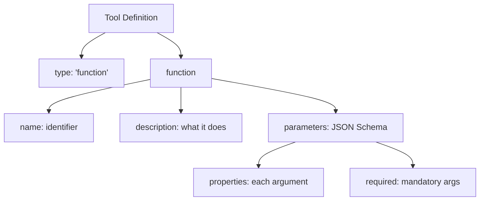

# Lesson 7.16: Tool Definitions

> **Duration**: 35 min | **Section**: C - Function Calling

## 📍 Where We Are

You understand the flow of function calling. Now let's master tool definitions — the JSON schema that tells the LLM what functions are available and how to use them.

---

## 🏗️ Anatomy of a Tool Definition

```python
{
    "type": "function",          # Always "function"
    "function": {
        "name": "get_weather",   # Function identifier
        "description": "...",    # What it does (crucial!)
        "parameters": {          # JSON Schema for args
            "type": "object",
            "properties": {...},
            "required": [...]
        }
    }
}
```



---

## 📝 Name: The Function Identifier

Keep it:
- Descriptive but concise
- snake_case (convention)
- Action-oriented

```python
# ✅ Good names
"get_weather"
"send_email"
"search_database"
"calculate_shipping_cost"

# ❌ Bad names
"weather"        # Not an action
"doStuff"        # Not descriptive
"function1"      # Meaningless
"getWeatherDataFromAPIAndFormat"  # Too long
```

---

## 📝 Description: The Most Important Part

The description tells the LLM **when** to use this tool.

### Bad Description

```python
{
    "name": "get_weather",
    "description": "Gets weather"  # Too vague!
}
```

### Good Description

```python
{
    "name": "get_weather",
    "description": "Get the current weather conditions for a specific city. Returns temperature, humidity, and weather conditions (sunny, cloudy, rainy, etc.). Use this when the user asks about current weather, temperature, or if they should bring an umbrella."
}
```

### What to Include in Descriptions

| Include | Example |
|---------|---------|
| What it returns | "Returns temperature in Celsius and conditions" |
| When to use it | "Use when user asks about weather" |
| Limitations | "Only supports major cities" |
| Format hints | "Location should be 'City, Country'" |

---

## 📝 Parameters: JSON Schema

Parameters use JSON Schema syntax:

```python
"parameters": {
    "type": "object",
    "properties": {
        "param_name": {
            "type": "string",
            "description": "What this parameter is for"
        }
    },
    "required": ["param_name"]
}
```

### Common Types

| Type | Example Values |
|------|---------------|
| `string` | `"hello"`, `"Tokyo"` |
| `number` | `42`, `3.14` |
| `integer` | `1`, `100` |
| `boolean` | `true`, `false` |
| `array` | `["a", "b", "c"]` |
| `object` | `{"key": "value"}` |

---

## 🔧 Real-World Examples

### Example 1: Weather API

```python
{
    "type": "function",
    "function": {
        "name": "get_weather",
        "description": "Get current weather for a city. Returns temperature, humidity, and conditions. Supports major cities worldwide.",
        "parameters": {
            "type": "object",
            "properties": {
                "city": {
                    "type": "string",
                    "description": "City name, e.g., 'London' or 'New York'"
                },
                "units": {
                    "type": "string",
                    "enum": ["celsius", "fahrenheit"],
                    "description": "Temperature units. Defaults to celsius."
                }
            },
            "required": ["city"]
        }
    }
}
```

### Example 2: Database Query

```python
{
    "type": "function",
    "function": {
        "name": "query_users",
        "description": "Search for users in the database. Returns user ID, name, email, and signup date.",
        "parameters": {
            "type": "object",
            "properties": {
                "name": {
                    "type": "string",
                    "description": "Filter by name (partial match)"
                },
                "email": {
                    "type": "string",
                    "description": "Filter by email (exact match)"
                },
                "status": {
                    "type": "string",
                    "enum": ["active", "inactive", "pending"],
                    "description": "Filter by account status"
                },
                "limit": {
                    "type": "integer",
                    "description": "Max results to return (default: 10)"
                }
            },
            "required": []
        }
    }
}
```

### Example 3: Send Email

```python
{
    "type": "function",
    "function": {
        "name": "send_email",
        "description": "Send an email to one or more recipients. Supports plain text and HTML content.",
        "parameters": {
            "type": "object",
            "properties": {
                "to": {
                    "type": "array",
                    "items": {"type": "string"},
                    "description": "List of recipient email addresses"
                },
                "subject": {
                    "type": "string",
                    "description": "Email subject line"
                },
                "body": {
                    "type": "string",
                    "description": "Email body content"
                },
                "html": {
                    "type": "boolean",
                    "description": "If true, body is treated as HTML"
                }
            },
            "required": ["to", "subject", "body"]
        }
    }
}
```

### Example 4: Calculator

```python
{
    "type": "function",
    "function": {
        "name": "calculate",
        "description": "Perform mathematical calculations. Use for precise arithmetic when needed.",
        "parameters": {
            "type": "object",
            "properties": {
                "expression": {
                    "type": "string",
                    "description": "Mathematical expression to evaluate, e.g., '2 + 3 * 4'"
                }
            },
            "required": ["expression"]
        }
    }
}
```

---

## 📊 Advanced Schema Features

### Enum: Restrict to Specific Values

```python
"status": {
    "type": "string",
    "enum": ["pending", "approved", "rejected"],
    "description": "Order status"
}
```

### Array: List of Items

```python
"tags": {
    "type": "array",
    "items": {"type": "string"},
    "description": "List of tags to apply"
}
```

### Nested Object

```python
"address": {
    "type": "object",
    "properties": {
        "street": {"type": "string"},
        "city": {"type": "string"},
        "zip": {"type": "string"}
    },
    "required": ["street", "city"]
}
```

### Multiple Types

```python
"value": {
    "type": ["string", "number"],  # Can be either
    "description": "Value to set (string or number)"
}
```

---

## 🎯 Best Practices

### 1. Write Descriptions for the LLM

```python
# ❌ Written for humans (assumes context)
"description": "Gets the data"

# ✅ Written for LLM (complete context)
"description": "Retrieves user profile data including name, email, and preferences. Use when the user asks about their account details or settings."
```

### 2. Include Examples in Descriptions

```python
"city": {
    "type": "string",
    "description": "City name, e.g., 'Tokyo', 'New York, NY', 'London, UK'"
}
```

### 3. Use Enums When Possible

```python
# ❌ Open-ended (LLM might hallucinate values)
"priority": {
    "type": "string",
    "description": "Task priority level"
}

# ✅ Constrained (LLM can only pick valid values)
"priority": {
    "type": "string",
    "enum": ["low", "medium", "high", "urgent"],
    "description": "Task priority level"
}
```

### 4. Make Optional Parameters Obvious

```python
"parameters": {
    "type": "object",
    "properties": {
        "query": {
            "type": "string",
            "description": "Search query (required)"
        },
        "limit": {
            "type": "integer",
            "description": "Max results (optional, default: 10)"
        }
    },
    "required": ["query"]  # Only query is required
}
```

---

## 🔄 Pydantic to Tool Definition

If you're using Pydantic models, convert them to tool definitions:

```python
from pydantic import BaseModel, Field
from typing import Literal
import json

class WeatherRequest(BaseModel):
    """Request parameters for weather lookup."""
    city: str = Field(description="City name, e.g., 'Tokyo'")
    units: Literal["celsius", "fahrenheit"] = Field(
        default="celsius",
        description="Temperature units"
    )

def pydantic_to_tool(name: str, model: type[BaseModel]) -> dict:
    """Convert Pydantic model to OpenAI tool definition."""
    return {
        "type": "function",
        "function": {
            "name": name,
            "description": model.__doc__ or "",
            "parameters": model.model_json_schema()
        }
    }

# Generate tool definition
tool = pydantic_to_tool("get_weather", WeatherRequest)
print(json.dumps(tool, indent=2))
```

---

## ⚠️ Common Mistakes

### Mistake 1: Missing Required Field

```python
# ❌ Forgot "required" - all params look optional
"parameters": {
    "type": "object",
    "properties": {
        "query": {"type": "string"}
    }
    # Missing: "required": ["query"]
}
```

### Mistake 2: Vague Descriptions

```python
# ❌ Too vague
"description": "Search for things"

# ✅ Specific
"description": "Search products by name, category, or price range. Returns matching products with name, price, and availability."
```

### Mistake 3: Wrong Type in JSON Schema

```python
# ❌ "str" is Python, not JSON Schema
"city": {"type": "str"}

# ✅ JSON Schema uses "string"
"city": {"type": "string"}
```

---

## 🧪 Practice: Design Your Tools

```python
# Create tools for a task management app

tools = [
    {
        "type": "function",
        "function": {
            "name": "create_task",
            "description": "Create a new task in the user's task list. Returns the created task with its ID.",
            "parameters": {
                "type": "object",
                "properties": {
                    "title": {
                        "type": "string",
                        "description": "Task title/name"
                    },
                    "description": {
                        "type": "string",
                        "description": "Detailed task description (optional)"
                    },
                    "due_date": {
                        "type": "string",
                        "description": "Due date in YYYY-MM-DD format (optional)"
                    },
                    "priority": {
                        "type": "string",
                        "enum": ["low", "medium", "high"],
                        "description": "Task priority (default: medium)"
                    }
                },
                "required": ["title"]
            }
        }
    },
    {
        "type": "function",
        "function": {
            "name": "list_tasks",
            "description": "Get all tasks, optionally filtered by status or priority.",
            "parameters": {
                "type": "object",
                "properties": {
                    "status": {
                        "type": "string",
                        "enum": ["pending", "completed", "all"],
                        "description": "Filter by status (default: all)"
                    },
                    "priority": {
                        "type": "string",
                        "enum": ["low", "medium", "high"],
                        "description": "Filter by priority (optional)"
                    }
                },
                "required": []
            }
        }
    },
    {
        "type": "function",
        "function": {
            "name": "complete_task",
            "description": "Mark a task as completed by its ID.",
            "parameters": {
                "type": "object",
                "properties": {
                    "task_id": {
                        "type": "integer",
                        "description": "The ID of the task to complete"
                    }
                },
                "required": ["task_id"]
            }
        }
    }
]
```

---

## 🔑 Key Takeaways

| Element | Best Practice |
|---------|--------------|
| name | Action verb + noun (`get_weather`) |
| description | Complete, with when-to-use guidance |
| properties | Each param needs type + description |
| required | List mandatory parameters |
| enum | Use when values are limited |
| examples | Include in descriptions |

---

**Next**: [Lesson 7.17: Parallel Tool Calls](./Lesson-17-Parallel-Tool-Calls.md) — When the LLM wants to call multiple tools at once.
