# Lesson 7.17: Parallel Tool Calls

> **Duration**: 25 min | **Section**: C - Function Calling

## 📍 Where We Are

You can define tools and handle single function calls. But what happens when the user asks something that needs multiple tools?

```
"What's the weather in Tokyo AND London?"
```

The LLM doesn't call one function at a time — it calls both **in parallel**.

---

## 🔄 The Parallel Call Flow

```mermaid
sequenceDiagram
    participant User
    participant App
    participant LLM as OpenAI
    participant F1 as get_weather(Tokyo)
    participant F2 as get_weather(London)
    
    User->>App: "Weather in Tokyo and London?"
    App->>LLM: Request
    LLM-->>App: tool_calls: [get_weather(Tokyo), get_weather(London)]
    
    par Execute in parallel
        App->>F1: Call
        F1-->>App: Result 1
    and
        App->>F2: Call
        F2-->>App: Result 2
    end
    
    App->>LLM: [tool_result_1, tool_result_2]
    LLM-->>App: "Tokyo is 22°C, London is 15°C"
```



---

## 📋 What Parallel Calls Look Like

```python
# Response when LLM wants multiple tools
response.choices[0].message.tool_calls = [
    {
        "id": "call_abc123",
        "type": "function",
        "function": {
            "name": "get_weather",
            "arguments": '{"city": "Tokyo"}'
        }
    },
    {
        "id": "call_def456",  # Different ID!
        "type": "function",
        "function": {
            "name": "get_weather",
            "arguments": '{"city": "London"}'
        }
    }
]
```

**Key insight**: Each call has a unique `id`. You must send back results with matching IDs.

---

## 🔧 Handling Multiple Tool Calls

```python
from openai import OpenAI
import json

client = OpenAI()

def get_weather(city: str) -> dict:
    """Fake weather function."""
    data = {
        "Tokyo": {"temp": 22, "condition": "sunny"},
        "London": {"temp": 15, "condition": "rainy"},
        "Paris": {"temp": 18, "condition": "cloudy"}
    }
    return data.get(city, {"temp": 20, "condition": "unknown"})

available_functions = {
    "get_weather": get_weather
}

tools = [
    {
        "type": "function",
        "function": {
            "name": "get_weather",
            "description": "Get weather for a city",
            "parameters": {
                "type": "object",
                "properties": {
                    "city": {"type": "string", "description": "City name"}
                },
                "required": ["city"]
            }
        }
    }
]

def chat_with_parallel_tools(user_message: str) -> str:
    """Handle multiple tool calls."""
    
    messages = [{"role": "user", "content": user_message}]
    
    response = client.chat.completions.create(
        model="gpt-4o-mini",
        messages=messages,
        tools=tools
    )
    
    message = response.choices[0].message
    
    if message.tool_calls:
        # Add assistant message first
        messages.append(message)
        
        # Process ALL tool calls
        for tool_call in message.tool_calls:
            function_name = tool_call.function.name
            function_args = json.loads(tool_call.function.arguments)
            
            # Execute the function
            result = available_functions[function_name](**function_args)
            
            # Add result with matching ID
            messages.append({
                "role": "tool",
                "tool_call_id": tool_call.id,
                "content": json.dumps(result)
            })
        
        # Get final response
        final_response = client.chat.completions.create(
            model="gpt-4o-mini",
            messages=messages,
            tools=tools
        )
        
        return final_response.choices[0].message.content
    
    return message.content

# Test it
print(chat_with_parallel_tools("What's the weather in Tokyo and London?"))
# "Tokyo is 22°C and sunny. London is 15°C and rainy."
```

---

## 📊 Message Structure with Parallel Calls

```mermaid
flowchart TD
    subgraph Messages Array
        U["user: 'Weather in Tokyo and London?'"]
        A["assistant: (2 tool_calls)"]
        T1["tool: (id: abc123) Tokyo result"]
        T2["tool: (id: def456) London result"]
        F["assistant: 'Tokyo is 22°C...'"]
    end
    
    U --> A --> T1 --> T2 --> F
```



**Important**: Order of tool results doesn't matter — the `tool_call_id` links them correctly.

---

## 🔄 Actually Running in Parallel

The example above runs functions sequentially. For true parallelism:

### Using concurrent.futures

```python
from concurrent.futures import ThreadPoolExecutor, as_completed
import json

def process_tool_calls_parallel(tool_calls: list) -> list:
    """Execute multiple tool calls in parallel."""
    
    results = []
    
    with ThreadPoolExecutor(max_workers=5) as executor:
        # Submit all tasks
        future_to_call = {
            executor.submit(
                available_functions[tc.function.name],
                **json.loads(tc.function.arguments)
            ): tc
            for tc in tool_calls
        }
        
        # Collect results as they complete
        for future in as_completed(future_to_call):
            tool_call = future_to_call[future]
            result = future.result()
            
            results.append({
                "role": "tool",
                "tool_call_id": tool_call.id,
                "content": json.dumps(result)
            })
    
    return results
```

### Using asyncio

```python
import asyncio
from openai import AsyncOpenAI

async def process_tool_calls_async(tool_calls: list) -> list:
    """Execute tool calls using asyncio."""
    
    async def execute_one(tool_call):
        function_name = tool_call.function.name
        function_args = json.loads(tool_call.function.arguments)
        
        # Assume async version of function
        result = await async_functions[function_name](**function_args)
        
        return {
            "role": "tool",
            "tool_call_id": tool_call.id,
            "content": json.dumps(result)
        }
    
    # Run all in parallel
    results = await asyncio.gather(*[
        execute_one(tc) for tc in tool_calls
    ])
    
    return list(results)
```

---

## 🎯 Mixed Tool Types

The LLM can call different tools in parallel:

```python
tools = [
    {
        "type": "function",
        "function": {
            "name": "get_weather",
            "description": "Get weather for a city",
            "parameters": {...}
        }
    },
    {
        "type": "function",
        "function": {
            "name": "get_stock_price",
            "description": "Get current stock price",
            "parameters": {...}
        }
    }
]

# User: "What's the weather in NYC and the price of AAPL?"
# LLM returns:
tool_calls = [
    {"name": "get_weather", "arguments": {"city": "NYC"}},
    {"name": "get_stock_price", "arguments": {"symbol": "AAPL"}}
]
```

---

## ⚠️ Common Mistakes

### Mistake 1: Missing Tool Results

```python
# ❌ Only sending one result when there were two calls
messages.append({
    "role": "tool",
    "tool_call_id": tool_calls[0].id,
    "content": json.dumps(result1)
})
# Missing result for tool_calls[1]!

# ✅ Send ALL results
for tool_call in message.tool_calls:
    result = execute_function(tool_call)
    messages.append({
        "role": "tool",
        "tool_call_id": tool_call.id,
        "content": json.dumps(result)
    })
```

### Mistake 2: Mismatched IDs

```python
# ❌ IDs don't match
messages.append({
    "role": "tool",
    "tool_call_id": "wrong_id",  # Not from actual call
    "content": "..."
})

# ✅ Always use the ID from the tool_call
messages.append({
    "role": "tool",
    "tool_call_id": tool_call.id,  # From response
    "content": "..."
})
```

### Mistake 3: Assuming One Tool Call

```python
# ❌ Only handling first tool call
tool_call = message.tool_calls[0]  # What about [1], [2]...?

# ✅ Loop through all
for tool_call in message.tool_calls:
    # Handle each one
```

---

## 🔧 Controlling Parallel Behavior

You can control whether the LLM uses parallel calls:

```python
response = client.chat.completions.create(
    model="gpt-4o-mini",
    messages=messages,
    tools=tools,
    parallel_tool_calls=False  # Force sequential (one at a time)
)
```

When to disable parallel calls:
- Tools have dependencies on each other
- You need strict ordering
- Simpler debugging

---

## 🧪 Practice: Multi-Tool Assistant

```python
from openai import OpenAI
import json

client = OpenAI()

# Multiple tools
tools = [
    {
        "type": "function",
        "function": {
            "name": "get_weather",
            "description": "Get weather for a city",
            "parameters": {
                "type": "object",
                "properties": {
                    "city": {"type": "string"}
                },
                "required": ["city"]
            }
        }
    },
    {
        "type": "function",
        "function": {
            "name": "get_time",
            "description": "Get current time in a timezone",
            "parameters": {
                "type": "object",
                "properties": {
                    "timezone": {"type": "string", "description": "e.g., 'Asia/Tokyo'"}
                },
                "required": ["timezone"]
            }
        }
    }
]

def get_weather(city: str) -> dict:
    return {"city": city, "temp": 22, "condition": "sunny"}

def get_time(timezone: str) -> dict:
    from datetime import datetime
    import pytz
    try:
        tz = pytz.timezone(timezone)
        return {"timezone": timezone, "time": datetime.now(tz).strftime("%H:%M")}
    except:
        return {"timezone": timezone, "time": "unknown"}

functions = {
    "get_weather": get_weather,
    "get_time": get_time
}

def multi_tool_chat(query: str) -> str:
    messages = [{"role": "user", "content": query}]
    
    response = client.chat.completions.create(
        model="gpt-4o-mini",
        messages=messages,
        tools=tools
    )
    
    message = response.choices[0].message
    
    if message.tool_calls:
        messages.append(message)
        
        for tc in message.tool_calls:
            result = functions[tc.function.name](
                **json.loads(tc.function.arguments)
            )
            messages.append({
                "role": "tool",
                "tool_call_id": tc.id,
                "content": json.dumps(result)
            })
        
        final = client.chat.completions.create(
            model="gpt-4o-mini",
            messages=messages,
            tools=tools
        )
        return final.choices[0].message.content
    
    return message.content

# Test
print(multi_tool_chat("Weather in Tokyo and time there?"))
# Uses both tools in parallel!
```

---

## 🔑 Key Takeaways

| Concept | Key Point |
|---------|-----------|
| Parallel calls | LLM can request multiple tools at once |
| `tool_call.id` | Unique ID links each call to its result |
| All results required | Must send back ALL tool results |
| Order doesn't matter | IDs handle matching, not order |
| True parallelism | Use ThreadPool or asyncio for speed |
| Control | `parallel_tool_calls=False` to disable |

---

**Next**: [Lesson 7.18: Function Calling Q&A](./Lesson-18-Function-Calling-QA.md) — Common questions about function calling.
