# Lesson 7.18: Function Calling Q&A

> **Duration**: 15 min | **Section**: C - Function Calling

## 📍 Section C Recap

You've learned:
- ✅ Why function calling exists (LLMs need "hands")
- ✅ The complete flow (two API calls)
- ✅ Writing effective tool definitions
- ✅ Handling parallel tool calls

Now let's address common questions.

---

## ❓ When & Why

### Q: When should I use function calling vs just prompting?

| Use Function Calling | Use Prompting |
|---------------------|---------------|
| Need real-time data (weather, stocks) | Static information |
| Need to take actions (send email, update DB) | Just generating text |
| Need structured output | Free-form responses |
| Need external API access | LLM knowledge is sufficient |

### Q: Can the LLM actually call functions?

**No.** The LLM generates a *request* to call a function. Your code:
1. Receives the request
2. Actually executes the function
3. Sends the result back

The LLM never runs code directly.

### Q: What if the LLM calls a function that doesn't exist?

If you pass a `tools` array, the LLM can only pick from those tools. It can't hallucinate new ones.

```python
tools = [{"type": "function", "function": {"name": "get_weather", ...}}]
# LLM can only request "get_weather", nothing else
```

---

## ❓ Tool Definitions

### Q: How many tools can I define?

Technically hundreds, but:
- More tools = more tokens = higher cost
- More tools = harder for LLM to choose correctly
- Recommended: 10-20 well-defined tools max

### Q: Do tool definitions count against context limit?

**Yes.** Tools are converted to text in the system prompt. Each tool uses roughly 50-200 tokens depending on complexity.

```python
# Rough token estimate for tools
tokens_per_tool = 100  # Average
total_tool_tokens = len(tools) * tokens_per_tool
```

### Q: How do I make the LLM prefer one tool over another?

Improve the **description**:

```python
# Make it clear when to use this tool
{
    "name": "search_web",
    "description": "Search the web for current information. ALWAYS use this when the user asks about recent events, news, or needs up-to-date information that might have changed since your training."
}
```

---

## ❓ Execution & Results

### Q: What if my function raises an error?

Send the error as the result:

```python
try:
    result = my_function(**args)
except Exception as e:
    result = {"error": str(e)}

messages.append({
    "role": "tool",
    "tool_call_id": tool_call.id,
    "content": json.dumps(result)
})
```

The LLM will see the error and can respond appropriately (apologize, try again, ask for clarification).

### Q: What if the function takes a long time?

Options:
1. **Timeout**: Set a limit and return error if exceeded
2. **Async**: Use async functions
3. **Streaming**: Keep connection alive while processing

```python
import asyncio

async def slow_function_with_timeout():
    try:
        result = await asyncio.wait_for(slow_function(), timeout=10.0)
    except asyncio.TimeoutError:
        result = {"error": "Request timed out"}
    return result
```

### Q: What should I return from my function?

Return useful information for the LLM to use:

```python
# ❌ Too little
return True

# ❌ Too much (wastes tokens)
return entire_database_dump

# ✅ Just right
return {
    "success": True,
    "weather": "sunny",
    "temperature": 22,
    "unit": "celsius"
}
```

---

## ❓ Advanced Patterns

### Q: Can the LLM call tools multiple times in a conversation?

**Yes.** The LLM can request tools on any turn:

```mermaid
flowchart LR
    U1["User: Weather in Tokyo?"] --> A1["Tool: get_weather"]
    A1 --> R1["Result: 22°C"]
    R1 --> U2["User: And London?"]
    U2 --> A2["Tool: get_weather"]
    A2 --> R2["Result: 15°C"]
```



### Q: How do I force the LLM to use a specific tool?

Use `tool_choice`:

```python
response = client.chat.completions.create(
    model="gpt-4o-mini",
    messages=messages,
    tools=tools,
    tool_choice={"type": "function", "function": {"name": "get_weather"}}
)
```

Options for `tool_choice`:
- `"auto"` — LLM decides (default)
- `"none"` — Never use tools
- `"required"` — Must use a tool (any tool)
- `{"type": "function", "function": {"name": "..."}}` — Specific tool

### Q: Can I chain function calls?

Yes, by making multiple API roundtrips:

```python
# Tool 1: Search for user
# Tool 2: Get user's orders (needs user_id from Tool 1)
# Tool 3: Calculate total (needs orders from Tool 2)

def chat_with_chained_tools(query):
    messages = [{"role": "user", "content": query}]
    
    while True:
        response = client.chat.completions.create(
            model="gpt-4o-mini",
            messages=messages,
            tools=tools
        )
        
        message = response.choices[0].message
        
        if not message.tool_calls:
            # No more tools needed - return final response
            return message.content
        
        # Process tool calls
        messages.append(message)
        for tool_call in message.tool_calls:
            result = execute(tool_call)
            messages.append({
                "role": "tool",
                "tool_call_id": tool_call.id,
                "content": json.dumps(result)
            })
        
        # Loop continues - LLM might need more tools
```

---

## ❓ Security

### Q: Can the LLM be tricked into calling dangerous functions?

**Yes, if you let it.** Mitigations:

1. **Validate arguments** before executing
2. **Limit tool capabilities** (read-only tools for untrusted users)
3. **Require confirmation** for dangerous actions
4. **Sanitize inputs** to prevent injection

```python
def delete_file(path: str):
    # Validate before executing
    if not path.startswith("/safe/directory/"):
        return {"error": "Access denied"}
    
    if ".." in path:
        return {"error": "Invalid path"}
    
    # Safe to proceed
    os.remove(path)
    return {"success": True}
```

### Q: How do I handle sensitive data in tool results?

- Don't log full results in production
- Mask sensitive fields before returning
- Use environment variables for secrets

```python
def get_user_data(user_id: str):
    user = db.get(user_id)
    
    # Don't expose everything
    return {
        "name": user.name,
        "email": user.email,
        # "password": user.password,  # Never!
        # "ssn": user.ssn,  # Never!
    }
```

---

## ❓ Debugging

### Q: How do I debug function calling issues?

```python
def debug_tool_call(response):
    message = response.choices[0].message
    
    print("=== DEBUG ===")
    print(f"Content: {message.content}")
    print(f"Tool calls: {message.tool_calls}")
    
    if message.tool_calls:
        for tc in message.tool_calls:
            print(f"  Function: {tc.function.name}")
            print(f"  Args: {tc.function.arguments}")
            print(f"  ID: {tc.id}")
    print("=============")
```

### Q: Why isn't the LLM using my tool?

Check:
1. **Description** — Is it clear when to use this tool?
2. **User prompt** — Does it match the tool's purpose?
3. **Competing tools** — Is another tool a better match?
4. **Model capability** — Not all models support tools

```python
# Add logging
print(f"User asked: {user_message}")
print(f"Available tools: {[t['function']['name'] for t in tools]}")
```

---

## 💥 Common Pitfalls

| Pitfall | Why It Happens | Fix |
|---------|---------------|-----|
| Thinking LLM executes functions | Name is misleading | LLM only generates JSON request; YOU execute the function |
| Vague tool descriptions | Seems obvious to you | Be explicit about when to use each tool; examples help |
| Not validating arguments | Trusting LLM output | Always validate args before execution; LLM can hallucinate values |
| Too many tools | More options = better? | 10-20 tools max; too many confuses the model and costs tokens |
| Returning huge results | Function worked, send it all | Return only what LLM needs; large results waste tokens |
| No error handling in tools | Happy path focus | Return errors as results; LLM can recover gracefully |

## 🔑 Key Takeaways

1. **Two-call flow** — First call gets tool request, you execute, second call gets final response
2. **LLM doesn't execute** — It only generates structured JSON; your code runs the actual function
3. **Tool definitions cost tokens** — Each tool is ~100 tokens; keep descriptions concise
4. **Use `tool_choice`** — `"auto"` (default), `"none"`, `"required"`, or specific function name
5. **Validate everything** — Sanitize inputs, validate arguments, handle errors gracefully
6. **Return useful results** — Include enough context for LLM to form a good response

---

## 🎯 Quick Reference

| Issue | Solution |
|-------|----------|
| LLM not using tool | Improve description |
| Wrong tool chosen | Make descriptions more specific |
| Function error | Return error as result |
| Too slow | Add timeout, use async |
| Security concern | Validate all inputs |
| Debugging | Log tool_calls before execution |

---

## 🔑 Section C Complete!

You now know:
- ✅ How function calling enables LLM actions
- ✅ The two-call flow (request → execute → respond)
- ✅ Writing effective tool definitions
- ✅ Handling parallel and chained calls
- ✅ Security and debugging patterns

---

**Next**: [Lesson 7.19: The Multi-Provider Problem](./Lesson-19-The-Multi-Provider-Problem.md) — Section D begins: Claude, Anthropic, and working with multiple LLM providers.
