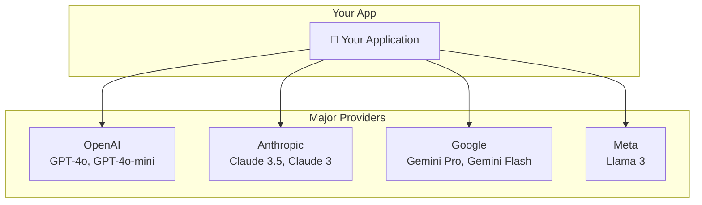

# Lesson 7.19: The Multi-Provider Problem

> **Duration**: 5 min | **Section**: D - Claude & Production | **Type**: Section Intro

---

## 🎭 The Situation

You've built an app with OpenAI. It works great. Then:

- **Cost concerns**: "GPT-4o is too expensive for this use case"
- **Performance needs**: "Claude is better at this specific task"
- **Reliability**: "OpenAI is down, we need a fallback"
- **Compliance**: "We need to use a specific provider for EU data"

---

## 🏢 The LLM Landscape



Each provider has:
- Different APIs
- Different pricing
- Different strengths
- Different rate limits

---

## 📊 When to Use What

| Provider | Best For |
|----------|----------|
| **OpenAI GPT-4o** | General purpose, broad knowledge |
| **OpenAI GPT-4o-mini** | Cost-effective, good enough for many tasks |
| **Claude 3.5 Sonnet** | Long documents, careful reasoning, coding |
| **Claude 3 Haiku** | Fast, cheap, good for simple tasks |
| **Gemini** | Google ecosystem, multimodal |
| **Llama** | Self-hosted, privacy requirements |

---

## 🧩 What You'll Learn in Section D

| Lesson | Topic |
|--------|-------|
| 7.20 | Claude API setup and differences |
| 7.21 | Building a multi-provider abstraction |
| 7.22 | Error handling and retries |
| 7.23 | Cost optimization strategies |
| 7.24 | Production Q&A |

---

## 🔑 The Key Insight

> **Don't lock yourself into one provider.** Build abstractions that let you switch.

```python
# Bad: Hardcoded to OpenAI
response = openai_client.chat.completions.create(...)

# Good: Abstracted
response = llm.complete(messages, model="gpt-4o-mini")
# or
response = llm.complete(messages, model="claude-3-sonnet")
```

---

**Next**: [Lesson 7.20: Claude API](./Lesson-20-Claude-API.md) — Setting up and using Anthropic's Claude.
