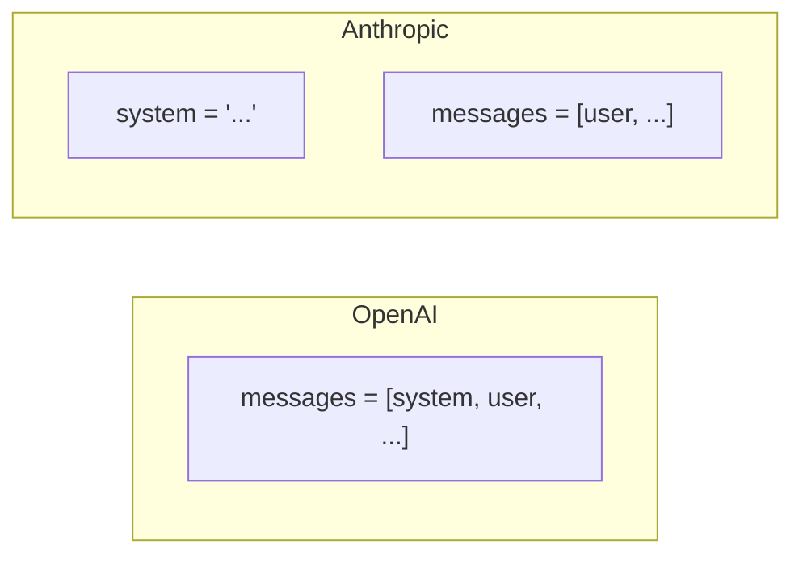

# Lesson 7.20: Claude API

> **Duration**: 35 min | **Section**: D - Claude & Production

## 📍 Where We Are

You know OpenAI. Now let's learn Anthropic's Claude API — setup, differences, and when to prefer it over OpenAI.

---

## 🔧 Setup

### Install the SDK

```bash
pip install anthropic
```

### Get an API Key

1. Go to [console.anthropic.com](https://console.anthropic.com)
2. Sign up or log in
3. Create an API key
4. Set environment variable:

```bash
export ANTHROPIC_API_KEY="sk-ant-..."
```

Or in `.env`:
```
ANTHROPIC_API_KEY=sk-ant-...
```

---

## 📝 Your First Claude Call

```python
from anthropic import Anthropic

client = Anthropic()

message = client.messages.create(
    model="claude-sonnet-4-20250514",
    max_tokens=1024,
    messages=[
        {"role": "user", "content": "Hello, Claude!"}
    ]
)

print(message.content[0].text)
```

---

## 📊 OpenAI vs Anthropic: Syntax Comparison

| Aspect | OpenAI | Anthropic |
|--------|--------|-----------|
| Client | `OpenAI()` | `Anthropic()` |
| Method | `.chat.completions.create()` | `.messages.create()` |
| Response content | `.choices[0].message.content` | `.content[0].text` |
| System prompt | In messages array | Separate `system` parameter |
| Max tokens | Optional | **Required** |

---

## 🔄 Side-by-Side Code

### OpenAI

```python
from openai import OpenAI

client = OpenAI()

response = client.chat.completions.create(
    model="gpt-4o-mini",
    messages=[
        {"role": "system", "content": "You are a helpful assistant."},
        {"role": "user", "content": "Hello!"}
    ],
    max_tokens=1024  # Optional
)

print(response.choices[0].message.content)
```

### Anthropic

```python
from anthropic import Anthropic

client = Anthropic()

response = client.messages.create(
    model="claude-sonnet-4-20250514",
    system="You are a helpful assistant.",  # Separate parameter!
    messages=[
        {"role": "user", "content": "Hello!"}
    ],
    max_tokens=1024  # Required!
)

print(response.content[0].text)
```

---

## 📋 Claude Models

| Model | Use Case | Context | Speed |
|-------|----------|---------|-------|
| `claude-sonnet-4-20250514` | Best balance of intelligence and speed | 200K | Fast |
| `claude-3-5-sonnet-20241022` | Previous generation Sonnet | 200K | Fast |
| `claude-3-5-haiku-20241022` | Fast and cheap | 200K | Fastest |
| `claude-3-opus-20240229` | Most capable (older) | 200K | Slower |

**Recommendation**: Start with `claude-sonnet-4-20250514` for most tasks.

---

## 🎯 System Prompt Difference

Claude handles system prompts differently:

### OpenAI: System in Messages

```python
messages = [
    {"role": "system", "content": "You are a pirate."},
    {"role": "user", "content": "Hello!"}
]
```

### Claude: Separate System Parameter

```python
response = client.messages.create(
    model="claude-sonnet-4-20250514",
    system="You are a pirate.",  # Not in messages!
    messages=[
        {"role": "user", "content": "Hello!"}
    ],
    max_tokens=1024
)
```



---

## 📤 Response Structure

### OpenAI Response

```python
{
    "choices": [
        {
            "message": {
                "role": "assistant",
                "content": "Hello!"
            },
            "finish_reason": "stop"
        }
    ],
    "usage": {
        "prompt_tokens": 10,
        "completion_tokens": 5,
        "total_tokens": 15
    }
}
```

### Claude Response

```python
{
    "id": "msg_abc123",
    "type": "message",
    "role": "assistant",
    "content": [
        {
            "type": "text",
            "text": "Hello!"
        }
    ],
    "stop_reason": "end_turn",
    "usage": {
        "input_tokens": 10,
        "output_tokens": 5
    }
}
```

**Key difference**: Claude's content is an array (can contain multiple blocks).

---

## 🔧 Tool Use in Claude

Claude also supports function calling (called "tool use"):

```python
from anthropic import Anthropic
import json

client = Anthropic()

tools = [
    {
        "name": "get_weather",
        "description": "Get current weather for a city",
        "input_schema": {
            "type": "object",
            "properties": {
                "city": {
                    "type": "string",
                    "description": "City name"
                }
            },
            "required": ["city"]
        }
    }
]

response = client.messages.create(
    model="claude-sonnet-4-20250514",
    max_tokens=1024,
    tools=tools,
    messages=[
        {"role": "user", "content": "What's the weather in Tokyo?"}
    ]
)

# Check for tool use
for block in response.content:
    if block.type == "tool_use":
        print(f"Tool: {block.name}")
        print(f"Input: {block.input}")
        print(f"ID: {block.id}")
```

### Tool Definition Differences

| Aspect | OpenAI | Claude |
|--------|--------|--------|
| Schema key | `parameters` | `input_schema` |
| Wrapper | `{"type": "function", "function": {...}}` | Direct object |
| Tool calls | `message.tool_calls` | Content block with `type: "tool_use"` |

---

## 🔄 Sending Tool Results to Claude

```python
# After getting tool_use response, execute function and send result

messages = [
    {"role": "user", "content": "What's the weather in Tokyo?"},
    {"role": "assistant", "content": response.content},  # Contains tool_use
    {
        "role": "user",
        "content": [
            {
                "type": "tool_result",
                "tool_use_id": block.id,  # From tool_use block
                "content": json.dumps({"temp": 22, "condition": "sunny"})
            }
        ]
    }
]

final_response = client.messages.create(
    model="claude-sonnet-4-20250514",
    max_tokens=1024,
    tools=tools,
    messages=messages
)

print(final_response.content[0].text)
```

---

## ⚡ Streaming with Claude

```python
from anthropic import Anthropic

client = Anthropic()

with client.messages.stream(
    model="claude-sonnet-4-20250514",
    max_tokens=1024,
    messages=[{"role": "user", "content": "Tell me a story"}]
) as stream:
    for text in stream.text_stream:
        print(text, end="", flush=True)

print()
```

---

## 📊 When to Choose Claude vs OpenAI

| Task | Prefer Claude | Prefer OpenAI |
|------|---------------|---------------|
| Long document analysis | ✅ 200K context, great at synthesis | |
| Code generation | ✅ Strong at code | ✅ Also strong |
| Following complex instructions | ✅ Very literal | |
| General chat | | ✅ More natural |
| Multi-modal (images) | ✅ Vision built-in | ✅ Vision available |
| Cost-sensitive | Claude Haiku ($) | GPT-4o-mini ($) |
| Maximum capability | Claude Sonnet | GPT-4o |

---

## 🧪 Practice: Convert OpenAI to Claude

```python
from anthropic import Anthropic

client = Anthropic()

def chat_with_claude(
    user_message: str,
    system_prompt: str = "You are a helpful assistant."
) -> str:
    """Chat using Claude API."""
    
    response = client.messages.create(
        model="claude-sonnet-4-20250514",
        system=system_prompt,
        max_tokens=1024,
        messages=[
            {"role": "user", "content": user_message}
        ]
    )
    
    return response.content[0].text

# Test it
print(chat_with_claude("What is Python?"))
print(chat_with_claude("Explain recursion", system_prompt="You are a CS teacher."))
```

---

## 🔑 Key Takeaways

| Aspect | Claude Difference |
|--------|-------------------|
| System prompt | Separate `system` parameter |
| Max tokens | Required, not optional |
| Response content | Array of blocks, access `.content[0].text` |
| Tool schema | Uses `input_schema` not `parameters` |
| Streaming | Use `.messages.stream()` context manager |

---

**Next**: [Lesson 7.21: Multi-Provider Abstraction](./Lesson-21-Multi-Provider-Abstraction.md) — Building a unified interface for multiple LLM providers.
