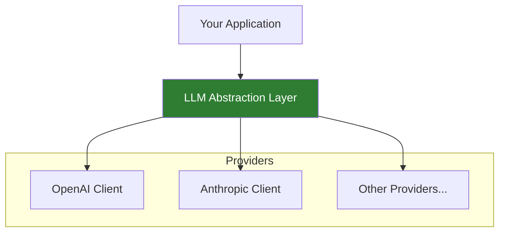

# Lesson 7.21: Multi-Provider Abstraction

> **Duration**: 35 min | **Section**: D - Claude & Production

## 📍 Where We Are

You know both OpenAI and Claude APIs. But each has different syntax. Let's build an abstraction layer that lets you switch providers without changing your code.

---

## 🎯 The Goal

```python
# Write once, use with any provider
response = llm.complete(
    messages=[{"role": "user", "content": "Hello!"}],
    model="gpt-4o-mini"  # or "claude-sonnet-4-20250514"
)
print(response.content)
```

---

## 🏗️ Architecture



---

## 📝 Step 1: Define a Common Response

```python
from dataclasses import dataclass
from typing import Optional

@dataclass
class LLMResponse:
    """Unified response format for all providers."""
    content: str
    model: str
    input_tokens: int
    output_tokens: int
    finish_reason: str
    raw_response: any  # Original provider response
    
    @property
    def total_tokens(self) -> int:
        return self.input_tokens + self.output_tokens
```

---

## 📝 Step 2: Define the Interface

```python
from abc import ABC, abstractmethod
from typing import Optional

class LLMProvider(ABC):
    """Abstract base class for LLM providers."""
    
    @abstractmethod
    def complete(
        self,
        messages: list[dict],
        model: str,
        system: Optional[str] = None,
        max_tokens: int = 1024,
        temperature: float = 1.0,
        **kwargs
    ) -> LLMResponse:
        """Generate a completion."""
        pass
    
    @abstractmethod
    def supports_model(self, model: str) -> bool:
        """Check if this provider supports the given model."""
        pass
```

---

## 📝 Step 3: Implement OpenAI Provider

```python
from openai import OpenAI

class OpenAIProvider(LLMProvider):
    """OpenAI implementation."""
    
    MODELS = ["gpt-4o", "gpt-4o-mini", "gpt-4-turbo", "gpt-3.5-turbo"]
    
    def __init__(self):
        self.client = OpenAI()
    
    def supports_model(self, model: str) -> bool:
        return any(model.startswith(m) for m in self.MODELS)
    
    def complete(
        self,
        messages: list[dict],
        model: str,
        system: Optional[str] = None,
        max_tokens: int = 1024,
        temperature: float = 1.0,
        **kwargs
    ) -> LLMResponse:
        # Add system message if provided
        if system:
            messages = [{"role": "system", "content": system}] + messages
        
        response = self.client.chat.completions.create(
            model=model,
            messages=messages,
            max_tokens=max_tokens,
            temperature=temperature,
            **kwargs
        )
        
        choice = response.choices[0]
        
        return LLMResponse(
            content=choice.message.content or "",
            model=response.model,
            input_tokens=response.usage.prompt_tokens,
            output_tokens=response.usage.completion_tokens,
            finish_reason=choice.finish_reason,
            raw_response=response
        )
```

---

## 📝 Step 4: Implement Anthropic Provider

```python
from anthropic import Anthropic

class AnthropicProvider(LLMProvider):
    """Anthropic Claude implementation."""
    
    MODELS = ["claude-sonnet-4-20250514", "claude-3-5-sonnet", "claude-3-5-haiku", "claude-3-opus"]
    
    def __init__(self):
        self.client = Anthropic()
    
    def supports_model(self, model: str) -> bool:
        return any(model.startswith(m) for m in self.MODELS)
    
    def complete(
        self,
        messages: list[dict],
        model: str,
        system: Optional[str] = None,
        max_tokens: int = 1024,
        temperature: float = 1.0,
        **kwargs
    ) -> LLMResponse:
        # Filter out system messages (handled separately)
        filtered_messages = [m for m in messages if m["role"] != "system"]
        
        # Build request
        request = {
            "model": model,
            "messages": filtered_messages,
            "max_tokens": max_tokens,
            "temperature": temperature,
            **kwargs
        }
        
        if system:
            request["system"] = system
        
        response = self.client.messages.create(**request)
        
        # Extract text from content blocks
        content = ""
        for block in response.content:
            if hasattr(block, "text"):
                content += block.text
        
        return LLMResponse(
            content=content,
            model=response.model,
            input_tokens=response.usage.input_tokens,
            output_tokens=response.usage.output_tokens,
            finish_reason=response.stop_reason or "unknown",
            raw_response=response
        )
```

---

## 📝 Step 5: Build the Unified Client

```python
class LLM:
    """Unified LLM client that routes to appropriate provider."""
    
    def __init__(self):
        self.providers: list[LLMProvider] = []
        self._register_defaults()
    
    def _register_defaults(self):
        """Register default providers."""
        try:
            self.providers.append(OpenAIProvider())
        except Exception:
            pass  # OpenAI not configured
        
        try:
            self.providers.append(AnthropicProvider())
        except Exception:
            pass  # Anthropic not configured
    
    def register(self, provider: LLMProvider):
        """Add a custom provider."""
        self.providers.append(provider)
    
    def _get_provider(self, model: str) -> LLMProvider:
        """Find provider that supports the model."""
        for provider in self.providers:
            if provider.supports_model(model):
                return provider
        raise ValueError(f"No provider found for model: {model}")
    
    def complete(
        self,
        messages: list[dict],
        model: str = "gpt-4o-mini",
        system: Optional[str] = None,
        max_tokens: int = 1024,
        temperature: float = 1.0,
        **kwargs
    ) -> LLMResponse:
        """Generate completion using appropriate provider."""
        provider = self._get_provider(model)
        return provider.complete(
            messages=messages,
            model=model,
            system=system,
            max_tokens=max_tokens,
            temperature=temperature,
            **kwargs
        )
```

---

## 🔧 Using the Unified Client

```python
# Initialize once
llm = LLM()

# Use with OpenAI
response = llm.complete(
    messages=[{"role": "user", "content": "Hello!"}],
    model="gpt-4o-mini"
)
print(f"OpenAI: {response.content}")
print(f"Tokens: {response.total_tokens}")

# Use with Claude - same interface!
response = llm.complete(
    messages=[{"role": "user", "content": "Hello!"}],
    model="claude-sonnet-4-20250514"
)
print(f"Claude: {response.content}")
print(f"Tokens: {response.total_tokens}")

# With system prompt
response = llm.complete(
    messages=[{"role": "user", "content": "Hello!"}],
    model="claude-sonnet-4-20250514",
    system="You are a pirate."
)
```

---

## 🔄 Fallback Pattern

```python
class LLM:
    # ... previous code ...
    
    def complete_with_fallback(
        self,
        messages: list[dict],
        models: list[str],
        **kwargs
    ) -> LLMResponse:
        """Try models in order until one works."""
        
        last_error = None
        
        for model in models:
            try:
                return self.complete(messages=messages, model=model, **kwargs)
            except Exception as e:
                last_error = e
                print(f"Model {model} failed: {e}, trying next...")
        
        raise last_error

# Usage
response = llm.complete_with_fallback(
    messages=[{"role": "user", "content": "Hello!"}],
    models=["gpt-4o", "claude-sonnet-4-20250514", "gpt-4o-mini"]
)
```

---

## 📊 Model Routing by Task

```python
class SmartLLM(LLM):
    """LLM that picks the best model for each task."""
    
    MODEL_PREFERENCES = {
        "code": ["claude-sonnet-4-20250514", "gpt-4o"],
        "creative": ["gpt-4o", "claude-sonnet-4-20250514"],
        "chat": ["gpt-4o-mini", "claude-3-5-haiku"],
        "analysis": ["claude-sonnet-4-20250514", "gpt-4o"],
    }
    
    def complete_for_task(
        self,
        messages: list[dict],
        task: str = "chat",
        **kwargs
    ) -> LLMResponse:
        """Use best model for the task type."""
        
        models = self.MODEL_PREFERENCES.get(task, ["gpt-4o-mini"])
        return self.complete_with_fallback(messages, models, **kwargs)

# Usage
smart_llm = SmartLLM()

# Will prefer Claude for code
response = smart_llm.complete_for_task(
    messages=[{"role": "user", "content": "Write a Python function"}],
    task="code"
)

# Will prefer GPT-4o-mini for chat
response = smart_llm.complete_for_task(
    messages=[{"role": "user", "content": "Hello!"}],
    task="chat"
)
```

---

## 🧩 Existing Libraries

Don't reinvent the wheel — use existing abstractions:

### LiteLLM

```python
# pip install litellm
from litellm import completion

# Works with 100+ models
response = completion(
    model="gpt-4o-mini",
    messages=[{"role": "user", "content": "Hello"}]
)

response = completion(
    model="claude-sonnet-4-20250514",
    messages=[{"role": "user", "content": "Hello"}]
)
```

### LangChain

```python
# pip install langchain langchain-openai langchain-anthropic
from langchain_openai import ChatOpenAI
from langchain_anthropic import ChatAnthropic

openai_llm = ChatOpenAI(model="gpt-4o-mini")
claude_llm = ChatAnthropic(model="claude-sonnet-4-20250514")

# Same interface
response = openai_llm.invoke("Hello!")
response = claude_llm.invoke("Hello!")
```

---

## 🔑 Key Takeaways

| Concept | Key Point |
|---------|-----------|
| Unified interface | Same code works with any provider |
| Provider detection | Auto-route based on model name |
| Fallback | Try multiple models if one fails |
| Task routing | Pick best model for the job |
| Libraries | LiteLLM, LangChain already solve this |

---

**Next**: [Lesson 7.22: Error Handling & Retries](./Lesson-22-Error-Handling-Retries.md) — Robust error handling for production LLM apps.
