```mermaid
flowchart LR
    A1["Attempt 1"] -->|Fail| W1["Wait 1s"]
    W1 --> A2["Attempt 2"]
    A2 -->|Fail| W2["Wait 2s"]
    W2 --> A3["Attempt 3"]
    A3 -->|Fail| W3["Wait 4s"]
    W3 --> A4["Attempt 4"]
    A4 -->|Fail| ERROR["Give Up"]
    
    A1 -->|Success| DONE["✓"]
    A2 -->|Success| DONE
    A3 -->|Success| DONE
    A4 -->|Success| DONE
    
    style DONE fill:#2E7D32,color:#fff
    style ERROR fill:#C62828,color:#fff
```

# Lesson 7.22: Error Handling & Retries

> **Duration**: 30 min | **Section**: D - Claude & Production

## 📍 Where We Are

Your LLM code works in development. But in production, things fail:
- Rate limits hit
- API goes down
- Network timeouts
- Invalid requests

Let's build robust error handling.

---

## 🔥 What Can Go Wrong

```mermaid
flowchart TD
    REQ["API Request"]
    
    REQ --> RATE["429: Rate Limited"]
    REQ --> AUTH["401: Auth Failed"]
    REQ --> QUOTA["402: Quota Exceeded"]
    REQ --> BAD["400: Bad Request"]
    REQ --> SERVER["500: Server Error"]
    REQ --> TIMEOUT["Timeout"]
    REQ --> NETWORK["Network Error"]
    REQ --> SUCCESS["200: Success ✓"]
    
    style RATE fill:#FF9800,color:#000
    style AUTH fill:#C62828,color:#fff
    style SERVER fill:#C62828,color:#fff
    style SUCCESS fill:#2E7D32,color:#fff
```



---

## 📋 Error Types

### OpenAI Errors

```python
from openai import (
    OpenAI,
    APIError,
    RateLimitError,
    APIConnectionError,
    AuthenticationError,
    BadRequestError,
    InternalServerError
)
```

### Anthropic Errors

```python
from anthropic import (
    Anthropic,
    APIError,
    RateLimitError,
    APIConnectionError,
    AuthenticationError,
    BadRequestError,
    InternalServerError
)
```

---

## 🔧 Basic Error Handling

```python
from openai import OpenAI, APIError, RateLimitError

client = OpenAI()

def safe_complete(messages: list[dict]) -> str:
    """Basic error handling."""
    
    try:
        response = client.chat.completions.create(
            model="gpt-4o-mini",
            messages=messages
        )
        return response.choices[0].message.content
    
    except RateLimitError:
        return "Rate limited. Please try again later."
    
    except APIError as e:
        return f"API error: {e.message}"
    
    except Exception as e:
        return f"Unexpected error: {str(e)}"
```

---

## 🔄 Retry with Exponential Backoff

```python
import time
import random
from openai import OpenAI, RateLimitError, APIConnectionError, InternalServerError

client = OpenAI()

def complete_with_retry(
    messages: list[dict],
    max_retries: int = 3,
    base_delay: float = 1.0
) -> str:
    """Retry with exponential backoff."""
    
    retryable_errors = (RateLimitError, APIConnectionError, InternalServerError)
    
    for attempt in range(max_retries):
        try:
            response = client.chat.completions.create(
                model="gpt-4o-mini",
                messages=messages
            )
            return response.choices[0].message.content
        
        except retryable_errors as e:
            if attempt == max_retries - 1:
                raise  # Last attempt, give up
            
            # Exponential backoff with jitter
            delay = base_delay * (2 ** attempt) + random.uniform(0, 1)
            print(f"Attempt {attempt + 1} failed: {e}. Retrying in {delay:.1f}s...")
            time.sleep(delay)
    
    raise Exception("Max retries exceeded")
```



---

## 🎯 Using tenacity Library

The `tenacity` library handles retries elegantly:

```bash
pip install tenacity
```

```python
from tenacity import (
    retry,
    stop_after_attempt,
    wait_exponential,
    retry_if_exception_type
)
from openai import OpenAI, RateLimitError, APIConnectionError

client = OpenAI()

@retry(
    stop=stop_after_attempt(3),
    wait=wait_exponential(multiplier=1, min=1, max=10),
    retry=retry_if_exception_type((RateLimitError, APIConnectionError))
)
def complete_with_tenacity(messages: list[dict]) -> str:
    """Automatic retry with tenacity."""
    
    response = client.chat.completions.create(
        model="gpt-4o-mini",
        messages=messages
    )
    return response.choices[0].message.content
```

### Advanced tenacity Configuration

```python
from tenacity import (
    retry,
    stop_after_attempt,
    wait_exponential,
    retry_if_exception_type,
    before_sleep_log,
    after_log
)
import logging

logging.basicConfig(level=logging.INFO)
logger = logging.getLogger(__name__)

@retry(
    stop=stop_after_attempt(5),
    wait=wait_exponential(multiplier=1, min=1, max=60),
    retry=retry_if_exception_type((RateLimitError, APIConnectionError)),
    before_sleep=before_sleep_log(logger, logging.WARNING),
    after=after_log(logger, logging.INFO)
)
def robust_complete(messages: list[dict]) -> str:
    """Fully instrumented retry logic."""
    
    response = client.chat.completions.create(
        model="gpt-4o-mini",
        messages=messages
    )
    return response.choices[0].message.content
```

---

## ⏱️ Timeout Handling

```python
from openai import OpenAI
import httpx

# Set timeout on client
client = OpenAI(
    timeout=httpx.Timeout(30.0, connect=5.0)
)

# Or per-request
def complete_with_timeout(messages: list[dict], timeout: float = 30.0) -> str:
    """Handle timeouts."""
    
    try:
        response = client.chat.completions.create(
            model="gpt-4o-mini",
            messages=messages,
            timeout=timeout
        )
        return response.choices[0].message.content
    
    except httpx.TimeoutException:
        return "Request timed out. Please try again."
```

---

## 🔄 Circuit Breaker Pattern

Prevent hammering a failing API:

```python
import time
from dataclasses import dataclass
from enum import Enum

class CircuitState(Enum):
    CLOSED = "closed"      # Normal operation
    OPEN = "open"          # Blocking requests
    HALF_OPEN = "half_open"  # Testing

@dataclass
class CircuitBreaker:
    failure_threshold: int = 5
    reset_timeout: float = 60.0
    
    def __post_init__(self):
        self.failures = 0
        self.state = CircuitState.CLOSED
        self.last_failure_time = 0
    
    def call(self, func, *args, **kwargs):
        if self.state == CircuitState.OPEN:
            if time.time() - self.last_failure_time > self.reset_timeout:
                self.state = CircuitState.HALF_OPEN
            else:
                raise Exception("Circuit is OPEN - service unavailable")
        
        try:
            result = func(*args, **kwargs)
            self._on_success()
            return result
        except Exception as e:
            self._on_failure()
            raise
    
    def _on_success(self):
        self.failures = 0
        self.state = CircuitState.CLOSED
    
    def _on_failure(self):
        self.failures += 1
        self.last_failure_time = time.time()
        
        if self.failures >= self.failure_threshold:
            self.state = CircuitState.OPEN

# Usage
circuit = CircuitBreaker(failure_threshold=3)

def make_api_call():
    return circuit.call(
        lambda: client.chat.completions.create(
            model="gpt-4o-mini",
            messages=[{"role": "user", "content": "Hello"}]
        )
    )
```


---

## 📊 Error Categorization

```python
from enum import Enum

class ErrorCategory(Enum):
    RETRYABLE = "retryable"       # Try again
    FATAL = "fatal"               # Don't retry
    USER_ERROR = "user_error"     # Fix input
    BILLING = "billing"           # Payment issue

def categorize_error(error: Exception) -> ErrorCategory:
    """Categorize error for appropriate handling."""
    
    error_type = type(error).__name__
    
    retryable = {"RateLimitError", "APIConnectionError", "InternalServerError"}
    fatal = {"AuthenticationError"}
    user_error = {"BadRequestError"}
    billing = {"InsufficientQuotaError"}
    
    if error_type in retryable:
        return ErrorCategory.RETRYABLE
    elif error_type in fatal:
        return ErrorCategory.FATAL
    elif error_type in user_error:
        return ErrorCategory.USER_ERROR
    elif error_type in billing:
        return ErrorCategory.BILLING
    
    return ErrorCategory.FATAL

def handle_llm_call(messages: list[dict]) -> str:
    """Handle LLM call with categorized errors."""
    
    try:
        response = client.chat.completions.create(
            model="gpt-4o-mini",
            messages=messages
        )
        return response.choices[0].message.content
    
    except Exception as e:
        category = categorize_error(e)
        
        if category == ErrorCategory.RETRYABLE:
            # Retry logic
            time.sleep(1)
            return handle_llm_call(messages)
        
        elif category == ErrorCategory.USER_ERROR:
            return f"Invalid request: {e}"
        
        elif category == ErrorCategory.BILLING:
            return "Please check your billing settings."
        
        else:
            raise  # Fatal, can't handle
```

---

## 🧪 Complete Production-Ready Function

```python
from openai import OpenAI, RateLimitError, APIConnectionError, InternalServerError
from tenacity import retry, stop_after_attempt, wait_exponential, retry_if_exception_type
import logging

logging.basicConfig(level=logging.INFO)
logger = logging.getLogger(__name__)

client = OpenAI()

@retry(
    stop=stop_after_attempt(3),
    wait=wait_exponential(multiplier=1, min=1, max=30),
    retry=retry_if_exception_type((RateLimitError, APIConnectionError, InternalServerError))
)
def production_complete(
    messages: list[dict],
    model: str = "gpt-4o-mini",
    max_tokens: int = 1024,
    temperature: float = 1.0
) -> dict:
    """Production-ready LLM completion with full error handling."""
    
    try:
        response = client.chat.completions.create(
            model=model,
            messages=messages,
            max_tokens=max_tokens,
            temperature=temperature
        )
        
        return {
            "success": True,
            "content": response.choices[0].message.content,
            "tokens": response.usage.total_tokens,
            "model": response.model
        }
    
    except Exception as e:
        logger.error(f"LLM call failed: {type(e).__name__}: {e}")
        
        return {
            "success": False,
            "error": str(e),
            "error_type": type(e).__name__
        }

# Usage
result = production_complete([{"role": "user", "content": "Hello!"}])
if result["success"]:
    print(result["content"])
else:
    print(f"Error: {result['error']}")
```

---

## 🔑 Key Takeaways

| Pattern | When to Use |
|---------|-------------|
| Basic try/except | Development, simple scripts |
| Exponential backoff | Rate limits, temporary failures |
| tenacity | Production retry logic |
| Circuit breaker | Protect from cascading failures |
| Error categorization | Different handling per error type |

| Error Type | Action |
|------------|--------|
| RateLimitError | Retry with backoff |
| APIConnectionError | Retry with backoff |
| InternalServerError | Retry with backoff |
| AuthenticationError | Fix config, don't retry |
| BadRequestError | Fix input, don't retry |

---

**Next**: [Lesson 7.23: Cost Optimization](./Lesson-23-Cost-Optimization.md) — Strategies to reduce your LLM API costs.
