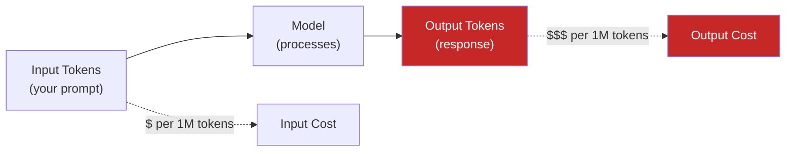

# Lesson 7.23: Cost Optimization

> **Duration**: 30 min | **Section**: D - Claude & Production

## 📍 Where We Are

LLM APIs are powerful but expensive. Let's learn strategies to reduce costs without sacrificing quality.

---

## 💰 Understanding LLM Costs



**Key insight**: Output tokens are 2-6x more expensive than input tokens!

---

## 📊 Model Pricing (2024)

| Model | Input (per 1M) | Output (per 1M) |
|-------|----------------|-----------------|
| GPT-4o | $2.50 | $10.00 |
| GPT-4o-mini | $0.15 | $0.60 |
| Claude 3.5 Sonnet | $3.00 | $15.00 |
| Claude 3.5 Haiku | $0.25 | $1.25 |

**GPT-4o is ~17x more expensive than GPT-4o-mini for output!**

---

## 🎯 Strategy 1: Choose the Right Model

```python
def get_model_for_task(task_complexity: str) -> str:
    """Select model based on task complexity."""
    
    models = {
        "simple": "gpt-4o-mini",      # Classification, extraction
        "medium": "gpt-4o-mini",      # Summarization, Q&A
        "complex": "gpt-4o",          # Reasoning, analysis
        "expert": "gpt-4o"            # Complex coding, research
    }
    
    return models.get(task_complexity, "gpt-4o-mini")

# Most tasks don't need the most expensive model
response = client.chat.completions.create(
    model=get_model_for_task("simple"),
    messages=[{"role": "user", "content": "Is this email spam? Yes or no."}]
)
```

---

## 🎯 Strategy 2: Reduce Input Tokens

### Shorter System Prompts

```python
# ❌ Expensive - 200+ tokens
system = """You are an extremely helpful AI assistant who always provides 
detailed, thorough, and comprehensive answers to any questions asked. 
You should consider multiple perspectives and provide balanced viewpoints...
[continues for 500 words]"""

# ✅ Cheaper - 20 tokens
system = "You are a helpful assistant. Be concise."
```

### Trim Conversation History

```python
def trim_conversation(messages: list[dict], max_messages: int = 10) -> list[dict]:
    """Keep only recent messages to reduce tokens."""
    
    system_msgs = [m for m in messages if m["role"] == "system"]
    other_msgs = [m for m in messages if m["role"] != "system"]
    
    # Keep system + last N messages
    return system_msgs + other_msgs[-max_messages:]

# Before: 50 messages = 10,000 tokens
# After: 10 messages = 2,000 tokens (80% savings!)
```

### Summarize Long Context

```python
def summarize_then_ask(long_document: str, question: str) -> str:
    """Summarize document first, then ask question about summary."""
    
    # Step 1: Cheap summarization
    summary = client.chat.completions.create(
        model="gpt-4o-mini",  # Cheap model
        messages=[{
            "role": "user", 
            "content": f"Summarize in 200 words:\n\n{long_document}"
        }],
        max_tokens=300
    ).choices[0].message.content
    
    # Step 2: Answer based on summary
    answer = client.chat.completions.create(
        model="gpt-4o-mini",
        messages=[{
            "role": "user",
            "content": f"Based on this summary:\n{summary}\n\nAnswer: {question}"
        }]
    ).choices[0].message.content
    
    return answer

# 10,000 token document → 200 token summary = 98% input reduction
```

---

## 🎯 Strategy 3: Reduce Output Tokens

### Set max_tokens Appropriately

```python
# ❌ Default: No limit, could generate 4000 tokens
response = client.chat.completions.create(
    model="gpt-4o-mini",
    messages=[{"role": "user", "content": "Explain Python"}]
)

# ✅ Limited: Only what you need
response = client.chat.completions.create(
    model="gpt-4o-mini",
    messages=[{"role": "user", "content": "Explain Python"}],
    max_tokens=100  # ~75 words, saves money
)
```

### Instruct Brevity

```python
# ❌ Open-ended prompt = long response
"Explain how databases work."

# ✅ Constrained prompt = shorter response
"Explain databases in 2 sentences."
"Give me a one-paragraph summary of databases."
```

### Use Stop Sequences

```python
# Stop generation early
response = client.chat.completions.create(
    model="gpt-4o-mini",
    messages=[{"role": "user", "content": "List 3 Python libraries:"}],
    stop=["\n4."]  # Stop before 4th item
)
```

---

## 🎯 Strategy 4: Caching

```python
import hashlib
import json
from functools import lru_cache

# In-memory cache
@lru_cache(maxsize=1000)
def cached_complete(prompt_hash: str) -> str:
    """Cache by prompt hash."""
    # This won't be called if cached
    pass

def complete_with_cache(messages: list[dict]) -> str:
    """Check cache before API call."""
    
    # Create hash of messages
    cache_key = hashlib.md5(json.dumps(messages).encode()).hexdigest()
    
    # Check cache (implement with Redis, disk, etc.)
    cached = cache.get(cache_key)
    if cached:
        return cached
    
    # API call
    response = client.chat.completions.create(
        model="gpt-4o-mini",
        messages=messages,
        temperature=0  # Deterministic for caching
    )
    
    result = response.choices[0].message.content
    
    # Store in cache
    cache.set(cache_key, result, ttl=3600)  # 1 hour
    
    return result
```

### Redis Cache Example

```python
import redis
import hashlib
import json

r = redis.Redis()

def cached_llm_call(messages: list[dict], model: str = "gpt-4o-mini") -> str:
    """Redis-backed caching."""
    
    cache_key = f"llm:{hashlib.md5(json.dumps(messages).encode()).hexdigest()}"
    
    # Check cache
    cached = r.get(cache_key)
    if cached:
        return cached.decode()
    
    # API call
    response = client.chat.completions.create(
        model=model,
        messages=messages,
        temperature=0
    )
    
    result = response.choices[0].message.content
    
    # Cache for 24 hours
    r.setex(cache_key, 86400, result)
    
    return result
```

---

## 🎯 Strategy 5: Batching

```python
async def batch_complete(prompts: list[str]) -> list[str]:
    """Process multiple prompts efficiently."""
    
    import asyncio
    from openai import AsyncOpenAI
    
    client = AsyncOpenAI()
    
    async def single_complete(prompt: str) -> str:
        response = await client.chat.completions.create(
            model="gpt-4o-mini",
            messages=[{"role": "user", "content": prompt}]
        )
        return response.choices[0].message.content
    
    # Run all in parallel (respecting rate limits)
    results = await asyncio.gather(*[
        single_complete(p) for p in prompts
    ])
    
    return results

# Process 100 prompts faster than sequential
```

---

## 🎯 Strategy 6: Prompt Engineering for Efficiency

### JSON Mode for Structured Output

```python
# ❌ Verbose natural language output
"The sentiment is positive. The confidence is high at 95%."

# ✅ Compact JSON output
response = client.chat.completions.create(
    model="gpt-4o-mini",
    messages=[{
        "role": "user",
        "content": "Analyze sentiment. Return JSON: {sentiment, confidence}"
    }],
    response_format={"type": "json_object"}
)
# {"sentiment": "positive", "confidence": 0.95}
```

### Few-Shot with Minimal Examples

```python
# ❌ 10 examples = expensive
# ✅ 2-3 well-chosen examples = effective and cheap

messages = [
    {"role": "system", "content": "Classify emails as spam or not."},
    {"role": "user", "content": "Free money! Click here!"},
    {"role": "assistant", "content": "spam"},
    {"role": "user", "content": "Meeting tomorrow at 3pm"},
    {"role": "assistant", "content": "not_spam"},
    {"role": "user", "content": email_to_classify}  # New email
]
```

---

## 📊 Cost Tracking

```python
from dataclasses import dataclass, field
from typing import Dict

@dataclass
class CostTracker:
    """Track LLM API costs."""
    
    # Pricing per 1M tokens
    pricing: Dict[str, Dict[str, float]] = field(default_factory=lambda: {
        "gpt-4o-mini": {"input": 0.15, "output": 0.60},
        "gpt-4o": {"input": 2.50, "output": 10.00},
    })
    
    total_input_tokens: int = 0
    total_output_tokens: int = 0
    total_cost: float = 0.0
    calls: int = 0
    
    def add(self, model: str, input_tokens: int, output_tokens: int):
        self.total_input_tokens += input_tokens
        self.total_output_tokens += output_tokens
        self.calls += 1
        
        prices = self.pricing.get(model, {"input": 0, "output": 0})
        cost = (
            (input_tokens / 1_000_000) * prices["input"] +
            (output_tokens / 1_000_000) * prices["output"]
        )
        self.total_cost += cost
    
    def summary(self) -> str:
        return f"""
        Calls: {self.calls}
        Input tokens: {self.total_input_tokens:,}
        Output tokens: {self.total_output_tokens:,}
        Total cost: ${self.total_cost:.4f}
        """

# Usage
tracker = CostTracker()

response = client.chat.completions.create(
    model="gpt-4o-mini",
    messages=[{"role": "user", "content": "Hello!"}]
)

tracker.add(
    "gpt-4o-mini",
    response.usage.prompt_tokens,
    response.usage.completion_tokens
)

print(tracker.summary())
```

---

## 📋 Cost Optimization Checklist

| Strategy | Savings Potential | Effort |
|----------|-------------------|--------|
| Use cheaper model | 90%+ | Low |
| Set max_tokens | 50-80% | Low |
| Instruct brevity | 30-50% | Low |
| Trim conversation | 50-80% | Low |
| Add caching | 50-99% | Medium |
| Summarize context | 80-95% | Medium |
| Batch requests | Speed + cost | Medium |

---

## 🔑 Key Takeaways

| Strategy | Key Point |
|----------|-----------|
| Model selection | GPT-4o-mini for most tasks |
| Limit output | Set max_tokens, request brevity |
| Reduce input | Trim history, summarize context |
| Cache | Same prompt = free |
| Track costs | Monitor usage per model |
| Output > Input | Output costs more, optimize it first |

---

**Next**: [Lesson 7.24: Production Q&A](./Lesson-24-Production-QA.md) — Common questions about running LLMs in production.
