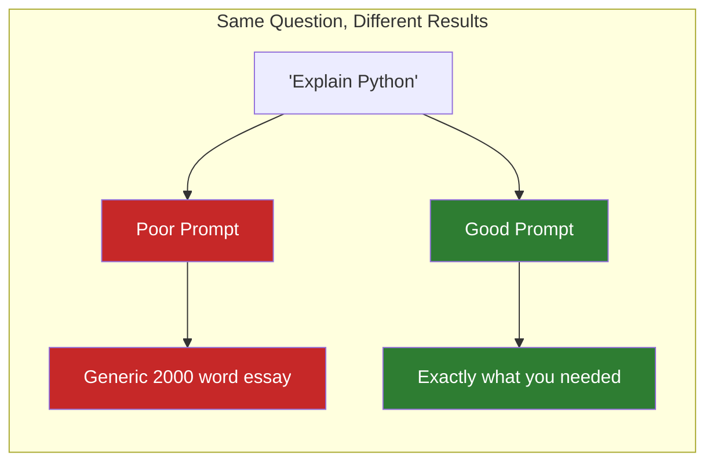
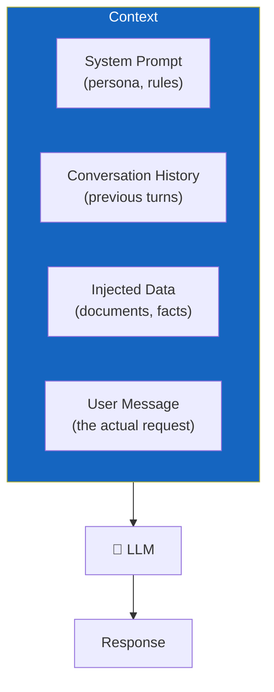

# Lesson 7.25: The Context Engineering Problem

> **Duration**: 5 min | **Section**: E - Context Engineering | **Type**: Section Intro

---

## 🎭 The Story So Far

You can call LLM APIs, handle errors, manage costs. But there's a crucial skill we haven't covered:

**How do you get the LLM to do what you actually want?**

---

## 📊 The Reality

The difference between a good and bad prompt can be:
- **Quality**: Useful vs. useless output
- **Cost**: 100 tokens vs. 2000 tokens
- **Reliability**: Consistent vs. random results

---

## 🧠 What is Context Engineering?

Everything you give the LLM that shapes its response:

Context engineering = designing this input for optimal output.

---

## 🎯 What You'll Learn in Section E

| Lesson | Topic |
|--------|-------|
| 7.26 | System prompt design |
| 7.27 | Prompt templates |
| 7.28 | Few-shot prompting |
| 7.29 | Chain-of-thought prompting |
| 7.30 | Long context strategies |
| 7.31 | Context engineering Q&A |

---

## 🔑 The Key Insight

> **The prompt is your product.** Your code is just plumbing.

A well-engineered prompt can:
- Get GPT-4o-mini to perform like GPT-4o
- Reduce tokens by 80%
- Make outputs predictable and testable

---

**Next**: [Lesson 7.26: System Prompt Design](./Lesson-26-System-Prompt-Design.md) — Writing effective system prompts.
