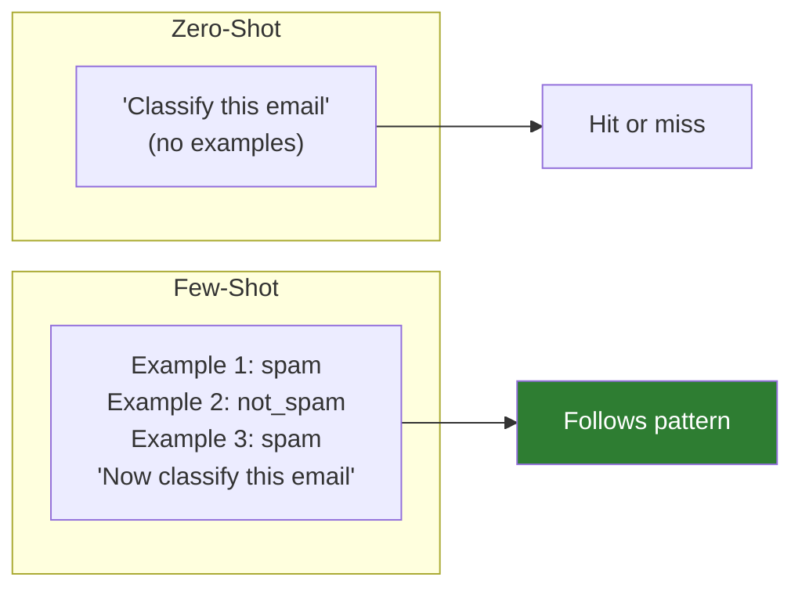
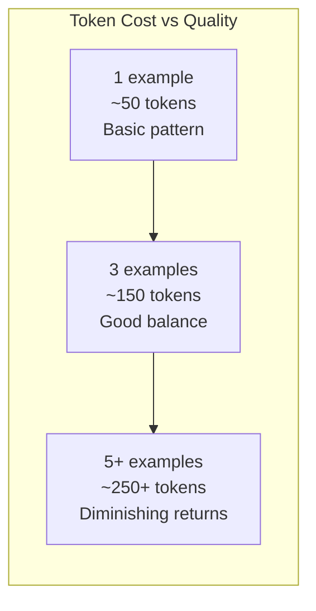

# Lesson 7.28: Few-Shot Prompting

> **Duration**: 30 min | **Section**: E - Context Engineering

## 📍 Where We Are

Sometimes telling the LLM what to do isn't enough. You need to SHOW it. That's few-shot prompting — teaching by example.

---

## 🎯 The Concept



---

## 📊 Zero-Shot vs Few-Shot

| Approach | Examples | Best For |
|----------|----------|----------|
| Zero-shot | 0 | Simple, well-known tasks |
| One-shot | 1 | Format demonstration |
| Few-shot | 2-5 | Consistent, specific behavior |
| Many-shot | 10+ | Complex patterns (uses more tokens) |

---

## 📝 Basic Few-Shot Pattern

```python
messages = [
    {"role": "system", "content": "Classify emails as spam or not_spam."},
    
    # Example 1
    {"role": "user", "content": "WIN $1,000,000 NOW! Click here!"},
    {"role": "assistant", "content": "spam"},
    
    # Example 2
    {"role": "user", "content": "Meeting tomorrow at 3pm in Room 201"},
    {"role": "assistant", "content": "not_spam"},
    
    # Example 3
    {"role": "user", "content": "Free iPhone! You've been selected!"},
    {"role": "assistant", "content": "spam"},
    
    # Actual input
    {"role": "user", "content": "Can we reschedule our call to Thursday?"}
]

response = client.chat.completions.create(
    model="gpt-4o-mini",
    messages=messages
)
# Output: "not_spam"
```

---

## 🔧 Building Few-Shot Prompts

```python
from dataclasses import dataclass
from typing import List, Tuple

@dataclass
class FewShotPrompt:
    """Few-shot prompt builder."""
    
    system_prompt: str
    examples: List[Tuple[str, str]]  # (input, output) pairs
    
    def build_messages(self, user_input: str) -> List[dict]:
        """Build message list with examples."""
        
        messages = [{"role": "system", "content": self.system_prompt}]
        
        # Add examples
        for example_input, example_output in self.examples:
            messages.append({"role": "user", "content": example_input})
            messages.append({"role": "assistant", "content": example_output})
        
        # Add actual input
        messages.append({"role": "user", "content": user_input})
        
        return messages

# Create a sentiment classifier
sentiment_classifier = FewShotPrompt(
    system_prompt="Classify the sentiment as positive, negative, or neutral.",
    examples=[
        ("I love this product!", "positive"),
        ("This is the worst thing I've ever bought.", "negative"),
        ("The package arrived on Tuesday.", "neutral"),
        ("Amazing quality, highly recommend!", "positive"),
        ("It broke after one day.", "negative"),
    ]
)

# Use it
messages = sentiment_classifier.build_messages("Pretty good, nothing special.")
response = client.chat.completions.create(
    model="gpt-4o-mini",
    messages=messages
)
print(response.choices[0].message.content)  # "neutral"
```

---

## 📋 Example Selection Strategies

### Strategy 1: Diverse Examples

Cover different categories and edge cases:

```python
examples = [
    # Clear positive
    ("Best purchase ever! 10/10", "positive"),
    
    # Clear negative
    ("Terrible, waste of money", "negative"),
    
    # Edge case: neutral
    ("It's okay, does what it says", "neutral"),
    
    # Edge case: mixed
    ("Good quality but slow shipping", "positive"),  # Show how to handle mixed
    
    # Edge case: sarcasm
    ("Oh great, another broken item", "negative"),  # Show sarcasm handling
]
```

### Strategy 2: Similar Examples

Use examples similar to expected inputs:

```python
# For classifying customer support tickets
support_examples = [
    ("My order hasn't arrived", "shipping"),
    ("Can I get a refund?", "billing"),
    ("The product is broken", "product_issue"),
    ("How do I reset my password?", "account"),
]
```

### Strategy 3: Edge Cases

Focus on tricky cases:

```python
# Date parsing examples
date_examples = [
    ("tomorrow", "relative"),
    ("next Friday", "relative"),
    ("Jan 15", "absolute"),
    ("2024-01-15", "absolute"),
    ("in 3 days", "relative"),
    ("the 15th", "absolute"),  # Edge case
]
```

---

## 🎯 Structured Output with Few-Shot

```python
# Teach specific output format
format_examples = [
    (
        "iPhone 15 Pro review",
        '{"product": "iPhone 15 Pro", "category": "electronics", "type": "review"}'
    ),
    (
        "How to make pasta",
        '{"product": null, "category": "food", "type": "tutorial"}'
    ),
    (
        "Nike Air Max price comparison",
        '{"product": "Nike Air Max", "category": "footwear", "type": "comparison"}'
    ),
]

classifier = FewShotPrompt(
    system_prompt="Extract structured data from titles. Return JSON only.",
    examples=format_examples
)
```

---

## 📊 How Many Examples?



| Examples | Quality | Token Cost | Use When |
|----------|---------|------------|----------|
| 1 | Basic | Low | Format demonstration |
| 2-3 | Good | Medium | Most tasks |
| 4-5 | Very good | Higher | Complex classification |
| 10+ | Marginal improvement | High | Only if needed |

**Rule of thumb**: 2-3 well-chosen examples often work as well as 10 random ones.

---

## 🔄 Dynamic Example Selection

Choose examples based on input:

```python
from typing import List, Tuple
import numpy as np

class DynamicFewShot:
    """Select examples dynamically based on similarity."""
    
    def __init__(
        self,
        system_prompt: str,
        example_pool: List[Tuple[str, str]],
        max_examples: int = 3
    ):
        self.system_prompt = system_prompt
        self.example_pool = example_pool
        self.max_examples = max_examples
        
        # In production, use embeddings for similarity
        self.example_texts = [ex[0] for ex in example_pool]
    
    def select_examples(self, user_input: str) -> List[Tuple[str, str]]:
        """Select most relevant examples."""
        
        # Simple: random selection
        # Better: embedding similarity
        # Best: learned selection
        
        import random
        return random.sample(self.example_pool, min(self.max_examples, len(self.example_pool)))
    
    def build_messages(self, user_input: str) -> List[dict]:
        examples = self.select_examples(user_input)
        
        messages = [{"role": "system", "content": self.system_prompt}]
        
        for input_text, output_text in examples:
            messages.append({"role": "user", "content": input_text})
            messages.append({"role": "assistant", "content": output_text})
        
        messages.append({"role": "user", "content": user_input})
        
        return messages
```

---

## ⚠️ Common Mistakes

### Mistake 1: Inconsistent Format

```python
# ❌ Inconsistent assistant responses
{"role": "assistant", "content": "This is positive"},
{"role": "assistant", "content": "negative"},
{"role": "assistant", "content": "The sentiment is neutral."},

# ✅ Consistent format
{"role": "assistant", "content": "positive"},
{"role": "assistant", "content": "negative"},
{"role": "assistant", "content": "neutral"},
```

### Mistake 2: Biased Examples

```python
# ❌ All examples are positive
("Great!", "positive"),
("Love it!", "positive"),
("Amazing!", "positive"),
# Model will be biased toward positive

# ✅ Balanced examples
("Great!", "positive"),
("Terrible!", "negative"),
("It's okay", "neutral"),
```

### Mistake 3: Too Many Tokens

```python
# ❌ Long examples waste tokens
{"role": "user", "content": "I recently purchased this product and I have to say that after using it for several weeks, I've come to the conclusion that while it has some nice features, overall I think..."},

# ✅ Concise examples
{"role": "user", "content": "Good product, some minor issues."},
```

---

## 🧪 Practice: Build a Code Converter

```python
# SQL to Python converter using few-shot
sql_to_python = FewShotPrompt(
    system_prompt="Convert SQL queries to Python code using pandas.",
    examples=[
        (
            "SELECT * FROM users WHERE age > 18",
            "df[df['age'] > 18]"
        ),
        (
            "SELECT name, email FROM users",
            "df[['name', 'email']]"
        ),
        (
            "SELECT COUNT(*) FROM orders GROUP BY status",
            "df.groupby('status').size()"
        ),
        (
            "SELECT * FROM products ORDER BY price DESC LIMIT 10",
            "df.sort_values('price', ascending=False).head(10)"
        ),
    ]
)

# Test
messages = sql_to_python.build_messages(
    "SELECT AVG(salary) FROM employees WHERE department = 'Engineering'"
)

response = client.chat.completions.create(
    model="gpt-4o-mini",
    messages=messages
)
print(response.choices[0].message.content)
# df[df['department'] == 'Engineering']['salary'].mean()
```

---

## 🔑 Key Takeaways

| Concept | Key Point |
|---------|-----------|
| Few-shot | Teach by example |
| 2-3 examples | Usually sufficient |
| Diversity | Cover different cases |
| Consistency | Same format in examples |
| Balance | Don't bias toward one class |
| Concise | Keep examples short |

| When to Use | Few-Shot |
|-------------|----------|
| Specific format | ✅ Show the format |
| Classification | ✅ Show each class |
| Conversion | ✅ Show input/output pairs |
| Open-ended generation | ❌ Usually not needed |

---

**Next**: [Lesson 7.29: Chain-of-Thought Prompting](./Lesson-29-Chain-of-Thought-Prompting.md) — Getting LLMs to reason step by step.
