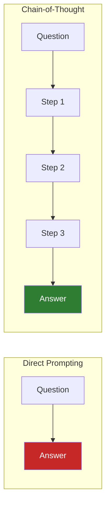
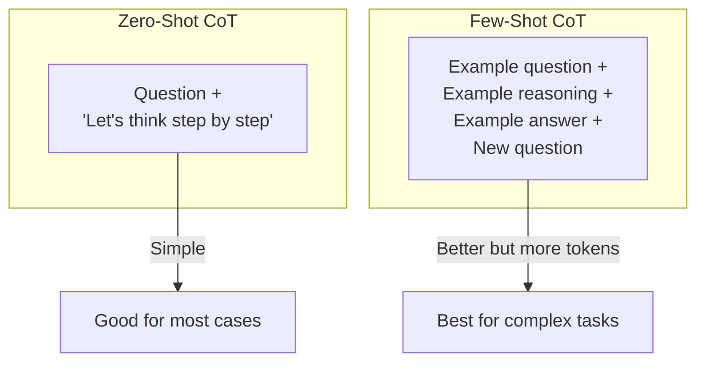

# Lesson 7.29: Chain-of-Thought Prompting

> **Duration**: 30 min | **Section**: E - Context Engineering

## 📍 Where We Are

LLMs can struggle with complex reasoning when asked for a direct answer. Chain-of-thought (CoT) prompting makes them think step by step — dramatically improving results on reasoning tasks.

---

## 🎯 The Problem

```python
# Direct question
"A bat and ball cost $1.10 total. The bat costs $1.00 more than the ball. How much does the ball cost?"

# Common wrong answer: "$0.10"
# Correct answer: "$0.05"
```

Without explicit reasoning, LLMs (and humans!) often jump to wrong conclusions.

---

## 💡 The Solution: Chain-of-Thought



---

## 📝 Basic CoT Prompt

Just add "Let's think step by step":

```python
# ❌ Direct
prompt = "A bat and ball cost $1.10 total. The bat costs $1.00 more than the ball. How much does the ball cost?"

# ✅ Chain-of-thought
prompt = """A bat and ball cost $1.10 total. The bat costs $1.00 more than the ball. How much does the ball cost?

Let's think step by step."""

response = client.chat.completions.create(
    model="gpt-4o-mini",
    messages=[{"role": "user", "content": prompt}]
)
```

Output:
```
Let me work through this step by step:

1. Let's call the ball's cost "x"
2. The bat costs $1.00 more than the ball, so bat = x + $1.00
3. Together they cost $1.10: x + (x + $1.00) = $1.10
4. Simplify: 2x + $1.00 = $1.10
5. Solve: 2x = $0.10, so x = $0.05

The ball costs $0.05.
```

---

## 🔧 CoT Patterns

### Pattern 1: Magic Phrase

```python
# Simple addition
prompt = f"""
{question}

Let's think step by step.
"""
```

### Pattern 2: Explicit Steps

```python
prompt = f"""
{question}

Work through this problem:
1. First, identify what we know
2. Then, set up the equation
3. Next, solve step by step
4. Finally, verify the answer
"""
```

### Pattern 3: Role-Based

```python
prompt = f"""
You are a math teacher explaining to a student.

{question}

Show your complete reasoning process.
"""
```

---

## 📊 When CoT Helps Most

| Task Type | Improvement |
|-----------|-------------|
| Math word problems | ✅✅✅ Huge |
| Logic puzzles | ✅✅✅ Huge |
| Multi-step reasoning | ✅✅ Large |
| Code debugging | ✅✅ Large |
| Commonsense reasoning | ✅ Moderate |
| Simple Q&A | ❌ Not needed |

---

## 🎯 Few-Shot CoT

Combine few-shot with chain-of-thought:

```python
messages = [
    {"role": "system", "content": "You are a helpful math tutor."},
    
    # Example with reasoning
    {
        "role": "user",
        "content": "If a train travels 60 mph for 2.5 hours, how far does it go?"
    },
    {
        "role": "assistant",
        "content": """Let me think through this:

1. We need: distance = speed × time
2. Speed = 60 mph
3. Time = 2.5 hours
4. Distance = 60 × 2.5 = 150 miles

The train travels 150 miles."""
    },
    
    # Actual question
    {
        "role": "user",
        "content": "A car travels at 45 mph for 3 hours, then 60 mph for 2 hours. What's the total distance?"
    }
]
```

---

## 🔄 Zero-Shot CoT vs Few-Shot CoT



| Approach | Tokens | Quality | Best For |
|----------|--------|---------|----------|
| Zero-shot CoT | Low | Good | Most reasoning tasks |
| Few-shot CoT | High | Best | Complex, specific formats |

---

## 🧩 CoT for Code

```python
debug_prompt = """
Here's a Python function with a bug:

```python
def calculate_average(numbers):
    total = 0
    for num in numbers:
        total += num
    return total / len(numbers)
```

This fails with an empty list. Debug it step by step:

1. First, identify what the bug is
2. Explain why it's a problem
3. Show the fix
4. Explain how the fix works
"""
```

---

## 📋 Structured CoT Template

```python
from dataclasses import dataclass

@dataclass
class ChainOfThoughtPrompt:
    """Structured chain-of-thought prompt."""
    
    task_description: str
    reasoning_steps: list[str]
    output_format: str
    
    def build(self, question: str) -> str:
        steps = "\n".join(f"{i+1}. {step}" for i, step in enumerate(self.reasoning_steps))
        
        return f"""
{self.task_description}

Question: {question}

Think through this problem step by step:
{steps}

{self.output_format}
"""

# Create reusable CoT prompt
math_cot = ChainOfThoughtPrompt(
    task_description="Solve this math problem showing all work.",
    reasoning_steps=[
        "Identify the known quantities",
        "Determine what we're solving for",
        "Write the relevant equation(s)",
        "Solve step by step",
        "Verify the answer makes sense"
    ],
    output_format="Present your final answer as: ANSWER: [value]"
)

# Use it
prompt = math_cot.build("If apples cost $2 each and you have $15, how many can you buy?")
```

---

## 🎯 Self-Consistency CoT

Generate multiple reasoning chains, pick the most common answer:

```python
def self_consistent_cot(question: str, num_samples: int = 5) -> str:
    """Generate multiple reasoning chains and vote on answer."""
    
    prompt = f"{question}\n\nLet's think step by step."
    
    answers = []
    
    for _ in range(num_samples):
        response = client.chat.completions.create(
            model="gpt-4o-mini",
            messages=[{"role": "user", "content": prompt}],
            temperature=0.7  # Some randomness for diversity
        )
        
        # Extract final answer (simplified)
        text = response.choices[0].message.content
        # In practice, parse more carefully
        answers.append(text.split("ANSWER:")[-1].strip() if "ANSWER:" in text else text)
    
    # Vote on most common answer
    from collections import Counter
    most_common = Counter(answers).most_common(1)[0][0]
    
    return most_common

# More reliable than single CoT
answer = self_consistent_cot("What is 17 * 23?", num_samples=3)
```

---

## ⚠️ When CoT Hurts

```python
# ❌ Simple lookup - CoT adds unnecessary tokens
"What is the capital of France?"
# Just needs: "Paris"
# CoT would waste tokens on "Let me think... France is a country in Europe..."

# ❌ Creative tasks - reasoning can constrain creativity
"Write a poem about spring"
# Just write the poem!

# ✅ Use CoT for reasoning, not recall or creativity
```

---

## 🔧 Extracting Just the Answer

```python
def solve_with_cot(question: str) -> dict:
    """Solve with CoT, extract both reasoning and answer."""
    
    prompt = f"""
{question}

Think through this step by step, then provide your final answer.

Format:
REASONING: [your step-by-step thinking]
ANSWER: [just the final answer]
"""
    
    response = client.chat.completions.create(
        model="gpt-4o-mini",
        messages=[{"role": "user", "content": prompt}]
    )
    
    text = response.choices[0].message.content
    
    # Parse structured output
    reasoning = ""
    answer = ""
    
    if "REASONING:" in text and "ANSWER:" in text:
        parts = text.split("ANSWER:")
        reasoning = parts[0].replace("REASONING:", "").strip()
        answer = parts[1].strip()
    
    return {
        "reasoning": reasoning,
        "answer": answer,
        "full_response": text
    }

result = solve_with_cot("What is 15% of 80?")
print(f"Answer: {result['answer']}")
print(f"Reasoning: {result['reasoning']}")
```

---

## 🧪 Practice: Build a Reasoning Assistant

```python
class ReasoningAssistant:
    """Assistant that always shows its reasoning."""
    
    def __init__(self, domain: str = "general"):
        self.domain = domain
        self.system_prompt = f"""You are a helpful {domain} assistant.
Always show your reasoning step by step before giving an answer.
Format responses as:
THINKING: [your reasoning process]
ANSWER: [your final answer]"""
    
    def solve(self, question: str) -> dict:
        response = client.chat.completions.create(
            model="gpt-4o-mini",
            messages=[
                {"role": "system", "content": self.system_prompt},
                {"role": "user", "content": question}
            ]
        )
        
        text = response.choices[0].message.content
        
        thinking = ""
        answer = ""
        
        if "THINKING:" in text and "ANSWER:" in text:
            thinking = text.split("ANSWER:")[0].replace("THINKING:", "").strip()
            answer = text.split("ANSWER:")[-1].strip()
        
        return {"thinking": thinking, "answer": answer}

# Use it
math_helper = ReasoningAssistant(domain="math")
result = math_helper.solve("A restaurant bill is $85. With 18% tip, what's the total?")
print(result["answer"])
```

---

## 🔑 Key Takeaways

| Technique | When to Use |
|-----------|-------------|
| "Let's think step by step" | Quick boost for reasoning |
| Explicit steps | Guide the reasoning |
| Few-shot CoT | Complex, specific formats |
| Self-consistency | Maximum reliability |

| Task Type | Use CoT? |
|-----------|----------|
| Math problems | ✅ Yes |
| Logic puzzles | ✅ Yes |
| Code debugging | ✅ Yes |
| Simple Q&A | ❌ No |
| Creative writing | ❌ No |

---

**Next**: [Lesson 7.30: Long Context Strategies](./Lesson-30-Long-Context-Strategies.md) — Handling documents larger than the context window.
