# Lesson 7.30: Long Context Strategies

> **Duration**: 35 min | **Section**: E - Context Engineering

## 📍 Where We Are

Modern LLMs have large context windows (128K+ tokens). But:
- Longer context = higher cost
- "Lost in the middle" — LLMs struggle with info in the middle
- Some documents exceed even large context windows

Let's master long context strategies.

---

## 📊 The Context Challenge


---

## 🎯 Strategy 1: Chunking

Break large documents into smaller pieces:

```python
def chunk_text(text: str, chunk_size: int = 1000, overlap: int = 200) -> list[str]:
    """Split text into overlapping chunks."""
    
    words = text.split()
    chunks = []
    
    start = 0
    while start < len(words):
        end = start + chunk_size
        chunk = " ".join(words[start:end])
        chunks.append(chunk)
        start = end - overlap  # Overlap prevents losing context at boundaries
    
    return chunks

# Usage
document = "Very long document text..."
chunks = chunk_text(document, chunk_size=500, overlap=50)

# Process each chunk
results = []
for chunk in chunks:
    response = client.chat.completions.create(
        model="gpt-4o-mini",
        messages=[
            {"role": "user", "content": f"Summarize:\n\n{chunk}"}
        ]
    )
    results.append(response.choices[0].message.content)
```

### Smart Chunking

Chunk by semantic boundaries, not just word count:

```python
import re

def smart_chunk(text: str, max_chunk_size: int = 2000) -> list[str]:
    """Chunk by paragraphs/sections, respecting semantic boundaries."""
    
    # Split by paragraph
    paragraphs = re.split(r'\n\n+', text)
    
    chunks = []
    current_chunk = []
    current_size = 0
    
    for para in paragraphs:
        para_size = len(para.split())
        
        if current_size + para_size > max_chunk_size and current_chunk:
            chunks.append("\n\n".join(current_chunk))
            current_chunk = []
            current_size = 0
        
        current_chunk.append(para)
        current_size += para_size
    
    if current_chunk:
        chunks.append("\n\n".join(current_chunk))
    
    return chunks
```

---

## 🎯 Strategy 2: Map-Reduce

Process chunks separately, then combine:


```python
def map_reduce_summarize(document: str, chunk_size: int = 2000) -> str:
    """Summarize long document using map-reduce."""
    
    # MAP: Summarize each chunk
    chunks = chunk_text(document, chunk_size=chunk_size)
    
    chunk_summaries = []
    for chunk in chunks:
        response = client.chat.completions.create(
            model="gpt-4o-mini",
            messages=[
                {"role": "system", "content": "Summarize the key points concisely."},
                {"role": "user", "content": chunk}
            ],
            max_tokens=200
        )
        chunk_summaries.append(response.choices[0].message.content)
    
    # REDUCE: Combine summaries
    combined = "\n\n".join(chunk_summaries)
    
    final_response = client.chat.completions.create(
        model="gpt-4o-mini",
        messages=[
            {"role": "system", "content": "Combine these summaries into one coherent summary."},
            {"role": "user", "content": combined}
        ]
    )
    
    return final_response.choices[0].message.content
```

---

## 🎯 Strategy 3: Hierarchical Processing

Build summaries at multiple levels:

```python
def hierarchical_summarize(document: str, target_length: int = 500) -> str:
    """Recursively summarize until reaching target length."""
    
    # Base case: document is short enough
    if len(document.split()) <= target_length:
        return document
    
    # Split into chunks
    chunks = chunk_text(document, chunk_size=2000)
    
    # Summarize each chunk
    summaries = []
    for chunk in chunks:
        response = client.chat.completions.create(
            model="gpt-4o-mini",
            messages=[{"role": "user", "content": f"Summarize in 200 words:\n\n{chunk}"}],
            max_tokens=300
        )
        summaries.append(response.choices[0].message.content)
    
    # Combine and recursively summarize if still too long
    combined = " ".join(summaries)
    
    if len(combined.split()) > target_length:
        return hierarchical_summarize(combined, target_length)
    
    return combined
```

---

## 🎯 Strategy 4: Sliding Window Q&A

For Q&A on long documents:

```python
def sliding_window_qa(document: str, question: str, chunk_size: int = 3000) -> str:
    """Answer question by checking each chunk."""
    
    chunks = chunk_text(document, chunk_size=chunk_size)
    
    # Check each chunk for relevant info
    relevant_chunks = []
    
    for chunk in chunks:
        response = client.chat.completions.create(
            model="gpt-4o-mini",
            messages=[
                {"role": "system", "content": "Does this text contain information relevant to answering the question? Reply YES or NO, then briefly explain."},
                {"role": "user", "content": f"Question: {question}\n\nText:\n{chunk}"}
            ],
            max_tokens=100
        )
        
        if "YES" in response.choices[0].message.content.upper():
            relevant_chunks.append(chunk)
    
    # Answer using only relevant chunks
    if not relevant_chunks:
        return "I couldn't find relevant information in the document."
    
    context = "\n\n---\n\n".join(relevant_chunks)
    
    response = client.chat.completions.create(
        model="gpt-4o-mini",
        messages=[
            {"role": "system", "content": "Answer the question based on the provided context."},
            {"role": "user", "content": f"Context:\n{context}\n\nQuestion: {question}"}
        ]
    )
    
    return response.choices[0].message.content
```

---

## 🎯 Strategy 5: Important Information First

LLMs pay more attention to the beginning and end:

```mermaid
flowchart LR
    subgraph Attention
        START["🔥 Beginning<br/>(high attention)"]
        MIDDLE["❄️ Middle<br/>(lower attention)"]
        END["🔥 End<br/>(high attention)"]
    end
    
    style START fill:#2E7D32,color:#fff
    style MIDDLE fill:#C62828,color:#fff
    style END fill:#2E7D32,color:#fff
```



```python
def structure_for_attention(context: str, question: str) -> str:
    """Place important info at start and end."""
    
    # Put question at start AND end
    prompt = f"""
Question: {question}

Context (refer to this to answer the question):
{context}

Remember the question: {question}

Now answer based on the context above.
"""
    return prompt
```

---

## 🎯 Strategy 6: Extract-Then-Answer

First extract relevant quotes, then answer:

```python
def extract_then_answer(document: str, question: str) -> dict:
    """Two-step: extract relevant passages, then answer."""
    
    # Step 1: Extract relevant passages
    extract_response = client.chat.completions.create(
        model="gpt-4o-mini",
        messages=[
            {"role": "system", "content": "Extract 3-5 relevant quotes from the document that help answer the question. Return only the quotes, numbered."},
            {"role": "user", "content": f"Question: {question}\n\nDocument:\n{document[:10000]}"}  # First 10K chars
        ]
    )
    
    quotes = extract_response.choices[0].message.content
    
    # Step 2: Answer using extracted quotes
    answer_response = client.chat.completions.create(
        model="gpt-4o-mini",
        messages=[
            {"role": "system", "content": "Answer the question using only the provided quotes."},
            {"role": "user", "content": f"Question: {question}\n\nRelevant quotes:\n{quotes}"}
        ]
    )
    
    return {
        "quotes": quotes,
        "answer": answer_response.choices[0].message.content
    }
```

---

## 📊 Strategy Comparison

| Strategy | Best For | Token Cost | Quality |
|----------|----------|------------|---------|
| Chunking | Processing whole doc | High | Moderate |
| Map-Reduce | Summarization | High | Good |
| Hierarchical | Very long docs | Medium | Good |
| Sliding Window Q&A | Q&A | Medium | Good |
| Info First/Last | Any long context | Low | Better |
| Extract-Then-Answer | Q&A | Medium | Best |

---

## 🔧 Using Large Context Models Effectively

When you DO fit in context:

```python
def large_context_qa(document: str, question: str) -> str:
    """Use large context effectively."""
    
    # Structure the prompt well
    prompt = f"""
I need you to answer a question about a document.

THE QUESTION (keep this in mind while reading):
{question}

THE DOCUMENT:
{document}

REMINDER - THE QUESTION WAS:
{question}

Based on the document above, please answer the question. 
If the answer isn't in the document, say so.
Quote relevant passages to support your answer.
"""
    
    response = client.chat.completions.create(
        model="gpt-4o",  # Use model with large context
        messages=[{"role": "user", "content": prompt}]
    )
    
    return response.choices[0].message.content
```

---

## 🧪 Practice: Build a Document QA System

```python
from dataclasses import dataclass
from typing import List, Optional

@dataclass
class DocumentQA:
    """Q&A system for long documents."""
    
    max_chunk_size: int = 3000
    model: str = "gpt-4o-mini"
    
    def __init__(self):
        self.client = OpenAI()
        self.document: Optional[str] = None
        self.chunks: List[str] = []
    
    def load_document(self, document: str):
        """Load and chunk document."""
        self.document = document
        self.chunks = chunk_text(document, chunk_size=self.max_chunk_size)
        print(f"Loaded document with {len(self.chunks)} chunks")
    
    def ask(self, question: str) -> str:
        """Answer question about the document."""
        
        if not self.chunks:
            raise ValueError("No document loaded")
        
        # Find relevant chunks
        relevant = self._find_relevant_chunks(question)
        
        if not relevant:
            return "I couldn't find relevant information."
        
        # Answer from relevant chunks
        context = "\n\n".join(relevant[:3])  # Top 3 chunks
        
        response = self.client.chat.completions.create(
            model=self.model,
            messages=[
                {"role": "system", "content": "Answer based on the provided context. Cite your sources."},
                {"role": "user", "content": f"Context:\n{context}\n\nQuestion: {question}"}
            ]
        )
        
        return response.choices[0].message.content
    
    def _find_relevant_chunks(self, question: str) -> List[str]:
        """Find chunks relevant to the question."""
        
        relevant = []
        
        for chunk in self.chunks:
            # Simple keyword matching (in production, use embeddings)
            question_words = set(question.lower().split())
            chunk_words = set(chunk.lower().split())
            
            overlap = len(question_words & chunk_words)
            if overlap >= 2:  # At least 2 common words
                relevant.append(chunk)
        
        return relevant

# Usage
qa = DocumentQA()
qa.load_document(long_document_text)
answer = qa.ask("What are the main findings?")
print(answer)
```

---

## 🔑 Key Takeaways

| Strategy | When to Use |
|----------|-------------|
| Chunking | Any long doc processing |
| Map-Reduce | Full doc summarization |
| Sliding Window | Q&A on long docs |
| Info First/Last | Maximize attention |
| Extract-Then-Answer | Precise Q&A |

| Principle | Guidance |
|-----------|----------|
| Chunk smartly | Respect semantic boundaries |
| Overlap chunks | Don't lose info at boundaries |
| Important info first | LLMs attend to start/end more |
| Iterate | Hierarchical for very long docs |
| Use embeddings | Better relevance matching (Module 8!) |

---

**Next**: [Lesson 7.31: Context Engineering Q&A](./Lesson-31-Context-Engineering-QA.md) — Common questions and Section E wrap-up.
