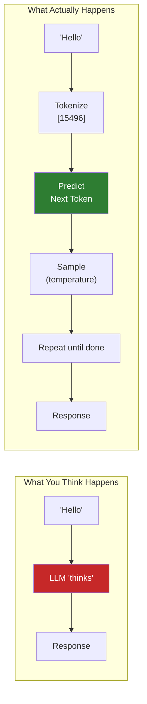

# Module 7: LLM APIs - The Hard Parts

> **Duration**: 2 Weeks | **Lessons**: 32

## 🎯 Module Overview

You've seen ChatGPT "understand" you, "think" about problems, and "know" things. But what is it actually doing? This module demystifies LLMs from first principles. You'll understand that an LLM is a **prediction machine** — given tokens, it predicts the next token. That's it. Once you see this, the "magic" becomes engineering, and you can build powerful AI applications with full control.

## 🧠 Mental Model

**The Core Insight**: LLMs don't "understand" — they predict probable next tokens based on patterns from training data. This is powerful, but it's NOT thinking.

## 📋 Prerequisites

- Python functions, classes, async/await (Module 3)
- HTTP requests and APIs (Module 3.41-3.45)
- FastAPI basics (Module 6)
- Environment variables and secrets management

## 🗂️ Module Structure

| Section | Lessons | Focus |
|---------|:-------:|-------|
| A: What IS an LLM? | 7.0 - 7.6 | Demystifying AI — tokens, prediction, context |
| B: OpenAI API | 7.7 - 7.13 | Chat completions, messages, streaming |
| C: Function Calling | 7.14 - 7.18 | Making LLMs "do" things with tools |
| D: Claude & Production | 7.19 - 7.24 | Anthropic API, error handling, async, costs |
| E: Context Engineering | 7.25 - 7.31 | KV caching, long context, retrieval strategies |

---

## 📚 Lessons

### Section A: What IS an LLM? (Demystifying AI)

| # | Lesson | Duration | What We're Solving |
|:-:|--------|:--------:|-------------------|
| 7.0 | The AI Magic Problem | 15 min | "ChatGPT seems to think. What is it ACTUALLY doing?" |
| 7.1 | Prediction Machines | 25 min | LLM = "fancy autocomplete". Predict next word. |
| 7.2 | Training Data | 20 min | It read the internet. Patterns, not knowledge. |
| 7.3 | Tokens Under the Hood | 25 min | Text → numbers. "Hello" = 1 token. Long words = many. |
| 7.4 | Context Window | 20 min | Limited space! 128K tokens ≈ 100K words. |
| 7.5 | Temperature & Sampling | 25 min | The randomness dial: 0 = robot, 1 = jazz musician. |
| 7.6 | LLM Fundamentals Q&A | 10 min | "Why different answers?" "Why does it lie?" |

### Section B: OpenAI API

| # | Lesson | Duration | What We're Solving |
|:-:|--------|:--------:|-------------------|
| 7.7 | The API Problem | 5 min | "How do you talk to OpenAI's servers?" |
| 7.8 | OpenAI Setup | 20 min | API key, `openai` package, environment variables. |
| 7.9 | Chat Completions Under the Hood | 35 min | What happens when you call the API? |
| 7.10 | Messages Array | 30 min | `system`, `user`, `assistant` roles. Conversation history. |
| 7.11 | Parameters Deep Dive | 25 min | `max_tokens`, `top_p`, `stop`, `n`. When to use each. |
| 7.12 | Streaming Responses | 30 min | `stream=True`. Token by token. Real-time output. |
| 7.13 | OpenAI Q&A | 10 min | "Rate limits?" "Costs?" "Which model?" |

### Section C: Function Calling (Tools)

| # | Lesson | Duration | What We're Solving |
|:-:|--------|:--------:|-------------------|
| 7.14 | The Action Problem | 5 min | "LLM generates text. How do you make it DO things?" |
| 7.15 | Function Calling Under the Hood | 40 min | LLM outputs JSON → you execute → return result. |
| 7.16 | Tool Definitions | 30 min | JSON Schema for tools. Required vs optional params. |
| 7.17 | Parallel Tool Calls | 25 min | Multiple tools in one response. Handling all of them. |
| 7.18 | Function Calling Q&A | 10 min | "Tool choice?" "What if LLM hallucinates a tool?" |

### Section D: Claude & Production Patterns

| # | Lesson | Duration | What We're Solving |
|:-:|--------|:--------:|-------------------|
| 7.19 | Anthropic Claude | 30 min | Different API, different strengths. |
| 7.20 | Claude Tool Use | 30 min | Same concept, different format. `tool_use` blocks. |
| 7.21 | Structured Output | 30 min | Force LLM to output specific JSON schema. |
| 7.22 | Error Handling & Retries | 30 min | Rate limits, timeouts, exponential backoff. |
| 7.23 | Async LLM Calls | 25 min | `AsyncOpenAI`. Concurrent requests. |
| 7.24 | Cost Tracking | 25 min | Token counting BEFORE calling. Budget alerts. |

### Section E: Context Engineering

| # | Lesson | Duration | What We're Solving |
|:-:|--------|:--------:|-------------------|
| 7.25 | The Context Problem | 5 min | "1M+ tokens available. Stuff everything in? Neither extreme works." |
| 7.26 | KV Caching Under the Hood | 35 min | Reuse computation. Memory-bound optimization. |
| 7.27 | Long-Context Containment | 30 min | When to use long context vs RAG. |
| 7.28 | The "Lost in the Middle" Problem | 25 min | LLMs degrade on long contexts. Placement strategy. |
| 7.29 | Contextual Retrieval | 30 min | Attach parent context to chunks. Hierarchy problem. |
| 7.30 | Context Engineering Q&A | 10 min | "When RAG vs long context?" "Optimal placement?" |
| 7.31 | Module 7 Review | 15 min | LLM mental model: Tokenize → Predict → Sample → Respond |

---

## 🎯 Module Project

**Chat API with Streaming + Context Management**

Build a FastAPI chat endpoint with:
- Streaming responses (real-time token output)
- Conversation history stored in PostgreSQL
- A calculator tool (function calling)
- KV cache-aware prompt management
- Cost tracking per conversation

---

## ✅ Independence Check

After this module, you should be able to:

| Level | Question |
|-------|----------|
| **Know** | What is a token? What does temperature control? |
| **Understand** | Why do you need to track conversation history yourself? Why do LLMs hallucinate? |
| **Apply** | Build a streaming chat endpoint. Implement function calling. |
| **Analyze** | When does long context fail? When is RAG better? |
| **Create** | Design a multi-tool agent with proper error handling and cost tracking. |

---

## 🔗 References

- [OpenAI API Documentation](https://platform.openai.com/docs/api-reference)
- [OpenAI Cookbook](https://cookbook.openai.com/)
- [Anthropic Claude Documentation](https://docs.anthropic.com/)
- [OpenAI Tokenizer](https://platform.openai.com/tokenizer)
- [tiktoken Library](https://github.com/openai/tiktoken)
- [Prompt Caching (Anthropic)](https://docs.anthropic.com/en/docs/build-with-claude/prompt-caching)
- [Lost in the Middle Paper](https://arxiv.org/abs/2307.03172)

---

## 🔗 Next Module

→ [Module 8: RAG - The Hard Parts](../Module-08-RAG/README.md)
