# Lesson 8.0: The Knowledge Problem

> **Duration**: 15 min | **Section**: A - Why RAG Exists

## 🎯 The Problem (3-5 min)

You just deployed a customer support chatbot powered by GPT-4. The marketing team is excited. "It can answer any question!"

Then an employee asks: **"What's our remote work policy?"**

GPT-4 confidently responds: "Most companies allow 2-3 days of remote work per week with manager approval."

**That's wrong.** Your company allows 4 days. And that "answer" came from GPT-4's training data - generic internet knowledge. It has never seen your 500-page employee handbook.

> **The Knowledge Gap**: LLMs know what was on the internet before their training cutoff. They don't know YOUR company's documents, YOUR product docs, YOUR customer data.

## 🧪 Try It: Just Ask the LLM

```python
from openai import OpenAI

client = OpenAI()

# Ask about something specific to YOUR company
response = client.chat.completions.create(
    model="gpt-4",
    messages=[
        {"role": "user", "content": "What is Acme Corp's refund policy?"}
    ]
)

print(response.choices[0].message.content)
```

**Output:**
```
I don't have specific information about Acme Corp's refund policy. 
Generally, refund policies vary by company...
```

At least it admits it doesn't know! But often, LLMs **confidently make things up**.

## 🔍 Under the Hood: What Does the LLM "Know"?


The LLM is a **frozen snapshot** of internet knowledge. Your private documents aren't in there. Recent events after the training cutoff aren't in there.

## 💥 Where It Breaks: The Three Failure Modes

### 1. Hallucination (Confident Wrong Answers)
```python
# Ask about a fictional policy
response = client.chat.completions.create(
    model="gpt-4",
    messages=[
        {"role": "user", "content": "What's Acme Corp's policy on pet-friendly offices?"}
    ]
)
# LLM might INVENT a policy that sounds plausible!
```

### 2. Outdated Information
```python
# Ask about something that changed
"Who is the CEO of Twitter?"  # Training data might say "Jack Dorsey"
```

### 3. "I Don't Know" (Unhelpful)
```python
# LLM correctly refuses, but user gets no value
"I don't have access to Acme Corp's internal documents."
```

## ✅ The Solution: Give It an Open Book

What if we could **show** the LLM the relevant parts of our documents?

```python
# Instead of just asking...
"What's our remote work policy?"

# ...we INJECT the relevant document:
"""
Based on the following excerpt from the Employee Handbook:

--- START OF EXCERPT ---
Section 4.2: Remote Work Policy
Employees may work remotely up to 4 days per week with 
prior manager approval. Core hours are 10am-3pm local time.
--- END OF EXCERPT ---

Question: What's our remote work policy?
"""
```

**Now the LLM answers correctly** - because it has the actual document right there in the prompt!

```mermaid
flowchart LR
    subgraph RAG["✅ RAG APPROACH"]
        Q["Question"] --> S["1. Search Your Docs"]
        S --> F["2. Find Relevant Chunks"]
        F --> I["3. Inject into Prompt"]
        I --> L["4. LLM Answers FROM Context"]
        L --> A["Correct Answer!"]
    end
    
    style RAG fill:#E8F5E9,stroke:#2E7D32
```



This is **Retrieval-Augmented Generation (RAG)**.

## 🎯 Practice

Think about your own use cases:

1. **What documents would you want an LLM to know about?**
   - Employee handbooks?
   - Product documentation?
   - Customer support tickets?
   - Legal contracts?

2. **What questions would users ask?**
   - "What's the return policy?"
   - "How do I configure feature X?"
   - "What did the customer say in their last ticket?"

3. **What happens if the LLM answers from generic training data instead of YOUR documents?**

## 🔑 Key Takeaways

- **LLMs only "know" their training data** - your private documents aren't in there
- **Hallucination** is when LLMs confidently make things up
- **RAG** = Retrieval (find docs) + Augmented (add to prompt) + Generation (LLM answers)
- **The core idea**: Give the LLM an "open book test" instead of a memory test

## ❓ Common Questions

| Question | Answer |
|----------|--------|
| Why not just put ALL docs in the prompt? | Context windows have limits (128K tokens). 100 PDFs = millions of tokens. |
| Can't we fine-tune the model instead? | Fine-tuning teaches *style*, not *facts*. Facts should come from retrieval. |
| What if no relevant docs are found? | The system should say "I don't know" - that's better than hallucinating! |
| Is RAG always needed? | No. For general knowledge questions, the LLM's training data is fine. |

---

## 📚 Further Reading

- [OpenAI: What is RAG?](https://help.openai.com/en/articles/8868588-retrieval-augmented-generation-rag-and-semantic-search-for-gpts) - OpenAI's explanation
- [LangChain RAG Concepts](https://python.langchain.com/docs/concepts/rag/) - Conceptual overview
