# Lesson 8.1: The Context Limit Problem

> **Duration**: 20 min | **Section**: A - Why RAG Exists

## 🎯 The Problem (3-5 min)

You're building a customer support bot for an e-commerce company. You have:
- 50 product manuals (average 20 pages each)
- 100 FAQ documents
- 500 customer support tickets
- Company policies (200 pages)

**Total: Millions of words.**

"No problem," you think. "GPT-4 has a 128K token context window. I'll just paste everything in!"

Let's do the math.

## 🧪 Try It: How Many Tokens?

```python
import tiktoken

# GPT-4's tokenizer
enc = tiktoken.encoding_for_model("gpt-4")

# Sample document
sample_page = """
Product Manual: Widget Pro X
Chapter 1: Getting Started

The Widget Pro X is our flagship product designed for 
professional use. Before operating, please ensure all 
safety guidelines are followed. This manual contains 
important information about installation, configuration,
and maintenance procedures.

Section 1.1: Unboxing
Remove the Widget Pro X from its packaging carefully.
You should find the following components:
- 1x Widget Pro X unit
- 1x Power adapter
- 1x Quick start guide
- 2x Mounting brackets
""" * 10  # Simulate a full page (~500 words)

tokens = enc.encode(sample_page)
print(f"One page: {len(tokens)} tokens")

# Estimate for all documents
pages = 50 * 20 + 100 * 5 + 500 * 2 + 200  # ~2700 pages
tokens_per_page = len(tokens)
total_tokens = pages * tokens_per_page

print(f"Estimated total: {total_tokens:,} tokens")
print(f"GPT-4 limit: 128,000 tokens")
print(f"Overflow: {total_tokens - 128000:,} tokens")
```

**Output:**
```
One page: ~400 tokens
Estimated total: 1,080,000 tokens
GPT-4 limit: 128,000 tokens
Overflow: 952,000 tokens  ← Doesn't fit!
```

## 🔍 Under the Hood: Context Window Limits

```mermaid
flowchart TD
    subgraph Limits["CONTEXT WINDOW LIMITS"]
        GPT4["GPT-4: 128K tokens"]
        Claude["Claude: 200K tokens"]
        Gemini["Gemini: 1M tokens"]
    end
    
    subgraph Docs["YOUR DOCUMENTS"]
        D["1M+ tokens"]
    end
    
    Docs -->|"❌ Doesn't fit"| GPT4
    Docs -->|"❌ Doesn't fit"| Claude
    Docs -->|"⚠️ Barely fits, but..."| Gemini
    
    subgraph Problems["EVEN IF IT FIT..."]
        P1["💰 Cost: $10+ per query"]
        P2["⏱️ Latency: 30+ seconds"]
        P3["📉 Quality: Needle in haystack"]
    end
    
    style Docs fill:#FFEBEE,stroke:#C62828
    style Problems fill:#FFF3E0,stroke:#EF6C00
```



### Token Costs Add Up Fast

| Model | Input Price | 1M tokens cost |
|-------|-------------|----------------|
| GPT-4-turbo | $0.01/1K | $10.00 |
| Claude 3 Opus | $0.015/1K | $15.00 |
| GPT-3.5-turbo | $0.0005/1K | $0.50 |

**Per query!** If you have 1000 users asking questions daily, that's $10,000+/day!

## 💥 Where It Breaks: The "Needle in a Haystack" Problem

Even with 1M token context (Gemini), there's another issue:

```python
# Imagine your context is 100 pages of documents
context = """
[PAGE 1]: Product safety guidelines...
[PAGE 2]: Installation instructions...
...
[PAGE 47]: The widget's maximum temperature is 85°C
...
[PAGE 100]: Warranty information...
"""

question = "What's the maximum temperature for the widget?"
```

Research shows: **LLMs struggle to find information buried in the middle** of very long contexts. They're better at using information at the beginning or end.

```mermaid
flowchart LR
    subgraph Attention["LLM ATTENTION PATTERNS"]
        B["Beginning ✓"]
        M["Middle ✗"]
        E["End ✓"]
    end
    
    B --> |"High attention"| Strong["Strong recall"]
    M --> |"Low attention"| Weak["Weak recall"]
    E --> |"High attention"| Strong
    
    style M fill:#FFEBEE,stroke:#C62828
    style B fill:#E8F5E9,stroke:#2E7D32
    style E fill:#E8F5E9,stroke:#2E7D32
```



This is called **"Lost in the Middle"** - a well-documented phenomenon in LLM research.

## ✅ The Fix: Retrieve Only What's Relevant

Instead of stuffing ALL documents into the prompt, we:

1. **Index** all documents once (preprocessing)
2. **Search** for only the relevant chunks per query
3. **Inject** just those few chunks into the prompt

```python
# BEFORE: Try to fit everything
prompt = f"""
{all_documents}  # 1M+ tokens - FAILS!

Question: {user_question}
"""

# AFTER: Retrieve only relevant chunks
relevant_chunks = search(user_question, top_k=5)  # ~1000 tokens

prompt = f"""
Context:
{relevant_chunks}

Question: {user_question}
"""
```

**Result:**
- Context: ~1,000 tokens (instead of 1M)
- Cost: ~$0.01 (instead of $10)
- Latency: ~2 seconds (instead of 30)
- Quality: Better (focused context)

```mermaid
flowchart LR
    subgraph Before["❌ BEFORE: FULL CONTEXT"]
        All["All Docs: 1M tokens"]
        All --> Fail["❌ Doesn't fit / Too expensive"]
    end
    
    subgraph After["✅ AFTER: RAG"]
        Q["Question"]
        Q --> S["Search"]
        D["All Docs"] --> S
        S --> R["Top 5 Chunks: 1K tokens"]
        R --> Success["✅ Fast, cheap, focused"]
    end
    
    style Before fill:#FFEBEE,stroke:#C62828
    style After fill:#E8F5E9,stroke:#2E7D32
```



## 🎯 Practice

Calculate the token requirements for your use case:

```python
import tiktoken

enc = tiktoken.encoding_for_model("gpt-4")

# Your documents
your_docs = """
[Paste a sample of your actual documents here]
"""

tokens = len(enc.encode(your_docs))
print(f"Tokens: {tokens:,}")
print(f"Fits in GPT-4 128K? {tokens < 128000}")
print(f"Estimated cost per query: ${tokens * 0.00001:.2f}")
```

**Questions to answer:**
1. How many tokens are your documents?
2. What's the cost per query if you used full context?
3. If you could retrieve just 5 relevant chunks (~1K tokens), how much would you save?

## 🔑 Key Takeaways

- **Context windows are limited**: Even 128K-1M tokens isn't enough for large document collections
- **Cost scales with tokens**: Full-context approaches are expensive at scale
- **"Lost in the Middle"**: LLMs struggle to find info buried in long contexts
- **RAG is economical**: Retrieve ~1K tokens instead of stuffing 1M tokens

## ❓ Common Questions

| Question | Answer |
|----------|--------|
| But Gemini has 1M tokens! | True, but cost, latency, and "lost in middle" still apply. RAG is still often better. |
| What if I have a small doc set? | If it fits and cost is acceptable, full context can work. But RAG scales better. |
| How many tokens should I retrieve? | Typically 3-10 chunks (~500-2000 tokens). Balance coverage vs. focus. |
| Can I use cheaper models? | Yes! With focused context, even GPT-3.5 often works well. |

---

## 📚 Further Reading

- [Lost in the Middle (Paper)](https://arxiv.org/abs/2307.03172) - Research on LLM context attention
- [OpenAI Tokenizer](https://platform.openai.com/tokenizer) - Interactive token counter
- [tiktoken](https://github.com/openai/tiktoken) - OpenAI's tokenization library
