# Lesson 8.2: The Hallucination Problem

> **Duration**: 20 min | **Section**: A - Why RAG Exists

## 🎯 The Problem (3-5 min)

Your legal team asks your AI assistant: **"What are the penalty clauses in our contract with Vendor X?"**

The AI confidently responds:

> "Based on the contract, Vendor X must pay a 5% penalty for late deliveries exceeding 7 days, with a maximum liability cap of $50,000."

The legal team is impressed... until they check the actual contract and find:
- The penalty is 3%, not 5%
- The threshold is 14 days, not 7
- The cap is $100,000, not $50,000

**The AI made up plausible-sounding legal terms.** This is **hallucination** - and in legal/medical/financial contexts, it's dangerous.

## 🧪 Try It: Watch an LLM Hallucinate

```python
from openai import OpenAI

client = OpenAI()

# Ask about a fictional internal policy
response = client.chat.completions.create(
    model="gpt-4",
    messages=[
        {"role": "user", "content": """
        Based on Acme Corp's 2024 Data Retention Policy, 
        how long must we keep customer financial records?
        """}
    ]
)

print(response.choices[0].message.content)
```

**Likely output:**
```
According to standard data retention practices, most companies 
keep customer financial records for 7 years to comply with 
IRS requirements and SOX regulations...
```

**Notice:** The LLM answered confidently about "Acme Corp's 2024 Data Retention Policy" - a document that doesn't exist in its training data. It **fabricated** a plausible answer.

## 🔍 Under the Hood: Why Do LLMs Hallucinate?


LLMs are trained to produce **statistically plausible text** - text that looks like what humans write. They're NOT trained to verify facts.

### The Three Types of Hallucination

| Type | Example | Danger Level |
|------|---------|--------------|
| **Fabricated facts** | "The contract penalty is 5%" (made up) | 🔴 High |
| **Outdated info** | "The CEO is John Smith" (retired 2 years ago) | 🟡 Medium |
| **Plausible extrapolation** | "Most companies do X" (but YOUR company doesn't) | 🔴 High |

## 💥 Where It Breaks: High-Stakes Domains

```python
# DANGEROUS: Medical advice without sources
response = client.chat.completions.create(
    model="gpt-4",
    messages=[
        {"role": "user", "content": "What's the dosage for medication X?"}
    ]
)
# LLM might give a plausible but WRONG dosage!

# DANGEROUS: Legal interpretation
response = client.chat.completions.create(
    model="gpt-4",
    messages=[
        {"role": "user", "content": "Can we terminate this contract early?"}
    ]
)
# LLM might invent contract terms that don't exist!
```

### Real-World Hallucination Disasters

1. **Lawyer cited fake cases**: A lawyer used ChatGPT to find legal precedents. It invented case names that didn't exist. He was sanctioned by the court.

2. **Medical misinformation**: AI chatbots have given incorrect medication dosages.

3. **Financial advice**: AI confidently stated wrong tax rules.

```mermaid
flowchart LR
    subgraph Risk["HALLUCINATION RISK BY DOMAIN"]
        Low["General Knowledge
        (Wikipedia-level)
        🟢 Lower risk"]
        
        Med["Company-specific
        (Policies, Products)
        🟡 Medium risk"]
        
        High["High-stakes
        (Legal, Medical, Financial)
        🔴 Highest risk"]
    end
    
    style Low fill:#E8F5E9,stroke:#2E7D32
    style Med fill:#FFF3E0,stroke:#EF6C00
    style High fill:#FFEBEE,stroke:#C62828
```



## ✅ The Fix: Ground Answers in Retrieved Documents

With RAG, we force the LLM to answer **from actual documents**:

```python
from openai import OpenAI

client = OpenAI()

# The ACTUAL document (retrieved from your system)
contract_excerpt = """
SECTION 8: PENALTIES
8.1 Late Delivery Penalty
In the event of delivery delays exceeding fourteen (14) calendar days,
Vendor shall pay a penalty of three percent (3%) of the order value.
Maximum liability under this section shall not exceed $100,000.
"""

# Ask with grounding
response = client.chat.completions.create(
    model="gpt-4",
    messages=[
        {"role": "system", "content": """
        Answer ONLY based on the provided document.
        If the document doesn't contain the answer, say "Not found in document."
        Always cite the specific section.
        """},
        {"role": "user", "content": f"""
        Document:
        {contract_excerpt}
        
        Question: What are the penalty clauses in this contract?
        """}
    ]
)

print(response.choices[0].message.content)
```

**Output:**
```
According to Section 8.1 of the contract:
- Late delivery penalty applies after 14 calendar days
- Penalty rate: 3% of order value
- Maximum liability: $100,000
```

**Now the answer is grounded in the actual document!**

```mermaid
flowchart LR
    subgraph NoRAG["❌ WITHOUT RAG"]
        Q1["Question"] --> L1["LLM"]
        L1 --> H["Hallucinated 'Facts'"]
    end
    
    subgraph WithRAG["✅ WITH RAG"]
        Q2["Question"] --> R["Retrieve Docs"]
        R --> D["Actual Documents"]
        D --> L2["LLM + Context"]
        L2 --> G["Grounded Answer + Citation"]
    end
    
    style NoRAG fill:#FFEBEE,stroke:#C62828
    style WithRAG fill:#E8F5E9,stroke:#2E7D32
```



## 🎯 Practice

Try to make GPT-4 hallucinate about your company:

```python
from openai import OpenAI

client = OpenAI()

# Replace with your company name
company = "YourCompany Inc"

prompts = [
    f"What is {company}'s vacation policy?",
    f"Who founded {company} and when?",
    f"What are {company}'s main products?",
]

for prompt in prompts:
    response = client.chat.completions.create(
        model="gpt-4",
        messages=[{"role": "user", "content": prompt}]
    )
    print(f"Q: {prompt}")
    print(f"A: {response.choices[0].message.content}\n")
    print("Is this accurate? Does the LLM admit uncertainty?")
    print("-" * 50)
```

**Questions to consider:**
1. Does the LLM admit when it doesn't know?
2. Does it fabricate plausible-sounding details?
3. How would RAG change these answers?

## 🔑 Key Takeaways

- **Hallucination = confident wrong answers** based on plausible patterns
- **LLMs don't verify facts** - they generate statistically likely text
- **High-stakes domains** (legal, medical, financial) are especially dangerous
- **RAG grounds answers** in actual retrieved documents
- **Always cite sources** so users can verify

## ❓ Common Questions

| Question | Answer |
|----------|--------|
| Can we prevent all hallucination? | No, but RAG dramatically reduces it by grounding in real docs. |
| Should I tell users AI might hallucinate? | Yes! Transparency about AI limitations builds trust. |
| What if the LLM ignores the context? | Use strong system prompts: "ONLY answer from the provided context." |
| How do I know if an answer is hallucinated? | RAG with citations lets users verify against source documents. |

---

## 📚 Further Reading

- [Hallucination in LLMs (Survey Paper)](https://arxiv.org/abs/2311.05232) - Academic overview
- [OpenAI's approach to reducing hallucination](https://openai.com/research/improving-factual-accuracy) - Official guidance
- [Grounding LLMs with RAG](https://www.pinecone.io/learn/retrieval-augmented-generation/) - Practical guide
