# Lesson 8.3: The RAG Solution

> **Duration**: 25 min | **Section**: A - Why RAG Exists

## 🎯 The Problem (3-5 min)

You've identified two critical problems:
1. **Context limits**: Can't fit all documents in the prompt
2. **Hallucination**: LLM makes up answers it doesn't know

The solution? **Give the LLM an open-book test.**

Instead of asking the LLM to recall information from memory (training data), we:
1. **Find** the relevant information first
2. **Show** it to the LLM in the prompt
3. **Ask** the LLM to answer based on what we showed it

This is **Retrieval-Augmented Generation (RAG)**.

## 🧪 Try It: RAG in 20 Lines

Here's the simplest possible RAG system:

```python
from openai import OpenAI

client = OpenAI()

# Our "knowledge base" (in reality, this would be a vector database)
documents = {
    "remote_policy": """
    Remote Work Policy (Updated 2024)
    Employees may work remotely up to 4 days per week.
    Core hours: 10am - 3pm local time.
    Manager approval required for full remote.
    """,
    "vacation_policy": """
    Vacation Policy
    All employees receive 20 days PTO per year.
    Unused days roll over up to 5 days max.
    Request vacation 2 weeks in advance.
    """,
    "expense_policy": """
    Expense Policy
    Meals: up to $50/day while traveling.
    Hotels: up to $200/night.
    Flights: economy class only, book 2 weeks ahead.
    """
}

def simple_search(query: str) -> str:
    """Ultra-simple keyword search"""
    query_lower = query.lower()
    for doc_name, content in documents.items():
        if any(word in query_lower for word in doc_name.split("_")):
            return content
    return "No relevant document found."

def ask_with_rag(question: str) -> str:
    # Step 1: RETRIEVE relevant context
    context = simple_search(question)
    
    # Step 2: AUGMENT the prompt with context
    messages = [
        {"role": "system", "content": """
        Answer based ONLY on the provided context.
        If the context doesn't contain the answer, say "Not found."
        Cite the policy name in your answer.
        """},
        {"role": "user", "content": f"""
        Context:
        {context}
        
        Question: {question}
        """}
    ]
    
    # Step 3: GENERATE the answer
    response = client.chat.completions.create(
        model="gpt-4",
        messages=messages
    )
    
    return response.choices[0].message.content

# Try it!
print(ask_with_rag("How many days can I work from home?"))
```

**Output:**
```
According to the Remote Work Policy (Updated 2024), 
employees may work remotely up to 4 days per week.
Core hours are 10am - 3pm local time, and manager 
approval is required for full remote work.
```

**That's RAG!** Retrieve → Augment → Generate.

## 🔍 Under the Hood: The RAG Pipeline


### Phase 1: Indexing (One-Time Setup)

| Step | What Happens | Example |
|------|--------------|---------|
| **Load** | Read documents from files | PDF → text |
| **Chunk** | Split into smaller pieces | 500 chars each |
| **Embed** | Convert text to vectors | "remote work" → [0.2, 0.8, ...] |
| **Store** | Save vectors in database | ChromaDB, Pinecone |

### Phase 2: Query (Per Question)

| Step | What Happens | Example |
|------|--------------|---------|
| **Embed query** | Convert question to vector | "WFH policy?" → [0.19, 0.82, ...] |
| **Search** | Find similar vectors | Top 3 most similar chunks |
| **Retrieve** | Get the text chunks | Actual policy text |

### Phase 3: Generation

| Step | What Happens | Example |
|------|--------------|---------|
| **Build prompt** | Combine context + question | "Based on: {context}. Q: {question}" |
| **Generate** | LLM produces answer | "You can work remote 4 days..." |

## 💥 Where RAG Can Still Break

RAG is powerful, but not perfect:

```mermaid
flowchart TD
    subgraph Failures["RAG FAILURE MODES"]
        F1["❌ Wrong chunks retrieved
        (semantic mismatch)"]
        F2["❌ Answer not in any chunk
        (chunking split it)"]
        F3["❌ Too many irrelevant chunks
        (dilutes context)"]
        F4["❌ LLM ignores context
        (relies on training)"]
    end
    
    style Failures fill:#FFEBEE,stroke:#C62828
```



### Example Failures

```python
# FAILURE 1: Wrong chunks retrieved
question = "What's the PTO policy?"
# Retriever finds "vacation policy" but user means "paid time off"
# Semantic search SHOULD find this, but keywords might not

# FAILURE 2: Answer split across chunks
# Original doc: "Remote work is allowed 4 days per week. 
#               However, some departments have exceptions."
# Chunk 1: "Remote work is allowed 4 days per week."
# Chunk 2: "However, some departments have exceptions."
# User asks about exceptions but only Chunk 1 retrieved!

# FAILURE 3: LLM ignores context
context = "Our refund policy: No refunds after 30 days."
question = "What's your refund policy?"
# LLM might say "Most companies offer 90-day refunds..." 
# if system prompt isn't strong enough
```

## ✅ The Complete Solution: Production RAG

```python
from openai import OpenAI
from typing import List

client = OpenAI()

class SimpleRAG:
    def __init__(self, documents: List[str]):
        self.documents = documents
        self.embeddings = self._embed_documents()
    
    def _embed_documents(self):
        """Create embeddings for all documents"""
        result = client.embeddings.create(
            model="text-embedding-3-small",
            input=self.documents
        )
        return [item.embedding for item in result.data]
    
    def _embed_query(self, query: str):
        """Create embedding for the query"""
        result = client.embeddings.create(
            model="text-embedding-3-small",
            input=query
        )
        return result.data[0].embedding
    
    def _cosine_similarity(self, a, b):
        """Calculate similarity between two vectors"""
        import numpy as np
        return np.dot(a, b) / (np.linalg.norm(a) * np.linalg.norm(b))
    
    def retrieve(self, query: str, top_k: int = 3) -> List[str]:
        """Find most similar documents"""
        query_embedding = self._embed_query(query)
        
        similarities = [
            (doc, self._cosine_similarity(query_embedding, emb))
            for doc, emb in zip(self.documents, self.embeddings)
        ]
        
        # Sort by similarity (highest first)
        similarities.sort(key=lambda x: x[1], reverse=True)
        
        return [doc for doc, score in similarities[:top_k]]
    
    def ask(self, question: str) -> str:
        """Full RAG pipeline"""
        # Retrieve
        context_chunks = self.retrieve(question)
        context = "\n\n---\n\n".join(context_chunks)
        
        # Generate
        response = client.chat.completions.create(
            model="gpt-4",
            messages=[
                {"role": "system", "content": """
                Answer based ONLY on the provided context.
                If the answer isn't in the context, say "I don't have that information."
                Always cite which part of the context you're using.
                """},
                {"role": "user", "content": f"""
                Context:
                {context}
                
                Question: {question}
                """}
            ]
        )
        
        return response.choices[0].message.content

# Usage
docs = [
    "Remote Work Policy: Employees may work from home up to 4 days per week.",
    "Vacation Policy: 20 days PTO per year, 5 days rollover max.",
    "Expense Policy: $50/day meals, $200/night hotels.",
]

rag = SimpleRAG(docs)
print(rag.ask("How many vacation days do I get?"))
```

## 🎯 Practice

Build a mini RAG system:

1. Create a list of 5 "documents" about a topic you know well
2. Implement keyword search (or use the embedding-based approach above)
3. Test with questions that ARE and ARE NOT in your documents

```python
# Your mini knowledge base
my_documents = [
    "...",  # Document 1
    "...",  # Document 2
    # Add more
]

# Questions to test:
# 1. Question with answer in docs
# 2. Question with NO answer in docs
# 3. Question where answer is ambiguous
```

**What to observe:**
- Does it find the right document?
- Does it correctly say "I don't know" when it shouldn't know?
- Does it cite sources?

## 🔑 Key Takeaways

- **RAG = Retrieve + Augment + Generate**
- **Indexing** happens once; **retrieval** happens per query
- **Embeddings** enable semantic search (meaning, not just keywords)
- **The prompt** must instruct LLM to use only the context
- **RAG reduces hallucination** by grounding answers in real documents

## ❓ Common Questions

| Question | Answer |
|----------|--------|
| Is RAG better than fine-tuning? | For facts, yes. Fine-tuning teaches style; RAG provides knowledge. |
| How many chunks should I retrieve? | Start with 3-5. Too few = missing info. Too many = noise. |
| What if chunks overlap? | That's often good! Overlap provides context continuity. |
| Can I use RAG with any LLM? | Yes! It's just prompt engineering with retrieved context. |

---

## 📚 Further Reading

- [What is RAG? (NVIDIA)](https://blogs.nvidia.com/blog/what-is-retrieval-augmented-generation/) - Clear explanation with diagrams
- [LangChain RAG Tutorial](https://python.langchain.com/docs/tutorials/rag/) - Hands-on implementation
- [RAG vs Fine-Tuning](https://www.anyscale.com/blog/fine-tuning-is-for-form-not-facts) - When to use which approach
