# Lesson 8.4: RAG Mental Model Q&A

> **Duration**: 10 min | **Section**: A - Why RAG Exists

## 🎯 The Purpose

Before diving into implementation, let's solidify the mental model. This Q&A addresses common confusions about RAG.

## 🧠 Draw It From Memory

Before reading further, try to draw the RAG pipeline from memory:

```
User Question → ??? → ??? → ??? → Answer
```

Then check against this:

```mermaid
flowchart LR
    Q["1️⃣ Question"] --> E["2️⃣ Embed"]
    E --> S["3️⃣ Search"]
    S --> R["4️⃣ Retrieve"]
    R --> P["5️⃣ Prompt"]
    P --> G["6️⃣ Generate"]
    G --> A["7️⃣ Answer"]
    
    style Q fill:#E3F2FD,stroke:#1565C0
    style A fill:#E8F5E9,stroke:#2E7D32
```



## ❓ Common Questions

### Q1: What if nothing relevant is found?

**Scenario**: User asks "What's the moon made of?" but your document collection is about company policies.


**Best practice**: Use a **similarity threshold**. If no chunks score above 0.7 (for example), respond with "I don't have information about that in my knowledge base."

```python
def retrieve_with_threshold(query, threshold=0.7):
    results = search(query)
    relevant = [r for r in results if r.score > threshold]
    
    if not relevant:
        return None  # Signal to say "I don't know"
    return relevant
```

---

### Q2: What if too much context is retrieved?

**Scenario**: User asks "Tell me about our policies" and EVERY document is somewhat relevant.

```mermaid
flowchart LR
    subgraph Problem["❌ TOO MUCH CONTEXT"]
        Q["'Tell me about policies'"]
        Q --> R["Returns 50 chunks!"]
        R --> T["Exceeds token limit"]
    end
    
    subgraph Solution["✅ LIMIT + FOCUS"]
        Q2["'Tell me about policies'"]
        Q2 --> R2["Top 5 most relevant"]
        R2 --> OK["Manageable context"]
    end
    
    style Problem fill:#FFEBEE,stroke:#C62828
    style Solution fill:#E8F5E9,stroke:#2E7D32
```



**Solutions:**
1. **Limit top-k**: Always retrieve a fixed number (e.g., 5)
2. **Ask for specificity**: "Which policy? Remote work, vacation, expenses?"
3. **Summarize first**: For broad questions, summarize retrieved chunks

---

### Q3: What's the difference between semantic and keyword search?

| Aspect | Keyword Search | Semantic Search |
|--------|---------------|-----------------|
| **How it works** | Exact word matching | Meaning matching via embeddings |
| **"WFH" finds "remote work"?** | ❌ No | ✅ Yes |
| **"vacation" finds "PTO"?** | ❌ No | ✅ Yes |
| **Exact term match** | ✅ Guaranteed | ⚠️ Might miss |
| **Speed** | ✅ Very fast | 🟡 Slower |

```mermaid
flowchart LR
    subgraph Keyword["KEYWORD SEARCH"]
        K1["Query: 'WFH policy'"]
        K1 --> K2["Match exact words"]
        K2 --> K3["❌ 'remote work policy' not found"]
    end
    
    subgraph Semantic["SEMANTIC SEARCH"]
        S1["Query: 'WFH policy'"]
        S1 --> S2["Find similar meaning"]
        S2 --> S3["✅ 'remote work policy' found!"]
    end
    
    style Keyword fill:#FFEBEE,stroke:#C62828
    style Semantic fill:#E8F5E9,stroke:#2E7D32
```



**Best practice**: Use **hybrid search** (both) - we'll cover this in Section F.

---

### Q4: Should I use RAG or fine-tuning?


| Use Case | Best Approach | Why |
|----------|--------------|-----|
| Company documentation | RAG | Facts change; need to update without retraining |
| Customer support bot | RAG | Must answer from real policies |
| Brand voice/tone | Fine-tuning | Teaching HOW to respond, not WHAT facts |
| Domain-specific code | Both | Style from fine-tuning, docs from RAG |

---

### Q5: How do I know if RAG is working well?

**Key metrics to track:**

| Metric | What It Measures | How to Calculate |
|--------|------------------|------------------|
| **Retrieval Recall** | Did we find the right chunks? | % of correct docs retrieved |
| **Retrieval Precision** | How much noise? | % of retrieved docs that are relevant |
| **Answer Accuracy** | Is the final answer correct? | Human evaluation or LLM-as-judge |
| **Citation Accuracy** | Did LLM cite the right source? | Compare cited vs. retrieved sources |

We'll cover evaluation in detail in Section G.

---

### Q6: What about when information is spread across multiple documents?

**Scenario**: User asks "What happens if I run out of vacation days and need more time off?"
- Vacation policy says: "20 days PTO"
- Leave policy says: "Unpaid leave available with manager approval"


**This works because RAG retrieves multiple relevant chunks!** The LLM then synthesizes information across them.

---

## 🎯 Practice: Mental Model Check

Without looking, answer these questions:

1. **What does RAG stand for?**
   <details>
   <summary>Answer</summary>
   Retrieval-Augmented Generation
   </details>

2. **What are the two main phases of RAG?**
   <details>
   <summary>Answer</summary>
   1. Indexing (one-time): Load → Chunk → Embed → Store
   2. Query (per question): Embed query → Search → Retrieve → Generate
   </details>

3. **Why embeddings instead of keywords?**
   <details>
   <summary>Answer</summary>
   Embeddings capture meaning, so "WFH" finds "remote work" even without exact word match
   </details>

4. **When is RAG better than fine-tuning?**
   <details>
   <summary>Answer</summary>
   When you need factual knowledge that changes (company docs, product info, policies)
   </details>

5. **What should the system do when nothing relevant is found?**
   <details>
   <summary>Answer</summary>
   Say "I don't have that information" rather than hallucinate or return irrelevant content
   </details>

## � Common Pitfalls

| Pitfall | Why It Happens | Fix |
|---------|---------------|-----|
| Returning irrelevant chunks | No similarity threshold | Set minimum score (e.g., 0.7) and say "I don't know" below it |
| Context overflow | Retrieving too many chunks | Limit top-k (3-5 chunks) and monitor token count |
| Using only keyword OR semantic | Thinking one is always better | Use hybrid search; keywords for exact terms, semantic for meaning |
| RAG when fine-tuning needed | Confusing facts vs style | RAG for knowledge/facts, fine-tuning for behavior/tone |
| Ignoring multi-document synthesis | Assuming answers are in one doc | Retrieve from multiple sources; LLM naturally synthesizes |
| No evaluation metrics | "It seems to work" | Track retrieval precision, recall, and answer accuracy |

## �🔑 Key Takeaways

- **Threshold your retrieval**: Don't return irrelevant content
- **Limit top-k**: Prevent context overflow
- **Semantic > Keyword**: But hybrid is best
- **RAG for facts, fine-tuning for style**: Different tools for different jobs
- **Multi-document synthesis**: RAG naturally handles questions spanning multiple sources

---

## 📚 Further Reading

- [RAG is Dead? Long Live RAG!](https://www.pinecone.io/learn/advanced-rag-techniques/) - Advanced patterns
- [Evaluating RAG Systems](https://www.trulens.org/trulens_explain/getting_started/quickstarts/quickstart/) - Metrics and evaluation
- [When to Fine-tune vs RAG](https://platform.openai.com/docs/guides/fine-tuning/when-to-use-fine-tuning) - OpenAI's guidance
